## Overview

Zadig is capable of managing the entire software development lifecycle. It supports almost all testing tools, services, and platform systems on the market, as well as multiple testing frameworks and different types of tests. Through its powerful runtime environment governance and workflow capabilities, Zadig provides robust engineering support for testing teams. 
This manual can help testing teams better address current industry challenges by shifting testing services and capabilities left and right into the entire lifecycle of development and operations teams. This allows for early identification of issues and empowers other roles to participate in quality assurance, thereby avoiding additional costs associated with fixing such issues.

## Orchestrating Different Test Types

### Code scanning

::: tip
It supports mainstream static security tools, such as SonarQube, Coverity, and any custom scanning tools.
:::

#### How to Configure

SonarQube : Added code scanning, specify scanning tool `SonarQube` , configure the code base to be scanned, scan scripts, and enable quality access control inspection. Reference Document: [Code Scan](/en/Zadig%20v3.4/project/scan/#%E6%96%B0%E5%BB%BA%E4%BB%A3%E7%A0%81%E6%89%AB%E6%8F%8F) .

2. Configure code change triggers in code scan, refer to the documentation: [Trigger configuration](/en/Zadig%20v3.4/project/scan/#%E8%A7%A6%E5%8F%91%E5%99%A8%E4%B8%8E%E9%80%9A%E7%9F%A5) .
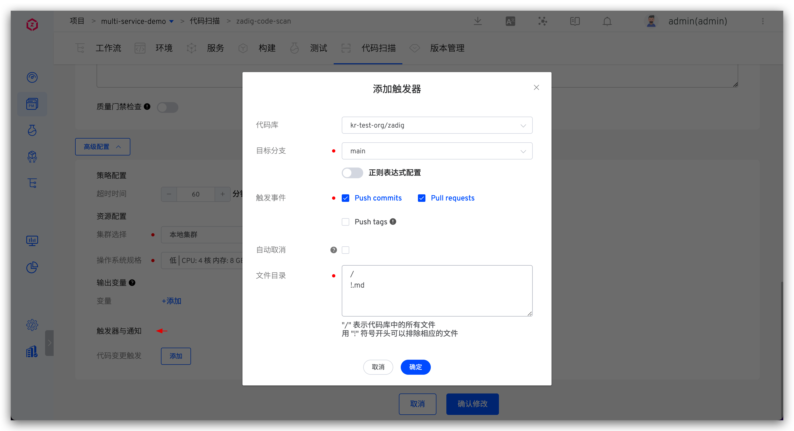

#### How to Orchestrate

Edit the workflow and add a `Code Scan` task at the specified stage (e.g., before building) to integrate code scanning into the workflow.

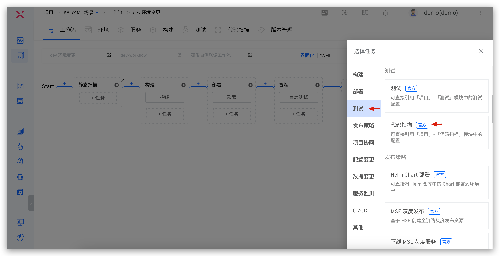

### Unit Testing

::: tip
Supports unit testing for various language stacks, including Java, Golang, Python, C++, JavaScript, C#, PHP, and Ruby.
:::

#### How to Configure

1. Add a new test, configure basic information, code information, and test scripts, and specify the report directory in the test report configuration. Refer to the documentation: [Testing](/en/Zadig%20v3.4/project/test/).

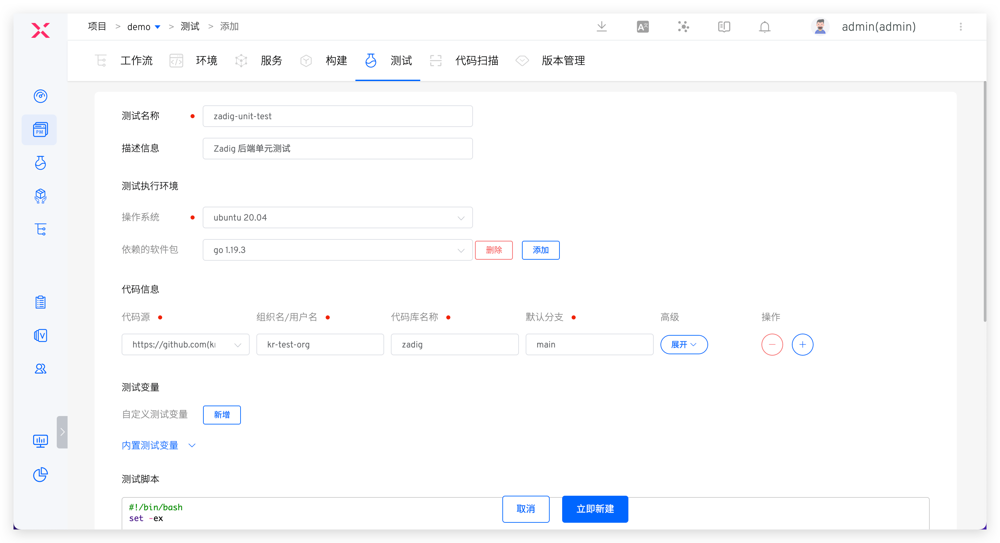
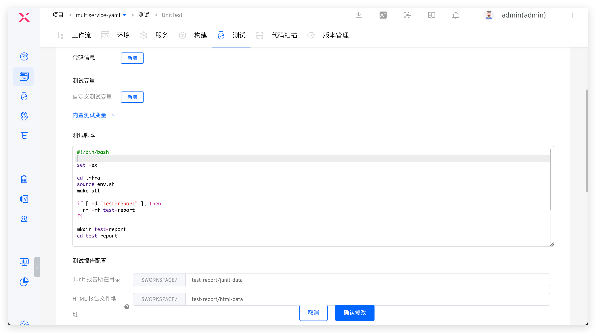

2. Configure code change triggers in tests, refer to the documentation: [Trigger configuration](/en/Zadig%20v3.4/project/test/#webhook-%E8%A7%A6%E5%8F%91%E5%99%A8) .
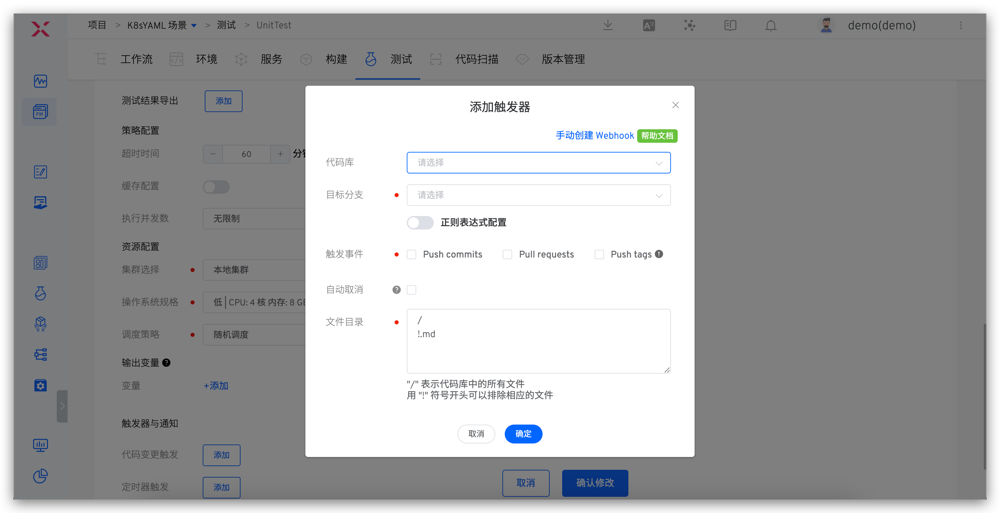

3. Configure IM Notifications in Test, refer to the documentation: [Notifications Configuration](/en/Zadig%20v3.4/project/test/#%E9%80%9A%E7%9F%A5%E9%85%8D%E7%BD%AE) .
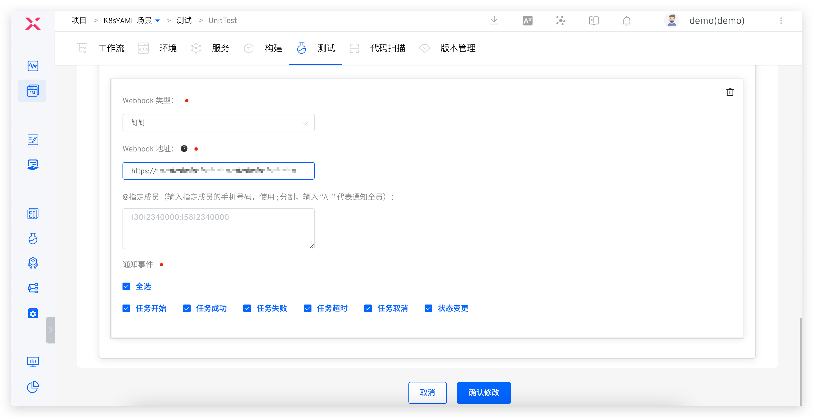

#### How to Orchestrate

Edit the workflow and add a `Test` task at the specified stage (e.g., after deployment).

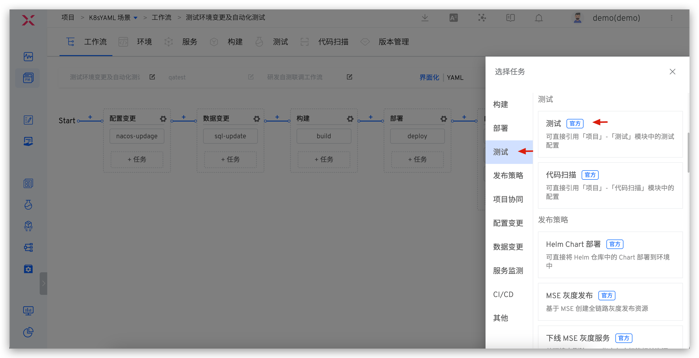
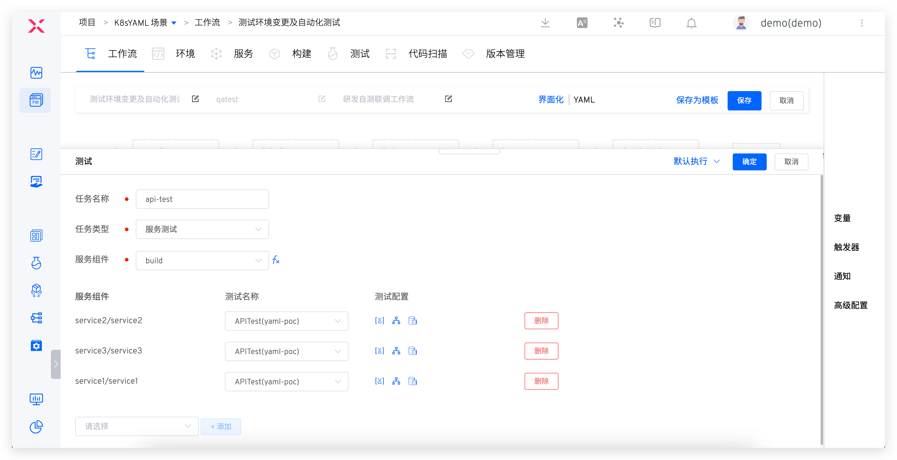

### Integration Testing
::: tip
1. Supports configuring the relationship between services and test cases to perform service-level testing: execute corresponding test cases for deployed services.
2. Supported integration test types include, but are not limited to: API interface testing, UI testing, end-to-end testing, stress testing, and scenario testing.
:::

#### How to Configure
The configuration process is similar to unit testing, refer to the documentation: [Configure tests in Zadig](/en/Zadig%20v3.4/test-manual/#%E5%A6%82%E4%BD%95%E9%85%8D%E7%BD%AE-2)

#### How to Orchestrate

Edit the workflow, add `测试` tasks, specify the task type to `服务测试` , refer to the document: [Workflow test configuration](/en/Zadig%20v3.4/project/workflow-jobs/#%E6%B5%8B%E8%AF%95%E4%BB%BB%E5%8A%A1) .

### System Testing

::: tip
Conduct product-level testing to perform comprehensive system testing of the product, ensuring a thorough understanding of system quality.
:::

#### How to Configure
The configuration process is similar to unit testing, refer to the documentation: [Configure tests in Zadig](/en/Zadig%20v3.4/test-manual/#%E5%A6%82%E4%BD%95%E9%85%8D%E7%BD%AE-2)

#### How to Orchestrate

Edit the workflow, add `测试` tasks, specify the task type to `产品测试` , refer to the document: [Workflow test configuration](/en/Zadig%20v3.4/project/workflow-jobs/#%E6%B5%8B%E8%AF%95%E4%BB%BB%E5%8A%A1) .
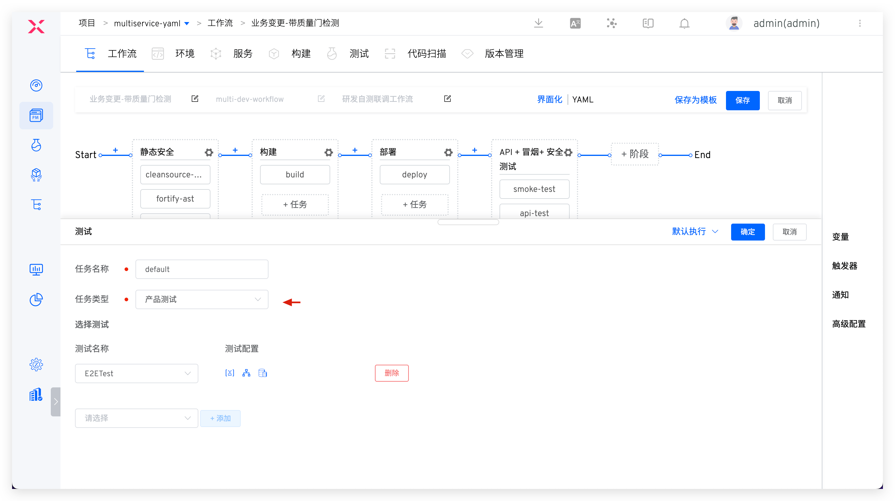

## Continuous Testing Run Scenarios

### Development Stage

> Process: Code Implementation > Code Commit > Automatically Trigger Static Code Scan Quality Gate > Developers Receive Feedback > Targeted Improvements

After the code is developed and a PR is submitted, the code scanning will be automatically triggered to effectively intercept code changes that do not pass the quality gate. The scan results will be automatically commented on the code changes, allowing developers to quickly obtain the scan results and optimize the code based on the feedback. This helps avoid quality risks at the source and ensures fail fast > feedback fast > fix fast.

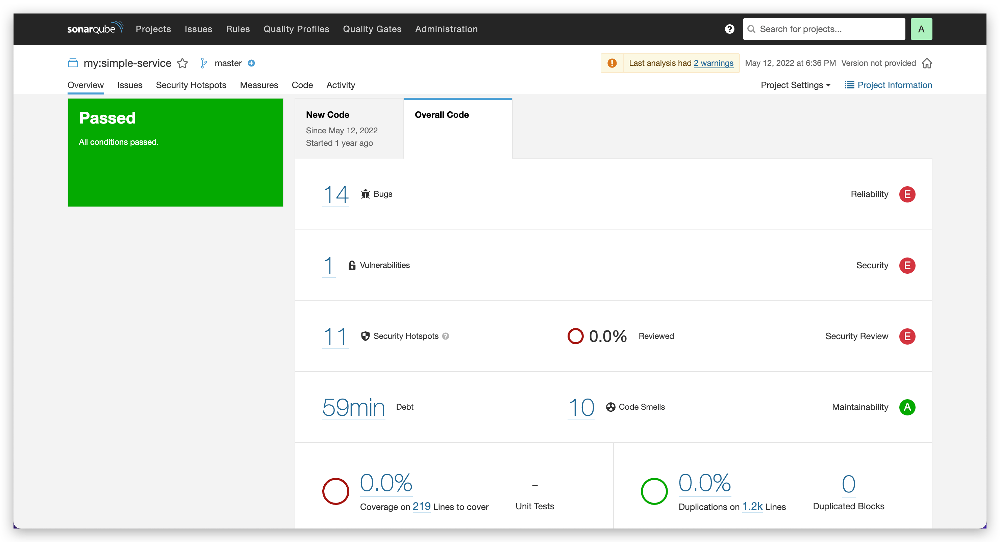

### Testing Stage

> Process: Static Scan (Quality Gate Enabled) > Build > Deploy > Automated Testing > IM Notification

Zadig can quickly set up independent development and testing environments (refer to the documentation: New Environment [8]). By integrating test orchestration into the workflow, you can build automated test suites in both the development and testing environments, and incorporate testing capabilities into every aspect of the team's daily collaboration:
- In the self-testing phase, update the self-testing environment and execute automated tests.
- In the joint testing phase, multiple developers' changes can be deployed simultaneously for integration testing.

- During the test engineer's acceptance phase, test reports can be analyzed in Zadig, and the automation test suite can be continuously expanded based on coverage, ensuring that the automation test suite evolves alongside business functions, continuously providing value to the team and showcasing the test engineer's capabilities on the platform.

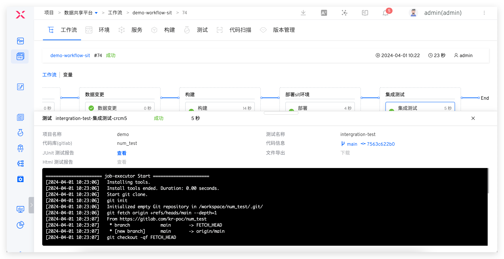

Additionally, the results of the workflow can be promptly notified to the IM group, allowing everyone in the team to stay informed about the automation execution and take responsibility for quality.

### Release Stage

> Process: Release Quality Gate > Manual Review by Release Committee > Gradual Rollout > System Testing > IM Notification

After test acceptance, the release and deployment operation will be performed. Several configuration strategies are recommended:
1. Establish a release quality gate to automatically obtain quality results from security scans, unit tests, integration tests, etc., to determine whether the release is allowed. This serves as a checkpoint in the release process to ensure that the version has passed acceptance and meets quality requirements before going live.
2. Flexibly orchestrate release strategies such as MSE Grayscale, Blue-Green, Canary, Gradual Rollout, and Istio to ensure reliable releases. Refer to: [Release Strategies](/en/Zadig%20v3.4/project/release-workflow/).
3. Add manual approval from the testing team during the release phase to ensure compliance in the business process.

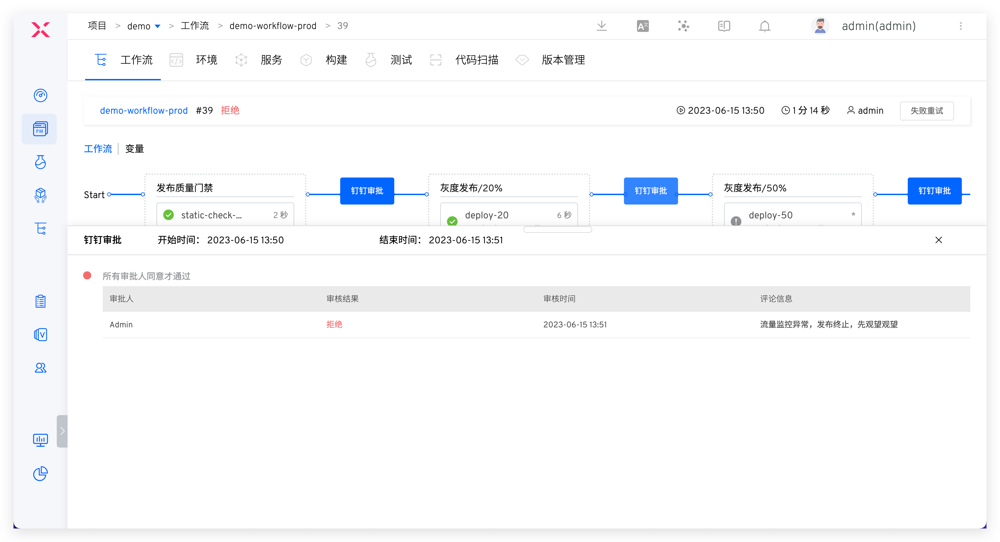

## Continuous Testing Effectiveness Metrics

The effectiveness of continuous testing can be measured by the proportion of test cases written by different roles, the number of bugs found, the effectiveness of automated tests, and whether automated tests are run in CI/CD. Specific metrics include:

| Measuring Factors | Metrics              | Targets |
|--------|-----------------------------|---------|
|Test Writers | Percentage of tests written by company developers, testers, and other members | The primary creators and maintainers of acceptance tests should be developers |
|Bugs Found at Different Stages|Proportion of bugs found over time|More bugs found during the testing phase|
|Time to Fix Acceptance Test Failures|Time required to fix acceptance test failures|Trend in fix time: Developers should be able to easily fix acceptance test failures |
|Effectiveness of Automated Testing|Reasons for test failures: Number of automated test failures due to actual defects and coding quality issues|Automated test failures always indicate actual defects in the product|
|Automated Testing in CI/CD Workflow|Check if all test suites run in each pipeline trigger (Yes/No)|Integration of automated testing: Automated testing should run in the main pipeline and main workflow|

In addition, Zadig's performance insights can track all quality data throughout the software delivery lifecycle. You can customize XOps agile quality and efficiency dashboards to track metrics such as incident recovery time, defect escape rate, critical defect rate, and rework rate, quickly identify quality gaps, and use data to drive targeted and continuous improvement.

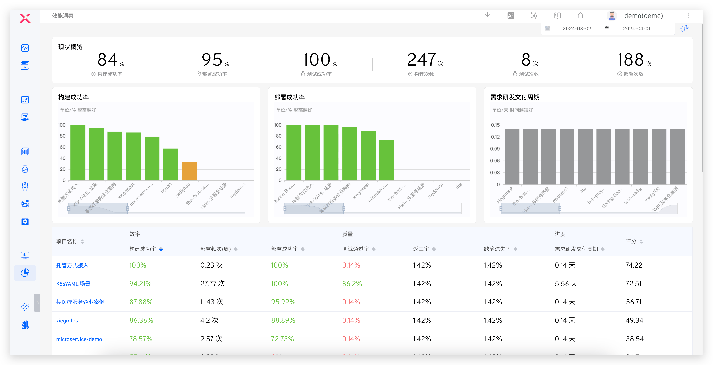