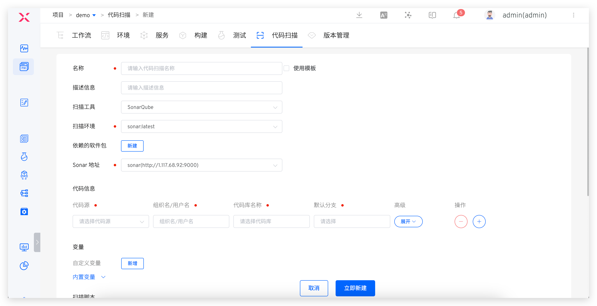
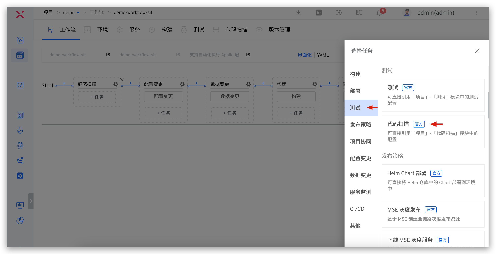
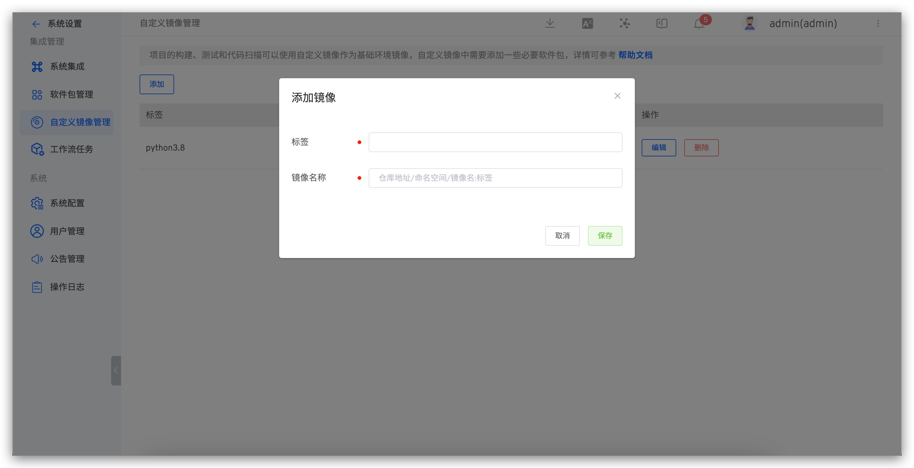
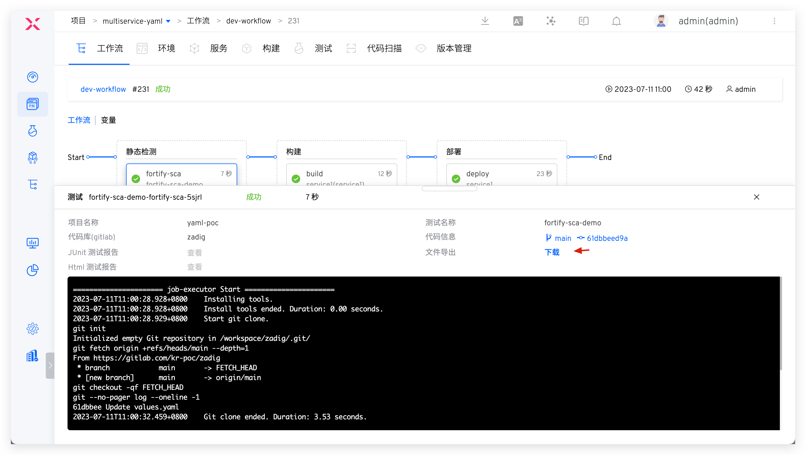
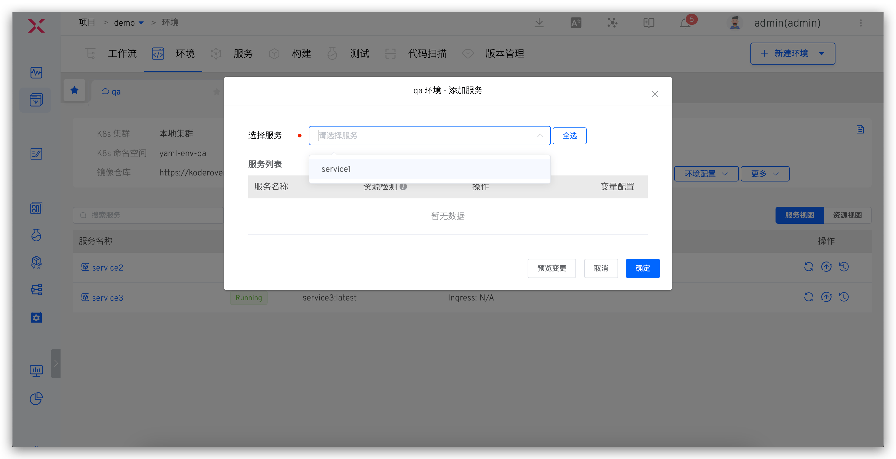
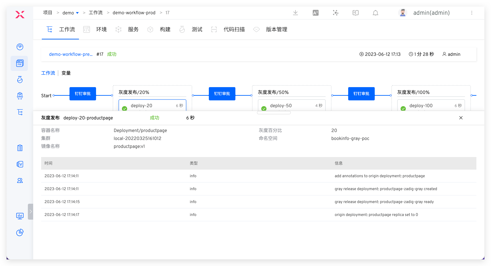

## Overview
Zadig has the capability to manage the entire software development lifecycle and supports almost all security tools and services on the market. For example, SAST tools like [SonarQube](https://www.sonarsource.com/), [Fortify](https://www.microfocus.com/en-us/cyberres/application-security), and [Coverity](https://scan.coverity.com/), SCA tools like [CleanSource](https://www.sectrend.com.cn/), and DAST tools like [DongTai](https://dongtai.io/). Zadig can easily integrate these tools into the entire delivery pipeline, leveraging its powerful runtime environment and workflow capabilities to provide strong support to the security team.<br>
Zadig helps the security team shift security services and capabilities left to the development, testing, and operations teams, enabling early identification of security issues and involving other roles in addressing security and compliance issues, thereby avoiding additional costs associated with fixing such issues.

## Security Service Access

### Static Security SAST - Sonar

**Step 1: Configure Code Scanning**

Add a new code scan, select the `SonarQube` scanning tool, and fill in the code scanning configuration. Refer to the documentation: [Code Scanning](/en/Zadig%20v3.4/project/scan/).



**Step 2: Orchestrate Code Scanning in the Workflow**

Edit the workflow and add a code scanning task at the specified stage (e.g., before the build task). Refer to the documentation: [Configure Workflow](/en/Zadig%20v3.4/project/common-workflow/).



### Software Composition Analysis SCA - Fortify

**Step 1: Build a Custom Image**

1. Build a custom image and upload it to the mirror repository. Refer to the document: [Custom Image](/en/Zadig%20v3.4/settings/custom-image/#%E6%AD%A5%E9%AA%A4-1-%E7%94%9F%E6%88%90%E8%87%AA%E5%AE%9A%E4%B9%89%E9%95%9C%E5%83%8F) .
2. Add a custom image in Zadig refer to the documentation: [Add a custom image](/en/Zadig%20v3.4/settings/custom-image/#%E6%AD%A5%E9%AA%A4-2-%E5%88%9B%E5%BB%BA%E8%87%AA%E5%AE%9A%E4%B9%89%E9%95%9C%E5%83%8F) .



**Step 2: Configure SCA Scan**

Add a new `test` and complete the specific configuration for Fortify SCA code scanning. The relevant parameters are explained below. For more detailed information, refer to the documentation: [Test](/en/Zadig%20v3.4/project/test/).

- `Operating System`: The custom image added in Step 1
- `Test Script`: The specific command to execute the code scan. Refer to the Fortify SCA official documentation
- `Test Result Export`: Configure the path where the scan results are located


**Step 3: Orchestrate SCA Scan**

Orchestrate SCA Scan in the workflow, refer to the document: [Orchestrate tasks](/en/Zadig%20v3.4/project/workflow-jobs/#%E6%B5%8B%E8%AF%95%E4%BB%BB%E5%8A%A1) .


Run the workflow. After the Fortify SCA execution is complete, you can download the scan results for analysis.



### Dynamic Security IAST - DongTai

**Step 1: Integrate IAST Capabilities into the Service**

Modify the service's YAML configuration, install the DongTai IAST Agent, and modify the service startup command. A sample service YAML is as follows:

::: tip
You can flexibly use the service variable capability of Zadig in the service YAML configuration content, and control whether you need to install Agent for the service on demand. Refer to the document: [Service variables](/en/Zadig%20v3.4/project/service/k8s/#%E5%8F%98%E9%87%8F%E9%85%8D%E7%BD%AE) .
:::

``` yaml
// 服务原始配置内容
apiVersion: apps/v1
kind: Deployment
metadata:
  labels:
    app: service1
  name: service1
spec:
  selector:
    matchLabels:
      app: service1
  template:
    metadata:
      labels:
        app: service1
    spec:
      containers:
        - name: service1
          image: dongtai/dongtai-java-agent-demo:0.0.1
```
``` yaml
// 安装 DongTai IAST Agent 后的服务配置内容
apiVersion: apps/v1
kind: Deployment
metadata:
  labels:
    app: service1
  name: service1
spec:
  selector:
    matchLabels:
      app: service1
  template:
    metadata:
      labels:
        app: service1
    spec:
      {{- if .iast }}
      volumes:
        - name: dongtai-iast-agent
          emptyDir: {}
      initContainers:
        - name: agent-init-container
          image: curlimages/curl
          volumeMounts:
            - name: dongtai-iast-agent
              mountPath: /tmp
          args:
            - "-k"
            - "-X"
            - "GET"
            - "从洞态管理后台获取到的 Agent 下载请求地址"
            - "-H"
            - "从洞态管理后台获取到的 Agent 下载请求的 Header 信息"
            - "-o"
            - "/tmp/agent.jar"
      {{- end}}
      containers:
        - name: service1
          image: dongtai/dongtai-java-agent-demo:0.0.1
          {{- if .iast }}
          volumeMounts:
            - name: dongtai-iast-agent
              mountPath: /agent
          env:
            - name: JAVA_TOOL_OPTIONS
              value: "-javaagent:/agent/agent.jar"
          {{- end}}
```

**Step 2: Deploy the Service to the Environment**

Deploy the injected IAST Agent service to the environment, refer to the documentation: [Add a service](/en/Zadig%20v3.4/project/env/k8s/#%E6%B7%BB%E5%8A%A0%E6%9C%8D%E5%8A%A1) .



## Introduction to DevSecOps Core User Scenarios

### Static Security Injection in the Development Stage

> The process includes: code commit > static scan > build > deployment > self-test and joint debugging

After the code implementation is complete and a code change PR is submitted, static code scanning will be automatically triggered. The scan results will be reflected in the PR. Click to jump to Zadig to view the failure reasons, effectively avoiding quality and security risks in the code at the development source.


For code scanning using the SonarQube tool, click the link to jump to the Sonar system to analyze more results of the code scan and fix them in a targeted manner. After the fix is complete, execute the dev workflow for daily self-testing and integration testing.


### Combined Security Policies in the Testing Stage

> The process includes: static scan (with quality gate enabled) > build > deployment > automated testing (business testing + dynamic security testing)

After the development and testing phase, the test engineer executes the workflow based on the code branch + PR, deploys the integrated test environment, and performs automated testing on the environment. The workflow will automatically notify the IM after execution. Log in to the management backend to view the details of dynamic security detection vulnerabilities, promote timely fixes by the team, and avoid security risks as soon as possible.


If the static scan task fails, subsequent build and deployment tasks will be prevented. Code changes that fail to pass the acceptance will be rejected to merge, capturing security risks at the source code level and establishing effective quality gate measures. This approach prevents potential issues from entering the system.


### Full Inspection and Approval in the Release Stage

> The process includes: Security Committee review > batched gray release > automated testing

After the test acceptance is passed, the prod workflow is executed for production release, which can only proceed after approval. Several configuration strategies are recommended:
1. Implement release gates by automatically obtaining quality results from security scans, unit tests, regression tests, etc., to determine whether the release is allowed. Use these as checkpoints in the release process to ensure that the version passes acceptance and meets the enterprise's security requirements before going live.
2. Flexibly orchestrate release strategies such as MSE Grayscale, Blue-Green, Canary, Batch Grayscale, and Istio to ensure release reliability. Refer to the documentation: [Release Strategy](/en/Zadig%20v3.4/project/release-workflow/).
3. Manual approval by the security team is added during the release phase to ensure release compliance in business processes.


