## Overview
In Zadig, a [project](/en/Zadig%20v3.4/quick-start/concepts/#project) is the core business management unit, typically used for independent and autonomous teams or product lines. Each project includes resources such as workflows, environments, services, builds, tests, code scans, and versions. This manual covers the main operations and maintenance tasks in Zadig projects, including project access, standard template management, service and environment configuration, workflow configuration, permissions, and collaboration management. Through this manual, you will be able to quickly understand and use Zadig, improve configuration and management efficiency, and rapidly support R&D processes.

## Project Access Methods

Zadig supports three project access methods: existing project hosting, existing project import, and new project access.

- Existing project hosting: Suitable for projects with existing service configurations not managed by Zadig
- Existing project import: Suitable for projects where existing service configurations are managed through Git repositories or other storage media
- New project access: Suitable for new projects that need to build an engineering system

### Existing Project Hosting

1. Create a new project -> Select the hosted project.

2. Configure the hosting environment by selecting services from the specified cluster and namespace.

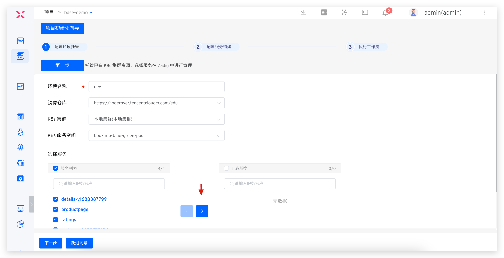

3. Configure service builds, refer to the documentation: [Build](/en/Zadig%20v3.4/project/build).

4. Execute workflows to deploy and update services in the specified environment.

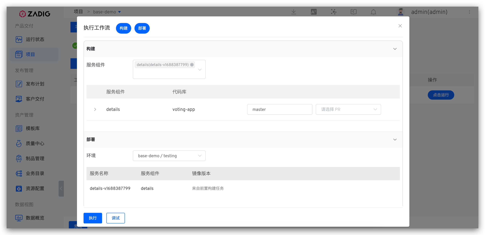

::: tip
If you need to manage service configuration on Zadig in the future, you can achieve it by switching the project type. Refer to the document: [Switch the project type](/en/Zadig%20v3.4/project/host-k8s-resources/#switch-a-k8s-hosting-project-to-a-k8s-yaml-project) .
:::

### Existing Project Import

The access steps are introduced separately for the two forms of configuration files (YAML/Helm Chart).

#### YAML Form

1. Create a new project and select the K8s YAML project.

2. Create a new service: Synchronize service configuration from the code base, refer to the document: [Create a new service](/en/Zadig%20v3.4/project/service/k8s/#create-a-new-service) .

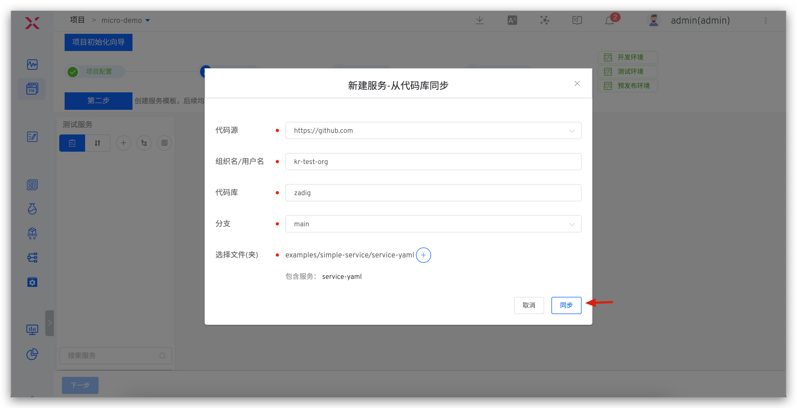

3. Add a build for the service: Select the service -> Variables -> Add build, configure the service build script.

4. Create a new environment: Select a new environment with an existing namespace (for example: dev/sit/uat/prod Environment), refer to the document: [Create a new environment](/en/Zadig%20v3.4/project/env/k8s/#create-a-new-environment) .

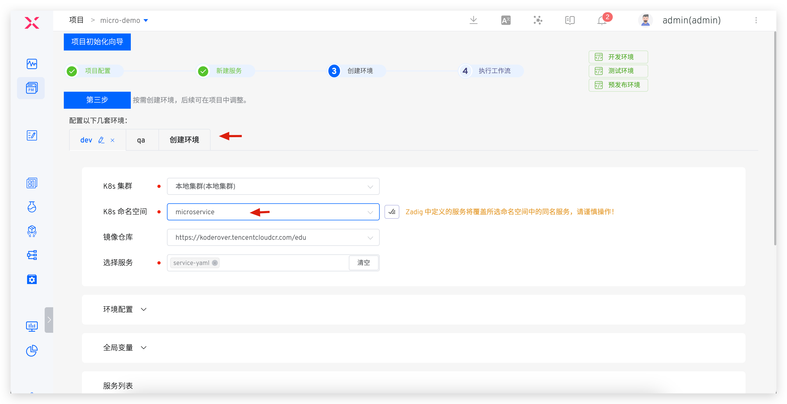

5. Execute workflows: Enter the project -> Workflows, run the workflow to update the services in the specified environment.

#### Helm Chart Form

1. Create a new project and select the K8s Helm Chart project.

2. Create a new service: Synchronize service configuration from the code base, refer to the document: [Create a new service](/en/Zadig%20v3.4/project/service/helm/chart/#create-a-new-service) .

3. Add a build for the service: Select the service -> Variables -> Add build, configure the service build script.

4. Create a new environment: Select a new environment with an existing namespace (for example: dev/sit/uat/prod Environment), refer to the document: [Create a new environment](/en/Zadig%20v3.4/project/env/k8s/#create-a-new-environment) .

5. Execute workflows: Enter the project -> Workflows, execute the workflow to update the services in the specified environment. For more workflow functions, refer to the documentation: [Workflows](/en/Zadig%20v3.4/project/common-workflow/).
   

### New Project Access

The access steps are introduced separately for the two forms of configuration files (YAML/Helm Chart).

#### YAML Form

1. Create a new project: Select the K8s YAML project.

2. Create a new service: Use templates to create a new service, refer to the document: [Create a new service](/en/Zadig%20v3.4//project/service/k8s/#create-a-single-service-using-templates) .

3. Create a new environment: Select the service to create new dev/sit/uat/prod environments.

4. Configure builds: Use build templates to configure build scripts, refer to the documentation: [Build](/en/Zadig%20v3.4/project/build).

5. Configure workflows: Configure the corresponding workflows for test and production environments, refer to the documentation: [Workflows](/en/Zadig%20v3.4/project/common-workflow/).

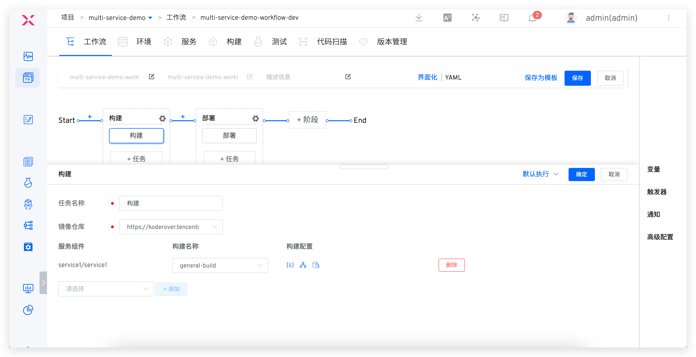

#### Helm Chart Form

1. Create a new project: Select the K8s Helm Chart type project.

2. Create a new service: Use templates to create a new service, refer to the document: [Create a new service](/en/Zadig%20v3.4/project/service/helm/chart/#create-a-single-service-using-templates) .

3. Create a new environment: Select the service to create new dev/sit/uat/prod environments.

4. Configuration build: Use the build template to configure the build script, refer to the documentation: [Build](/en/Zadig%20v3.4/project/build/#zadig-%E6%9E%84%E5%BB%BA) .

5. Configure workflows: Configure the corresponding workflows for test and production environments, refer to the documentation: [Workflows](/en/Zadig%20v3.4/project/common-workflow/).

## Standard Template Management

Through the Zadig template library, the operations team can achieve unified application delivery standards, standardize release processes, and accumulate standardized templates that meet the company's own characteristics. This provides the R&D and operations departments with an efficient engineering collaboration basis, quickly responding to the needs of business iteration, and ensuring the stability and scalability of the system. The template library provides various types of templates, including service templates, build templates, Dockerfile templates, and workflow templates.

### Service Templates

::: tip Scenario
The configuration file content structure of multiple services isomorphic, but the specific configuration is different. For example: the port number/number of replicas/database connection addresses of different services are different. Abstract the configuration of the service into a common K8s YAML/Helm Chart template, allowing users to create multiple services on the common template.
:::

The different organizational forms of service configurations (K8s YAML/Helm Chart) are introduced separately.

#### K8s YAML Template

Preparation: Abstract the configuration of multiple services into a K8s YAML template. The following are the relevant configurations of multi-service-demo projects for reference. For more usage postures, please refer to the document: [K8s YAML Template](/en/Zadig%20v3.4/template/k8s_yaml/) , [create a new service using templates](/en/Zadig%20v3.4/project/service/k8s/#%E4%BD%BF%E7%94%A8%E6%A8%A1%E6%9D%BF%E6%96%B0%E5%BB%BA%E6%9C%8D%E5%8A%A1) .
- The K8s YAML configurations of three microservices: [service1](https://github.com/koderover/zadig/tree/main/examples/multi-service-demo/k8s-yaml/service1), [service2](https://github.com/koderover/zadig/tree/main/examples/multi-service-demo/k8s-yaml/service2), [service3](https://github.com/koderover/zadig/tree/main/examples/multi-service-demo/k8s-yaml/service3)
- The abstracted template for the above three service configurations: [K8s YAML Template](https://github.com/koderover/zadig/blob/main/examples/multi-service-demo/k8s-yaml/template.yaml).
1. Create a new template: Access the template library -> K8s YAML -> Create template, enter the template content and save it.

2. Configure custom variables: Configure the default values of variables as needed.

3. Create a new service using the template.

4. Template content changes will synchronize and update the service configuration: Enable automatic synchronization in the service configuration, and after the template content changes, it will be applied to the service

#### Helm Chart Template

Preparation: abstract the Helm Chart configurations of multiple services into Helm Chart templates, and the following are the relevant configurations of multi-service-demo projects for reference. For more usage postures, please refer to the document: [Helm Chart Template](/en/Zadig%20v3.4/template/helm_chart/) , [create a new service using template](/en/Zadig%20v3.4/project/service/helm/chart/#%E4%BD%BF%E7%94%A8%E6%A8%A1%E6%9D%BF%E6%96%B0%E5%BB%BA%E5%8D%95%E4%B8%AA%E6%9C%8D%E5%8A%A1) .
- The Helm Chart configurations of three microservices: [service1](https://github.com/koderover/zadig/tree/main/examples/multi-service-demo/full-charts/service1), [service2](https://github.com/koderover/zadig/tree/main/examples/multi-service-demo/full-charts/service2), [service3](https://github.com/koderover/zadig/tree/main/examples/multi-service-demo/full-charts/service3).
- The abstracted template for the above three service configurations: [Helm Chart Template](https://github.com/koderover/zadig/tree/main/examples/multi-service-demo/general-chart).
1. Create a new template: Access the template library -> K8s YAML -> Create template, enter the template content and save it.

2. Configure custom variables: Save the default values of variables as needed.

3. Create a new service using the template: Enter K8s Helm Chart project -> Services -> Create a new service using the template, fill in the parameters and import it.

4. Template content changes will synchronize and update the service configuration: Enable automatic synchronization in the service configuration, and after the template content changes, it will be applied to the service.

### Dockerfile Template

Preparation: Abstract the mirror building configuration of multiple services into a Dockerfile template. The following are the relevant configurations of multi-service-demo projects for reference. For more usage postures, please refer to the documentation: [Dockerfile Template](/en/Zadig%20v3.4/template/dockerfile/) , [build configuration](/en/Zadig%20v3.4/project/build/#%E6%9B%B4%E5%A4%9A%E6%9E%84%E5%BB%BA%E6%AD%A5%E9%AA%A4) .
- The source code of three microservices: [service source code](https://github.com/koderover/zadig/tree/main/examples/multi-service-demo/src).
- The project build files for the above three services: [Makefile](https://github.com/koderover/zadig/blob/main/examples/multi-service-demo/Makefile).
- The abstracted image build configuration for the above three services: [Dockerfile Template](https://github.com/koderover/zadig/blob/main/examples/multi-service-demo/Dockerfile).
1. Create a new template: Access the template library -> Dockerfile Template -> Create template, enter the template content and save it.

2. Use the Dockerfile template to configure the build for the service.

### Build Templates

::: tip Scenario
The build configurations of multiple services are isomorphic (e.g., multiple service codes of the same technology stack are maintained in separate codebases, the dependent software packages are the same, the build scripts are isomorphic, and only the code information differs...). Use Zadig build templates to improve the efficiency of configuration builds. For more details, refer to the documentation: [Build Templates](/en/Zadig%20v3.4/template/build/).
:::

1. Create a new build template: Access the template library -> Build -> Create template, configure and save.

1. Using build templates: Use template configuration to configure the code information required for multiple service builds. For multiple services using the same build template, you can use batch entry to quickly configure it.

### Workflow Templates

Abstract workflow templates based on project processes, quickly create workflows based on templates. For more details, refer to the documentation: [Workflow Templates](/en/Zadig%20v3.4/template/workflow/).
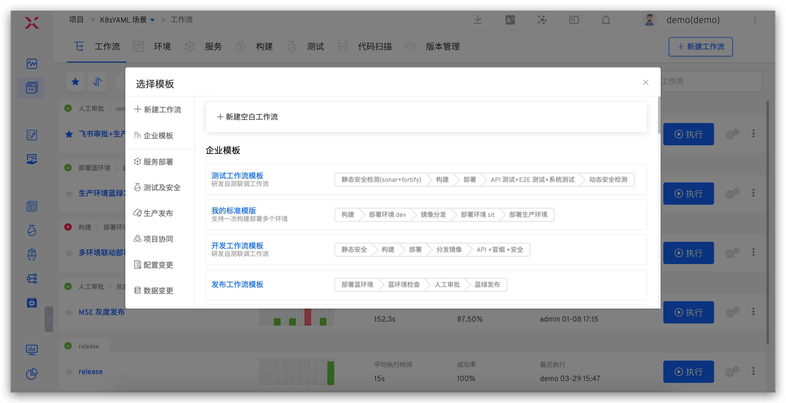

## Service and Environment Configuration

### Deploying Test Services

Step 1: Configure the test service
1. Based on K8s  YAML template, create new business services, reference document: [service](/en/Zadig%20v3.4/project/service/k8s/#%E4%BD%BF%E7%94%A8%E6%A8%A1%E6%9D%BF%E6%96%B0%E5%BB%BA%E6%9C%8D%E5%8A%A1) .
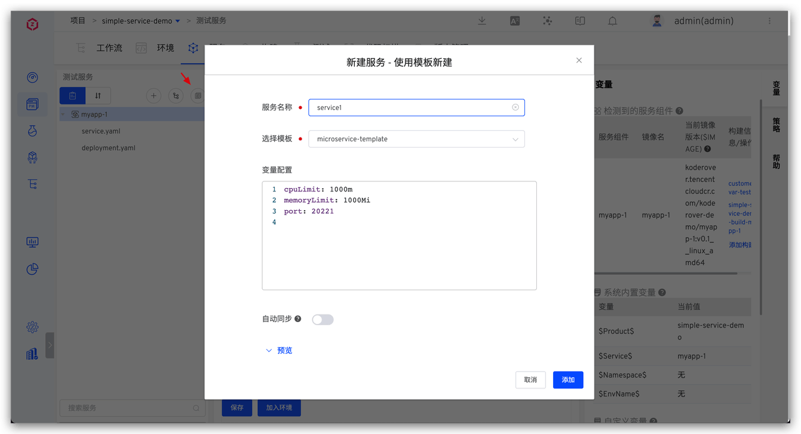

2. Based on the build template, configure the build for the service, refer to the documentation: [Build](/en/Zadig%20v3.4/project/build/template/).

::: tip Optimization Suggestions:
|    Suggestions   |                Description                           |                    Reference Documents              |
|:----------- | :-------------------------------------------- |:-----------------------------------------|
| Speed up the build process | 1. Include commonly used build dependency tools  2. Customize cache directories| 1. [Custom build images](/en/Zadig%20v3.4/settings/custom-image/)  2. [Configure the build cache](/en/Zadig%20v3.4/project/build/#%E9%AB%98%E7%BA%A7%E9%85%8D%E7%BD%AE) |
| Reduce maintenance burden | 1. Multiple services have similar builds; configure a single build script to reduce maintenance costs  2. Standardize and unify the management of service build materials to reduce maintenance and management burdens| 1. [Share build scripts](/en/Zadig%20v3.4/project/build/#Zadig-%E5%85%B1%E4%BA%AB%E6%9E%84%E5%BB%BA)  2. [Use the build template](/1) |
:::

Step 2: Add to the environment, refer to the documentation: [K8s YAML Environment](/en/Zadig%20v3.4/project/env/k8s/#%E5%9F%BA%E6%9C%AC%E6%93%8D%E4%BD%9C) .

Step 3: Add the service to the corresponding workflow, and add the service component and its corresponding build to the workflow.

### Offline Testing Service

1. Delete service definition, refer to the document: [Delete service](/en/Zadig%20v3.4/project/service/k8s/#%E5%88%A0%E9%99%A4%E6%9C%8D%E5%8A%A1) .
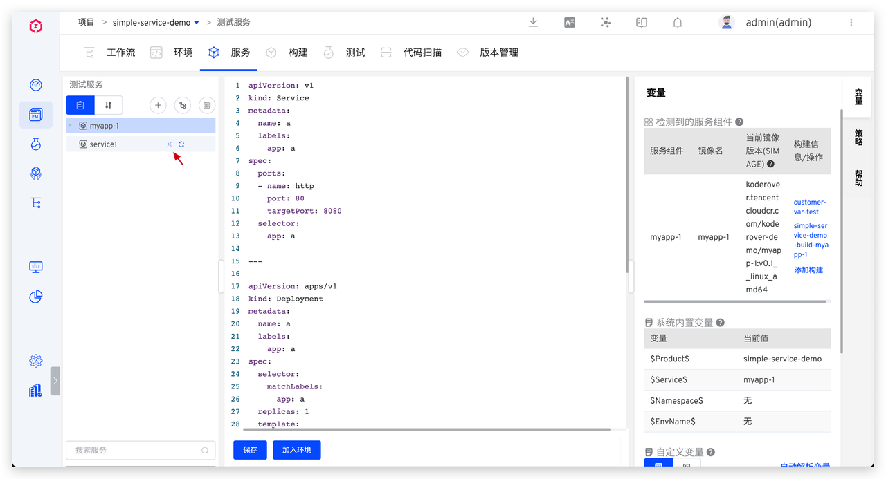

2. Delete the service from the environment, refer to the documentation: [K8s YAML Environment](/en/Zadig%20v3.4/project/env/k8s/#%E5%88%A0%E9%99%A4%E6%9C%8D%E5%8A%A1) .

### Create a New Test Environment

Enter the project -> Environment -> Create a new environment -> Test Environment, fill in the parameters, and create a new one.
- K8s YAML Project, reference document: [Create a new K8s YAML environment](/en/Zadig%20v3.4/project/env/k8s/#%E6%96%B0%E5%BB%BA%E7%8E%AF%E5%A2%83) .
- K8s Helm Chart Project, reference document: [Create a new Helm Chart environment](/en/Zadig%20v3.4/project/env/helm/chart/#%E6%96%B0%E5%BB%BA%E7%8E%AF%E5%A2%83) .
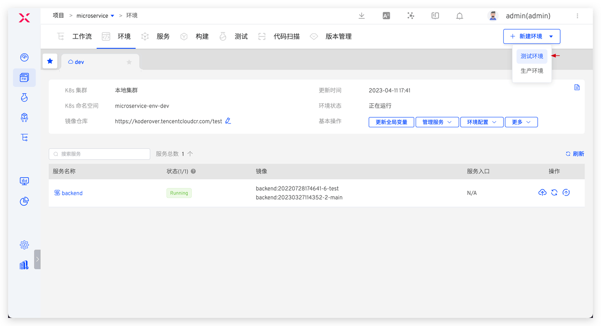

Some best practices are provided for reference:
1. Use a single set of service configurations to create multiple test environments, refer to the documentation: [Configure Multiple Integrated Environments](/en/Zadig%20v3.4/env/multi-env/).
2. Different environments use different structures deployment , variable capabilities can be used, refer to the document: [K8s YAML](/en/Zadig%20v3.4/project/service/k8s/#%E5%8F%98%E9%87%8F%E9%85%8D%E7%BD%AE) .
3. Different business lines can use different K8s cluster resources. For adding new cluster configurations, refer to: [Cluster Management](/en/Zadig%20v3.4/pages/cluster_manage/).
4. Environment configuration management, refer to the document: [Environment configuration](/en/Zadig%20v3.4/project/env/k8s/#%E7%8E%AF%E5%A2%83%E9%85%8D%E7%BD%AE) .

### Online Production Service

Step 1: Configure production services, refer to the document: [production services](/en/Zadig%20v3.4/project/service/k8s/prod/#%E6%96%B0%E5%BB%BA) .

Step 2: Configure the production environment, refer to the documentation: [K8s YAML Production Environment](/en/Zadig%20v3.4/project/env/release/).
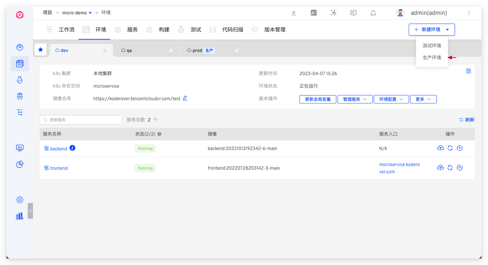

Step 3: Configure the workflow, add deployment tasks, refer to the document: [Workflow](/en/Zadig%20v3.4/project/workflow-jobs/#%E9%83%A8%E7%BD%B2%E4%BB%BB%E5%8A%A1) .

### Offline Production Service

::: tip Caution
Given the seriousness of production services, there are certain risks associated with offline operations. Please ensure that the service can be safely taken offline before proceeding.
:::

Reference document: [Offline service](/en/Zadig%20v3.4/project/workflow-jobs/#%E4%B8%8B%E7%BA%BF%E6%9C%8D%E5%8A%A1) .

### Create a New Production Environment

Reference Document: [Production Environment](/en/Zadig%20v3.4/project/env/release/#%E6%96%B0%E5%BB%BA%E7%8E%AF%E5%A2%83) .

## Workflow Configuration

For specific configuration, refer to: [Workflow](/en/Zadig%20v3.4/project/workflow-overview/)

## Permission Management

Zadig user permissions consist of system permissions and project permissions. These are managed by configuring the user's system roles, project roles, and collaboration modes within the project. User permissions are the union of all granted permission items. The specific mechanism is shown in the figure below:

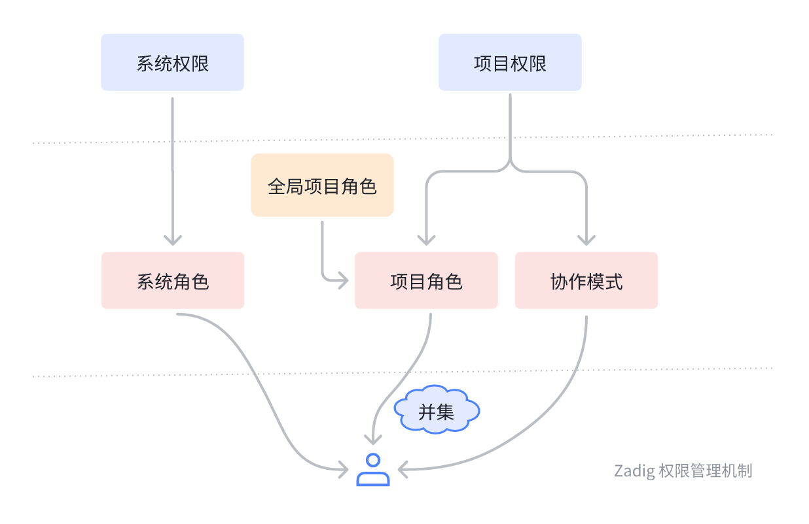

### Configuration Operations

First, understand the basic operations for configuring user project permissions.

#### Project Role Configuration

Access project configuration -> permissions, configure roles and project members, you can refer to the document: [permission configuration](/en/Zadig%20v3.4/project/permission/#permission-configuration) .

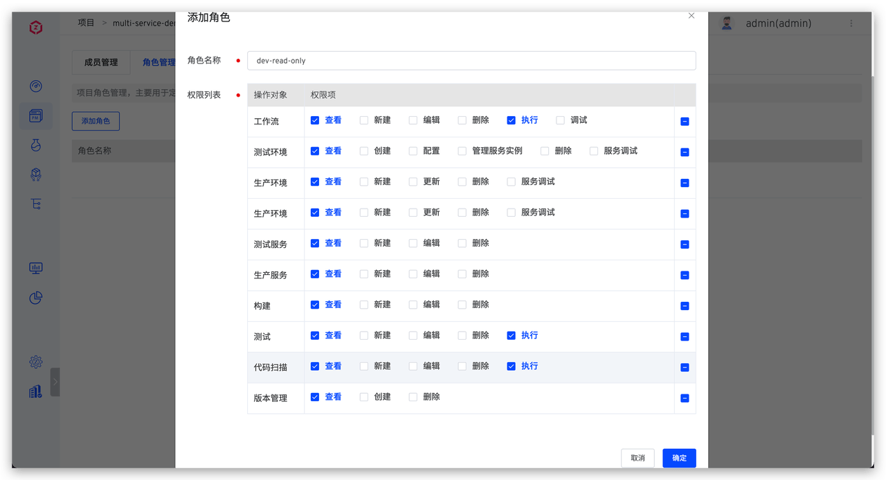
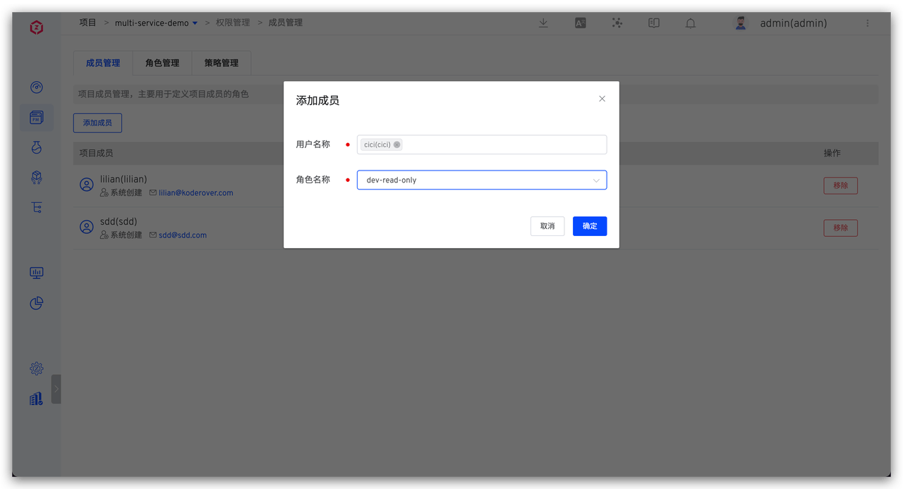

#### Collaboration Mode Configuration

Access permission management -> Collaboration mode, just configure permissions for collaboration members, workflows, and environmental resources. For specific configuration process, please refer to: [Collaboration mode](/en/Zadig%20v3.4/project/permission/#collaboration-mode) .

### Configuration Examples

The following examples illustrate how to configure permissions for different roles.
#### Project Administrator

Permission Description: Has permissions for any operation in the project

Specific Configuration: Grant the project role `project-admin`

#### R&D Engineer
Permission Description:
- All operation permissions for building, testing services, code scanning, and version management modules
- All operation permissions for dev workflows
- All operation permissions for dev and sit environments

Specific Configuration:
- Create and grant the project role `dev`, and configure permissions as shown in the figure below:

- Create and join the collaboration mode `dev`, and configure workflow and environment-related permissions as shown in the figure below:

#### Test Engineer
Permission Description:
- All operation permissions for the test module
- All operation permissions for sit workflows
- All operation permissions for sit environments

Specific Configuration:
- Create and grant the project role `qa`, and configure permissions as shown in the figure below:

- Create and join the collaboration mode `qa`, and configure workflow and environment-related permissions as shown in the figure below:

#### Release Engineer
Permission Description:
- All operation permissions for production services, production environments, and version management
- All operation permissions for prod and uat workflows
- All operation permissions for uat environments

Specific Configuration:

- Create and grant the project role `sre`, and configure permissions as shown in the figure below:

- Create and join the collaboration mode `sre`, and configure workflow and environment-related permissions as shown in the figure below:

