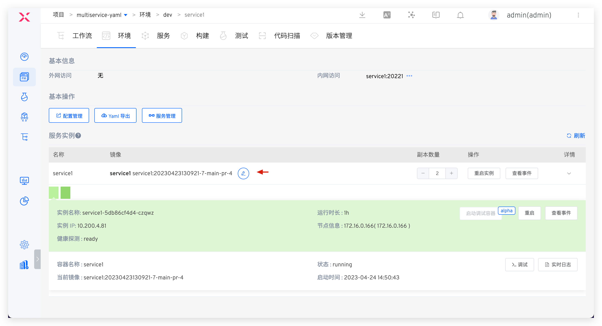
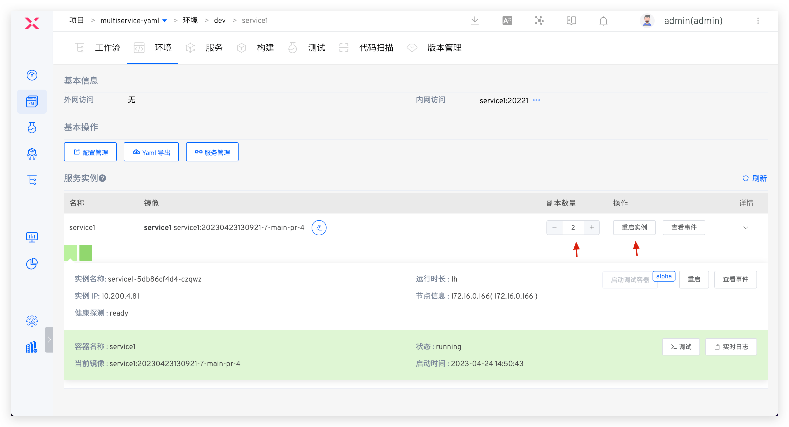
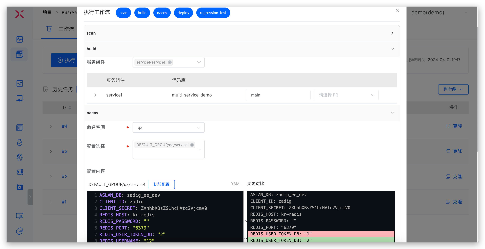

Software delivery involves multiple elements such as personnel, technology, processes, and tools. Common challenges include: difficulty in simulating development environments, complex multi-service integration, low R&D efficiency, high proportion of manual testing, unstable environments, difficulties in automation, complex O&M tools, frequent manual operations, low delivery efficiency, and time-consuming cross-department communication and process formulation. Zadig enhances organizational efficiency through platform engineering and technology upgrades, establishing an integrated engineering collaboration baseline to help enterprises efficiently deliver software and improve team productivity.

## Zadig R&D Collaboration Solution

Zadig provides an engineering foundation for unified collaboration of R&D teams, supporting agile delivery across the entire lifecycle from development to testing to release. It supports custom processes, tool extension, and orchestration of test, IT, and security services. Automation is achieved through Zadig, improving engineering efficiency.

## Introduction to Core Scenarios

Development, testing, operation and maintenance engineers are based on the Zadig unified collaboration plane and deliver using automated workflows and cloud-native environments. In addition, the business person in charge/enterprise management personnel can analyze the overall operation of the project in the performance board and analyze the performance shortcomings in each process of the project. The following is an introduction to different characters.

### Administrator Preparation

Administrators (such as O&M engineers) configure the engineering foundation required for team collaboration in Zadig, including environments and workflows for R&D, testing, and O&M roles.

**Workflow Example**

**Environment Example**

### Development Engineer

#### Local Self-Testing

IDE hot deployment, where code written locally is hot-deployed to a remote environment. For more details, refer to: [VSCode Plugin Usage Guide](/en/Zadig%20v3.4/zadig-toolkit/overview/).

#### Submit Code and CI Process

1. Create a new branch locally based on the develop branch, complete development, push to the remote repository, and create a PR/MR (Pull Request/Merge Request).
2. The system automatically triggers the CI process, including unit testing, code style checking, and code scanning.
3. CI results are fed back on the PR/MR page.

#### Self-Testing by a Single Engineer

Manually or automatically trigger the dev workflow, including: build, deploy dev environment, smoke test, IM notification.

#### Multi-Engineer Integration and Debugging

Execute the dev workflow, select multiple services and corresponding code changes.

#### Update the Same Service

Execute the dev workflow, select the service and multiple code changes.

#### Update Business Configuration

> Applicable scenarios: Changes involve configuration updates

For configuration changes, use the corresponding environment workflow, select and modify the Nacos configuration.

#### Update Project Management Task Status

> Applicable scenarios: After a feature is implemented, update the status of the tracking task with one click

For project management task status updates, use the workflow to select the corresponding Jira task.

#### Update the Database

> Applicable scenarios: Changes involve data modifications (such as table structure changes, field changes, etc.)

For database changes, use the workflow to input SQL statements and update data (e.g., table structure or field changes).

#### Service Debugging

View environment and service status.

View real-time service logs.

Enter container debugging.

Temporarily Replace Service Image

Adjust the Number of Replicas/Restart Instances

### Test Engineer
#### Manage Test Cases

1. Write test case scripts locally and perform self-testing for the sit environment.
2. After passing the self-test, submit to the code repository.

#### Sit Release Verification

Execute the sit workflow to update the environment for integration verification, including: build, deploy sit environment, interface test, IM notification.

#### Uat Release Verification

Execute the uat workflow for pre-release verification, including: quality gate, build, Nacos configuration change, deploy uat environment, regression test, IM notification.

#### Analysis of Automated Test Results
Analyze automated test results and continuously optimize the test suite based on coverage.

### Release Engineer

#### Production Environment Release

> Supports multiple release strategies.

**Rolling Release**

Execute the prod workflow to update the production environment, including: release approval, Nacos configuration change, deployment.

**Blue-Green Release**

Execute the workflow to update the production environment, including: deploy blue environment, approval, switch production version.

**Canary Release**

Execute the workflow to update the production environment, including: deploy canary, random testing, approval, full release of new version.

**Batched Gray Release**

Execute the workflow to update the production environment, including: gray 20%, approval, gray 60%, approval, full release of new version.

**Istio Release**

Execute the workflow to update the production environment, including: deploy new version 20% traffic, approval, 100% traffic to new version.

### Project/Enterprise Managers
View the Overall Operation Status of the Enterprise Project

Analyze changes in each environment and identify performance bottlenecks.

## More Product Features

### Everything About Open Source Zadig

Supports cloud-native CI/CD, efficient R&D engineering collaboration, and rapid response to business iterations.

Reference Documentation:

- [Zadig Best Practice](https://mp.weixin.qq.com/mp/appmsgalbum?action=getalbum&amp;__biz=Mzg4NDY0NTMyNw==&amp;scene=1&amp;album_id=2315406414233927682&amp;count=3#wechat_redirect)
- [Zadig Corporate Cases](https://mp.weixin.qq.com/mp/appmsgalbum?action=getalbum&amp;__biz=Mzg4NDY0NTMyNw==&amp;scene=1&amp;album_id=2408445357925269505&amp;count=3#wechat_redirect)

### Publishing Center

Flexible orchestration of various release strategies, supporting blue-green, canary, batched gray, Istio, and APISIX + MSE gray release solutions. Combined with manual approval, enables one-click automated, safe, and reliable releases.

Reference Documentation:

- [Zadig Release Strategies](/en/Zadig%20v3.4/project/release-workflow/)
- [Zadig Workflow Approval](/en/Zadig%20v3.4/workflow/approval/)

### Customer Delivery

Provides 24/7 response and deployment for large customers across all regions, with self-service O&M and dedicated service channels for stable and efficient delivery and service assurance.

Reference Documentation:

- [Customer Delivery](/en/Zadig%20v3.4/plutus/overview/)

