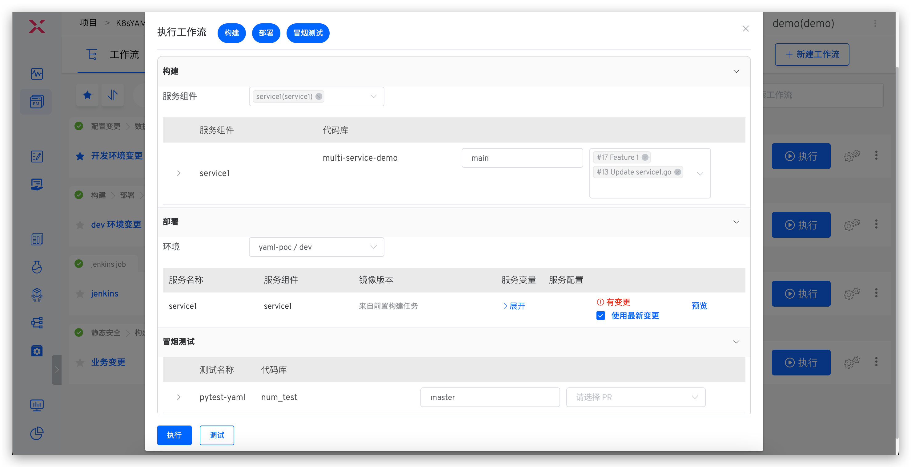
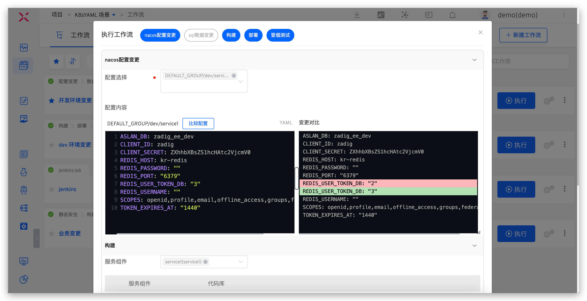
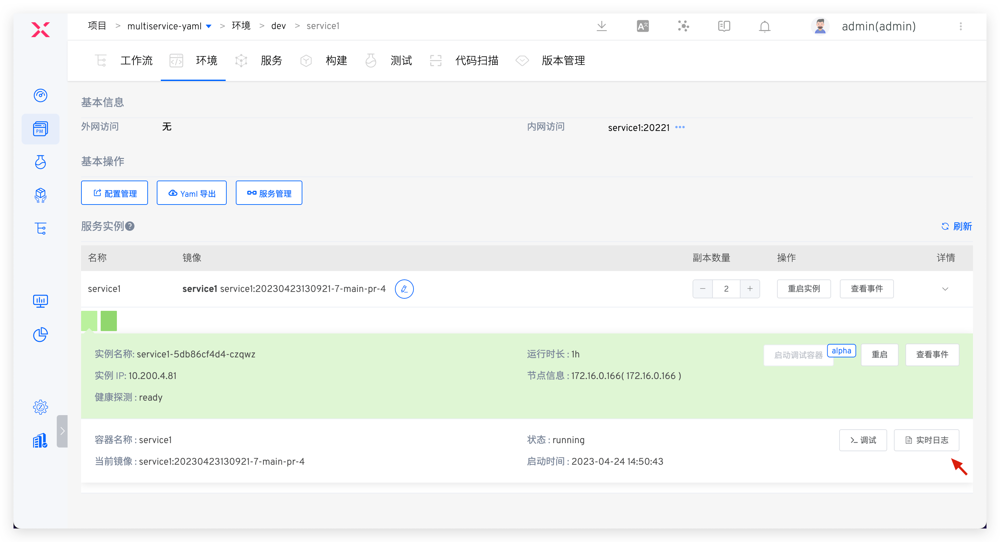
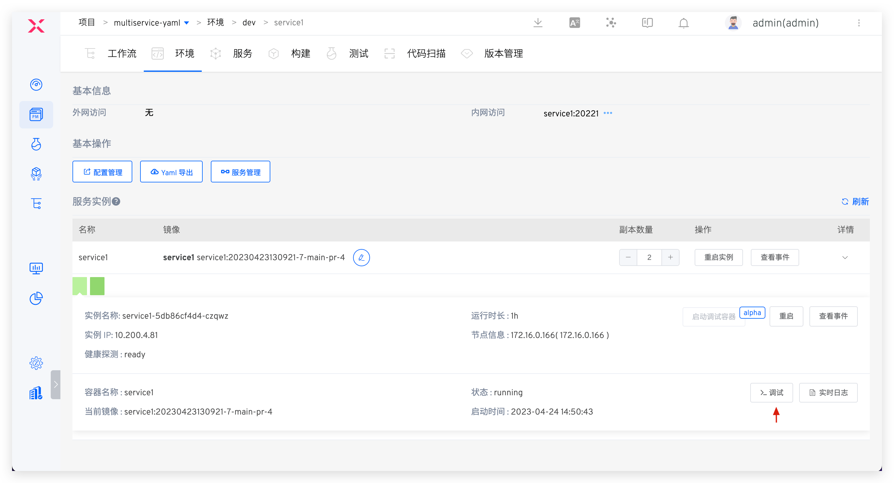
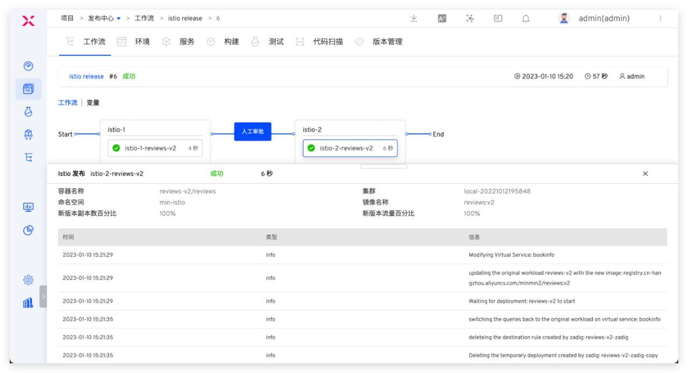

Software delivery is a complex and challenging process involving multiple elements such as people, technology, processes, and tools. During this process, enterprises often encounter the following issues: difficulty in simulating development environments, challenges in multi-business joint debugging, and low R&D efficiency; low efficiency in manual testing, unstable environments, and difficulties in automation; heavy operations and maintenance burdens, numerous tools, and low delivery efficiency; communication difficulties across departments and time-consuming process formulation... To address these challenges, Zadig enhances organizational efficiency through platform engineering and technology upgrades, establishing a comprehensive integrated engineering collaboration baseline, helping enterprises deliver software more efficiently and unleash team productivity.

## Zadig Production and Research Collaboration Solution

Zadig provides an engineering foundation, enabling the production and research teams to collaborate uniformly and achieve agile delivery, completing the entire lifecycle of requirements from development to testing to release. It also supports custom processes, tool expansion, and the orchestration of test services, IT services, security services, and other capabilities. Through Zadig, everything can be automated, allowing engineers to focus on innovation.

## Introduction to Core Scenarios

Development, testing, operation and maintenance engineers are based on the Zadig unified collaboration plane and deliver using automated workflows and cloud-native environments. In addition, the business person in charge/enterprise management personnel can analyze the overall operation of the project in the performance board and analyze the performance shortcomings in each process of the project. The following is an introduction to different characters.

### Administrator Preparation

Administrators (such as operations engineers) configure the engineering foundation required for daily team collaboration in Zadig, including environments and workflows needed for different roles in R&D, testing, and operations.

**Workflow Example**

**Environment Example**

### Development Engineer

#### Local Self-Testing

IDE hot deployment, where code written locally is hot-deployed to a remote environment. For more details, refer to: [VSCode Plugin Usage Guide](/en/Zadig%20v3.4/zadig-toolkit/overview/).

#### Submit Code and CI Process

1. After writing code locally, submit code changes via PR/MR (Pull Request/Merge Request)
	- Create a new branch locally based on the develop branch and write code on the new branch
	- After completing the code, push it to the code repository under your account
	- Create a code change PR/MR
2. Automatically trigger the CI process, including unit testing, code style checking, and code scanning
3. After the CI process is complete, receive feedback on the PR/MR

#### Self-Testing by a Single Engineer

Manually or automatically trigger the dev workflow, which includes steps: Build > Deploy dev environment > Smoke test > IM notification.

#### Multi-Engineer Integration and Debugging

Execute the dev workflow, selecting multiple services and corresponding code changes to execute.

#### Update the Same Service

Execute the dev workflow, selecting the service and its corresponding multiple code changes to execute.

#### Update Business Configuration

> Applicable scenarios: Changes involve configuration updates

Using Nacos configuration as an example, execute the corresponding environment workflow, select the Nacos configuration, and make necessary modifications.

#### Update Project Management Task Status

> Applicable scenarios: After a feature is implemented, update the status of the tracking task with one click

Using Jira as an example, execute the workflow and select the corresponding Jira task.

#### Update the Database

> Applicable scenarios: Changes involve data modifications (such as table structure changes, field changes, etc.)

Using MySQL as an example, execute the workflow and input SQL statements to perform data updates.

#### Service Debugging

View the status of the environment and services:

View real-time service logs:

Enter container debugging:

Temporarily Replace Service Image

Adjust the Number of Replicas/Restart Instances

### Test Engineer
#### Manage Test Cases

1. Write test case scripts locally and perform local self-testing for the sit environment.
2. After passing the self-test, submit the test cases to the code repository.

#### Sit Release Verification

Execute the sit workflow to update the environment for integration verification, including steps: Build -> Deploy sit environment -> Interface Test -> IM Notification.

#### Uat Release Verification

Execute the uat workflow for pre-release verification, including steps: Quality Gate -> Build -> Nacos Configuration Change -> Deploy uat environment -> Regression Test -> IM Notification.

#### Analysis of Automated Test Results
Analyze the results of automated tests and continuously iterate the automated test suite based on coverage.

### Release Engineer

#### Production Environment Release

> Supports multiple release strategies.

**Rolling Release**

Execute the prod workflow to update the production environment, including steps: Release Approval -> Nacos Configuration Change -> Deployment.

**Blue-Green Release**

Execute the workflow to update the production environment, including steps: Deploy blue environment -> Approval -> Switch production version.

**Canary Release**

Execute the workflow to update the production environment, including steps: Deploy canary -> Random testing -> Approval -> Full release of new version.

**Batched Gray Release**

Execute the workflow to update the production environment, including steps: Gray 20% -> Approval -> Gray 60% -> Approval -> Full release of new version.

**Istio Release**

Execute the workflow to update the production environment, including steps: Deploy new version 20% traffic -> Approval -> 100% traffic to new version.

### Project/Enterprise Managers
View the Overall Operation Status of the Enterprise Project

Analyze the changes in the project's various environments and identify performance bottlenecks.

## More Product Features

### Everything About Open Source Zadig

Cloud-native CI/CD, efficient engineering collaboration in production and research, and rapid response to business iterations.

Reference Documentation:

- [Zadig Best Practice](https://mp.weixin.qq.com/mp/appmsgalbum?action=getalbum&amp;__biz=Mzg4NDY0NTMyNw==&amp;scene=1&amp;album_id=2315406414233927682&amp;count=3#wechat_redirect)
- [Zadig Corporate Cases](https://mp.weixin.qq.com/mp/appmsgalbum?action=getalbum&amp;__biz=Mzg4NDY0NTMyNw==&amp;scene=1&amp;album_id=2408445357925269505&amp;count=3#wechat_redirect)

### Publishing Center

Flexibly orchestrate various release strategies, supporting blue-green, canary, batched gray, Istio, and other release strategies, as well as gray release solutions such as APISIX + MSE. Combined with manual approval, it can connect the organization, processes, and internal and external systems, achieving one-click automation, safe, and reliable releases.

Reference Documentation:

- [Zadig Release Strategies](/en/Zadig%20v3.4/project/release-workflow/)
- [Zadig Workflow Approval](/en/Zadig%20v3.4/workflow/approval/)

### Customer Delivery

We are responding 24/7 to large customers and deploying in all regions, providing self-operation and maintenance and dedicated service channels to achieve stable and efficient delivery and service guarantees.

Reference Documentation:

- [Customer Delivery](/en/Zadig%20v3.4/plutus/overview/)

