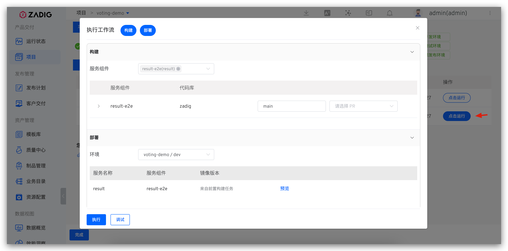

## Quickly Build a Project

The following content outlines the quick setup steps for a K8s YAML project. If you need specific examples, see: [Tutorial](https://www.koderover.com/tutorials-detail/codelabs/GitHub/index.html?index=..%2F..index#0).

### Create a New Project

Enter the Zadig system, click "Project" - "New Project", fill in the project name, and select the project type `K8s YAML Project` to create a new project.

Click `Next` to proceed to the service configuration step.

### Service Configuration
Create a new service and configure it for the service. For new services, see [New K8s YAML Service](/en/Zadig%20v3.4/project/service/k8s/#create-a-new-service). After the service is created, the system will automatically parse K8s resources and related service components.

> For a concept introduction to the service component, see [Service component](/en/Zadig%20v3.4/env/overview/#what-is-a-service-component).

Click `Add Build` to add a build configuration for the service component. See [Build Configuration](/en/Zadig%20v3.4/project/build/).

### Environment Configuration

After completing the service configuration, click `Next` to proceed to the new environment page, where you can configure the business environment as needed.

> For relevant parameter descriptions, see [Create a new environment](/en/Zadig%20v3.4/project/env/k8s/#create-a-new-environment).

Click `Create Environment`, and after the environment is created, click `Next` to proceed to the workflow delivery process.

::: tip
The number of services and the resources required to start the services will affect the environment creation time, so please be patient.
:::

### Workflow Delivery

- Execute the `dev` workflow to update and upgrade the services in the `dev` environment.

- On the workflow execution details page, you can track the build logs in real time.

- After the workflow successfully completes, the service will be automatically updated and deployed.

