## Quick Setup

This guide provides the essential steps to create a K8s Helm Chart project. For detailed examples, see: [Tutorial](https://www.koderover.com/tutorials-detail/codelabs/helm-chart/index.html?index=..%2F..index#0).

### Create Project

Navigate to "Project" → "New Project", enter the project name, and select `K8s Helm Chart Project`.

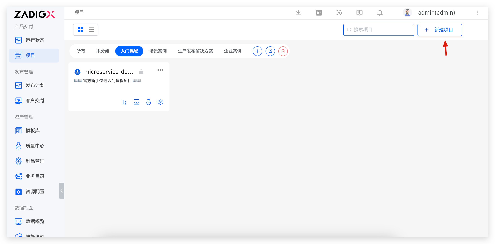
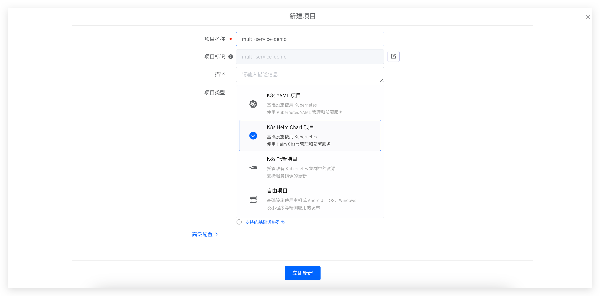

Click `Next` to configure services.

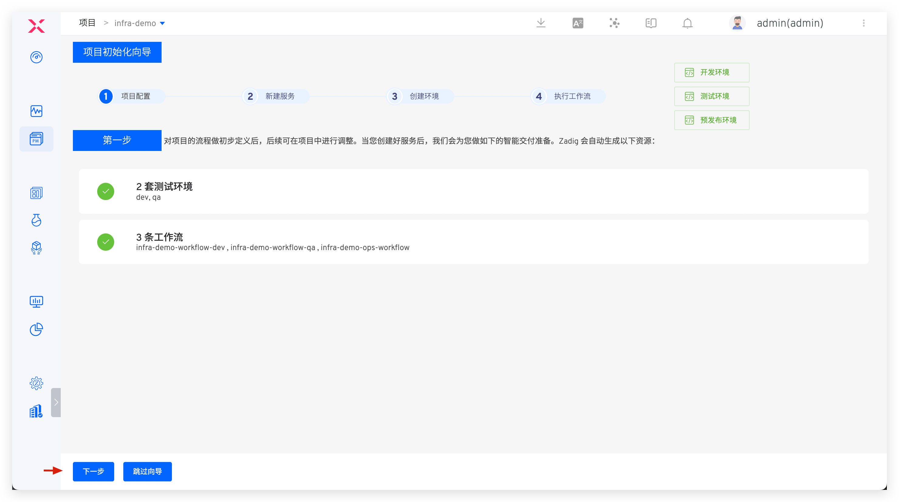

### Configure Services

Create and configure services. See [New K8s Helm Chart Service](/en/Zadig%20v3.4/project/service/helm/chart/#create-a-new-service) for details.

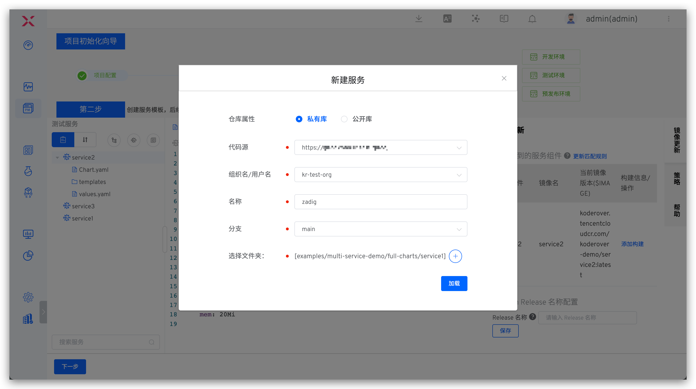

The system automatically parses service components from the values file. Click `Add Build` to configure build settings. See [Build Configuration](/en/Zadig%20v3.4/project/build/).

> For service component concepts, see [Service component](/en/Zadig%20v3.4/env/overview/#what-is-a-service-component).

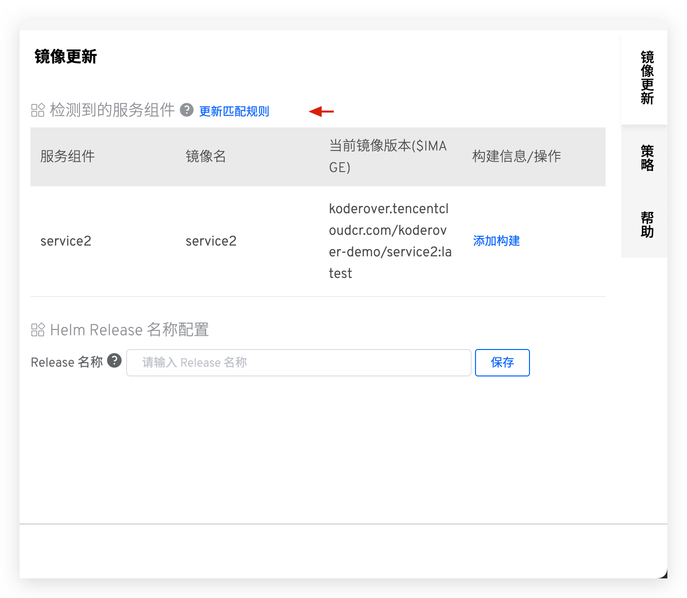
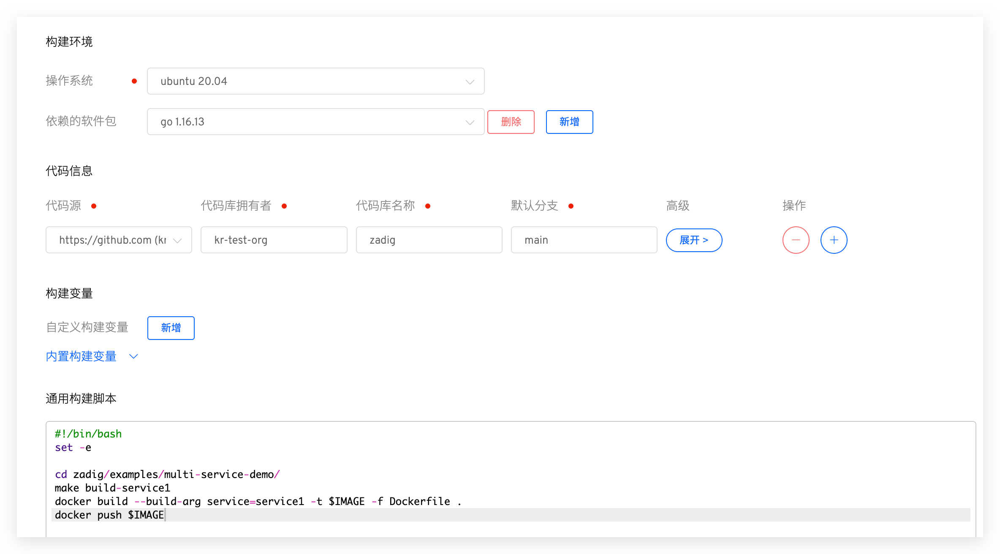

### Configure Environment
Click `Next` to create an environment. Configure business environment parameters as needed.
> For parameter details, see [Create a new environment](/en/Zadig%20v3.4/project/env/k8s/#create-a-new-environment).

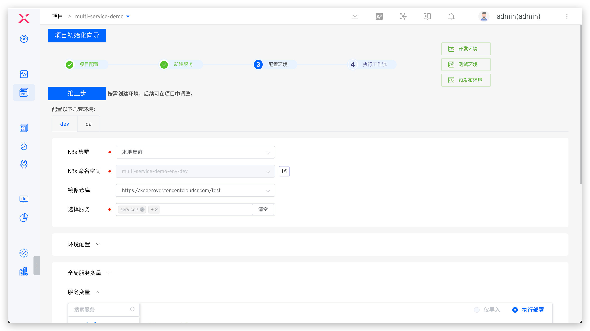

Click `Create Environment`, then `Next` to proceed to workflow delivery.
::: tip
Environment creation time depends on service count and resource requirements.
:::

### Deploy via Workflow

- Execute the `multi-service-demo-workflow-dev` workflow to deploy services to the `dev` environment.

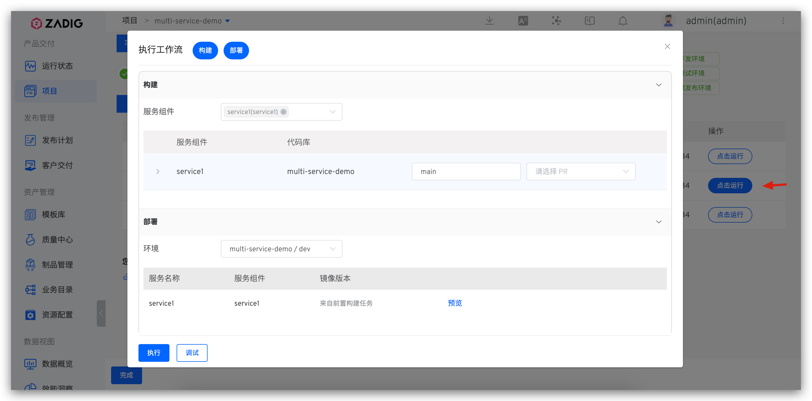

- Monitor build logs in real-time on the execution details page.

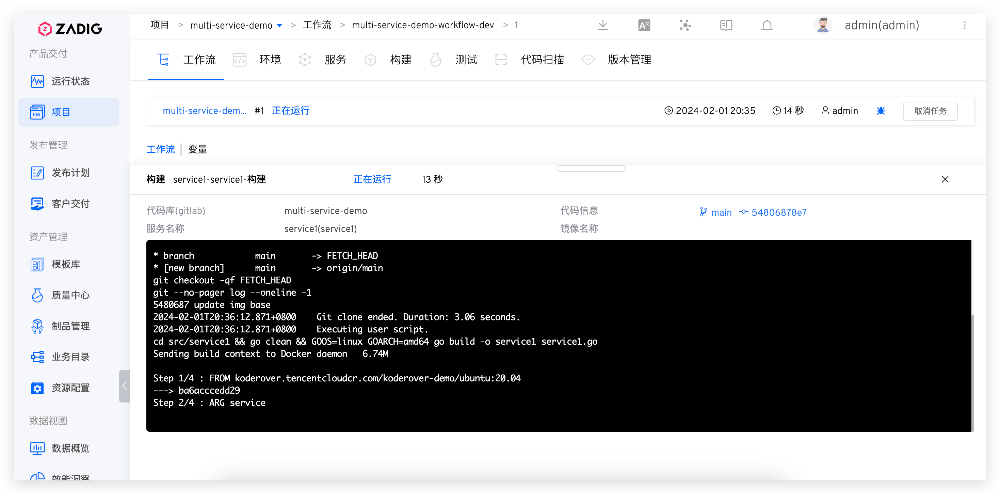

- Services are automatically updated upon successful workflow completion.

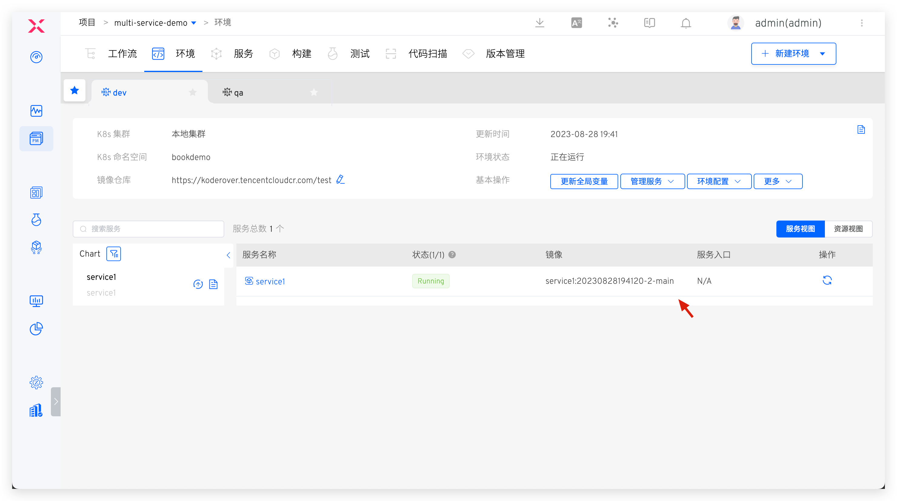

## Variable Groups

### Configuration

In a Helm Chart project, administrators can manage project variables via `Configuration` → `Variable Groups`.

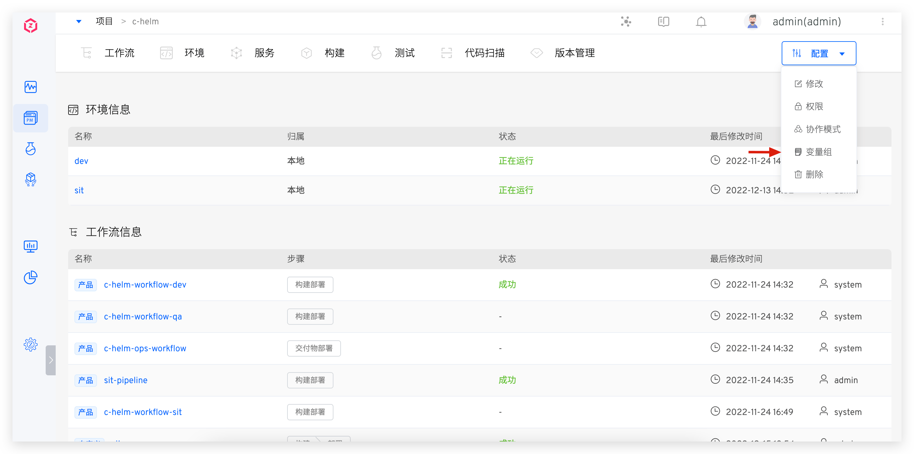
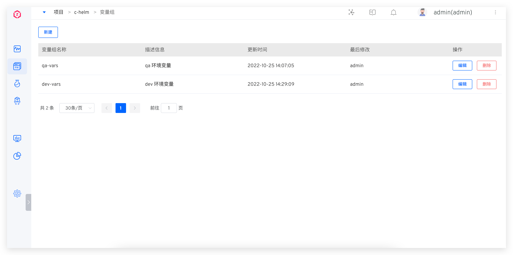

### Usage

Environment global variables can reference variable groups. See [update global variables](/en/Zadig%20v3.4/project/env/helm/chart/#update-global-variables) for details.