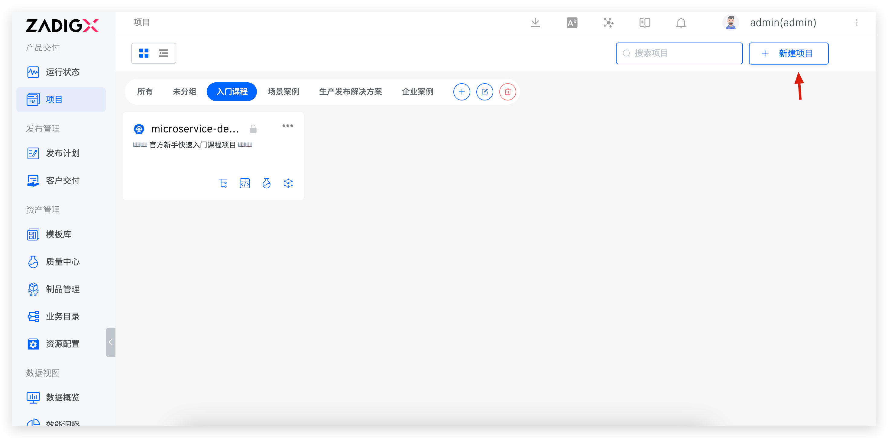

Supports the management of resources in a specified namespace of Kubernetes clusters. By creating a new environment and hosting services in Zadig, it enables cross-cluster testing environment management and service management.

## Quickly Build a Project

The following content outlines the quick setup steps for a K8s hosting project. If you need specific examples, refer to: [Tutorial](https://www.koderover.com/tutorials-detail/codelabs/Hosting-Namespace/index.html?index=..%2F..index#0).

### Create a New Project
Enter the Zadig system, click on "Project" - "New Project", fill in the project name, and select the `K8s Hosting Project` type to create a new project.

### Configure Environment Hosting
Fill in the environment name, select the hosted cluster and the namespace within the cluster, and choose the services to be managed.

::: tip
1. Zadig can manage services in both local and non-local clusters. Local clusters refer to the clusters where the Zadig system resides.
2. For configuring multiple clusters, refer to [Cluster Management](/en/Zadig%20v3.4/pages/cluster_manage/).
:::

### Configure Service Build
The system will automatically parse the service components. Click `Add Build` to add build configurations for the service components. Refer to the documentation: [Build Configuration](/en/Zadig%20v3.4/project/build/).

> For a concept introduction to the service component, please refer to the document: [Service component](/en/Zadig%20v3.4/env/overview/#what-is-a-service-component) .

Click `Next`, and the service hosting for the Kubernetes cluster is now complete. In the integrated environment, you can preview the status, images, and other information of the hosted services.

Click on a specific service to view more detailed information, including but not limited to modifying the service image version, viewing service deployment events, and viewing real-time logs.

### Run the Workflow
Trigger a workflow, select the service to be updated, and start the task to achieve automated deployment and upgrade of the hosted services. After the workflow execution is complete, enter the environment to verify that the service has been automatically updated.

## Switch a K8s Hosting Project to a K8s YAML Project

Users can switch existing hosting projects to K8s YAML projects with one click as needed.

::: tip Caution
1. The workflow/build/test/code scanning/permissions/collaboration mode will remain the same, and new service management capabilities will be added.
2. All hosted environments will be displayed in the new project.
3. Service configurations in all environments will be managed and displayed, with only one instance of duplicate service configurations retained.
:::

Enter the corresponding hosting project, click `Switch Project Type`, and complete the project type switching.
