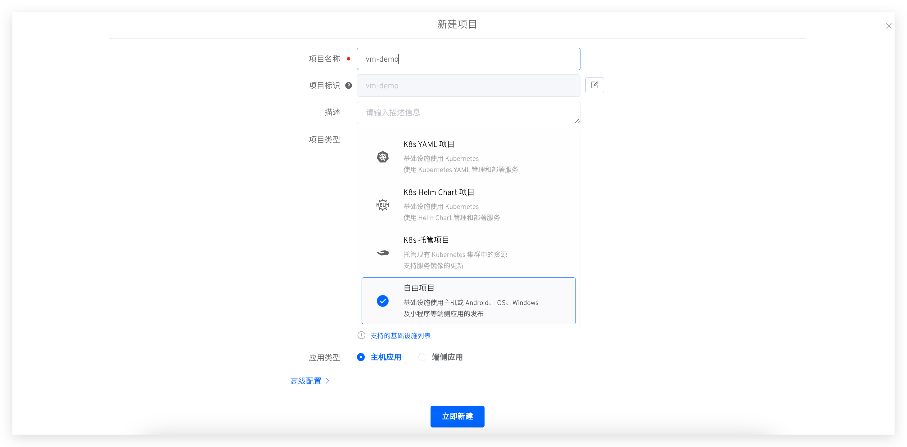
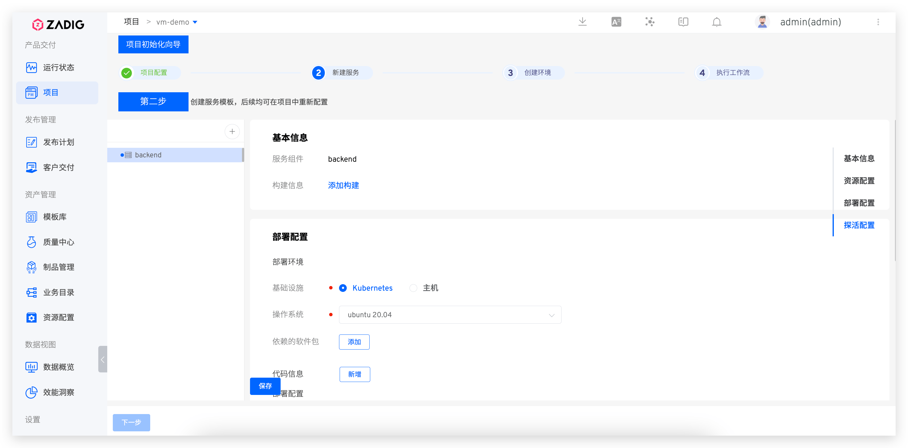
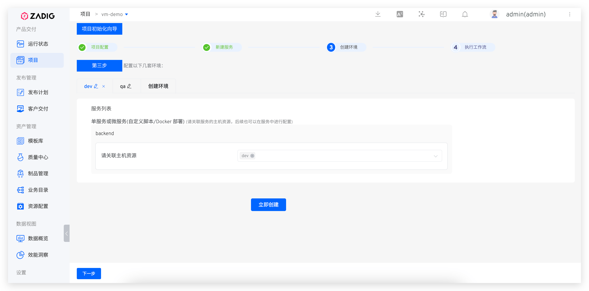

## Quickly Set Up a Project

The following content outlines the quick steps to set up a freestyle project. If you need specific examples, see: [Tutorial](https://www.koderover.com/tutorials-detail/codelabs/cloudhost/index.html?index=..%2F..index#0).

### Create a New Project

Enter the Zadig system, click on "Project" - "New Project", fill in the project name, select the `freestyle Project` project type, and choose `Vm` to create a new project.

### Service Configuration
Click the `+` button to fill in the service name. Then configure the build, service deployment, and service liveness checks.

> See [Host Service](/en/Zadig%20v3.4/project/service/vm/) to complete the relevant configuration items.

### Create a New Environment

Create a new environment and associate it with host resources.

### Workflow Delivery

Once the environment and workflow are ready, click `Next` to select the dev environment workflow, which can trigger service updates in the dev environment.

