This article primarily introduces the unique aspects of Zadig workflows compared to Jenkins jobs and the specific steps for migrating from Jenkins to Zadig.

## What Makes Zadig Workflows Unique?

The Zadig workflow engine was initially built on Kubernetes capabilities, leveraging Kubernetes' dynamic resource allocation to achieve concurrent execution of multiple tasks. Compared to Jenkins, it can save at least **50%** of resources and improve task execution efficiency by at least **40%**.
The design of Zadig workflows aligns more closely with real-world business scenarios and supports the orchestration of any systems and tools involved in the product delivery process, such as project management systems, code hosting platforms, testing platforms, deployment tools, configuration management tools, data management tools, approval systems, and enterprise-built systems. In addition to the basic capabilities of CI workflows (such as cloning code, executing shell scripts, triggers, notifications, and caching), Zadig workflows support the following additional capabilities:
  - Support for shared builds, build templates, and serverless resource builds across multiple services
  - Support for concurrent builds, deployments, and tests across multiple services
  - Support for task status changes, configuration changes, and data changes in project management
  - Support for blue-green deployments, canary deployments, phased gray deployments, MSE full-stack, and Istio full-stack deployments
  - Support for release process approvals
  - During execution, it supports building using Branch, PR/MR, Branch+PR/MR, Tag, and Commit methods based on the actual branching strategy
  - ..


### Differences in Workflow Implementation Details

| Key Workflow Components | Jenkins | Zadig |
| --- | --- | --- |
| Execution Environment | Manually Created Environment | Extendable Cloud-Native Environment and Dependency Packages |
| Code Information | Decentralized Code Source Configuration | Unified Management of Multiple Code Sources |
| Execution Scripts and Variables | Decentralized Script Writing | Unified Script Configuration Standards |
| Scheduled Triggers | Scheduled Triggers | Multiple Customizable Trigger Strategies |
| Code Change Trigger | Plugin Code Triggers  | A Variety of Trigger Strategies |
| Workflow Chaining | Triggering Based on Workflow Status | Service-Oriented Flexible Orchestration and Scheduling |
| Multi-Task Concurrent Execution | Script-Based Concurrency Control | Cloud-Native Task GUI Concurrency Configuration |
|  Concurrent Task Quantity Control | Resource Node-Based Concurrency Control | Unified Management of Concurrency Scheduling Policies |


## Specific steps for migrating from Jenkins to Zadig

### Comparison 1: Execution Environment

For the environments dependent on workflow tasks, Jenkins requires manually setting up the environment on the corresponding nodes, while Zadig supports managing the basic environment and dependency software packages for task execution. This facilitates platform operations and maintenance to control the basic resources used in business construction, testing, and other processes, ensuring the security and compliance of resources.

The execution environment for Jenkins tasks is specified by selecting the running node in the configuration. The software packages used during task execution need to be installed and managed on the corresponding node.

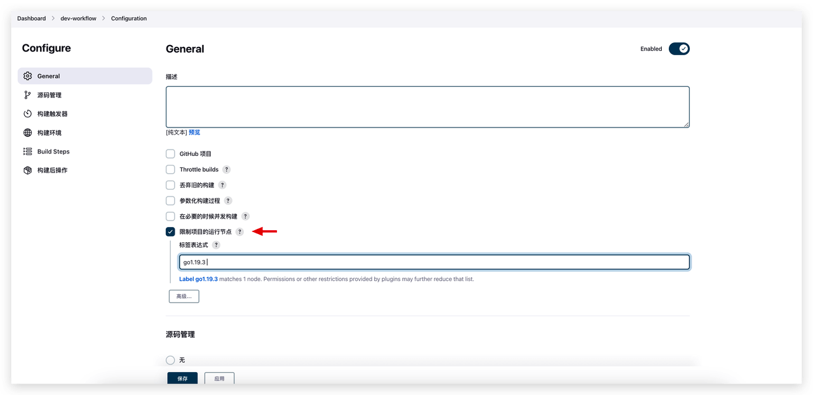

The execution environment for Zadig tasks is specified by selecting the operating system and dependency software packages in the configuration.


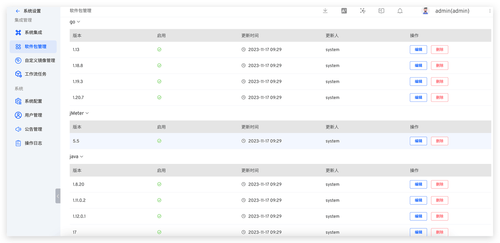
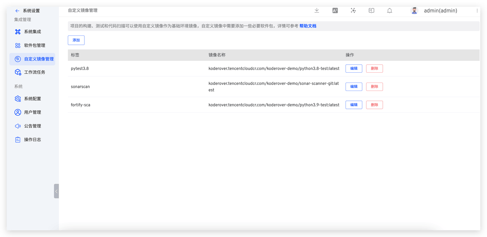
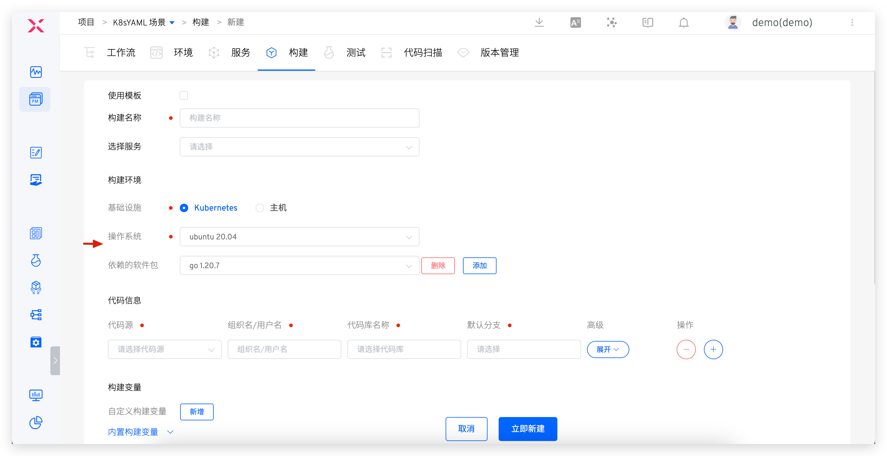

### Comparison 2: Code Information

For internal code sources used in the enterprise, Jenkins manages them in different tasks, while Zadig integrates them centrally by administrators to ensure the security of code sources.

The following example uses GitLab to compare the configuration of code information on Jenkins and Zadig.

Jenkins configures "Source Code Management" to define the code source.

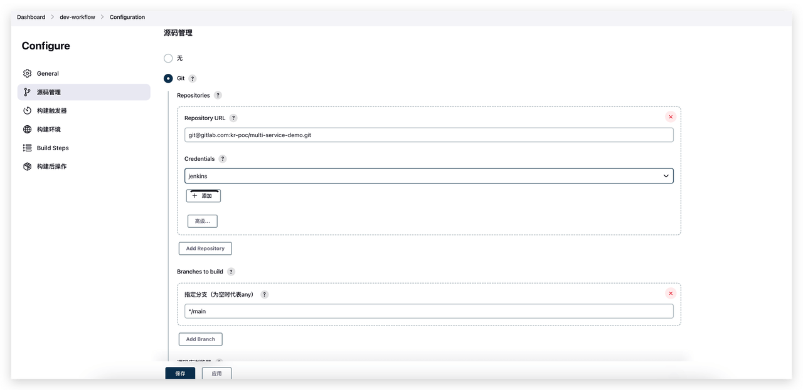

Zadig supports the integration of code hosting platforms such as GitLab, GitHub, Gerrit, Gitee, and other general Git code sources. After integration, it can list the authorized code repository information in the code base, including Branch, PR/MR, Tag, etc., which is more intuitive and user-friendly for developers.

- Step 1: Integrate the code source. For the specific process, refer to [GitLab Code Source Integration](/en/Zadig%20v3.4/settings/codehost/gitlab/)

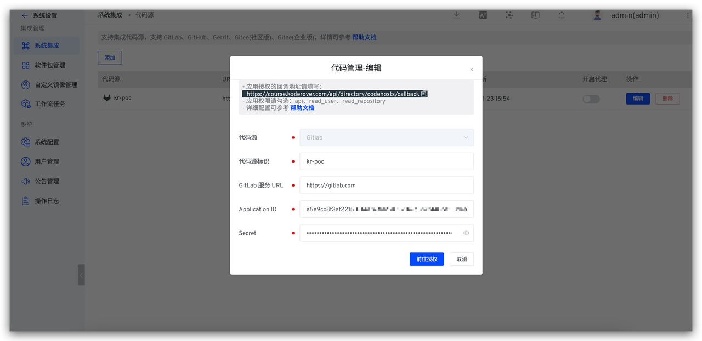

- Step 2: Configure code information in the task. Zadig build, test, code scan, and general tasks all support pulling code information.

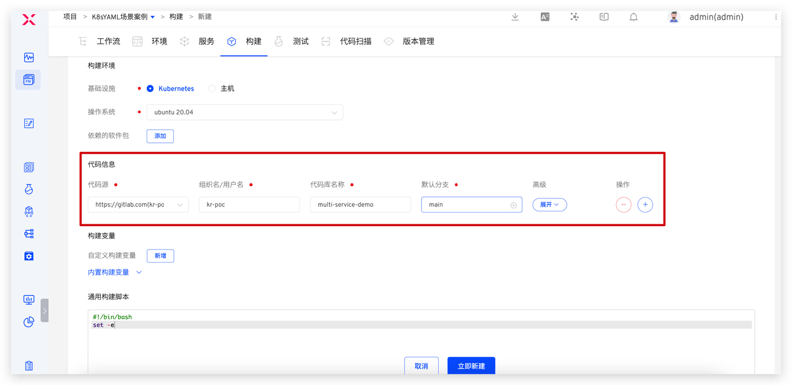

### Comparison 3: Execution Scripts and Variables

For the definition of service execution scripts and variables, Jenkins manages them in a decentralized manner across different tasks, while Zadig standardizes the service build process through build templates, reducing the burden of operations and maintenance management.

The following example uses a multi-service code repository to build and push images, comparing the differences between Jenkins script writing and Zadig script writing.

The Jenkins execution script and variables are shown in the figure below. The script primarily handles service building, image building, and image pushing. The variables `$SERVICE`, `$VERSION`, and `$PWD` need to be defined in the configuration.

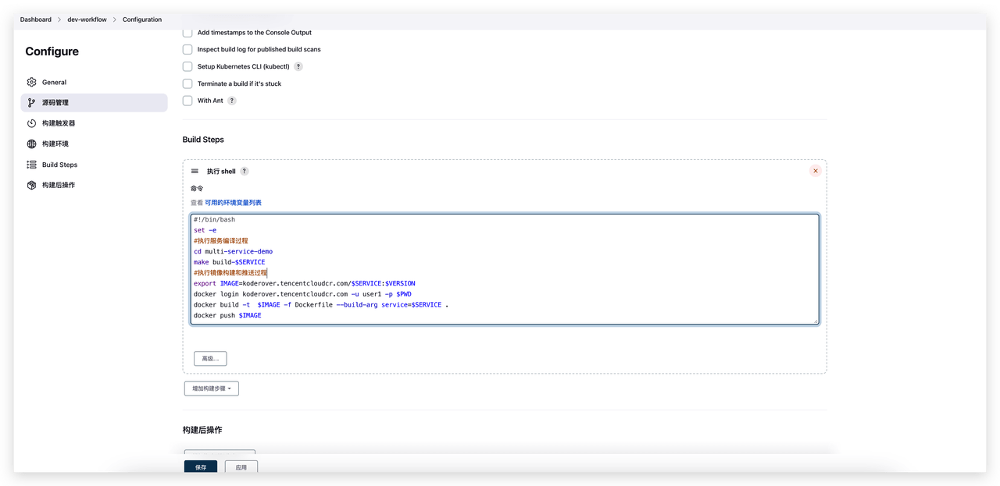
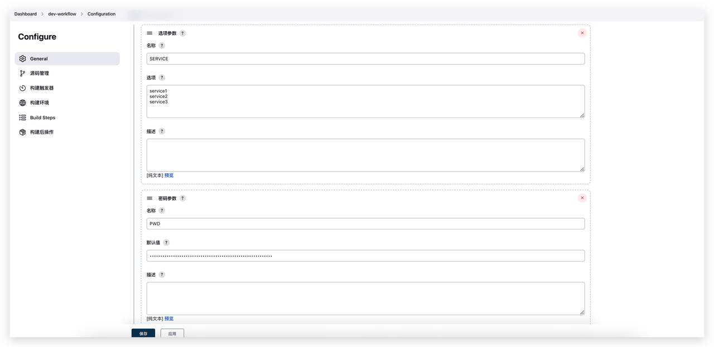

The Zadig execution script and variables are shown in the figure below. Zadig's built-in `$SERVICE` and `$IMAGE` variables make the script more concise.

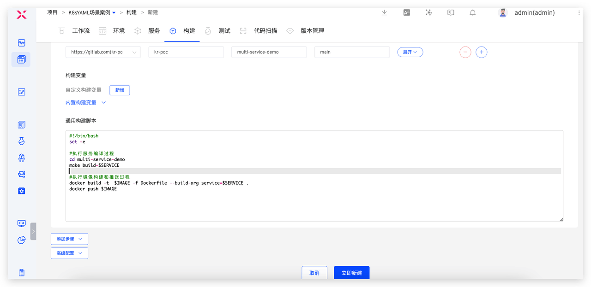
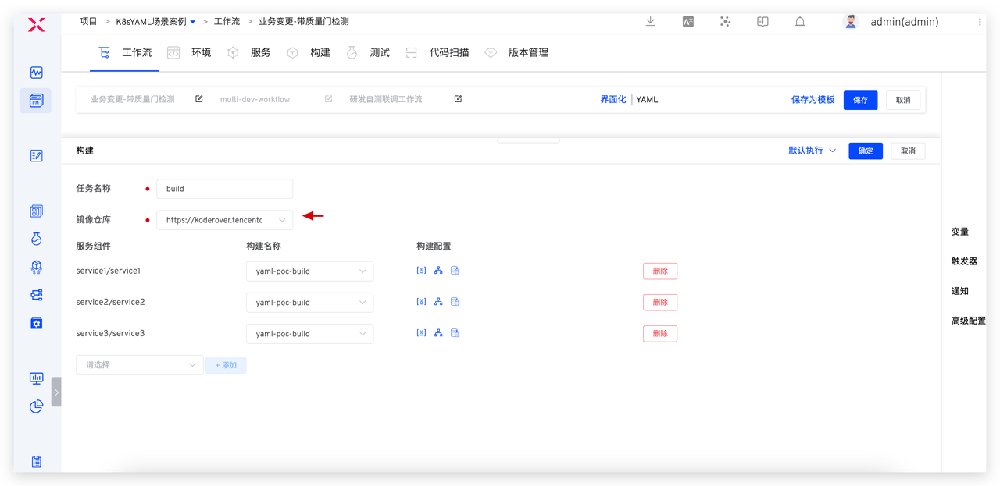

Differences between the two:
1. During task execution, Zadig automatically performs the `docker login` operation based on the configured image repository, so there is no need to declare it in the script.
2. In Zadig , the mirror naming rules support unified configuration and management. For details, you can refer to [the documentation](/en/Zadig%20v3.4/project/service/k8s/#policy-configuration) , so there is no need to define the generation rules for IMAGE variables in the script.

### Comparison 4: Scheduled Triggers

Scheduled execution of workflow tasks is a common scenario. Jenkins can configure scheduled triggers for the default parameters of workflow tasks. In addition to specifying the trigger time period, Zadig also supports configuring task execution variables, providing more flexibility.
Jenkins triggers support configuring Cron expressions to schedule tasks.

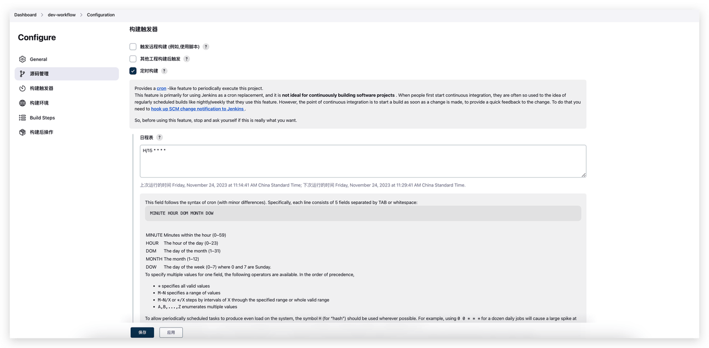

Zadig timers support multiple triggering methods, including timed loops, interval loops, and Cron expressions, to meet various scheduling needs. Additionally, compared to Jenkins using default parameters, Zadig timers allow configuring different workflow execution variables, providing more flexible customization options.

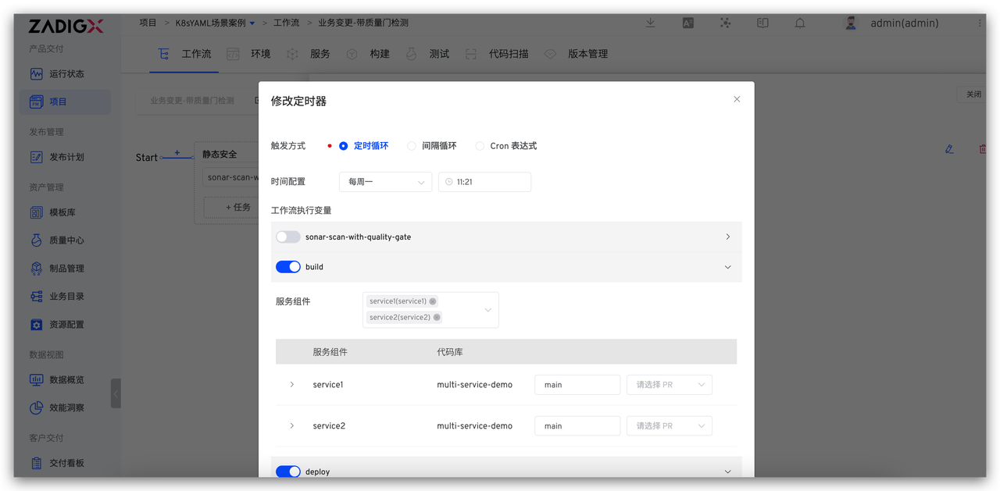

### Comparison 5: Code Change Triggers

Automatically triggering workflow execution when developers submit code is a common practice in Continuous Integration and Continuous Deployment (CI/CD). In Jenkins, this requires relying on plugins. In contrast, Zadig has built-in Git triggers, which do not require additional plugins and can meet various trigger scenarios through flexible configuration, thereby improving overall efficiency.
Jenkins can implement code change-triggered tasks by installing plugins.

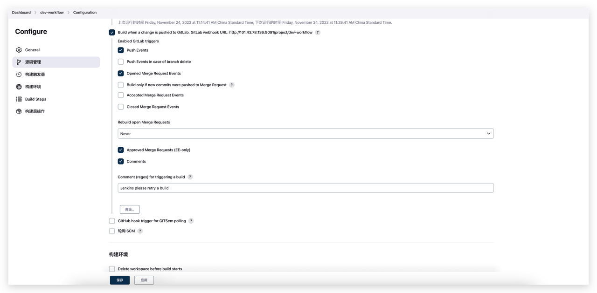

Zadig Git triggers support code change triggering by defining code information, trigger events, code file directories, and workflow execution variables. This allows the corresponding workflow to be triggered flexibly and accurately when the code base changes, meeting the execution of various complex automated processes.

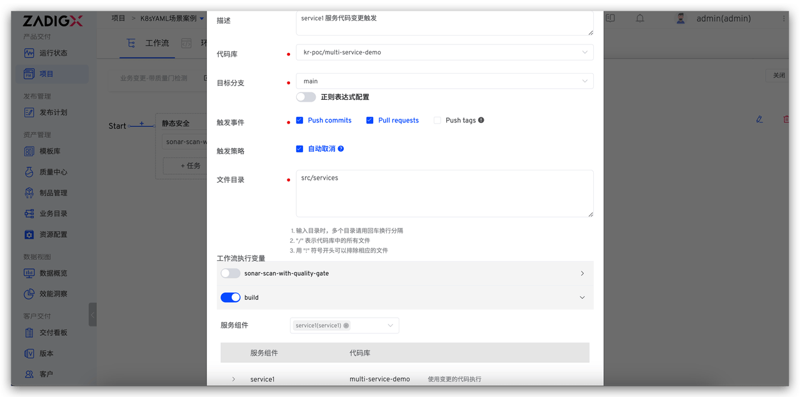

In addition to the above triggers, Zadig supports various other triggers, including "JIRA Trigger," "Feishu Project Trigger," and "Generic Trigger." For more details, refer to [the documentation](/en/Zadig%20v3.4/project/workflow-trigger/).


### Comparison 6: Workflow Chaining and Orchestration

For some service-oriented tasks within the enterprise, such as security scans, they need to be managed uniformly and used in multiple workflows. Typically, these tasks are managed centrally by security departments or platform teams and then called in various business workflows. To reduce the burden of implementation and subsequent maintenance, a multi-workflow chaining approach is generally chosen to achieve more efficient task scheduling and management.
Jenkins triggers other tasks by configuring "Build Other Projects."

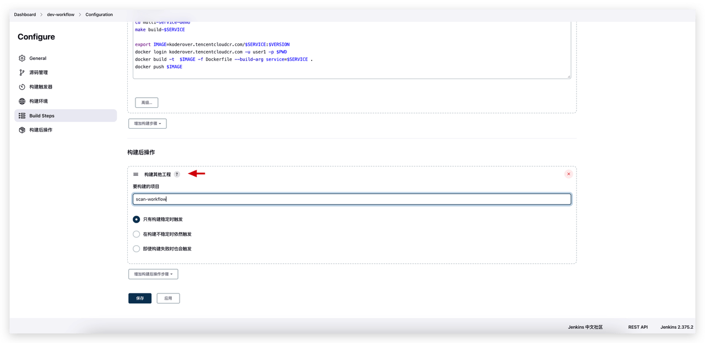

Zadig's workflows are designed in a service-oriented manner, allowing configurations such as testing and code scanning to be centrally managed and easily attached to various workflows. This design makes configuration and management more efficient and allows these services to be flexibly applied in different workflows, improving the maintainability and scalability of the overall workflow.

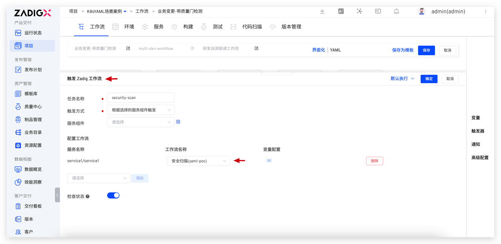

### Comparison 7: Multi-Task Concurrent Execution

Multi-task concurrent execution is particularly critical in complex software development processes, continuous integration, and deployment. This can significantly reduce engineers' waiting time, improve overall R&D efficiency, and accelerate project progress, enabling more flexible responses to changing needs.
The Jenkins pipeline supports concurrent execution of different "stages." Refer to the following structure for detailed configuration.

```groovy
pipeline {
    agent any
    stages {
        stage('Build and Deploy Services') {
            parallel {
                stage('Service 1') {
                    steps {
                        echo "Build and Deploy Service 1"
                    }
                }
                stage('Service 2') {
                    steps {
                        echo "Build and Deploy Service 2"
                    }
                }
                stage('Service 3') {
                    steps {
                        echo "Build and Deploy Service 3"
                    }
                }
            }
        }
    }
}
```

The Zadig workflow only needs to turn on the "Concurrent Execution" switch at the "Stage" level to achieve concurrent execution of multiple tasks within the stage.

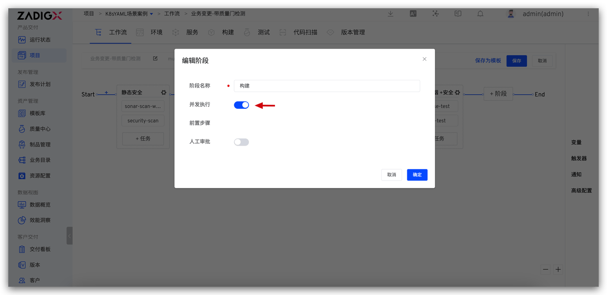
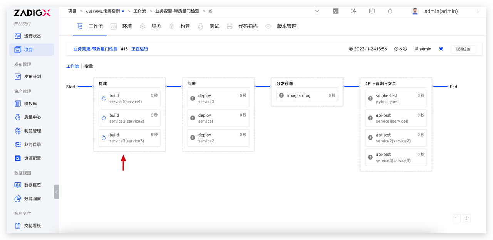


### Comparison 8: Concurrent Task Quantity Control

Both Jenkins and Zadig support concurrent execution of multiple tasks within the same workflow. Jenkins controls the number of concurrent tasks through resource nodes, while Zadig uniformly manages concurrency scheduling policies and has the ability to flexibly control task priorities.
Jenkins controls the concurrency of multiple tasks by configuring the "number of task executions" on the node. The concurrency of a single Jenkins task can be specified in the task configuration.

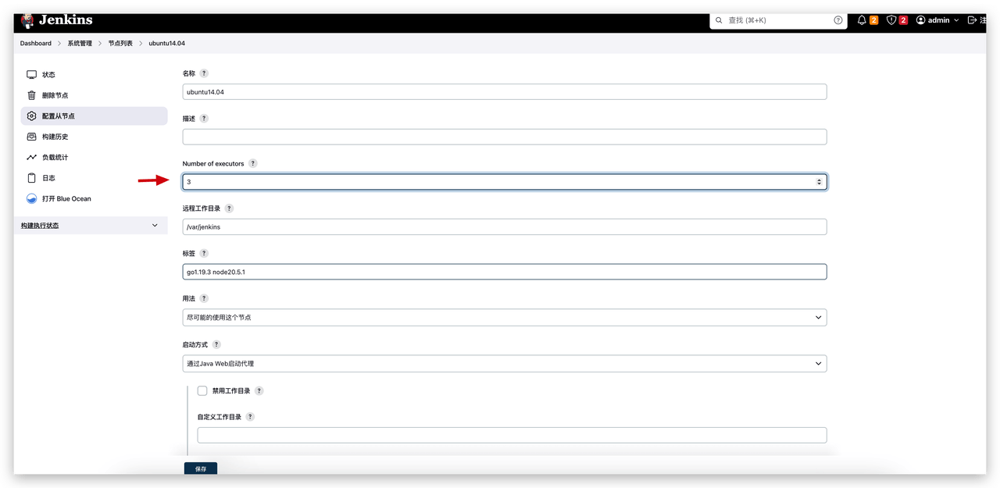
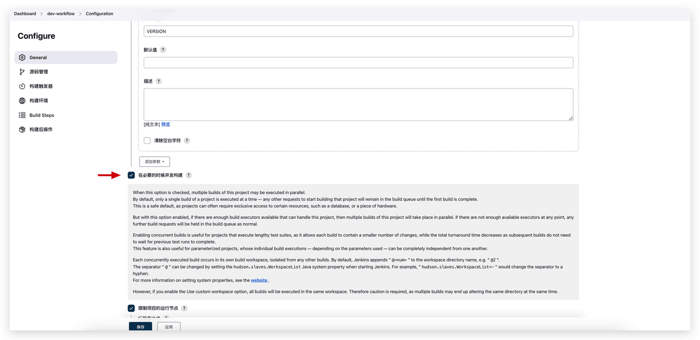

Zadig controls concurrency by modifying the "Task Concurrency Number" in the task configuration. The "Workflow Task Concurrency Number" controls the number of workflow tasks executed simultaneously, while the "Single Task Service Concurrency Number" controls the number of concurrent services within the same workflow task. Additionally, for scenarios where low-priority tasks occupy the global concurrency number, this can be addressed by configuring the "Execution Concurrency Number" of the workflow. Zadig offers more flexible task concurrency control, enabling it to handle complex task concurrency scenarios within the enterprise.

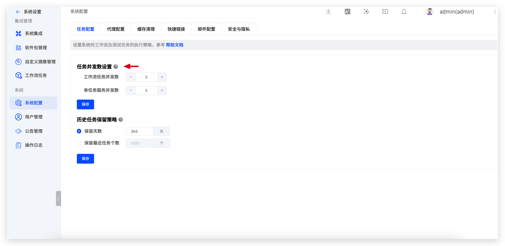
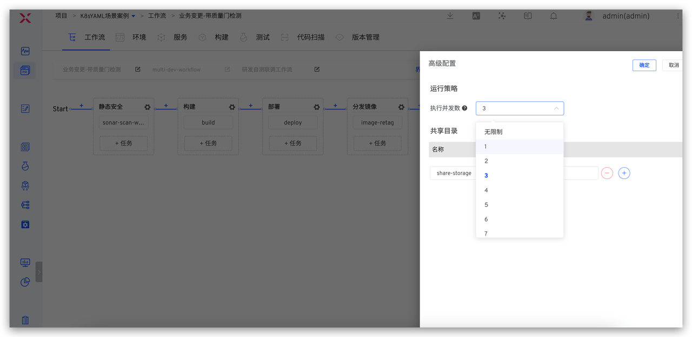


Beyond these capabilities, Jenkins extends additional functionalities through plugins, while Zadig can develop "Custom Tasks" to integrate with the enterprise's own systems, meeting complex enterprise processes. For the specific development process, refer to [Workflow Tasks](/en/Zadig%20v3.4/settings/custom-task/).