This article primarily introduces the triggering of Zadig workflows, including:
- Manual Trigger
- Trigger-based triggers, supporting the following five types of triggers:
    - `Git`: The workflow is automatically triggered after code changes
    - `Timer`: The workflow is triggered at a set time
    - `JIRA`: The workflow is automatically triggered after a JIRA issue status changes
    - `Feishu Project Trigger`: The workflow is automatically triggered after a Feishu project status changes
    - `Universal`: A third-party system triggers the workflow via Webhook
- Calling the Developer OpenAPI to Trigger

## Manual Trigger

### Workflow Execution

Click "Execute Workflow" to modify the value of the workflow variables and select the tasks to be executed as needed:
> If the value of the workflow variable is set to a fixed value, the variable will not be visible on the page when the workflow is executed.

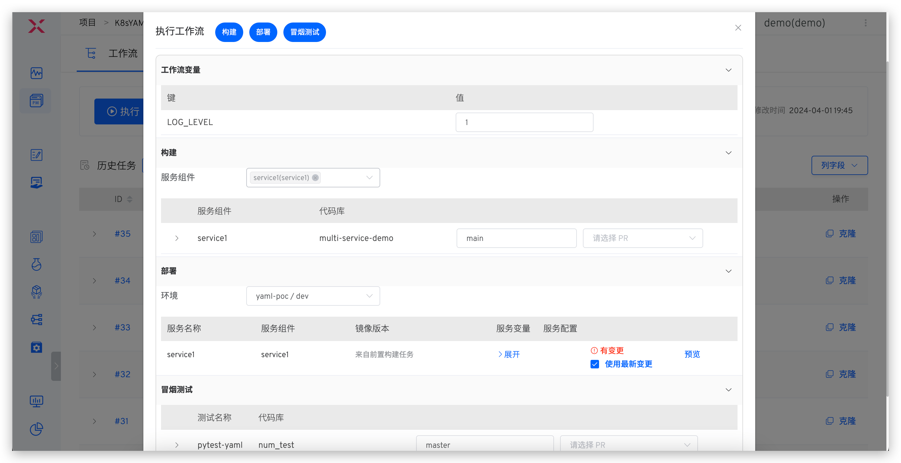

Click on a specific build task to view the build log:
> The task name format is: `Service Name-Service Component Name-Task Name`

After a workflow execution fails, you can retry the execution. When retried, it will start from the failed task, and the previously successful tasks will not be executed again.

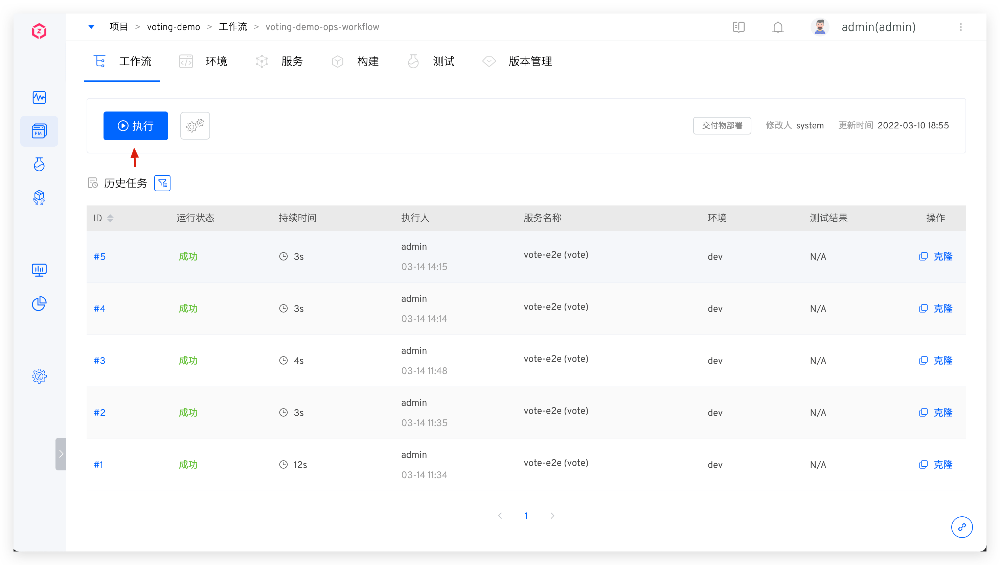

### Execution Parameters

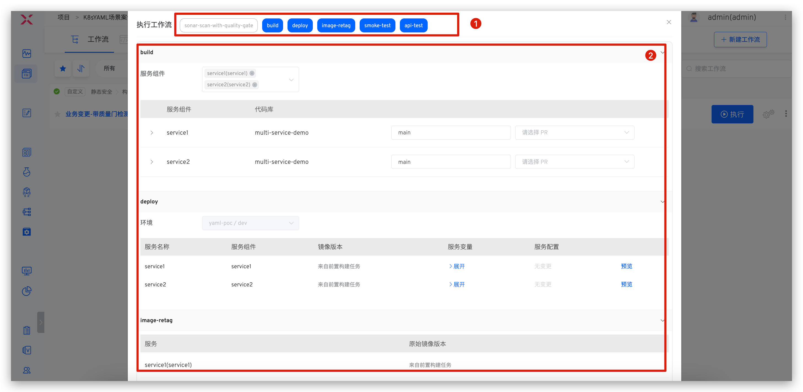

Explanation:

- `Area 1`: Select the task to be executed
- `Area 2`: Enter different execution parameters based on the selected task

## Git Trigger

After configuring the Git trigger, the workflow can be automatically triggered when the code that meets the configuration conditions changes.

::: warning
When the code source is of type `Other`, the Git trigger is not supported.
:::

### How to Configure

The code hosting platform triggers the Zadig workflow via Webhook, so you need to configure the corresponding Webhook in the corresponding repository. Zadig provides two ways to configure the Webhook:
- Automatic Creation: Just configure the trigger parameters in the workflow. Zadig will automatically create a Webhook in the corresponding code repository, suitable for scenarios where the code source integration account has permission to create a Webhook in the code repository.
- Manual Creation: First configure the Webhook in the code repository, then configure the trigger parameters in Zadig. This is suitable for scenarios where the code source integration account does not have permission to create a Webhook in the code repository.

##### Automatic Creation

Click `Triggers` on the right side of the workflow.

Select `Git Trigger` -> Fill in the parameters and save.

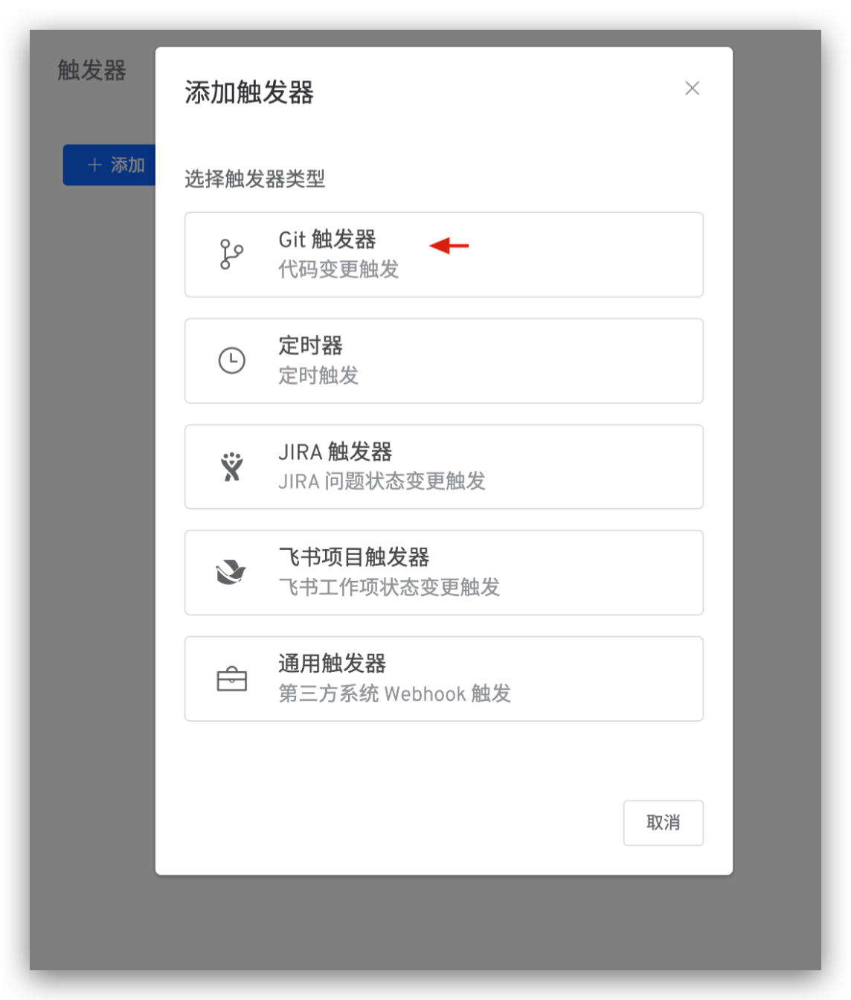

Parameter Description:
- `Workflow Execution Variables`: The tasks you want to be triggered and their specific configurations
- Other parameters: Please refer to the description in [Git basic configuration of the trigger](/en/Zadig%20v3.4/project/common-workflow/#git-trigger)

##### Manual Creation

If the code source integration account in the system integration does not have permission to create a Webhook in the code repository, you can choose to use manual creation to configure it. The steps are as follows:

1. Click `Manual Webhook Creation` to switch to the manual creation page.

2. Access the code repository to configure the Webhook, fill in the Webhook URL, Secret Token, and trigger events. The example for GitLab is as follows:

::: tip Trigger events that need to be configured for different code sources
- GitHub code source: Branch or tag creation, Check runs, Pull requests, Pushes
- GitLab code source: Push events, Tag push events, Merge request events
- Gitee code source: Push, Tag Push, Pull Request
:::

3. Refer to [Git The basic configuration of the trigger](/en/Zadig%20v3.4/project/common-workflow/#git-trigger) is filled in the relevant configuration in Zadig and then saved.

### Code Change Trigger Effect

After the configuration is completed, the workflow can be triggered by submitting a pull request, merge request, or push according to the configuration. Taking GitLab as an example, the workflow feedback information can be viewed in the merge request, as shown below.

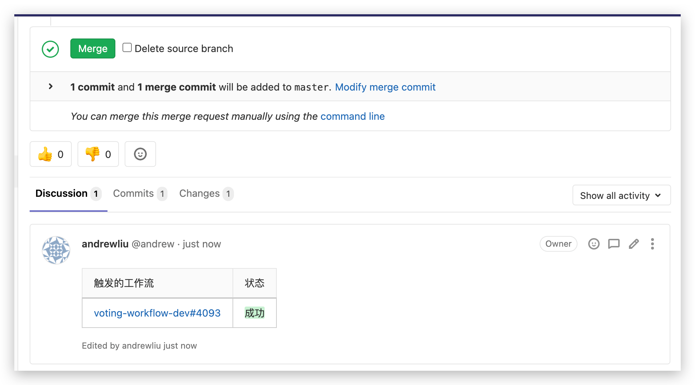

<!-- ### 进阶场景：Pull Request 独立测试环境

::: tip
1. 通过工作流触发器中配置基准环境和环境销毁策略实现 pull request 独立测试环境的持续交付过程，完成一段代码的全生命周期质量验证。
2. 支持的代码源请参考：[代码源信息](/en/Zadig%20v3.4/settings/codehost/overview/#功能兼容列表)。
:::

Pull request 级持续交付分为以下步骤：
- 提交更新的 pull request 代码
- 根据选择的基准环境生成一个相同服务版本的临时环境
- 执行工作流更新该测试环境中的服务版本，以及针对该集成环境进行相关自动化测试验证
- 根据环境销毁策略对测试环境进行回收操作

具体配置如下图所示：

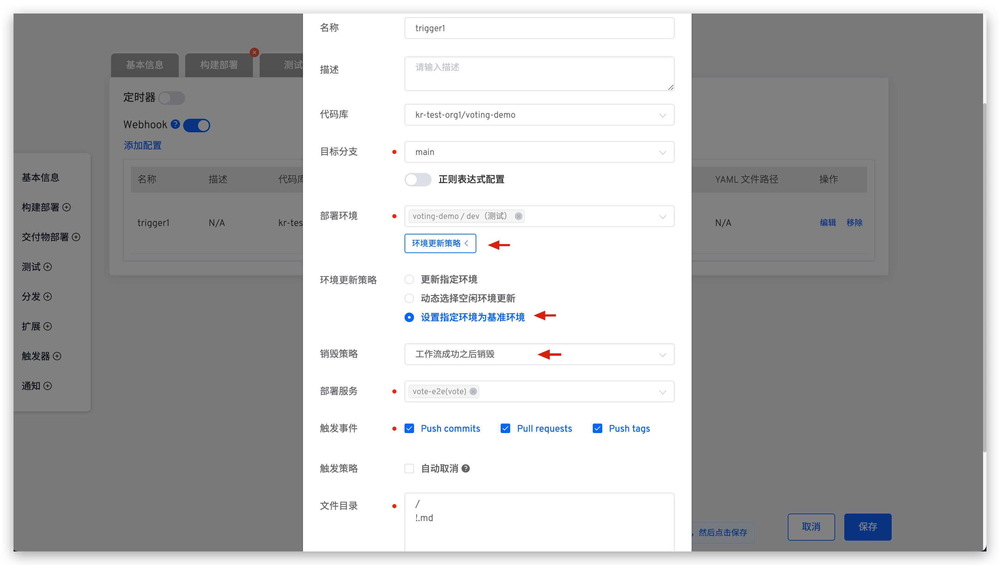

提交代码变更，在对应 pull request 下可看到关于独立环境的状态信息：

创建的独立环境效果如下：

 -->

## Timer

### How to Configure

To edit the workflow, click `Triggers` on the right -> Select `Timer`. By configuring the timer, you can achieve periodic workflow execution. It supports timed loops, periodic loops, and Cron expression-based loops.

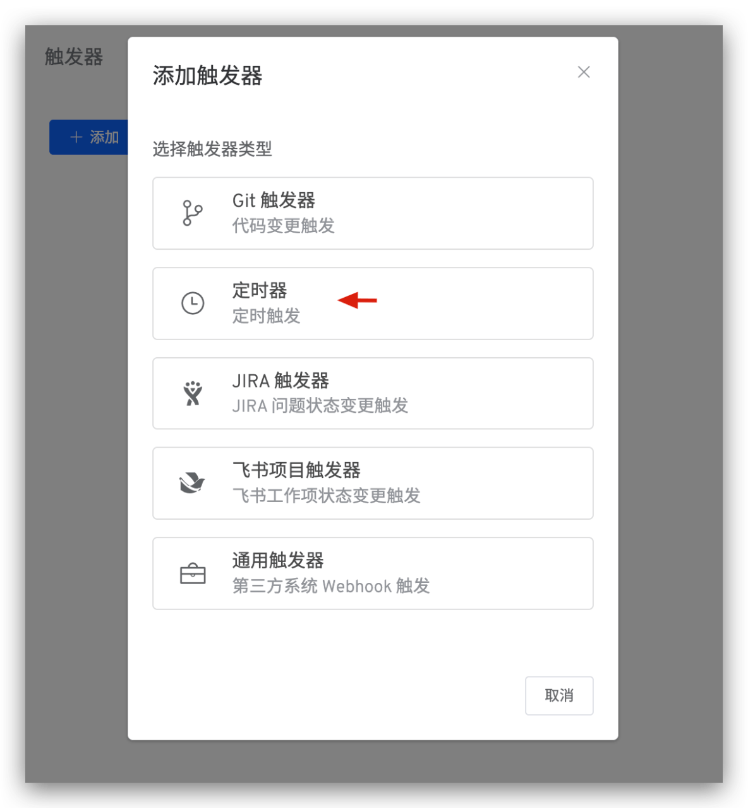

Parameter Description:

- Workflow Execution Variables: The task that will be triggered and its specific configuration
- Other parameters: Refer to [timer configuration](/en/Zadig%20v3.4/project/common-workflow/#timer)

### Use Effect

After configuration, Zadig executes the workflow based on the configured time period and workflow variables.

## JIRA Trigger

It can automatically trigger the Zadig workflow after a JIRA issue status changes.

### How to Configure

#### Step 1: Add a JIRA Trigger to the Workflow

To edit the workflow, click `Triggers` on the right -> Select `JIRA Trigger`.

Save the trigger configuration after filling in the parameters.

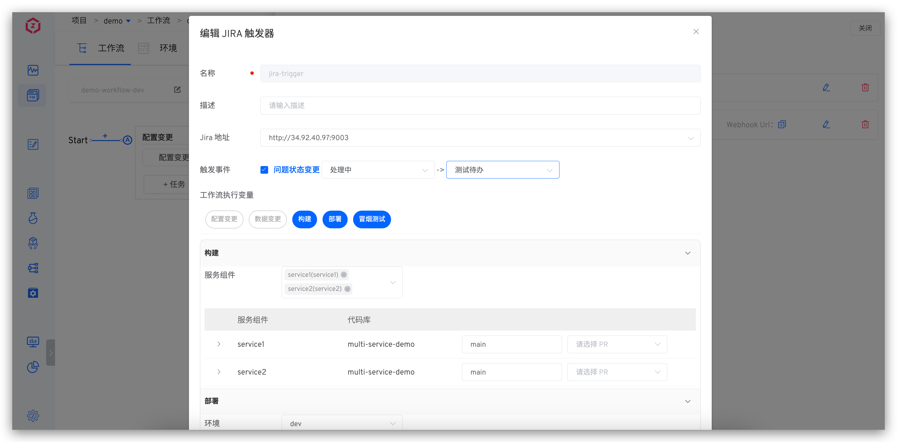

Parameter Description:
- `Trigger Event`: The workflow can only be triggered when the configured issue status change conditions are met
- `Workflow Execution Variables`: The task you want to be triggered and its specific configuration

Save the workflow after copying the Webhook URL.

#### Step 2: Complete the Webhook Configuration in JIRA

Access the JIRA System -> Click the `Settings` icon in the upper right corner -> Click `System` -> Find `Webhooks` under `ADVANCED` on the left.

Click `+ Create a Webhook` -> Fill in the URL (i.e., the Webhook URL saved in the first step) and configure the trigger events.

::: tip Tips
Currently, it supports automatic triggering of workflows based on `Issue-related events`
:::

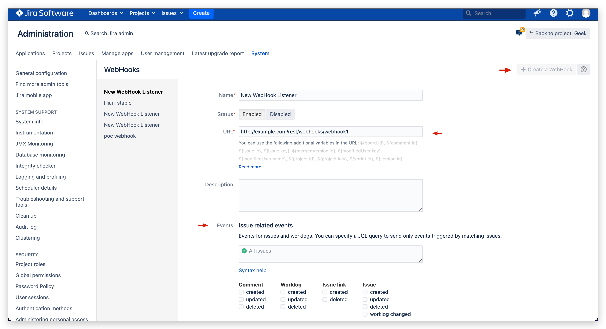

### Use Effect

When an event that meets the conditions occurs, the workflow execution will be automatically triggered. After the workflow execution is completed, a comment will be added to the corresponding issue.

## Feishu Project Trigger

It can automatically trigger the Zadig workflow after a Feishu work item status changes.

### How to Configure

#### Step 1: Add a Feishu Project Trigger to the Workflow

To edit the workflow, click `Triggers` on the right -> Select `Feishu Project Trigger`.

Save the trigger configuration after filling in the parameters.

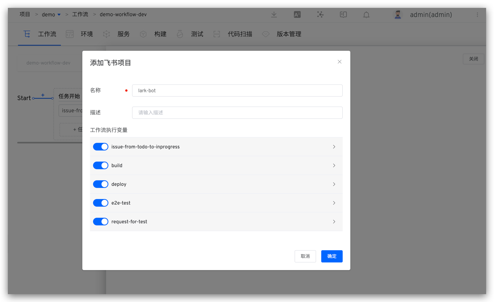

Parameter Description:
- `Workflow Execution Variables`: The task you want to be triggered and its specific configuration

Save the workflow after copying the Webhook URL.

#### Step 2: Complete the Webhook Configuration in the Feishu Project

Click `Space Configuration` -> `Automation` -> `Create Rule` to enter rule creation.

Select the rules as needed, and set `Action Type` to Webhook -> in the operation and fill in the URL (i.e., the Webhook URL saved in the first step) and save the rules.

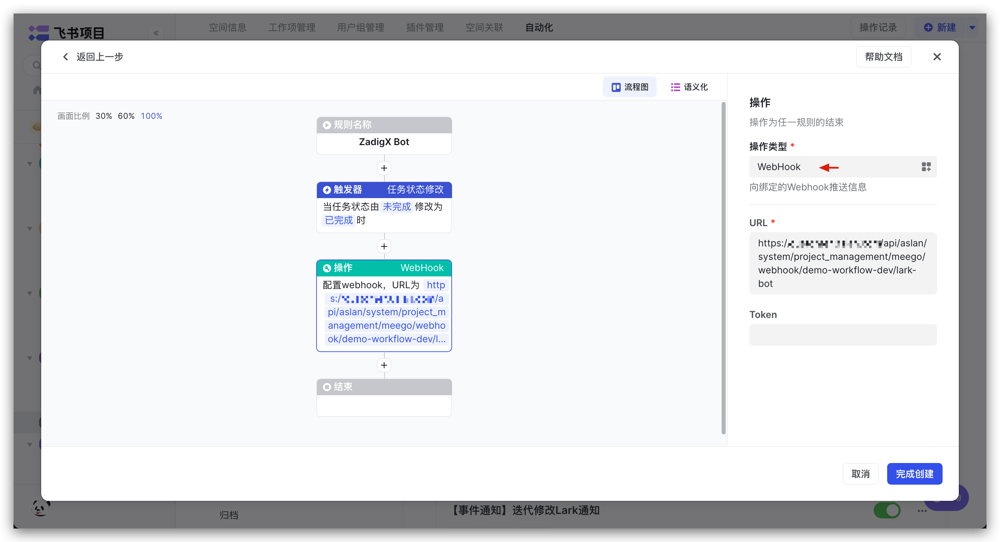

### Use Effect

When an event that meets the conditions occurs, the workflow execution will be automatically triggered. After the workflow execution is completed, a comment will be added to the corresponding issue.

## Universal Trigger

### How to Configure

Click `Triggers` on the right -> Select `Generic Trigger` to configure third-party Webhook workflow.

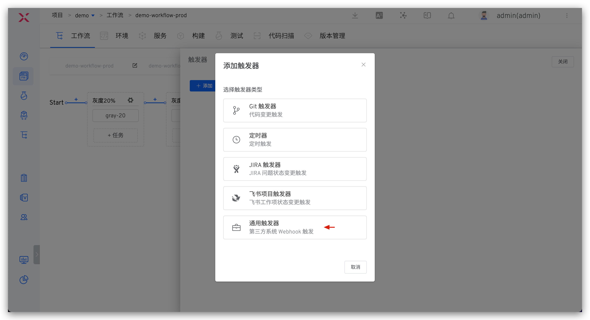

Parameter Description:
- `Workflow Execution Variables`: The task you want to be triggered and its specific configuration

Copy the Webhook URL and complete the addition in a third-party system.

## Calling the Developer OpenAPI to Trigger

Trigger workflow by calling OpenAPI see [Execution workflow](/en/Zadig%20v3.4/api/workflow/#execute-the-workflow) for details.