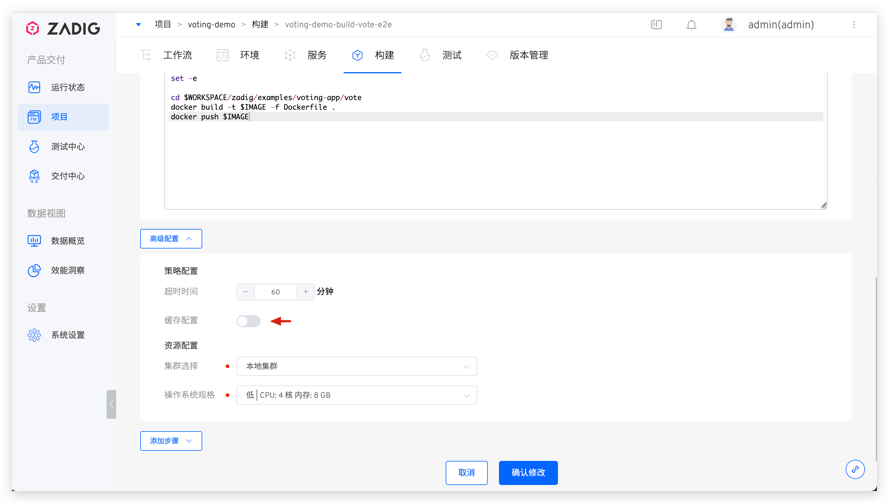
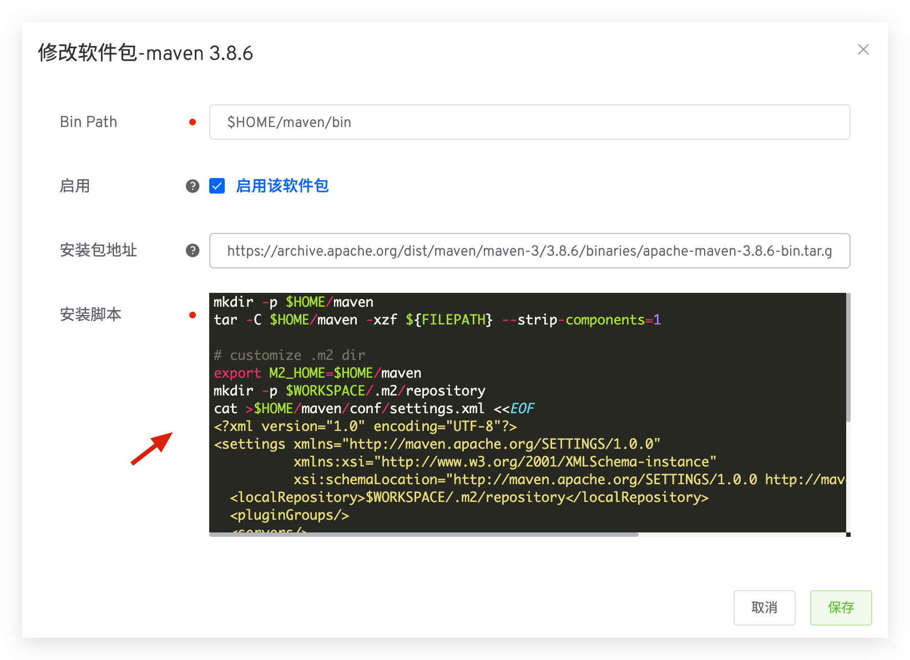

This article primarily introduces the caching mechanism for Zadig workflow construction, testing, and code scanning tasks. Using caching can enhance the efficiency of workflow construction.

Zadig workflow tasks support:
- Build dependency and intermediate product caching: Dependency packages pulled by build, test, and code scanning tasks, as well as generated products, can be cached in **object storage** or **cluster resources**.
- Package caching: Task-dependent software packages are cached in the built-in object storage.
- Image caching: Base images and build products used in image construction are cached in the dind component.

## Build Dependency and Intermediate Product Caching

### Step 1: Configure the Cache Medium

For specific configuration, refer to [cache resource configuration](/en/Zadig%20v3.4/pages/cluster_manage/#cache-resource-configuration) .

### Step 2: Configure the Cache Directory

Enable cache configuration in the advanced settings and select `Workspace $WORKSPACE` or `Custom Cache Directory`. When the workflow executes build tasks, tests, or code scanning, the dependency packages or generated products pulled by the task will be cached in the corresponding storage medium.

The workspace may contain the following:
1. Code and dependencies pulled during the build
2. Temporary files generated during the build process
3. Build products

In some business scenarios, you may not want to use caching or temporarily avoid using historical caches for building. You can adjust the cache configuration to achieve this.

* If you do not use caching for a long time during the build, you can go to `Project` -> `Build`, select the corresponding build script, and disable the `Cache Configuration` as shown in the figure below.

## Package Caching

When performing service construction and testing on the Zadig system, it is generally necessary to install the required software package environment based on actual business needs. For example, compiling backend-related code requires a Go environment, Java environment, etc., and compiling frontend code may require NodeJS. For specific configuration, refer to [Package Management](/en/Zadig%20v3.4/settings/app/). These software packages are cached in the system's built-in object storage.

## Best Practices for Different Technology Stacks

Below, we provide best practices for configuring and building cache directories for Java/Golang/NodeJS projects as a reference.

### Java
Taking the Maven build tool as an example, its default configuration file is located in `${M2_HOME}/conf/settings.xml`. You can specify `localRepository` in [Package Management](/en/Zadig%20v3.4/settings/app/) to set the cache directory and specify the cache directory in the build configuration.

**Maven Package Configuration**

Specify `localRepository` as `$WORKSPACE/.m2/repository`.

**Build Configuration**

Use the Maven package, enable cache configuration, and set custom directories.

### Golang

The Golang cache path is controlled by the `$GOCACHE` environment variable and can be explicitly modified in the build script.
In the custom directory where the application build cache configuration is applied, you can fill in the `$GOCACHE` path from the above configuration.

### NodeJS

Use `npm install <*> -g --prefix <Custom Cache Directory>` in the build script, and then cache the directory in the advanced settings.

