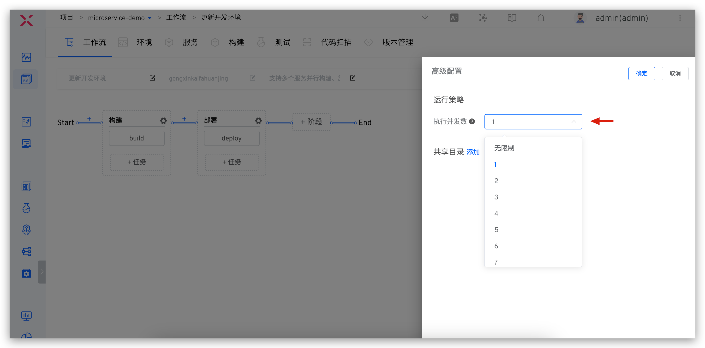
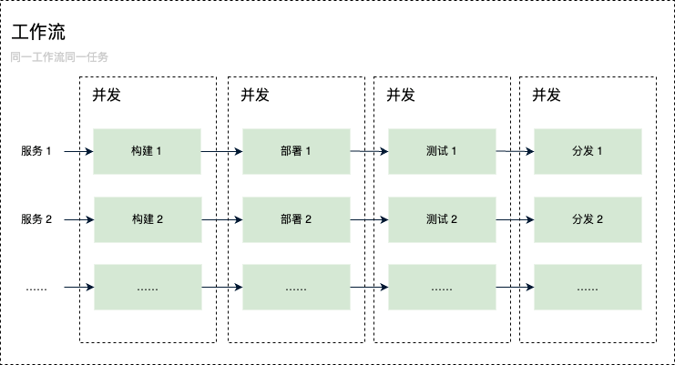
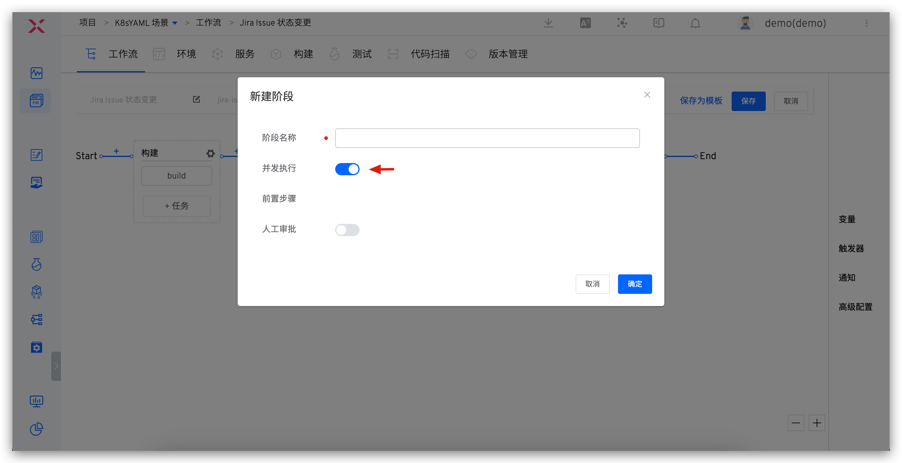
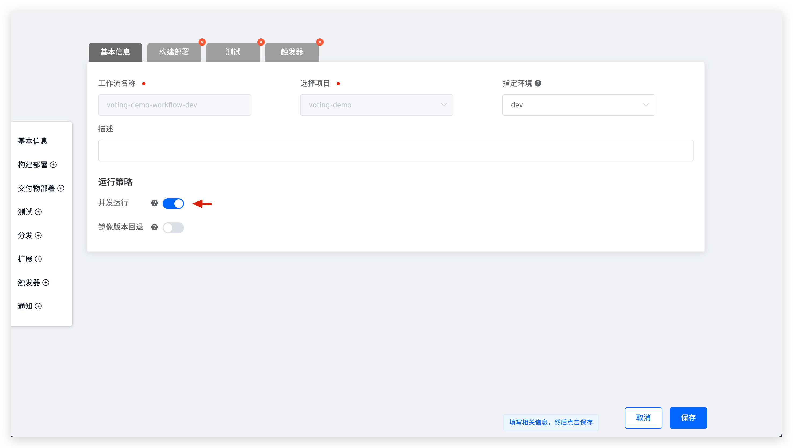

This article primarily introduces the capabilities of concurrent workflow execution.

## Concurrent Execution of the Same Workflow

::: tip
Zadig The number of concurrency execution of workflows depends on the upper limit of system resources, and the administrator needs to set a reasonable [number of concurrencies](/en/Zadig%20v3.4/settings/system-settings/#task-concurrency-settings) in the system for its own situation.
:::

The same workflow can handle multiple execution instances simultaneously. Modify the execution concurrency number in the workflow's `Advanced Configuration` to enable the workflow's concurrency capability. When multiple developers trigger the workflow to deploy and update different services, these tasks will run concurrently, eliminating the need to wait for other tasks to complete, thus maximizing collaboration efficiency.

## Concurrent Execution of Tasks in the Same Stage of the Workflow

Zadig allows tasks in the same stage of a workflow to be executed concurrently. By executing a single workflow, multiple services can be triggered to execute the `Build` -> `Deploy` -> `Test` -> `Distribute` process simultaneously. The build and release processes of different services are independent and do not interfere with each other, as shown in the figure below.

Enabling concurrent execution of workflow stages achieves the capability of concurrent task execution within the same stage, as shown in the figure below.

<!-- 当多个开发者先后触发该工作流：

- 触发的工作流任务里包括部署阶段，则更新不同的服务时，产生的多个工作流任务将会并发执行，开发者之间无需等待，最大限度地提升协作效率。
- 触发的工作流任务里不包含部署阶段，则即使使用工作流更新相同的服务，同一工作流的多个任务也可并发执行。

目前同一个工作流多个不同的任务支持的并发规则如下：
| | 手动触发 | 定时触发 | Webhook 触发 |
|---|---|---|---|
| 不同服务，同时构建             | √ | √ | x |
| 相同服务，同时构建             | √ | √ | x |
| 不同服务，构建部署到同环境      | √ | √ | √ |
| 不同服务，构建部署到不同环境    | √ | √ | √ |
| 相同服务，构建部署到不同环境    | x | x | √ |
| 相同服务，构建部署到同环境      | x | x | x | -->