Zadig workflow supports MSE grayscale release, blue-green release, canary release, batch grayscale release, Istio release and other release strategies. The following will introduce relevant concepts and specific uses.

## MSE Grayscale Release

### Concept Introduction

MSE grayscale release is a full-link grayscale capability provided by Alibaba Cloud MSE. It can achieve full-link traffic control without modifying the business code.

**advantage**

- No intrusive business code
- Simply create grayscale service resources to reduce costs

**Note**
- Only support Java applications, see [the full link grayscale component support for details](https://www.alibabacloud.com/help/zh/mse/user-guide/component-support-for-the-end-to-end-canary-release-feature?spm=a2c63.p38356.0.0.3e9e1104lmwnIx)
- Supports production environment only

### How It Works

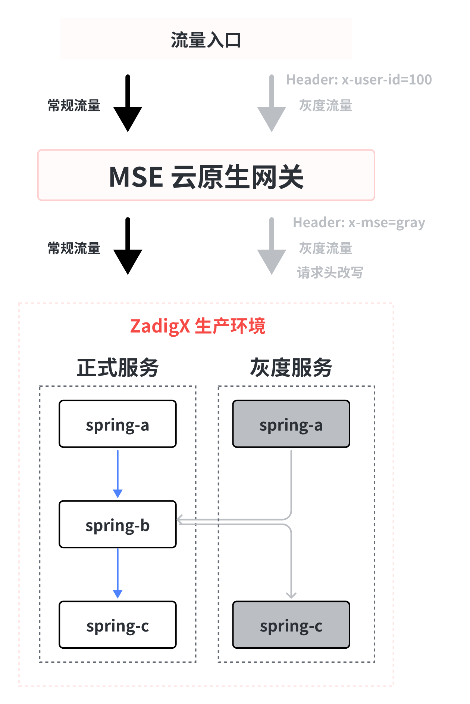

**MSE Grayscale release task**

1. Copy a copy of YAML based on services in a benchmark environment
2. Automatically add suffix `-mse-<Gray Scale Mark>` for resource name metadata.name in YAML
3. Automatically add the necessary labels for MSE full-link grayscale release to the resources in the YAML
4. Users can set the grayscale image and replica count, and can directly modify other fields in the rendered YAML (labels used during the grayscale process cannot be deleted)
5. Generate the grayscale version resources based on the final YAML

**Offline MSE Grayscale service tasks**

Find and delete related labels set by grayscale resources

### How to Use

#### Pre-Operations

MSE full-link grayscale scenarios need to be based on gateway capacity building, MSE components need to be installed in the cluster and select appropriate gateways according to their own situation. Take the cloud-native gateway that comes with MSE as an example and refer to it as follows:

- Install MSE Components, Reference Document: [Install ack-onepilot](https://help.aliyun.com/zh/mse/user-guide/enable-microservices-governance-for-microservice-applications-in-an-ack-cluster-1)
- Install MSE Ingress Cloud Native Gateway, reference document: [Create MSE Cloud Native Gateway](https://help.aliyun.com/zh/mse/getting-started/create-a-cloud-native-gateway) , [access container services through MSE Ingress](https://help.aliyun.com/zh/mse/user-guide/use-mse-ingresses-to-access-applications-in-ack-clusters#task-2229308)

#### Things to Note

1. Before executing the MSE Grayscale release task, the namespace involved in the grayscale process needs to be labeled with `mse-enable` tags, and the command is as follows: 
`kubectl label namespace <NAMESPACE> mse-enable=enabled`
2. The workload type of the grayscale service is Deployment, and the following selector and template.metadata.labels need to be added: 
`zadigx-release-version: original`

#### Configure the workflow:

Add the "MSE Grayscale Publish" task to the workflow.

Parameter Description:

- `Benchmark Environment` : Select the benchmark environment, and the grayscale publishing task will be based on the services in the benchmark environment YAML Add relevant resources required for grayscale publishing
- `Gray Scale Environment` : The environment where grayscale release will be performed
- `Image Repository` : The image registry where the grayscale mirror is located
- `Gray Scale Mark` : Set grayscale marks and follow-up offline MSE The resources with these grayscale marks will be automatically deleted during grayscale service
- `Status Detection` : If enabled, the grayscale publishing task will poll the grayscale service operation status, and the task status will be successful after the service is running normally

Add the "Offline MSE Grayscale Service" task to the workflow and configure the grayscale environment.

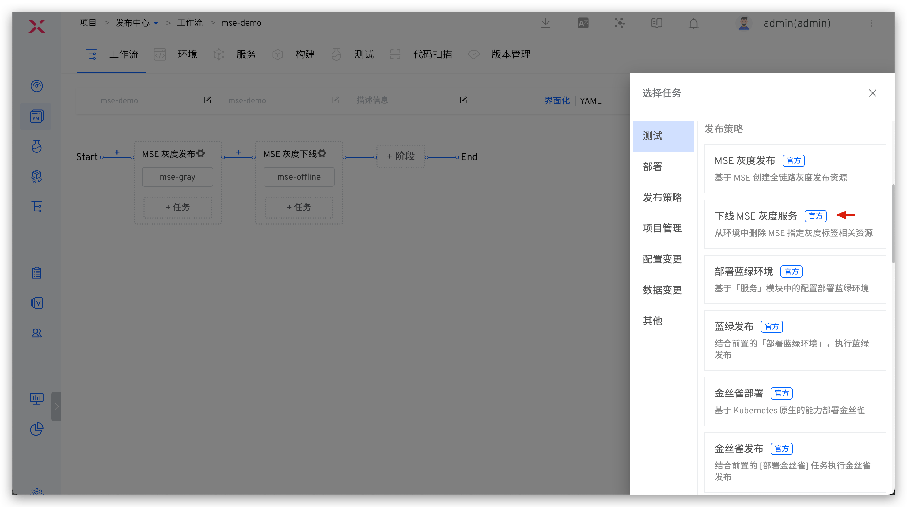

#### Perform MSE Grayscale Publishing

Start the workflow and perform MSE grayscale publishing tasks to modify grayscale scales, grayscale mirroring, number of copies, and grayscale service YAML configuration.

You can view the specific process of grayscale release. After the grayscale task is executed, you can view the status and basic information of the grayscale service in the environment.

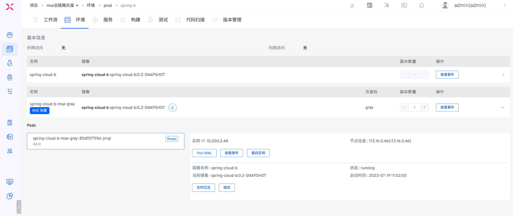

#### Offline MSE Grayscale Service

After the grayscale service is verified correctly, start the workflow and execute the offline MSE grayscale service task. Select the grayscale mark that needs to be offline to automatically remove the corresponding grayscale service.

## Blue-Green Release
### Concept Introduction
Blue and green release is a strategy to upgrade services with minimal downtime. The two versions of the environment that need to be maintained are called "Blue Environment" and "Green Environment". Generally, the current production traffic is a green environment, and a new version is deployed on a blue environment and used as a test environment in a short time.

**advantage**
- Simple, fast, easy to understand and easy to implement
- Compared with other deployment strategies, the risk is smaller.

**Note**
- Double resources may incur more costs.
- The service will be lost from one version to another.
- Database compatibility (schema changes, backward compatibility).

### How It Works
1. Deploy the blue environment by copying the current workload, setting a new image, and creating a blue service pointing to it.
2. After the blue environment is deployed, execute the user's verification tasks.
3. Start the blue-green release by setting a new image for the green workload.
4. The publishing process is completed or interrupted, delete the blue environment, delete the blue service, and blue workload.

### How to Use
#### Usage Conditions
The workload of the service to be updated must meet the following conditions:
1. The workload must have a corresponding service, and the workload's labels must include all service selector labels.
2. The type of workload is Deployment.

#### Configuring Blue-Green Release
1. Create a new workflow. Visit `Workflow` -> `New Workflow` , select the "Blue and Green Publish" workflow template to create a new workflow.

2. Configure the blue-green environment deployment task. Select the "Deploy Blue-Green Environment" task and configure it.

Parameter Description:
- `Environment` : Choose a production environment
- `K8s Service Configuration` : Add services that require blue-green deployment

Supports modifying the default configuration of K8s Service, and will take effect on the blue service when performing blue-green deployment.

3. Configure the verification task to ensure the blue environment meets the requirements for production. Select the "Check" task and configure it.

4. Configure the approval task.

5. Configure the blue-green release task. Select the "Blue-Green Release" task and configure it.

Parameter Description:
- `Select "Deploy Blue-Green Environment" Task` : Select the pre-development task of blue and green environment

6. Click the "Save" button for the workflow to complete the workflow configuration.

#### Executing Blue-Green Release
- Execute the workflow, select the service component that needs to be updated, specify the image, and modify the K8s Service configuration as needed.

- The workflow is completed and executed according to the set tasks. Click on the task to view the specific process of blue-green deployment and blue-green release.

- You can view the blue-green service details in the environment.

## Canary Release
### Concept Introduction
In the production environment, a part of the actual traffic is used to test a new version, test the performance and performance of the new version, and discover the problems of the new version in the actual environment as soon as possible while ensuring the overall stable operation of the system.

**advantage**
- The lowest risk relative to all other deployment strategies (reduce business risk).
- Production testing is performed using real users and use cases.
- Run and compare the two service versions side by side.
- It saves resources than blue and green releases, and does not require two production environments.

**Note**
- Monitoring and basic components (APM, logs, infrastructure, end users, etc.) required for production testing.
- Database compatibility (schema changes, backward compatibility).

### How It Works
1. Deploy the canary, copy the current workload, set the replica, set the new image, point to the same service.
2. Deploy the canary and perform user verification tasks.
3. Start executing canary publishing and delete the newly created workload.
4. Scroll to upgrade the current workload to the new image.
5. Canary is deleted if the release process is completed or interrupted

### How to Use
#### Usage Conditions
The workload of the service to be updated must meet the following conditions:
1. The workload needs to have a service corresponding to it, and the labels of the workload contain the selector labels of all services.
2. The workload currently only supports the deployment type.

#### Configuring Canary Release
1. Create a new workflow. Visit `Workflow` -> `New Workflow` , select the "Canary Publish" workflow template to create a new workflow.

2. Configure the canary deployment task. Select the "Canary Deployment" task and configure it.

Parameter Description:
- `Image Repository` : The warehouse stored in the instance image
- `Cluster` : Cluster information
- `Namespace` : The namespace where the instance is K8s
- `Instance List` : This task can select the updated instance list
  - `Instance Number(%)` : The number of canary replicas, such as the number of original replicas is 100 and the number of configuration instances is 10 %, then 10 canaries will be deployed online 10 % of the traffic to the canary version.

3. Configure the verification task to ensure the canary version meets the requirements for production. Select the "Check" task and configure it.

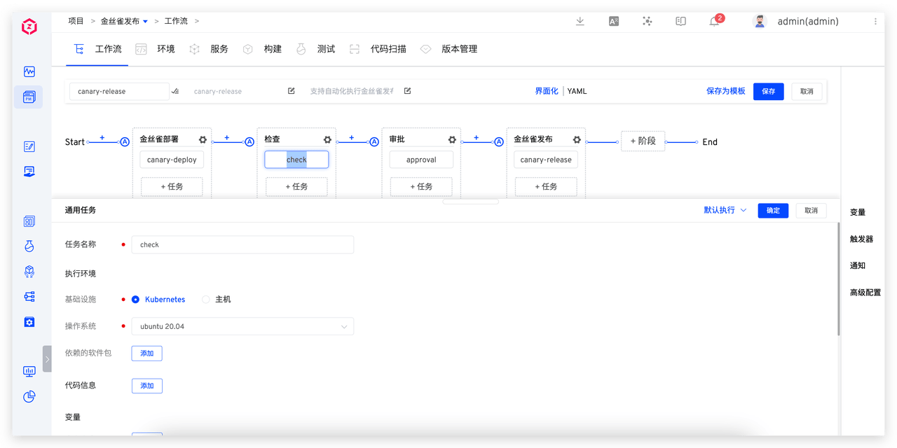

4. Configure the approval task.

5. Configure the canary release task. Select "Canary Release" and configure it.

6. Click the "Save" button for the workflow to complete the workflow configuration.

#### Executing Canary Release
- Click the "Execute" button to select the instance and image to be updated.

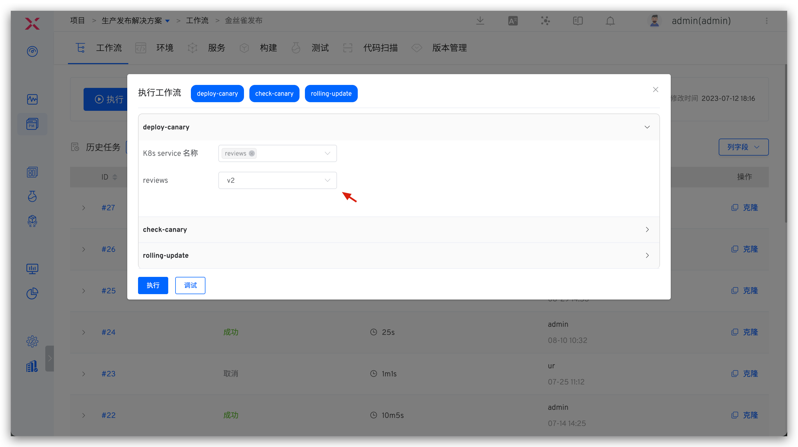

- The workflow completes the deployment of canary and verification tasks, waiting for manual approval. At this time, 1 canary instance has been deployed in the environment, as shown in the figure below.

- Manual approval and completion of canary release. At this time the environment has been updated to the canary version, as shown in the figure below.

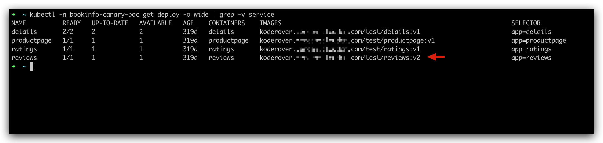

## Batch Gray-scale Release
There are many ways to implement gray-scale releases. In addition to canary releases, Zadig also supports batch gray-scale releases. Based on actual conditions, online services are upgraded in multiple stages. For example, the first gray-scale release might be 20%, with 20% of production traffic directed to the new version. By monitoring online traffic, a second gray-scale release of 40% can be performed, and after no issues are detected, a full rollout is made.

### How It Works
**The first grayscale task**
1. Initialize the original deployment, and the system automatically adds the annotation required by the grayscale process.
    - `<origin-deployment-name>`-gray-release-image : Record the image name before release
    - `<origin-deployment-name>`-gray-release-container : Record the container name before release
    - `<origin-deployment-name>`-gray-release-replica : Record the number of copies before release
2. Create grayscale deployment `<origin-deployment-name>`-zadig-gray , set the number of replicas to round up (original number of replicas * percentage), set the mirror to a new image, wait for deployment ready .
3. Adjust the number of original deployment replicas: original copy number - the number of new deployment replicas, waiting for deployment ready.

**Intermediate state grayscale task**
1. Set the new version deployment Number of replicas is rounded up (original number of replicas * percentage), wait for deployment ready .
2. Set the number of grayscale deployment replicas to the original replicas - the number of new deployment replicas, waiting for deployment ready.

**100 % Grayscale task**
1. Set the original deployment: The mirror is set to the new version, the number of replicas is the original number of replicas, waiting for deployment ready.
2. Delete grayscale deployment

### How to Use
#### Configuring Gray-scale Release
1. Edit the workflow and add the "Grayscale Publish" task: Click " + Task", select the "Grayscale Publish" task and configure `First Gray Scale Task` .

Parameter Description:
- `Gray Scale Task Type` : Select `First Gray Scale Task` .
- `Container Name` : A container that can be grayscale. When executing a workflow, several of the containers can be selected from the configured range for grayscale.
- `Gray Scale Percentage` : Control the actual number of grayscale copies, the number of original copies * The value of grayscale percentage is rounded upward.

2. Add more grayscale phases and configure `Non-First Gray Scale Task` tasks.

Parameter Description:
- `Gray Scale Task Type` : Select `Non-First Gray Scale Task` .
- `Select First Gray Scale Task` : Continue to perform grayscale on the basis of the first grayscale task.
- `Gray Scale Percentage` : Control the actual number of grayscale copies, the number of original copies * The value of grayscale percentage is rounded upward. In the last grayscale phase, the percentage of grayscale must be 100 %.

#### Executing Gray-scale Release
- Click the "Execute" button to select the container and its image that need to be gray-scaled.

- The workflow executes according to the set tasks, and the execution status is shown in the figure below.

## Grayscale Rollback
If an unexpected interrupt occurs during the grayscale process or needs to roll back to the state before grayscale, you can use the "Grayscale Rollback" task.

### How It Works
1. Adjust deployment, the image corresponding to the container is the image before grayscale, the number of copies is adjusted to the number of copies of the previous version, and wait for deployment ready.
2. Clean up grayscale deployment.

### How to Use
#### Configure Grayscale Rollback
1. Edit the workflow and add the "Grayscale Rollback" task: Click "+ Task", select the "Grayscale Rollback" task and configure it.

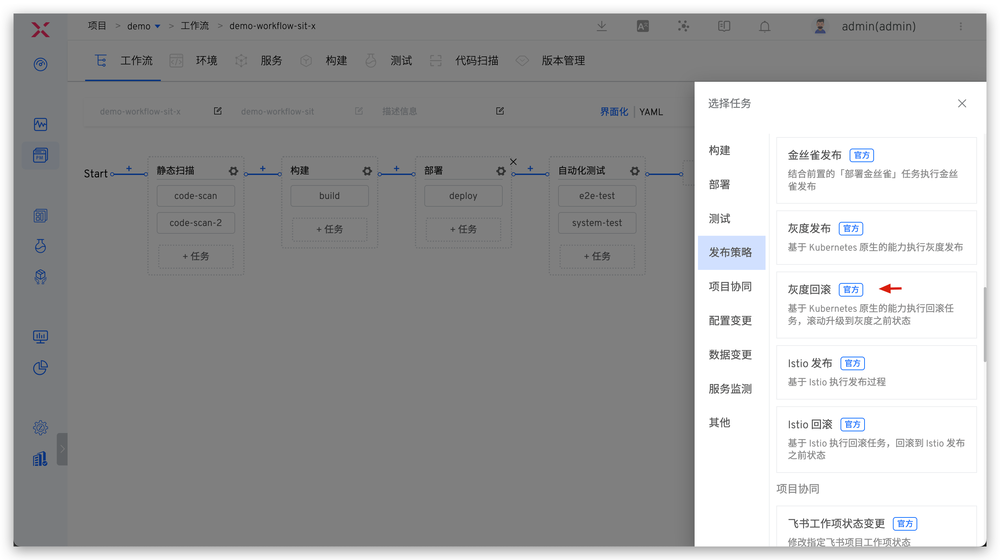

Parameter Description:
- `Deployment Name` : Only those published by Grayscale can be selected deployment
- `Timeout (minutes)`: The timeout duration for the rollback task

#### Perform Grayscale Rollback
- Click the "Execute" button to select the Deployment that needs to be rolled back.

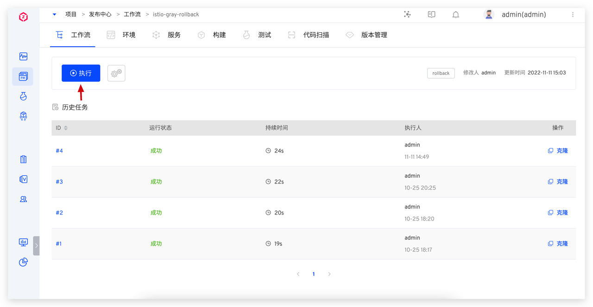

- The workflow executes according to the set tasks, and the execution status is shown in the figure below.

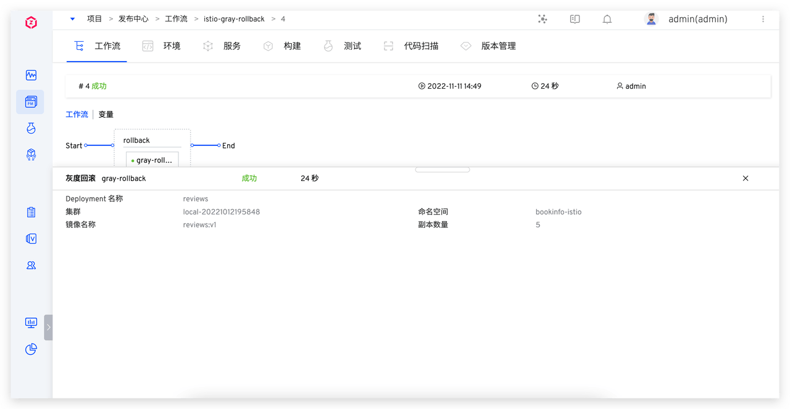

## Istio Release
Istio release is a type of grayscale release that uses Istio flow control capabilities to complete the grayscale process.

### How It Works

**First istio Post a mission**
- Create a deployment named `<workload_name>`-zadig-copy
- Create a destination rule named `<workload_name>`-zadig
- If virtual service is provided, modify the routing rules in the provided virtual service and set the subset weight according to the user-provided proportional weight
- If not provided virtual service create virtual service named `<workload_name>`-vs-zadig

**Intermediate status istio Post a task**
- Modify the virtual service in the above rules and configure subset weights according to the new traffic ratio

**New version traffic 100 % istio task**
- Modify the image name and number of replicas of the target deployment, set the value to the ratio of new image and published replicas, and type the corresponding image name and number of replicas on the deployment
- Depending on whether vs is provided, fallback virtual service becomes a temporary virtual service created by the original version/delete zadig
- Delete temporary destination rule created by zadig
- Delete temporary deployment created by zadig

### How to Use
#### Usage Conditions
The following conditions are required:
1. Istio needs to be installed by yourself in the cluster
2. The updated workload needs to be marked with the pod label of zadig-istio-release-version: original
3. The workload currently only supports the Deployment type

#### Configure Istio Release
1. Edit the workflow and add the " Istio Publish" task: Click " + ", select the " Istio Publish" task and configure `First Istio Publish Task` .

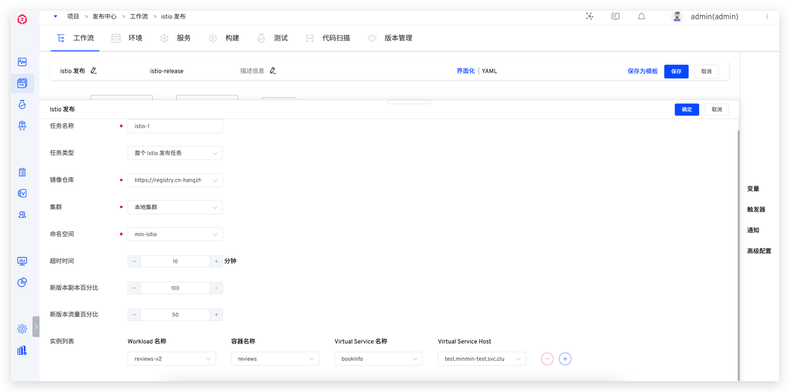

Parameter Description:
- `Task Type` : Select the first one Istio Publish the task
- `New Version Replica Percentage` : Control the number of new version copies, the number of new version copies is the number of original copies * The value of the percentage of new version copies is rounded upwards
- `New Version Traffic Percentage` : Control the percentage of actual traffic of the new version
- `Instance List`
  - `Workload Name` : Need to be updated workload
  - `Container Name` : The name of the container that needs to be updated
  - `Virtural Service Name` : Optional, use the name Istio Virtual Service if there is no selection, Zadig will be created by itself
  - `Virtual Service Host` : The name used for accessing Host

2. Add more istio Release phase, configure `Non-First Istio Publish Task` .

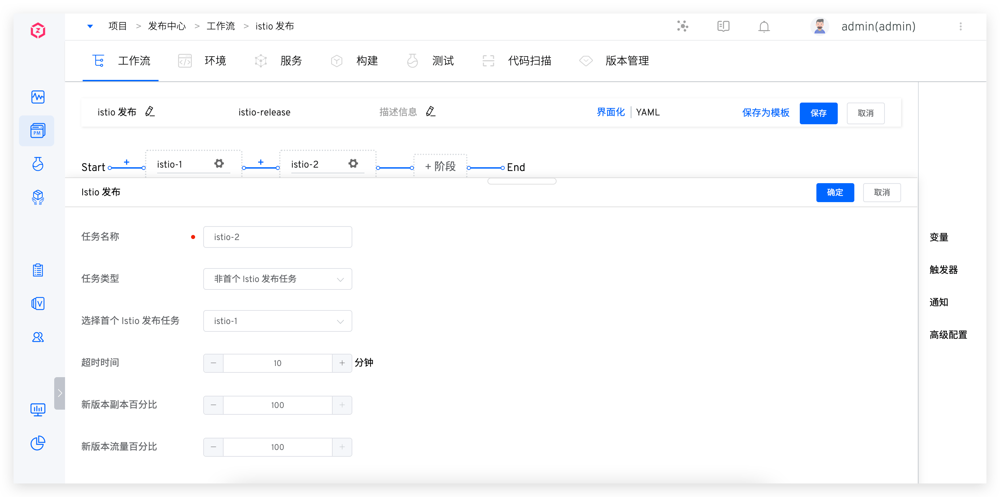

Parameter Description:
- `Task Type` : Select `Non-First Istio Publish Task`
- `Select First Istio Publish Task` : Continue to perform grayscale on the basis of the first Istio release task
- `New Version Replica Percentage` : Control the number of new version copies, the number of new version copies is the number of original copies * The value of the percentage of new version copies is rounded upwards
- `New Version Traffic Percentage` : Control the percentage of actual traffic in the new version, the last Istio Release

#### Perform Istio Publishing

- Click the "Execute" button to select the container and its image that need to be gray-scaled.

- The workflow executes according to the set tasks, and the execution status is shown in the figure below.

## Istio Release Rollback

If an unexpected interrupt occurs during the Istio release process or needs to roll back to the state before release, you can use the "Istio release rollback" task.

### How It Works

- Clean up the name ``<workload_name>`-zadig` destination rule
- If the specified workload contains the image name and number of replicas from the last application, the image name and number of replicas of the target workload will be rolled back to the version recorded in the annotation.
- In any case, attempt to delete the deployment named ``<workload_name>`-zadig-copy`
### How to Use
#### Configure Grayscale Rollback
1. Edit the workflow and add the "Istio Publish Rollback" task: Click "+ Task", select the "Istio Publish Rollback" task, and configure it.

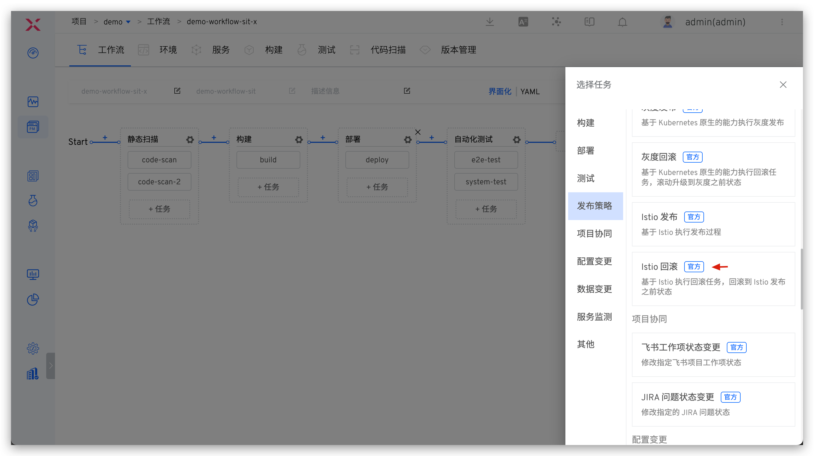
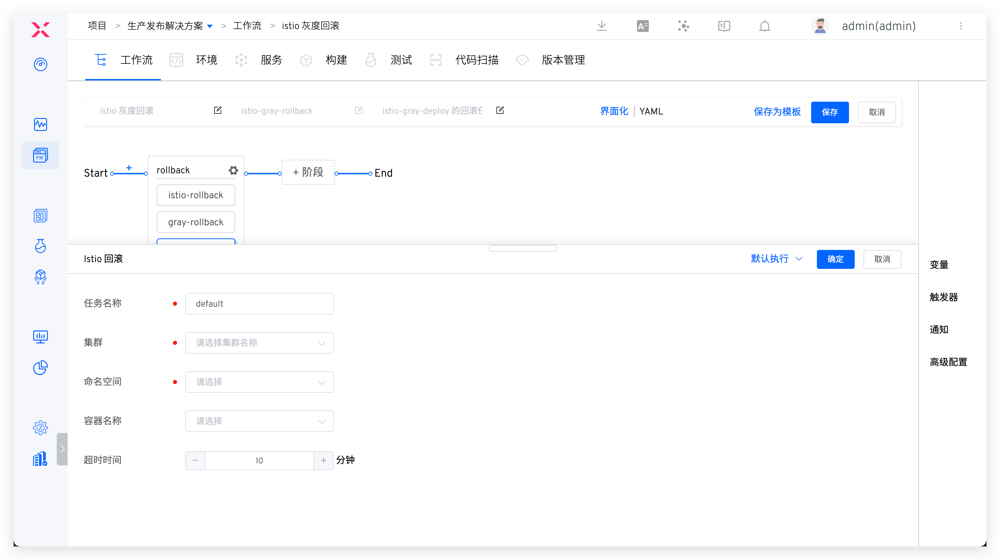

Parameter Description:
- `Cluster`: The cluster where the service to be rolled back is located
- `Namespace`: The namespace where the service to be rolled back is located
- `Container Name`: Only select containers that have been published by Istio
- `Timeout (minutes)`: The timeout duration for the rollback task

#### Perform Grayscale Rollback

- Click the "Execute" button and select the container that needs to be rolled back.

- The workflow executes according to the set tasks, and the execution status is shown in the figure below.

