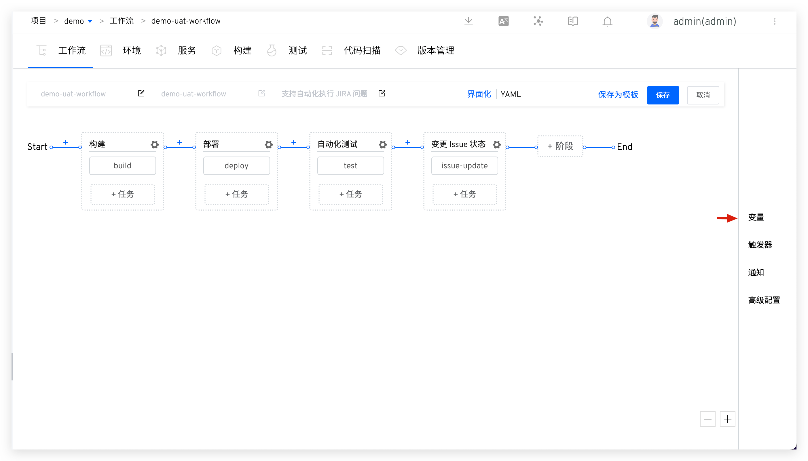

Workflows support a variety of variables (project dimension, workflow dimension, task dimension) and can be freely passed between multiple tasks, workflows, and projects. This article will use a specific scenario to illustrate how to use them.

## Background

Use workflows to construct deployment services, aiming to reflect more information in the built images, such as the version number the team is currently sprinting on.

## How to Use

1. Edit the workflow, increase the variable `VERSION_INFO` , set the value to `Runtime` , refer to the document: [Workflow variable](/en/Zadig%20v3.4/project/common-workflow/#workflow-variable) .

2. Add custom variable `VERSION_INFO` to the build configuration and modify the build script. Before building the image, modify the value of variable `IMAGE` to connect it with `VERSION_INFO` , for example: `export IMAGE=$IMAGE-$VERSION_INFO` , refer to the document: [Custom variables](/en/Zadig%20v3.4/project/build/#%E6%9E%84%E5%BB%BA%E5%8F%98%E9%87%8F) .

3. Modify the variable configuration of the build task in the workflow, and use the workflow global variable `{{.workflow.params.VERSION_INFO}}` in the first step to assign it a value. Refer to the document: [Build task variables](/en/Zadig%20v3.4/project/common-workflow/#%E6%9E%84%E5%BB%BA%E4%BB%BB%E5%8A%A1) .

## Usage Effect

When executing the workflow, specify the value of `VERSION_INFO`.

For more usage postures for variable transfer, you can refer to [Variable transfer](/en/Zadig%20v3.4/project/common-workflow/#variable-passing) and [Trigger Zadig workflow](/en/Zadig%20v3.4/project/workflow-jobs/#trigger-zadig-workflow) .