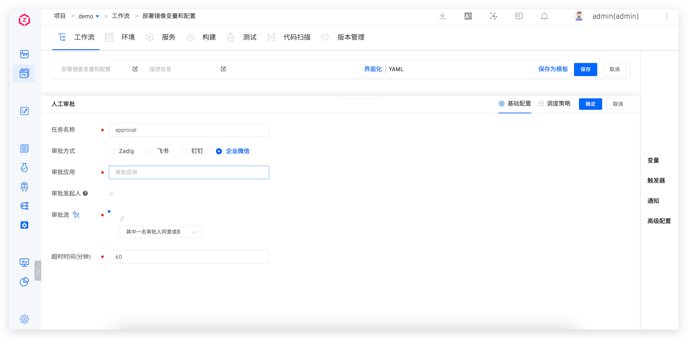

This article mainly introduces how to configure and use the approval feature of Zadig workflows.
- The workflow supports manual approval tasks. After the approval is granted, the workflow will continue to run
- It supports multiple approvals, setting an approval timeout, and configuring multiple approvals within a single workflow

Currently, the following four approval methods are supported:
- Zadig Approval: Approval operation in the Zadig system
- Feishu Approval: Approval operation in the Feishu application
- DingTalk Approval: Approval operation in the DingTalk application
- Enterprise WeChat Approval: Approval operation in the Enterprise WeChat application

## Zadig Approval

### How to Configure

To add a "Manual Approval" task to the workflow, select `Zadig` as the approval method.

Parameter Description:
- `Timeout` : Starting from the time the approval is triggered, if the timeout is exceeded, it is considered that the approval has failed due to timeout, and subsequent tasks will not be executed
- `Approver` : Select the Zadig user or user group to participate in the approval
- `Approval Required` : When the number of participants meets the value specified here, the entire approval process is considered complete

### Use Effect

## Feishu Approval

::: tip
Before starting Feishu approval, you need to integrate Feishu approval application in the system. For details, please refer to the document: [Integrated Feishu approval](/en/Zadig%20v3.4/settings/approval/#feishu) .
:::

### How to Configure

To add a "Manual Approval" task to the workflow, select `Feishu` as the approval method.

Parameter Description:
- `Timeout` : Starting from the time the approval is triggered, if the timeout is exceeded, it is considered that the approval has failed due to timeout, and subsequent tasks will not be executed
- `Approval Application` : The Feishu approval application integrated into the system
- `Approval Initiator` : If the approval initiator is not configured, it defaults to the workflow executor. Ensure that the mobile phone number is configured in Zadig (consistent with the mobile phone number in the Feishu account)
- `Approval Flow` : Configure the Feishu approval flow, supporting multi-stage approval

::: tip More Info

1. To configure a mobile phone number, you can refer to the document: [account information](/en/Zadig%20v3.4/preferences/#account-settings) .
2. When a Feishu user is involved in multiple approval flows, once one of the approval flows is approved, the subsequent flows are also considered approved.
3. If the workflow has a trigger but the approval initiator is not configured, the approval function will not execute correctly.
:::

### Use Effect

The approver provides the approval opinion in Feishu:

The approval information will be synchronized to the workflow:

## DingTalk Approval

::: tip
Before turning on DingTalk approval, you need to integrate DingTalk approval application in the system. For details, please refer to the document: [Integrated DingTalk approval](/en/Zadig%20v3.4/settings/approval/#dingtalk) .
:::

### How to Configure

To add a "Manual Approval" task to the workflow, select `DingTalk` as the approval method.

Parameter Description:
- `Timeout` : Starting from the time the approval is triggered, if the timeout is exceeded, it is considered that the approval has failed due to timeout, and subsequent tasks will not be executed
- `Approval Application` : The DingTalk approval application integrated into the system
- `Approval Initiator` : If the approval initiator is not configured, it defaults to the workflow executor. Ensure that the mobile phone number is configured in Zadig (consistent with the mobile phone number in the DingTalk account)
- `Approval Flow` : Configure the DingTalk approval flow, supporting multi-stage approval

::: tip More Info

1. To configure a mobile phone number, you can refer to the document: [account information](/en/Zadig%20v3.4/preferences/#account-settings) .
2. Multiple approval flows cannot include the same DingTalk user.
3. If the workflow has a trigger but the approval initiator is not configured, the approval function will not execute correctly.
:::

### Use Effect

The approver provides the approval opinion in DingTalk:

The approval information will be synchronized to the workflow:

## Enterprise WeChat Approval

::: tip
Before starting enterprise WeChat approval, you need to integrate enterprise WeChat approval applications in the system. For details, please refer to the document: [Integrated enterprise WeChat approval](/en/Zadig%20v3.4/settings/approval/#enterprise-wechat) .
:::

### How to Configure

To add a "Manual Approval" task to the workflow, select `Enterprise WeChat` as the approval method.

Parameter Description:
- `Timeout` : Starting from the time the approval is triggered, if the timeout is exceeded, it is considered that the approval has failed due to timeout, and subsequent tasks will not be executed
- `Approval Application` : The Enterprise WeChat approval application integrated into the system
- `Approval Initiator` : If the approval initiator is not configured, it defaults to the workflow executor. Ensure that the mobile phone number is configured in Zadig (consistent with the mobile phone number in the DingTalk account)
- `Approval Flow` : Configure the Enterprise WeChat approval flow, supporting multi-stage approval

::: tip More Info

1. To configure a mobile phone number, you can refer to the document: [account information](/en/Zadig%20v3.4/preferences/#account-settings) .
2. Multiple approval flows cannot include the same Enterprise WeChat user.
3. If the workflow has a trigger but the approval initiator is not configured, the approval function will not execute correctly.
:::

### Use Effect

The approver provides the approval opinion in Enterprise WeChat:

The approval information will be synchronized to the workflow:
