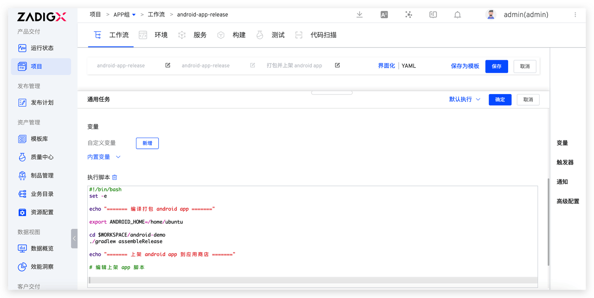

This article primarily focuses on how to flexibly utilize host resources on Zadig for compiling and publishing Android and iOS apps.

## Pre-Operation: Integrate Host as Build Node

First, you need to integrate host resources on Zadig so that Zadig workflow tasks can use the host as a build node. The specific integration process is as follows:

**Step 1**: On Zadig, go to "Resource Configuration" > "Host Management" > Add Host, and fill in the necessary information below.
- Host Name: The name used to identify the host
- Tags: Workflows can use tags to restrict task execution to specific hosts
- Schedule Workflow Tasks: Select `Yes` to allow workflow tasks to be scheduled to this host
- Task Root Directory: The working directory for workflow tasks

**Step 2**: Install the Zadig Agent on the host. Choose the appropriate command to execute on the host based on its actual system and architecture. Here, we integrate two hosts (tags `linux` and `mac`) for the subsequent build and release of Android and iOS apps, respectively.

## Android App Automated Release

### Configure the workflow:

**Step 1**: Create a new workflow > Add "Stage" > Add "Task", select "General Task"

**Step 2**: Configure the "General Task"

- Infrastructure: Select `Host`
- Execution Host: Select the pre-configured `linux` host tag
- Code Information: Select the code repository where the Android App is located
- Execution Scripts: Write different scripts for the testing and release stages to automate the delivery process
  - Testing Phase: Includes steps to compile and package the Android App and push it to the application distribution platform
  - Release Phase: Includes steps to compile and package the Android App and list it in the app store

### Execute the Workflow

Execute the workflow and select the code information to complete the automated release process for the Android App.

## iOS App Automated Release

### Configure the workflow:

**Step 1**: Create a new workflow > Add "Stage" > Add "Task", select "General Task"

**Step 2**: Configure the "General Task"

- Infrastructure: Select `Host`
- Execution host: Select the pre-configured `mac` host tag
- Code Information: Select the code repository where the iOS App is located
- Execution Scripts: Write different scripts for the testing and release stages to automate the delivery process
  - Testing Phase: Includes steps to compile and package the iOS App and push it to the application distribution platform
  - Release Phase: Includes steps to compile and package the iOS App and list it in the app store

### Execute the Workflow

Execute the workflow and select the code information to complete the automated release process for the iOS App.

> The upcoming version of Zadig will support Windows hosts as build nodes to meet the needs of building and releasing Windows applications. Stay tuned..