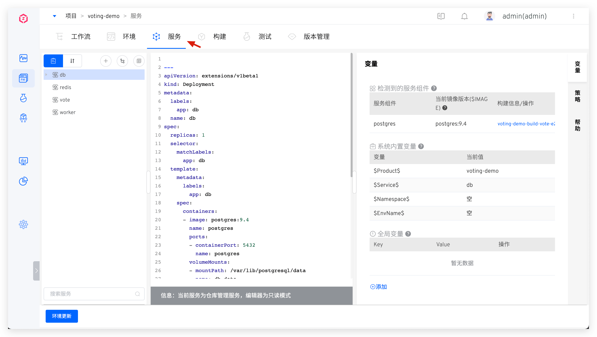
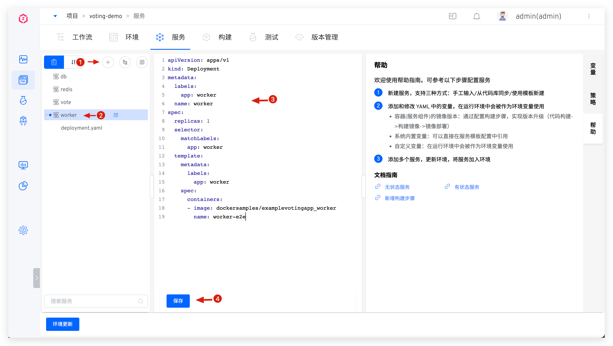
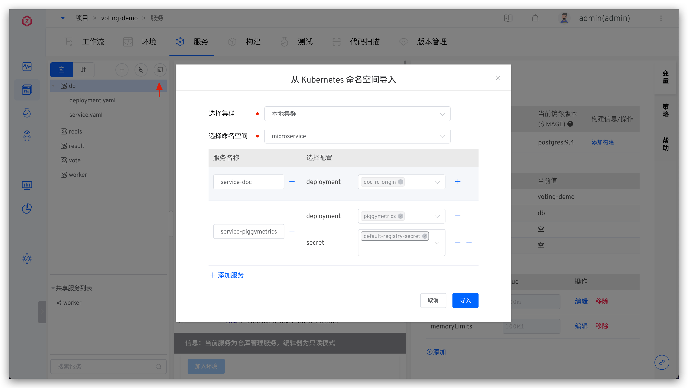
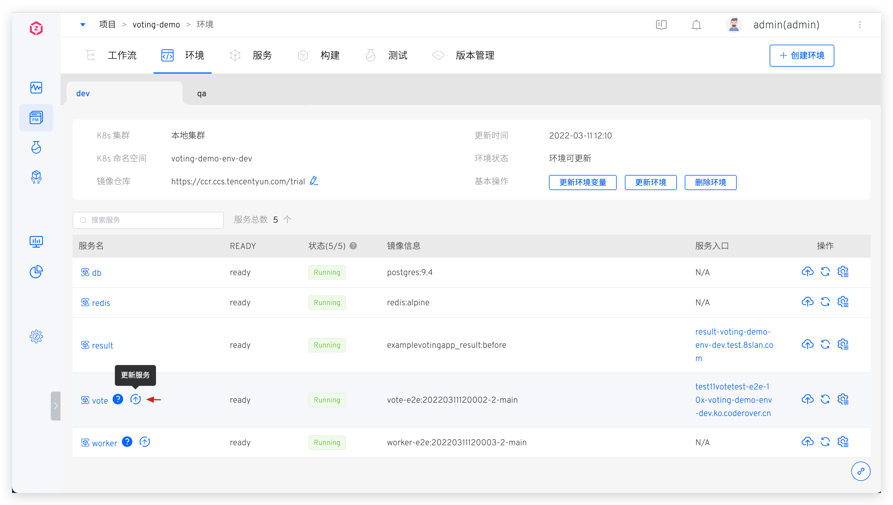
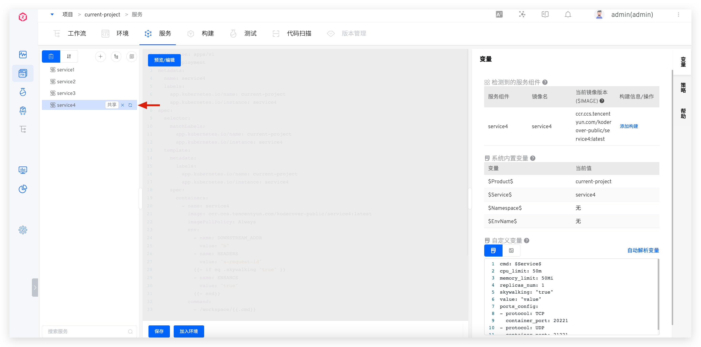
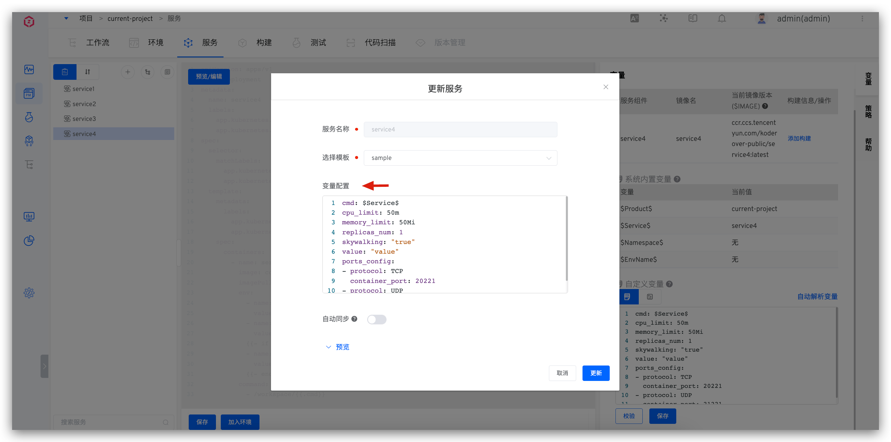
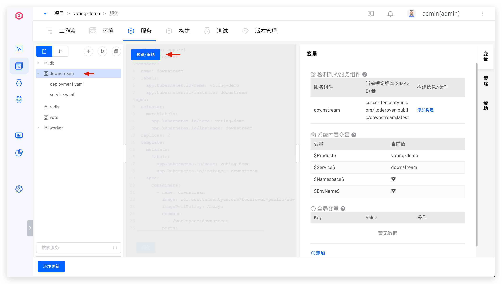
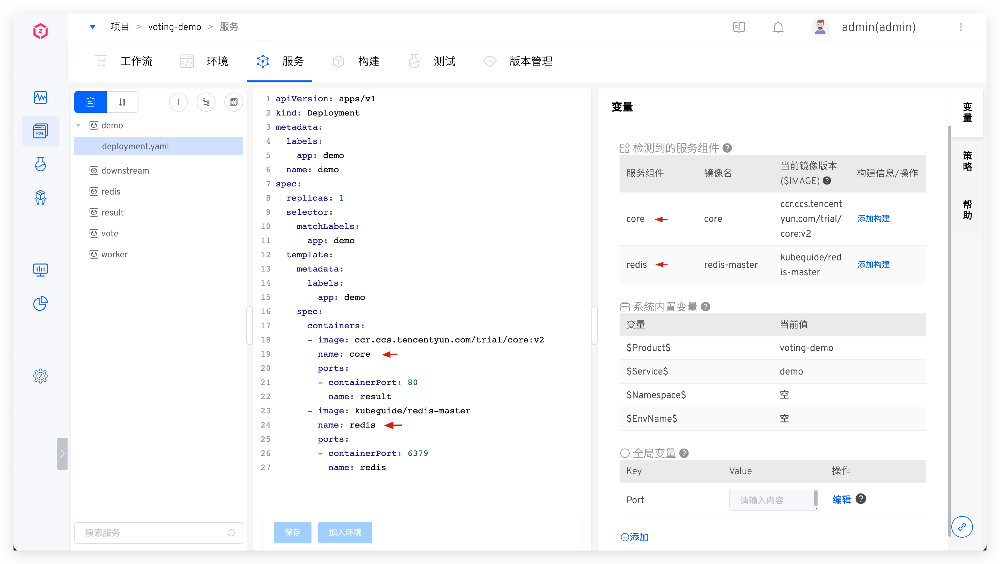
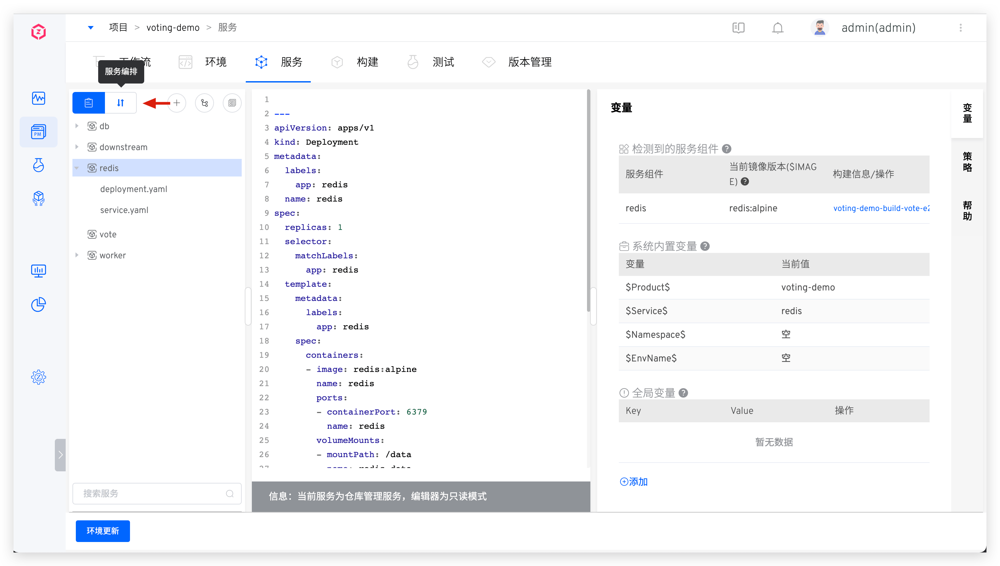

This article introduces the configurations related to test services and production services in the K8s YAML project.

## Create a New Service

Enter the K8s YAML project, click `Service` - `Test Service` or `Production Service` to enter the service management page.



The system supports the following four ways to create K8s YAML services:
- `Manual Input`: Manually enter the K8s YAML configuration file when creating a new service.
- `Synchronize from Code Repository`: Synchronize the K8s YAML configuration of the service from the code repository. A single synchronization can create one or multiple services. When the service configuration in the code repository changes, the service configuration in the Zadig platform will be automatically updated via Webhook.
- `Create New Service Using Template`: Use K8s YAML templates from the template library to create a new service.
- `Import from Kubernetes`: Import service configuration from an existing Kubernetes namespace.

### Manual Input Service

Click the manual input button -> Enter the service name -> Enter the K8s YAML configuration in the editor -> Click the save button to create a new service.



After successfully adding the service, you can update the environment: Click `Update Environment`, select the environment to be updated, and add the service to the environment.


### Synchronize a Single Service from the Code Repository

::: tip
1. You need to integrate the code source in the system, see [Code Source Integration](/en/Zadig%20v3.4/settings/codehost/overview/)
2. See [Code Source Information](/en/Zadig%20v3.4/settings/codehost/overview/#function-compatibility-list) for supported code sources
:::

The service's YAML configuration is organized in a separate folder. Click the "Sync from Code Repository" button -> select the specific code repository and the directory containing the service configuration file -> click "Sync" to create a new service from the code repository.

Taking the [result](https://github.com/koderover/zadig/tree/main/examples/voting-app/freestyle-k8s-specifications/result) service as an example:


After synchronization, the effect is as follows:


### Synchronize Multiple Services from the Code Repository

::: tip
1. You need to integrate the code source in the system, see [Code Source Integration](/en/Zadig%20v3.4/settings/codehost/overview/)
2. See [Code Source Information](/en/Zadig%20v3.4/settings/codehost/overview/#function-compatibility-list) for supported code sources
:::

The YAML configurations for multiple services are organized in separate folders at the same level. Click the "Sync from Code Repository" button -> select the specific code repository and the directory containing the multiple service configuration files -> click "Sync" to create multiple services from the code repository.

Taking the 5 services in the [voting](https://github.com/koderover/zadig/tree/main/examples/voting-app/freestyle-k8s-specifications/result) project as an example, the configuration files of multiple services are organized as follows:

```shell
├── Root Directory (zadig/examples/voting-app/freestyle-k8s-specifications)
│   ├── db
│   │   ├── db-deployment.yaml
│   │   └── db-service.yaml
│   ├── redis
│   │   ├── redis-deployment.yaml
│   │   └── redis-service.yaml
│   ├── result
│   │   ├── result-deployment.yaml
│   │   └── result-service.yaml
│   ├── vote
│   │   ├── vote-deployment.yaml
│   │   └── vote-service.yaml
│   └── worker
│       └── worker-deployment.yaml
```

Synchronize multiple services from the code repository:


After synchronization, the effect is as follows:


### Create a New Service Using the Template

::: tip
You need to create K8s YAML templates in the system template library first, see [K8s YAML Template Management](/en/Zadig%20v3.4/template/k8s_yaml/).
:::

Click the New button -> Select `Create New Service Using Template` -> in the service name, select the template and fill in the relevant configuration -> Click New to create a new service using this template and the assigned variables.

- The variable configuration can use the default values in the template or be reassigned when creating
- After `Automatic Synchronization` is enabled, when the `Apply to Service` operation is performed on the used template in the template library, the service configuration will be automatically synchronized based on the template content


### Import from Kubernetes

Click the New button -> Select `Import from Kubernetes` -> in the following information and import it.

- `Select Cluster`: The K8s cluster where the service to be imported is located. `Local Cluster` refers to the cluster where Zadig is located
- `Select Namespace`: The K8s namespace where the service to be imported is located
- Click `Add Service` and fill in the service name, select the resource type and corresponding configuration. Currently, deployment/statefulset/cronjob/service/ingress/secret/configmap/pvc resources can be selected for import



After successfully creating a new service, you can click to view the specific content of the service configuration and modify and save it as needed. Click `Add to Environment` to add the service to the environment.

::: tip
The `Add to Environment` operation will deploy the service in the corresponding namespace of the environment. If the namespace of the environment is the same as the namespace of the imported service, the original service will be restarted or updated.
:::


## Update Service
The following sections describe how to update services created using different methods.

### Update Manually Inputted Service

Modify the K8s YAML content of the service and save it.


After successfully modifying the service, you can update the environment: click "Update Environment" and select the environment to be updated to update the services in the environment.


### Update Service Synchronized from the Code Repository

* Commit the service configuration changes to the code repository.


* After the changes are merged, the latest configuration will be automatically synchronized to the Zadig system via Webhook. You can also manually synchronize the service configuration on the interface, as shown in the figure below.


* In the environment, view the service configuration changes and click the "Update Service" button to perform the update operation.




### Update Service Created Using Templates

**Method 1: Synchronize Based on Template Content**

Click the synchronization button to the right of the service name -> Select the template -> Fill in the variable configuration as needed.

::: tip

When updating the service:
1. If you do not switch templates, the system will merge the saved variables in the service and the custom variables in the template. For keys that exist in both, the saved values in the service are used by default.
2. If you switch templates, the system will use the custom variables from the new template as the service's variable configuration.
:::





**Method 2: Direct Editing**

Click on the service created using the template -> click "Preview/Edit" to preview/edit the service's K8s YAML configuration.
> After direct editing, the service will no longer be updated based on the template content.



### Update Service Imported from Kubernetes

Click the service imported from Kubernetes to preview the detailed content of the service configuration, modify the content, and save it.


## Delete Service

Click the delete button to the right of the service to delete the service.


## Service Version Rollback

Refer to the documentation: [Service Version Rollback](/en/Zadig%20v3.4/project/service/versions/).

## Service Components



Reference Documentation: [Service Components](/en/Zadig%20v3.4/env/overview/#what-is-a-service-component) .

## Service Orchestration
> The Zadig system supports the orchestration and management of the deployment sequence of multiple services. Services in the same startup sequence group will be executed in parallel when deployed, and services in different startup sequence groups will be executed in group order. This is suitable for scenarios where multiple services have a sequence of dependencies.

Click the `Service Orchestration` icon and drag and drop to combine the service startup order as needed.




## Tag Management

By tagging services, you can quickly classify and search for service metadata. For specific configuration and usage, refer to the [documentation](/en/Zadig%20v3.4/project/service/label/).

## Variable Configuration

Through variable configuration, you can share a single service configuration across multiple environments. For specific configuration and usage, refer to the [documentation](/en/Zadig%20v3.4/project/service/variable/).

## Policy Configuration
Set the deployment service timeout, whether the environment should automatically update after the service configuration is updated, and the delivery artifact naming rules in the policy.


### Basic Instructions

- Service Deployment Timeout Settings: The timeout for deploying the service to the environment, with a default value of 10 minutes. If the service is not in the Running state after exceeding this threshold, it is considered a deployment timeout.
- Automatic Service Update Settings: When enabled, if the service configuration changes, Zadig will automatically update the environment containing the service and apply the latest service configuration.
- Delivery object naming rules settings: Customize the naming rules for the workflow construction products in this project. You can set them through the following [built-in variables](#built-in-variables) and constants combinations. Note:
- Once the rule is set, it applies to all services in the current project.

### Built-in Variables

|Variable Name|Description|
|-------|---|
|`TIMESTAMP`|The execution timestamp of the workflow task, e.g., `20211029113304`|
|`TASK_ID`|The ID of the workflow task|
|`REPO_BRANCH`|The branch information used by the specified code repository during the build process|
|`REPO_PR`|The Pull Request ID information used by the specified code repository during the build process. If multiple Pull Requests are specified, the IDs will be concatenated with `-`|
|`REPO_TAG`|The Tag information used by the specified code repository during the build process|
|`REPO_COMMIT_ID`|The Commit ID information used by the specified code repository during the build process|
|`PROJECT`|The identifier of the project to which the build belongs|
|`SERVICE`|The name of the service component being built|
|`IMAGE_NAME`|The image name|
|`Character Constants`|Constants within 127 characters, consisting of uppercase and lowercase letters, numbers, hyphens, underscores, and periods|

## Service YAML Sample
### Stateless Service

Concept: The instances running the service do not store data that needs to be persisted locally, and the results of multiple instances for the same request are exactly the same. For more details on stateless services, refer to [this article](https://kubernetes.io/zh/docs/tasks/run-application/run-stateless-application-deployment/).
::: details
```yaml
apiVersion: apps/v1
kind: Deployment
metadata:
  name: nginx-deployment
spec:
  selector:
    matchLabels:
      app: nginx
  replicas: 2 # 2 Pod Instances
  template:
    metadata:
      labels:
        app: nginx
    spec:
      containers:
      - name: nginx
        image: nginx:1.14.2
        ports:
        - containerPort: 80
```
:::

### Stateful Service

Concept: The instances of the service can back up part of the data at any time, and when creating a new stateful service, the data can be restored from the backup to achieve data persistence. For more details on stateful services, refer to [this article](https://kubernetes.io/zh/docs/tasks/run-application/run-replicated-stateful-application/).
::: details
```yaml
apiVersion: v1
kind: ConfigMap
metadata:
  name: mysql
  labels:
    app: mysql
data:
  master.cnf: |
    # Apply this config only on the master.
    [mysqld]
    log-bin
  slave.cnf: |
    # Apply this config only on slaves.
    [mysqld]
    super-read-only
---
# Headless service for stable DNS entries of StatefulSet members.
apiVersion: v1
kind: Service
metadata:
  name: mysql
  labels:
    app: mysql
spec:
  ports:
  - name: mysql
    port: 3306
  clusterIP: None
  selector:
    app: mysql
---
# Client service for connecting to any MySQL instance for reads.
# For writes, you must instead connect to the master: mysql-0.mysql.
apiVersion: v1
kind: Service
metadata:
  name: mysql-read
  labels:
    app: mysql
spec:
  ports:
  - name: mysql
    port: 3306
  selector:
    app: mysql
---
apiVersion: apps/v1beta1
kind: StatefulSet
metadata:
  name: mysql
spec:
  selector:
    matchLabels:
      app: mysql
  serviceName: mysql
  # 1 master and 2 slave
  replicas: 3
  template:
    metadata:
      labels:
        app: mysql
    spec:
      initContainers:
      - name: init-mysql
        image: mysql:5.7
        command:
        - bash
        - "-c"
        - |
          set -ex
          # Generate mysql server-id from pod ordinal index.
          [[ `hostname` =~ -([0-9]+)$ ]] || exit 1
          ordinal=${BASH_REMATCH[1]}
          echo [mysqld] > /mnt/conf.d/server-id.cnf
          # Add an offset to avoid reserved server-id=0 value.
          echo server-id=$((100 + $ordinal)) >> /mnt/conf.d/server-id.cnf
          # Copy appropriate conf.d files from config-map to emptyDir.
          if [[ $ordinal -eq 0 ]]; then
            cp /mnt/config-map/master.cnf /mnt/conf.d/
          else
            cp /mnt/config-map/slave.cnf /mnt/conf.d/
          fi
        volumeMounts:
        - name: conf
          mountPath: /mnt/conf.d
        - name: config-map
          mountPath: /mnt/config-map
      - name: clone-mysql
        image: gcr.azk8s.cn/google-samples/xtrabackup:1.0
        command:
        - bash
        - "-c"
        - |
          set -ex
          # Skip the clone if data already exists.
          [[ -d /var/lib/mysql/mysql ]] && exit 0
          # Skip the clone on master (ordinal index 0).
          [[ `hostname` =~ -([0-9]+)$ ]] || exit 1
          ordinal=${BASH_REMATCH[1]}
          [[ $ordinal -eq 0 ]] && exit 0
          # Clone data from previous peer.
          ncat --recv-only mysql-$(($ordinal-1)).mysql 3307 | xbstream -x -C /var/lib/mysql
          # Prepare the backup.
          xtrabackup --prepare --target-dir=/var/lib/mysql
        volumeMounts:
        - name: data
          mountPath: /var/lib/mysql
          subPath: mysql
        - name: conf
          mountPath: /etc/mysql/conf.d
      containers:
      - name: mysql
        image: mysql:5.7
        env:
        - name: MYSQL_ALLOW_EMPTY_PASSWORD
          value: "1"
        ports:
        - name: mysql
          containerPort: 3306
        volumeMounts:
        - name: data
          mountPath: /var/lib/mysql
          subPath: mysql
        - name: conf
          mountPath: /etc/mysql/conf.d
        resources:
          requests:
            cpu: 500m
            memory: 1Gi
          limits:
            cpu: 500m
            memory: 1Gi
        livenessProbe:
          exec:
            command: ["mysqladmin", "ping"]
          initialDelaySeconds: 30
          periodSeconds: 10
          timeoutSeconds: 5
        readinessProbe:
          exec:
            # Check we can execute queries over TCP (skip-networking is off).
            command: ["mysql", "-h", "127.0.0.1", "-e", "SELECT 1"]
          initialDelaySeconds: 5
          periodSeconds: 2
          timeoutSeconds: 1
      - name: xtrabackup
        image: gcr.azk8s.cn/google-samples/xtrabackup:1.0
        ports:
        - name: xtrabackup
          containerPort: 3307
        command:
        - bash
        - "-c"
        - |
          set -ex
          cd /var/lib/mysql

          # Determine binlog position of cloned data, if any.
          if [[ -f xtrabackup_slave_info && "x$(<xtrabackup_slave_info)" != "x" ]]; then
            # XtraBackup already generated a partial "CHANGE MASTER TO" query
            # because we're cloning from an existing slave. (Need to remove the tailing semicolon!)
            cat xtrabackup_slave_info | sed -E 's/;$//g' > change_master_to.sql.in
            # Ignore xtrabackup_binlog_info in this case (it's useless).
            rm -f xtrabackup_slave_info xtrabackup_binlog_info
          elif [[ -f xtrabackup_binlog_info ]]; then
            # We're cloning directly from master. Parse binlog position.
            [[ `cat xtrabackup_binlog_info` =~ ^(.*?)[[:space:]]+(.*?)$ ]] || exit 1
            rm -f xtrabackup_binlog_info xtrabackup_slave_info
            echo "CHANGE MASTER TO MASTER_LOG_FILE='${BASH_REMATCH[1]}',\
                  MASTER_LOG_POS=${BASH_REMATCH[2]}" > change_master_to.sql.in
          fi

          # Check if we need to complete a clone by starting replication.
          if [[ -f change_master_to.sql.in ]]; then
            echo "Waiting for mysqld to be ready (accepting connections)"
            until mysql -h 127.0.0.1 -e "SELECT 1"; do sleep 1; done

            echo "Initializing replication from clone position"
            mysql -h 127.0.0.1 \
                  -e "$(<change_master_to.sql.in), \
                          MASTER_HOST='mysql-0.mysql', \
                          MASTER_USER='root', \
                          MASTER_PASSWORD='', \
                          MASTER_CONNECT_RETRY=10; \
                        START SLAVE;" || exit 1
            # In case of container restart, attempt this at-most-once.
            mv change_master_to.sql.in change_master_to.sql.orig
          fi

          # Start a server to send backups when requested by peers.
          exec ncat --listen --keep-open --send-only --max-conns=1 3307 -c \
            "xtrabackup --backup --slave-info --stream=xbstream --host=127.0.0.1 --user=root"
        volumeMounts:
        - name: data
          mountPath: /var/lib/mysql
          subPath: mysql
        - name: conf
          mountPath: /etc/mysql/conf.d
        resources:
          requests:
            cpu: 100m
            memory: 100Mi
      volumes:
      - name: conf
        emptyDir: {}
      - name: config-map
        configMap:
          name: mysql
  volumeClaimTemplates:
  - metadata:
      name: data
    spec:
      accessModes: ["ReadWriteOnce"]
      resources:
        requests:
          storage: 10Gi
```
:::