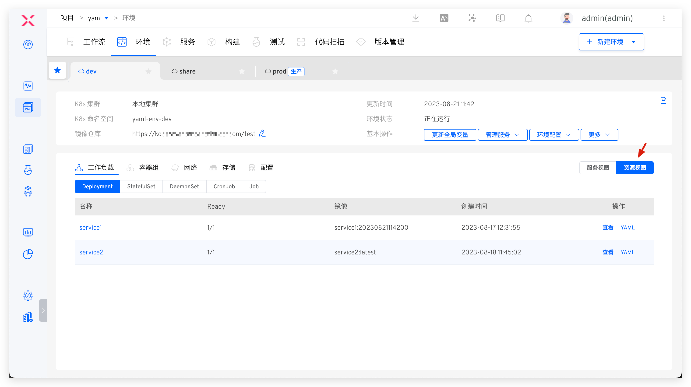
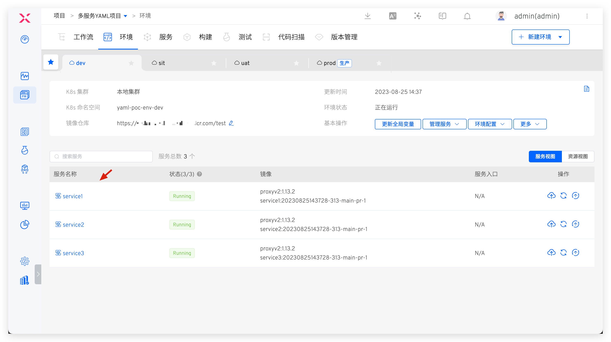
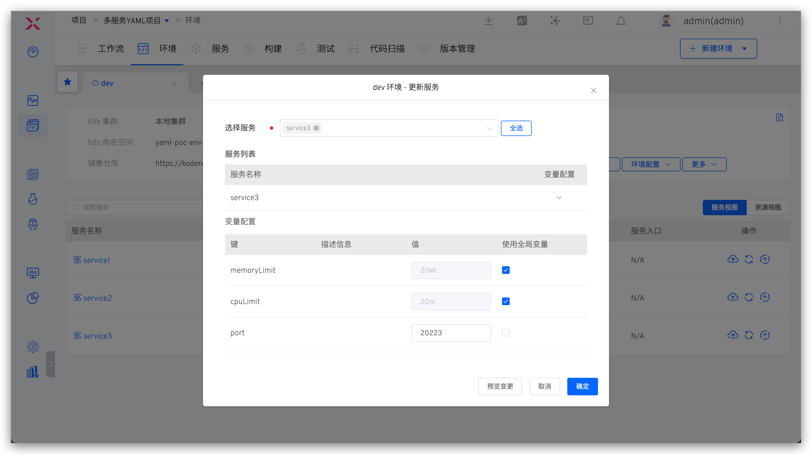
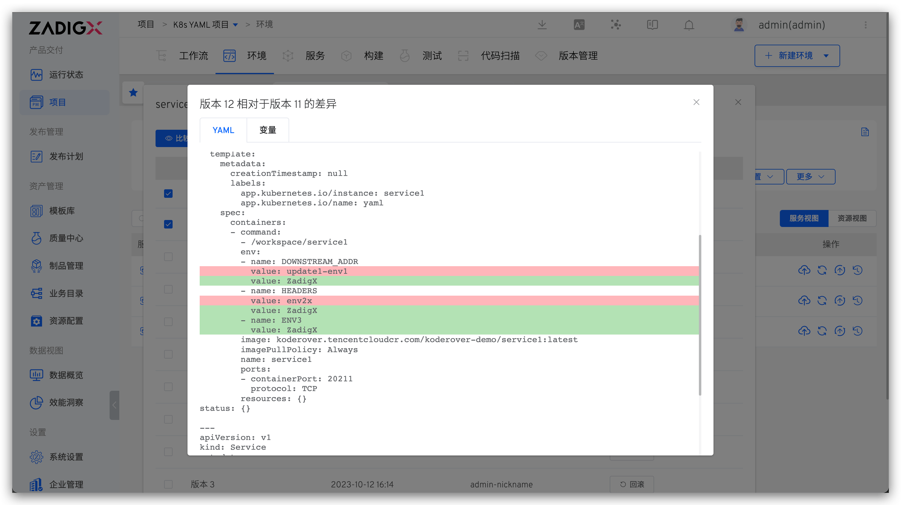
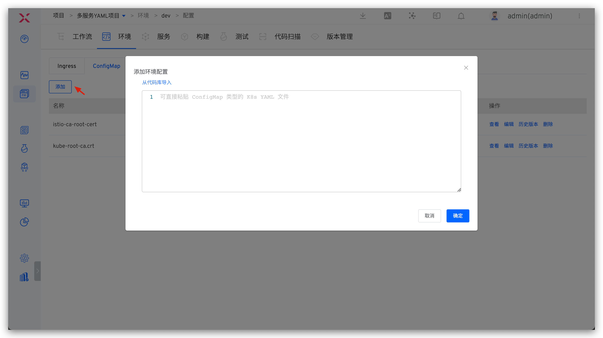
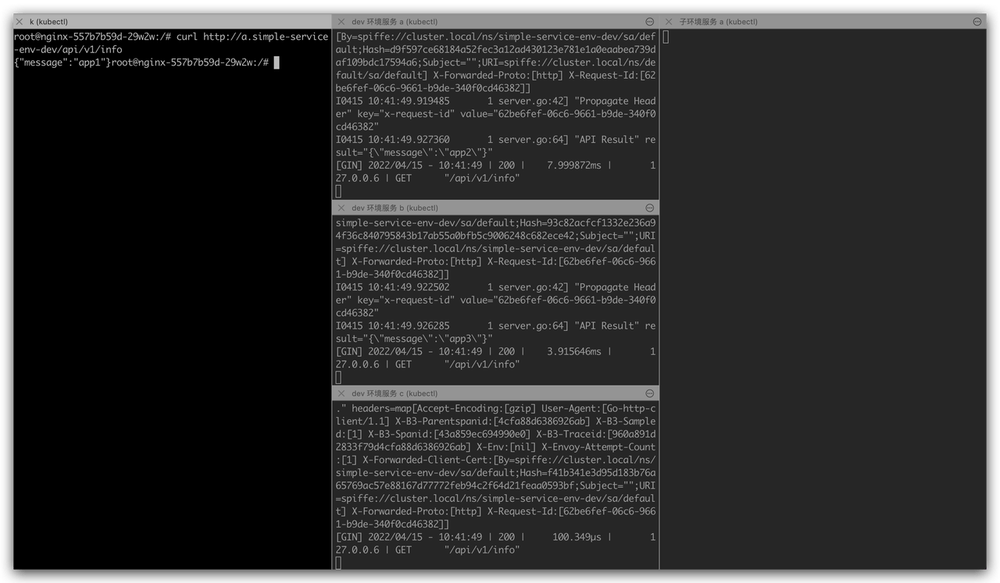
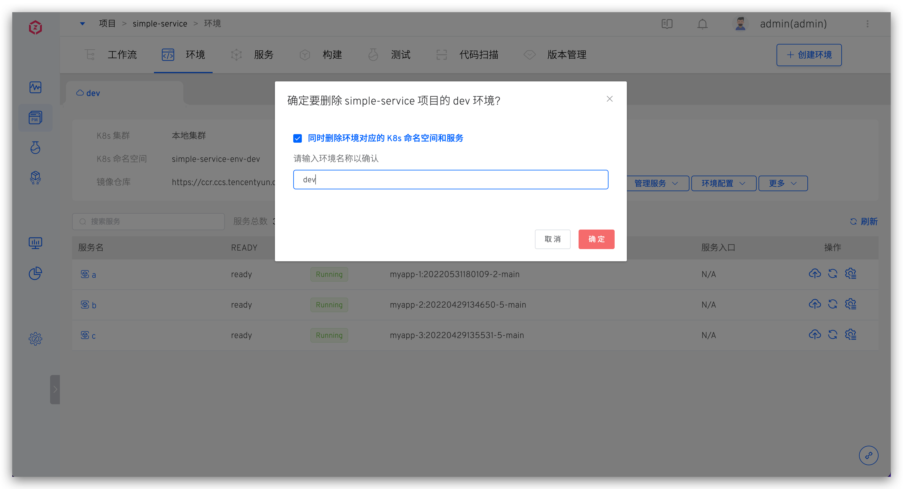

This article introduces the test and production environment operations in the K8s YAML project.

## View the environment

After the environment is created, click on a different environment Tab to switch to the details page of the environment, click `Resource View` to view the resources in the namespace where the environment is located from the resource perspectives such as workload / group / network / storage / configuration.

### Basic Information

The basic information of the environment includes the Kubernetes cluster, Kubernetes namespace, update time, environment status, and image repository. The environment status can be one of the following:
- `Creating` : Creating
- `Updating` : Updating
- `Deleting` : Deleting
- `Running` : All services in the environment are in a normal Running state
- `Unstable` : Some services in the environment are in an Unstable state. There are two possible scenarios:
	- The container service has encountered an issue
	- The container service is undergoing an update operation, such as updating the image, which may cause a temporary Unstable state. Once the update process is complete, the service status will revert to Running

### Basic Operations

Environment operations include:

- `Update Global Variables` : Update the global variables of the environment, see [update the global variables of the environment](/en/Zadig%20v3.4/project/service/variable/#update-environment-global-variables)
- `Manage Services` : Including [adding services](#add-a-service) , [updating services](#update-a-service) , and [deleting services](#delete-a-service)
- `Environment Configuration` : Configure for the environment Ingress , ConfigMap , Secret ,
- `Sleep and Wake Up` : Sleep and wake up the environment, which can save the cost of cloud resources used by the environment. For details, please read [Sleep and wake up.](#sleep-and-wake-up)
- `Delete Environment` : Delete the current environment. Once the environment is deleted, it cannot be recovered

### Change Record

Click the icon in the upper right corner to view the operation log of the environment.

### Service Details

Click on a specific service in the service list to view more information about the service. You can perform operations such as service restart, service scaling, configuration management, and image updates. For more details, see [Service Details](/en/Zadig%20v3.4/project/env/service/).

## Create a New Environment

::: tip
The number of services and the resources required to start the services will affect the creation time of the environment. Please be patient.
:::

### Test Environment

In the project, click the `New Environment` button, select the test environment, and enter the new environment page.

#### Basic Information

- `Environment Name` : The name of the environment to be created. It can be configured according to actual semantics, such as `dev` or `pre-release`.
- `Creation Method` : Supports three methods: `New` , `Copy` and `Rollback` Reference can be given to the replication environment: [replication environment](#%E5%A4%8D%E5%88%B6%E7%8E%AF%E5%A2%83) , and reference can be given to [the replication environment](#%E5%9B%9E%E6%BA%AF%E7%8E%AF%E5%A2%83) .
- `Resource Selection` :
	- `K8s Cluster` : Select the cluster resource to be used when creating a new environment. `Local Cluster` refers to the cluster where the Zadig system is located. For cluster integration, see [Cluster Management](/en/Zadig%20v3.4/pages/cluster_manage/).
	- `K8s Namespace` : Different environments will use independent Kubernetes namespaces to achieve isolation. The default rule for creating namespaces in the Zadig system is `project-env-environment-name`. Users can also customize or select an existing namespace.
	- `Image Repository` : Specify the image registry used after the environment is created, use the workflow to build and deploy services, and modify service images, and use the image registry specified here. For the integration of image registrys, see [image registry management](/en/Zadig%20v3.4/settings/image-registry/#add-a-mirror-repository) .
- `Service Selection` : Select the services to be included in the new environment. By default, it includes all services under the current project.

#### Environment Configuration
When creating a new environment, configure the environment as follows:

- Multiple configurations of types Ingress, ConfigMap, Secret, and PVC can be created
- Supports direct pasting or importing configurations from the code base. See [Code Source Information](/en/Zadig%20v3.4/settings/codehost/overview/#function-compatibility-list) for supported code base
- After the environment is created successfully, the newly created configuration here will take effect in the environment / cluster. You can also manage the environment configuration after the environment is created, see [environment configuration management](#environment-configuration-management)

#### Global Variables

When creating a new environment, the default values of global variables can be overwritten as needed to realize differentiated configurations of different environments. See [Global variables](/en/Zadig%20v3.4/project/service/variable/#update-environment-global-variables) .

#### Service List

This section allows users to customize the images and variables used by the services.

In `Quick Filter`, configure the images:

- `All Containers-Smart Select Image` : Automatically select the latest image version in the specified image repository for each container
- `All Containers-All Default Images` : Use the image version configured in the service YAML for each container

In `Variable Configuration`, assign values to service variables. You can use global variables or manually set them.

> Tip: After the environment is created, you can also modify the service's variable configuration in the environment and re-specify whether to use global variables.

### Production Environment

In the project, click the `New Environment` button, select the production environment, and enter the new environment page.

Parameter Description:
- `Environment Name` : The name of the environment to be created, such as `env-shanghai-ap1` or `env-shanghai-ap2`.
- `K8s Cluster` : Select the cluster resource to be used when creating a new environment. `Local Cluster` refers to the cluster where the Zadig system is located. For cluster integration, refer to [Cluster Management](/en/Zadig%20v3.4/pages/cluster_manage/).
- `K8s Namespace` : Select the K8s namespace to be used by the environment. Subsequent services will be deployed in this namespace. You cannot select a namespace that is already being used by other environments in Zadig.
- `Image Repository` : Specify the image registry used after the environment is created, use the workflow to build and deploy services, and modify service images, and use the image registry specified here. For the integration of image registrys, please refer to [image registry management](/en/Zadig%20v3.4/settings/image-registry/#add-a-mirror-repository) .
- `Alias` : Set an alias for the environment to be displayed in the environment list page. This is optional and can be set according to your needs.

## Copy Environment

> Based on an existing **test environment**, create a new test environment. The K8s cluster, image repository, global variables, service list, service image versions, and service configurations of the new environment will default to those of the copied environment.

In the project, click the `New Environment` button, select the test environment, and enter the new environment page.

Parameter Description:

- `Environment Name` : Customize according to actual semantics
- `Creation Method` : Select `Copy`
- `Copy Source` : Select the environment to be copied
- `Resource Selection` : Refer to the description in [the new environment > Basic information](/en/Zadig%20v3.4/project/env/k8s/#basic-information)
- `Service List` : By default, it is consistent with the copied environment and can be manually deleted
- `Environment Configuration` : Refer to the description in [New Environment > Environment Configuration](/en/Zadig%20v3.4/project/env/k8s/#environment-configuration)
- `Global Variables` : By default, it is consistent with the copied environment and can be manually modified
- `Service List` : By default, it is consistent with the copied environment and can be manually modified

## Trace Back Environment

> Create a new environment based on an existing service version to trace back the version.

When creating a new environment, you can create version backtracking based on the specified version. You can refer to the creation version: [Create version](/en/Zadig%20v3.4/project/version/#k8s-yaml-%E9%A1%B9%E7%9B%AE) .

- `Environment Name` : Customize according to actual semantics
- `Creation Method` : Select `Rollback`
- `Version` : Specify the version to be traced back
- `Resource Selection` : Refer to the description in [the new environment > Basic information](/en/Zadig%20v3.4/project/env/k8s/#basic-information)
- `Service List` : By default, it is consistent with the copied environment and can be manually deleted
- `Environment Configuration` : Refer to the description in [New Environment > Environment Configuration](/en/Zadig%20v3.4/project/env/k8s/#environment-configuration)

## Manage Services

Click `Manage Services` to add, update, and delete services in the environment.

### Add a Service

The service to be added needs to be defined in [Services](/en/Zadig%20v3.4/project/service/k8s/) in advance. After selecting a service, the system will automatically detect whether the resources defined in the service exist in the selected Kubernetes namespace. If the resources already exist, you can choose to import the existing service in one click or redeploy the service.

In `Variable Configuration` , configure the variable for the service, refer to the document [service variable](/en/Zadig%20v3.4/project/service/variable/#update-service-variables) .

### Update a Service

Select an existing service in the current environment to update it, including modifying the variable values in the service configuration and synchronously updating the service configuration.

::: tip
If the image has been updated after the service has been added to the environment (for example, deploying the service image using a workflow or manually switching the service image in the environment), the service image will not be updated based on the image information in the service configuration.
:::

### Delete a Service

Remove the service from the current environment.

::: tip
1. If the service was created through `Execute Deployment`, the delete service operation will also delete the service resources in the Kubernetes cluster
2. If the service was created through `Only Import Service` and has not been updated in the Zadig platform after importing, the delete service operation will not delete the service resources in the Kubernetes cluster
:::

## Service Rollback

Click the historical version icon on the right side of the service to view all historical versions of the service, compare the configuration differences between two different versions, and roll back the service to the specified version with one click.

::: tip
After the rollback, the service's YAML configuration and the value of the custom variables will revert to the state of the specified version.
:::

## Environment Configuration Management

You can operate on the Ingress, ConfigMap, Secret, and PVC configurations in the environment. The following example illustrates the Secret configuration. 

### Check

Click `Environment Configuration` -> `Secret` under Basic Operations to view the list of Secret configurations in the current environment and the collection of services that use the Secret configuration.

### Add

Manually input the content of the K8s YAML file, or import a file from a GitHub/GitLab repository (with the extension `.yaml`) to create a configuration.

When importing from a repository, you can enable the automatic synchronization feature as needed. After enabling, Zadig will periodically pull configuration files from the repository and automatically update them to the environment.

### Edit

Click the `Edit` button to modify the Secret configuration. You can choose whether to restart the associated services after the modification as needed.

### Version Rollback

Click the `History Version` button, select two versions to compare the differences between them, and click the `Rollback` button to quickly roll back the current environment's configuration.

### Delete

Click the `Delete` button to delete the configuration in the environment. Note that deleting the configuration may cause associated services to fail to run properly. Please confirm there are no adverse effects before proceeding.

## Self-Test Mode

> Only the test environment supports the self-test mode.

The following example uses the simple-service project to illustrate how to use the self-test mode of the environment. The background of the environment and services in the project, as well as the self-test and joint debugging requirements, are explained as follows:
1. The project includes three microservices: a, b, and c, with the service call chain: a -> b -> c
2. The dev environment is a daily stable test environment, including all microservices a, b, and c.
3. A service will undergo frequent changes on a daily basis, and it is hoped to thoroughly self-test the service to ensure that its changes can be delivered

### Enable Self-Test Mode

In the `dev` environment, enable the self-test mode:

The system checks the dependency conditions for the self-test mode:

1. The system cannot automatically check the Tracing components; the administrator needs to ensure this manually
2. The system will automatically check whether Istio is installed. If not, please install it in the cluster where the environment is located
3. The service call chain is automatically checked, mainly based on the correspondence between K8s Service type resources and services

After enabling the self-test mode, the services in the `dev` environment will restart. Wait a moment for the services to restart, and the environment will become the baseline environment.

If the sub-environment contains ingress services, you need to configure the Istio gateway for the baseline environment's ingress service. The configured access address should be resolved to the external network access address of the cluster's istio-ingressgateway service, as shown in the figure below.

### Create a Sub-Environment

::: tip
The optional service list when creating a sub-environment comes from the baseline environment
:::

In the `dev` benchmark environment, click `Create Sub-Environment` and select service a to create a sub-environment containing service a, `dev-test-env1`:

### Self-Test and Joint Debugging

When requesting service a, add `x-env:dev-test-env1` to the request Header to forward the request traffic to the sub-environment `dev-test-env1`, achieving self-testing and integration between the sub-environment and the `dev` environment. The effect is as follows:

1. No x-env request header is added, service a is directly requested, service a/b/c in the `dev` environment will process the request, and there is no requested traffic input in the sub-environment.

2. Add `x-env: dev-test-env1` request header to access service a, service a in the sub-environment will receive the request and give a response. For the b/c service on the request link, the service in the `dev` environment will give a normal response.

### Disable Self-Test Mode

When the self-test and joint debugging requirements are completed, click `More` -> `Disable Self-Test Mode` in the baseline environment to disable the self-test mode.

- Disabling the self-test mode will simultaneously delete all sub-environments created under the baseline environment
- After disabling the self-test mode, the services in the environment will restart. Wait a moment for the services to restart, and the environment will return to normal operation

## Sleep and Wake Up

1. Support one-click sleep for the environment, where the number of replicas of all service instances in the environment will be automatically adjusted to 0, and CronJobs will be suspended, saving the cost of cloud resources used by the environment.
2. Wake up the environment, and all services in the environment will return to their state before sleep according to the service orchestration order.
3. Support configuration Cron expressions to realize the environment's timed sleep / wakeup. The form of Cron expression is `* * * * *` In the example below, every day 22:00 the environment will automatically sleep, every day 8:00 will automatically wake up.

## Set an Alias

> Only the production environment supports setting an alias.

Click `Basic Operations` -> `More` -> `Set Alias` and enter a new name to set an alias for the environment and display it in the Tab.

## Delete the Environment

Click `Basic Operations` -> `More` -> `Delete Environment` and enter the environment name to delete the environment. If the environment is created based on a new Namespace, check `Delete the K8s Namespace and Services Corresponding to the Environment` when deleting. The delete environment operation will simultaneously delete the Namespace and the resources created by the Zadig system in the environment.

::: tip
1. Given the seriousness of production services, deleting a production environment in Zadig only deletes the environment record; the related service resources in the Kubernetes cluster will not be deleted.
2. If you need to delete resources in the cluster, do it manually after ensuring there is no impact.
:::
