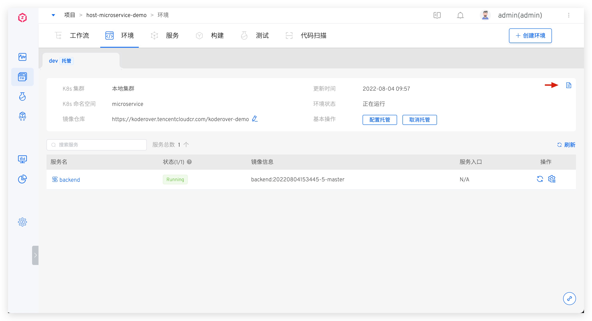
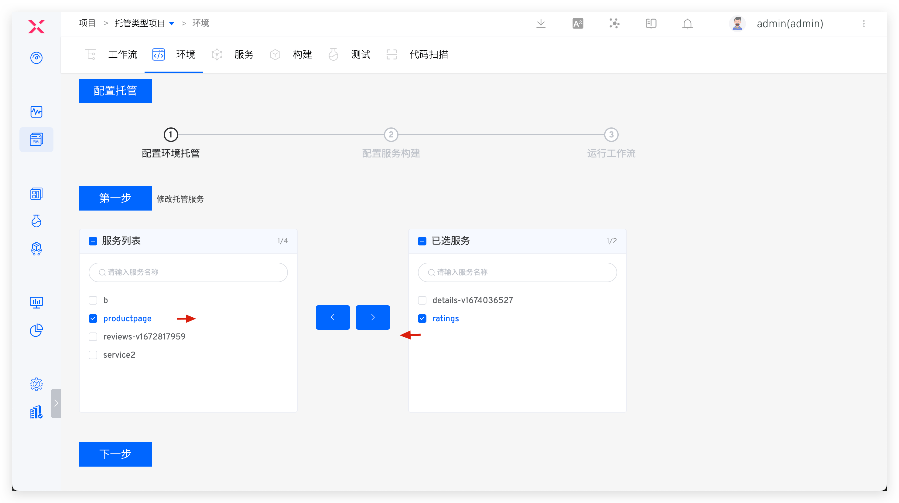

This article introduces environment-related operations in K8s hosting projects.

## Create a New Environment

In the K8s hosting project, click the `New Environment` button to enter the new environment page. After filling in the relevant parameters, you can create the environment immediately.

Parameter Explanation:

- `Environment Name`: Enter the environment name
- `K8s Cluster`: The Kubernetes cluster where the service to be hosted is located. Note: This cluster must be integrated into Zadig in advance. For details, refer to [Cluster Management](/en/Zadig%20v3.4/pages/cluster_manage)
- `K8s Namespace`: The Kubernetes namespace where the service to be hosted is located
- `Select Service`: The service to be hosted

## View the environment

Click on a different environment Tab You can view the details of the hosted services in this environment. Click `Resource View` to view the resources under the namespace hosted by this environment from the perspective of workload / / storage / configuration and other resource.

### Basic Information
This includes information such as the K8s cluster, K8s namespace, update time, and environment status. The environment status can be one of the following:
- `Creating`: Creating.
- `Running`: All services in the environment are in the Running state.
- `Unstable`: Some services in the environment are in the Unstable state. There are two possible scenarios:
	- The container service has encountered an issue.
	- The container service is undergoing an update operation, such as updating the image, which may cause a temporary Unstable state. Once the update process is complete, the service status will return to Running.

### Service List

The service list displays all the hosted services in the current environment. The parameters are as follows:

- `Status`: The running status of the service
- `Image Information`: The current image being used by the service. You can click on the service name to modify it on the service details page
- `Service Entry`: If the service has Ingress information, it will be displayed
- `Operation`: Quickly restart the service

### Change Record
Click the icon in the upper right corner to view the operation log of the environment.

### Service Details

Click on a specific service in the service list to view more information about the service. You can perform operations such as service restart, service scaling, configuration management, and image updates. For more details, refer to [Service Details](/en/Zadig%20v3.4/project/env/service/).

## Configuration Management

Click `Configuration Hosting` in the basic operations to manage the hosted services in the current environment. You can add or remove services as needed

## Unhost

Click `Unhost` in the basic operations to unhost the services in the current environment. After unhosting, the environment will be deleted.

## Sleep and Wake Up

Refer to [Sleep and Wake Up](/en/Zadig%20v3.4/project/env/k8s/#sleep-and-wake-up).