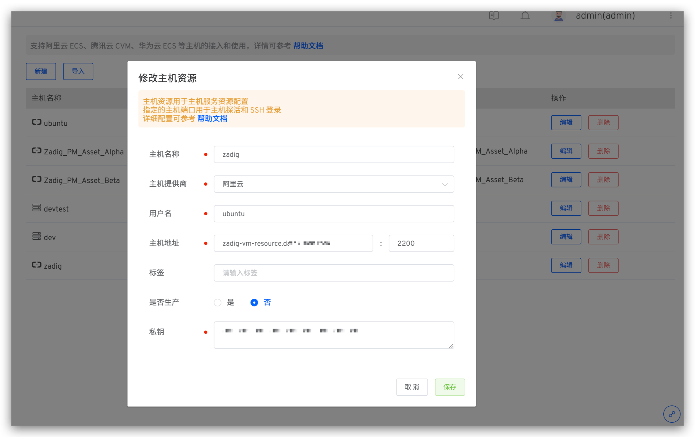

This article introduces the operations related to hosting services in free projects.

## Add a Service

Click the Add Service button -> Enter the service name -> Add a build -> Configure deployment and liveness checks, and save.

### Build Configuration

For more details, refer to [Build Configuration](/en/Zadig%20v3.4/project/build/).

> If you use the host deployment steps in the workflow, you must add the "Binary Package Storage" step in the service build.

### Deployment Configuration

Configure the deployment method and deployment scripts to define the service's deployment process.

#### Deployment Environment

The environment in which the deployment task is executed, supporting both Kubernetes and host infrastructure.

#### Deployment Methods
##### Local Direct Deployment

Execute the deployment script in Zadig, using deployment tools (such as Ansible) to deploy the service to the target host. Ensure that the deployment tool is ready and that the network connection between the Zadig system and the target deployment host is established.

##### SSH Agent Remote Deployment

Securely log into the target machine to perform deployment operations. You need to configure the host resources in the system in advance, refer to [Host Management](/en/Zadig%20v3.4/settings/vm-management/).

#### Artifact Type

Select according to the actual type of artifact. This selection affects the type of artifact in the "Host Deployment" task.

#### Built-in Deployment Variables

In addition to using variables in [build variables](#%E6%9E%84%E5%BB%BA%E5%8F%98%E9%87%8F) , the following variables are included:

- `ARTIFACT`: The deployment artifact package, which can be obtained through this variable.
    - When deploying services using workflows, the entity that delivers packages is added to the [binary](#%E6%9B%B4%E5%A4%9A%E6%9E%84%E5%BB%BA%E6%AD%A5%E9%AA%A4) package storage, i.e., $PKG_FILE files.
- `IMAGE`: The image name output by the build task.
- `<AGENT_NAME>_PK`: The private key information used for remote login to the host via SSH Agent, where AGENT_NAME is the name of the SSH Agent. If the host in the example below is used as the SSH Agent, use $zadig_PK in the deployment script to obtain the private key information of the host server.
- `<AGENT_NAME>_USERNAME`: The username used for remote login to the host via SSH Agent, which is $zadig_USERNAME in the example below.
- `<AGENT_NAME>_IP`: The IP address of the target server for the SSH Agent (excluding the port), which is $zadig_IP in the example below.
- `<AGENT_NAME>_PORT`: The port in the IP address of the target server for the SSH Agent, which is $zadig_PORT in the example below.

- `<ENV>_HOST_IPs`: Get all host IPs associated with the specified service in a specific environment. In the example below, use $dev_HOST_IPs to obtain all host IPs associated with the dev environment.
- `<ENV>_HOST_NAMEs`: Get all host names associated with the specified service in a specific environment, which is $dev_HOST_NAMEs in the example below.

- `<HOST_NAME>_PK`: HOST_NAME is the specific host name. Use `<HOST_NAME>_PK` to obtain the private key information of the corresponding host, which is $dev_PK in the example below.
- `<HOST_NAME>_USERNAME`: HOST_NAME is the specific host name. Use `<HOST_NAME>_USERNAME` to obtain the username information of the corresponding host, which is $dev_USERNAME in the example below.
- `<HOST_NAME>_IP`: HOST_NAME is the specific host name. Use `<HOST_NAME>_IP` to obtain the address information of the corresponding host (excluding the port), which is $dev_IP in the example below.
- `<HOST_NAME>_PORT`: HOST_NAME is the specific host name. Use `<HOST_NAME>_PORT` to obtain the port information in the corresponding host address, which is $dev_PORT in the example below.
- `$DOCKER_REGISTRY_HOST`: Get the image registry address.
- `$DOCKER_REGISTRY_AK`: Get the Access Key of the image registry.
- `$DOCKER_REGISTRY_SK`: Get the Secret Key of the image registry.

#### Deployment Script

Deployment scripts and [common build scripts](#common-build-scripts) share storage volumes, and packages generated in build scripts can be used directly in deployment scripts. [Build variables](#build-variables) and [built-in deployment variables](#built-in-deployment-variables) can be used in deployment scripts.

### Liveness Configuration

After the service is deployed successfully, it is tested according to certain rules.

Field Descriptions:
- `Protocol`: Supports HTTP, HTTPS, and TCP.
- `Path`: The health check path for HTTP/HTTPS requests.
- `Port`: Supports ports 1 - 65535.
- `Response Timeout`: If the response exceeds the set time, it is considered unhealthy.
- `Advanced Settings`:
    - `Probe Interval`: The interval between two liveness checks, default is 2s.
    - `Healthy Threshold`: The number of consecutive successful liveness checks required to transition from unhealthy to healthy.
    - `Unhealthy Threshold`: The number of consecutive failed liveness checks required to transition from healthy to unhealthy.

### Start and Stop Configuration

After configuring the service start and stop commands, you can start, stop, and restart the service in the environment.

Operate service start and stop in the environment.

## Update Service

- Select the service you need to modify, modify the service configuration, click `Save` -> Click `Update Environment` -> In the pop-up box, select the environment you need to update.

## Delete Service

- Click the delete button on the right side of the service to delete it. After deleting the service, if you need to remove the service from the environment, click `Update Environment`.

## Tag Management

By tagging services, you can quickly classify and retrieve service metadata. For specific configuration and usage, refer to the [documentation](/en/Zadig%20v3.4/project/service/label/).

## Policy Configuration

Click `Policy` to set the timeout time of the deployment service and the delivery object naming rules. Details can be read: [Policy configuration](/en/Zadig%20v3.4/project/service/k8s/#policy-configuration) .

