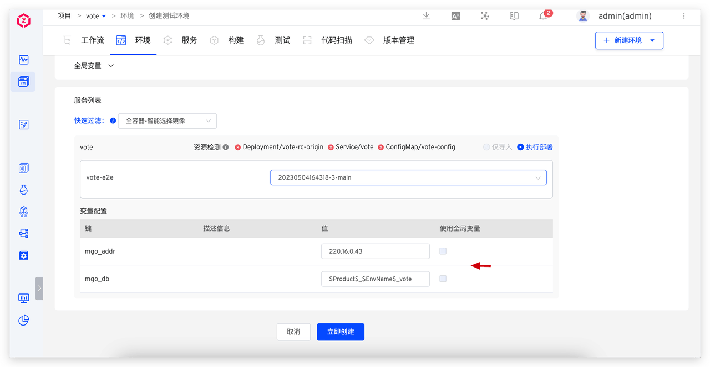
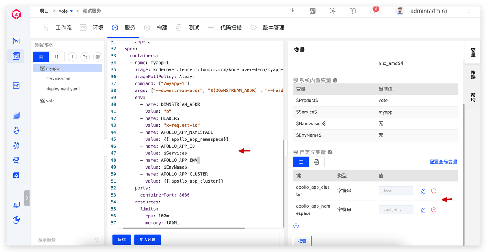

This article primarily introduces how to leverage Zadig's K8s YAML project service management variable configuration capabilities to achieve isolation of multiple environments and global configuration management through a single set of configurations

- Database Isolation: Each environment's business data is stored independently in different databases, ensuring no interference between them
- Differentiated Domain Name Access: Use different domain names to access different environments
- Differentiated Business Configuration: Business configurations are managed in configuration centers such as Nacos and Apollo, with different environments using different configurations
- Global Management of Shared Configurations: Globally manage configurations shared by multiple services

Zadig provides both system-built-in variables and custom variables to distinguish different variable values across different environments. The following sections detail the practical application of these configurations within the Zadig system.

## Database Isolation

> Applicable: Business data in different environments are isolated from each other, with one database corresponding to multiple connection addresses or connecting to different databases.

### Configure Service Variables

As shown in the `vote` service, the database-related configurations are managed in a ConfigMap and mounted to the application via a volume. In Zadig, the database configuration items are extracted into custom variables `mgo_addr` and `mgo_db`, and default values are set for them.
- `mgo_addr` default value setting: `220.16.0.43`, which can be configured according to actual conditions.
- The default value for `mgo_db` is set to `$Product$_$EnvName$_vote`. Here, we use the system-built-in global variables `$Product$` and `$EnvName$`, which represent the project name and environment name, respectively.


### Use Service Variables

When creating a new environment, the variables in the configuration can use the default values or be re-specified.



When the environment is created, the variables are automatically rendered, as shown in the figure below. In the dev environment, it is rendered as `vote-dev-vote`, and in the qa environment, it is rendered as `vote-qa-vote`.


**Example YAML Reference:**
:::details
```yaml
apiVersion: apps/v1
kind: Deployment
metadata:
  labels:
    app: vote
  name: vote-rc-origin
spec:
  replicas: 1
  selector:
    matchLabels:
      app: vote
      version: rc-origin
  template:
    metadata:
      labels:
        app: vote
        version: rc-origin
    spec:
      containers:
      - image: dockersamples/examplevotingapp_vote:before
        name: vote-e2e
        ports:
        - containerPort: 80
          name: vote
        volumeMounts:
        - name: config-volume
          mountPath: /app/config
      volumes:
      - name: config-volume
        configMap:
          name: vote-config
---
apiVersion: v1
kind: ConfigMap
metadata:
  name: vote-config
data:
  SERVICE_MGO_ADDR: {{.mgo_addr}}
  SERVICE_MGO_DB: {{.mgo_db}}
  SERVICE_MGO_MODE: strong
```
:::

## Differentiated Domain Name Access

> Applicable: Create multiple environments in Zadig and use different domain names to access different environments

### Configure a Wildcard Domain

Configure a wildcard domain for the cluster entry, such as `*.koderover.com`, ensuring the domain name DNS correctly resolves to the external IP of the cluster [Ingress controller](https://kubernetes.io/zh/docs/concepts/services-networking/ingress-controllers/) LoadBalancer.


### Configure and Use Service Variables

In this example, the external network access address for the service entry point is configured. In Zadig, a global variable <span v-pre>{{.domain}}</span> is set, with the variable value configured as `vote-$EnvName$.koderover.com`


When creating a new environment, the system automatically renders the variables, as shown in the following diagram:


**Example YAML Reference:**
:::details
```yaml
apiVersion: apps/v1
kind: Deployment
metadata:
  name: vote-rc-origin
spec:
  replicas: 1
  selector:
    matchLabels:
      app.kubernetes.io/instance: vote
      app.kubernetes.io/name: vote
  template:
    metadata:
      labels:
        app.kubernetes.io/instance: vote
        app.kubernetes.io/name: vote
    spec:
      containers:
      - image: dockersamples/examplevotingapp_vote:before
        name: vote-e2e
        ports:
        - containerPort: 80
          name: vote

---
apiVersion: networking.k8s.io/v1
kind: Ingress
metadata:
  name: vote
  annotations:
    nginx.ingress.kubernetes.io/proxy-body-size: 100m
spec:
  ingressClassName: {{.ingressClass}}
  rules:
  - host: {{.domain}}
    http:
      paths:
      - backend:
          service:
            name: vote
            port:
              number: 5000
        path: /
        pathType: ImplementationSpecific
---
apiVersion: v1
kind: Service
metadata:
  name: vote
spec:
  type: NodePort
  ports:
    - protocol: TCP
      port: 5000
      targetPort: 80
  selector:
    app.kubernetes.io/instance: vote
    app.kubernetes.io/name: vote
```
:::

## Differentiated Business Configuration

> Applicable: The service's business configuration is managed in a third-party configuration center (such as Nacos, Apollo, etc.), with different environments using different configuration items. The following example uses an Apollo configuration center to manage and use business configurations in different environments through Zadig.

### Configure Service Variables

Taking the `myapp` service as an example, we need to set the correspondence between the Apollo configuration parameters and the Zadig environment variables in Zadig.

Configuration items defined in Zadig (can be set according to the situation):
- `APOLLO_APP_NAMESPACE`: Apollo Configuration Center namespace (Namespace), assigned using the Zadig custom variable `apollo_app_namespace`, with the default value set to `zadig.dev`
- `APOLLO_APP_ID`: The Apollo Configuration Center application (Application) is assigned a value using the Zadig system-built-in variable `$Service$`.
- `APOLLO_APP_ENV`: Apollo Configuration Center environment (Environment), assigned using the Zadig system built-in variable `$EnvName$`.
- `APOLLO_APP_CLUSTER`: Apollo Configuration Center cluster (Cluster), assigned using the Zadig custom variable `apollo_app_cluster`, with the default value set to `local`.



### Use Service Variables

When the environment is launched or the `myapp` service starts, the service configuration is retrieved from the corresponding configuration center.

dev and qa environment effects:


**Example YAML Reference:**
:::details
```yaml
apiVersion: v1
kind: Service
metadata:
  name: a
  labels:
    app: a
spec:
  ports:
  - name: http
    port: 80
    targetPort: 8080
  selector:
    app: a

---

apiVersion: apps/v1
kind: Deployment
metadata:
  name: a
  labels:
    app: a
spec:
  selector:
    matchLabels:
      app: a
  replicas: 1
  template:
    metadata:
      labels:
        app: a
    spec:
      containers:
      - name: myapp-1
        image: koderover.tencentcloudcr.com/koderover-demo/myapp-1:v0.1__linux_amd64
        imagePullPolicy: Always
        command: ["/myapp-1"]
        args: ["--downstream-addr", "$(DOWNSTREAM_ADDR)", "--headers", "$(HEADERS)"]
        env:
          - name: DOWNSTREAM_ADDR
            value: "b"
          - name: HEADERS
            value: "x-request-id"
          - name: APOLLO_APP_NAMESPACE
            value: {{.apollo_app_namespace}}
          - name: APOLLO_APP_ID
            value: $Service$
          - name: APOLLO_APP_ENV
            value: $EnvName$
          - name: APOLLO_APP_CLUSTER
            value: {{.apollo_app_cluster}}
        ports:
        - containerPort: 8080
        resources:
          limits:
            cpu: 100m
            memory: 100Mi
```
:::

## Global Management of Shared Configurations

In practical application scenarios, multiple services often share the same database address, configuration management system address, and other information. To effectively manage these shared configuration items and simplify subsequent maintenance, we can use "global variables" to uniformly store and manage these variables. This way, when configuration updates or changes are needed, a single modification in the global variable can achieve synchronized updates for all related services, improving management efficiency and reducing the possibility of errors.


### Configure Global Variables

Define global variables by extracting some variables from service variables as global variables.


### Using Global Variables

When creating a new environment, you can choose whether the service uses global variables


The values of global variables in the environment can be modified. Once the global variables change, all services that depend on these variables will be automatically updated to ensure consistency and real-time configuration.


