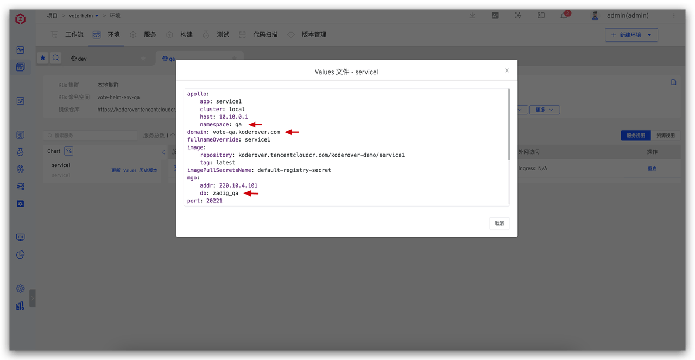
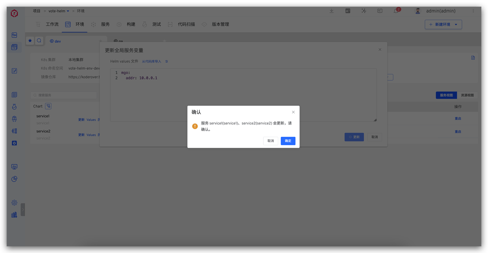

This article primarily explains how to use the variable configuration capabilities of Zadig's Helm Chart project service management to achieve isolation of multiple environments and global configuration management through a single set of configurations

- Define values to distinguish services:
  - Database Isolation: Each environment's business data is stored independently in different databases, ensuring no interference between them
  - Differentiated Domain Name Access: Use different domain names to access different environments
  - Differentiated Business Configuration: Business configurations are managed in configuration centers such as Nacos and Apollo, with different environments using different configurations
- Global Management of Shared Configurations: Globally manage configurations shared by multiple services

Zadig provides both system-built-in variables and custom variables to distinguish different variable values across different environments. The following sections detail the practical implementation of these configurations in the Zadig system.

## Define values to distinguish services

Depending on the needs of different environments, services can be distinguished and configured by setting different values for variables.

### Define values file

For scenarios involving database isolation, differentiated domain name access, and differentiated business configuration, define the database, domain name, business configuration, and other information as variables in the values file.

### Use values file

When creating a new environment or adding a service to an environment, define the values of the corresponding variables in the values file.

The variables for the same service in the dev environment and the qa environment are distinguished as follows:

## Global Management of Shared Configurations

In practical application scenarios, multiple services often share the same database address, configuration management system address, and other information. To effectively manage these shared configuration items and simplify subsequent maintenance, we can use "global variables" to uniformly store and manage these variables. This way, when configuration updates or changes are needed, a single modification in the global variable can achieve synchronized updates for all related services, improving management efficiency and reducing the possibility of errors.

After modifying the global variables, the system will automatically detect these changes, and all services that depend on these global variables will automatically update accordingly.

