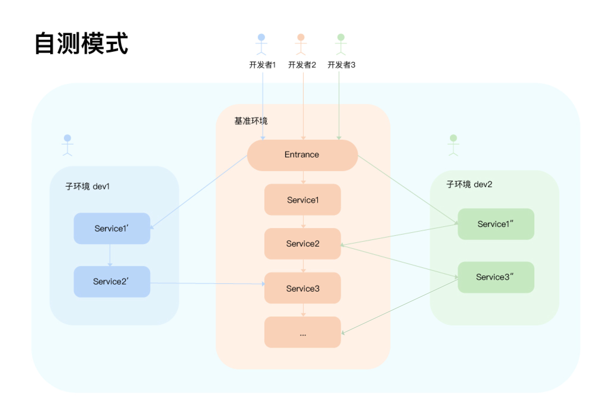
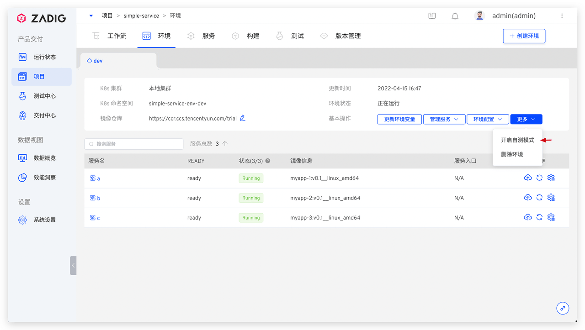
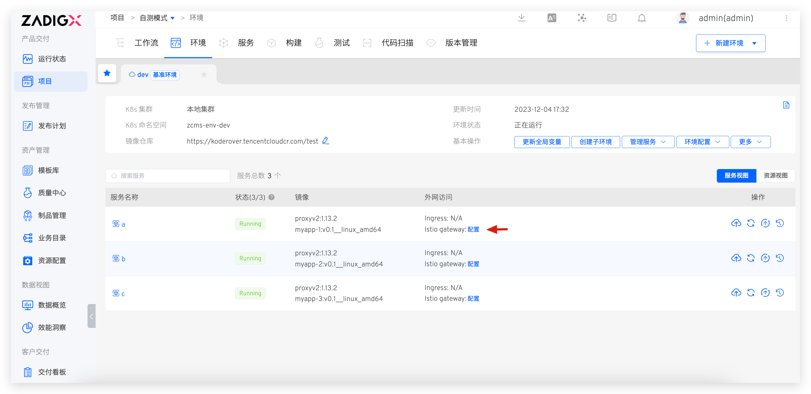
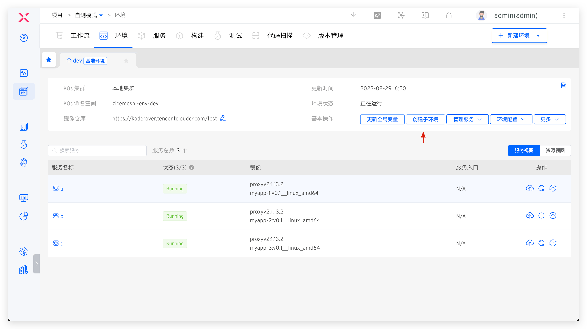
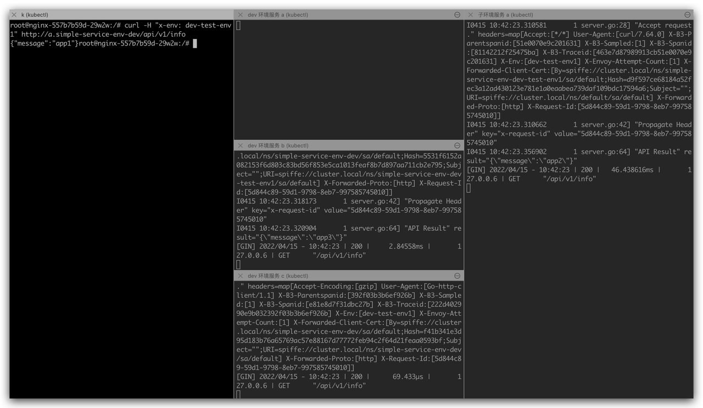

## Introduction

The self-test mode is a developer-oriented feature module introduced by Zadig to reduce the complexity of environment management and deployment costs. When the self-test mode is enabled for an environment, it becomes the baseline environment. Developers can quickly replicate their own self-test environment (i.e., sub-environment) based on the baseline environment, focusing only on services related to their daily changes. They do not need to worry about upstream and downstream services, as the baseline environment will provide the necessary capabilities, enabling quick self-testing and joint debugging. The illustration is as follows:



## Application Scenarios

Zadig's self-test mode supports the rapid creation of sub-environments that include only some services at a lower cost. Developers can develop and change target services in the sub-environment and interact with the baseline environment, which includes all services, to achieve self-testing and joint debugging. The issues that enterprises can address using the self-test mode include but are not limited to:

1. Frequent development and a strong demand for business verification, necessitating rapid iteration of business processes, but lacking the necessary engineering infrastructure.
2. A large number of microservices and high business complexity, leading to high costs and significant effort in building a complete environment.
3. Some microservices, due to basic technical architecture or other reasons, cannot be fully replicated into multiple complete environments, resulting in multiple teams being bound to a single environment, making it difficult to ensure environmental stability.
4. ......

## How to Use

The following example uses [simple-service](https://github.com/koderover/zadig/tree/main/examples/simple-service/) to illustrate how to use the self-test mode of the environment to achieve daily joint debugging. The background of the environment and services in the project, as well as the self-test and joint debugging requirements, are explained as follows:

1. The project includes three microservices: a, b, and c, with the service call chain: a -> b -> c
2. The `dev` environment is a complete and stable daily test environment, including all microservices: a, b, and c
3. A service will undergo frequent changes on a daily basis. We aim to conduct thorough self-testing on service A to ensure that its changes can be delivered

### Administrator: Enable Self-Test Mode

::: tip Prerequisites
1. The system cannot automatically check the Tracing components, and the administrator needs to ensure this manually. This supports widely used tools such as SkyWalking, Zipkin, and Jaeger.
2. The system will automatically check whether Istio is installed. If not, please install it in the cluster where the environment is located
3. The system will automatically check the service call chain, primarily based on the K8s Service type resources and services corresponding to A, B, and C
:::

In the `dev` environment, enable the self-test mode. After enabling, the `dev` environment becomes the baseline environment.



If the sub-environment includes ingress services, you need to configure the Istio gateway for the baseline environment's ingress service. The configured access address should be resolved to the external network access address of the cluster's istio-ingressgateway service, as shown in the figure below.




### Engineer: Daily Self-Test Joint Debugging

#### Create a Sub-Environment

In the `dev` benchmark environment, click `Create Sub-Environment` and select service A to create a sub-environment containing service A, named `dev-test-env1`:




#### Self-Test and Joint Debugging

The following operations need to operate in a service that is in the same Service Mesh as a/b/c and is injected with istio-proxy. In this example, the shortcut operation for deploying the service is as follows:

``` bash
# Execute the following command to inject istio label into the default namespace
kubectl label ns default istio-injection=enabled

# Deploy the nginx service in the default namespace
kubectl -n default apply -f nginx.yaml # nginx.yaml can be obtained from the project source code
```

When requesting service A, add `x-env:dev-test-env1` to the request Header to forward the request traffic to the sub-environment `dev-test-env1`, enabling self-testing and joint debugging between the sub-environment and the `dev` environment. Log in to the nginx Pod, and the test results are as follows:

1. No `x-env` request header is added, service a is directly requested, service in `dev` environment a/b/c The request will be processed, and there is no requested traffic input in the sub-environment.


2. Add `x-env: dev-test-env1` request header to access service a, service a in the sub-environment will receive the request and give a response. For the b/c service on the request link, the service in the `dev` environment will give a normal response.




For more information, refer to:
- [Based on Ingress Controller Access Zadig self-test environment outside the cluster (best practice)](https://mp.weixin.qq.com/s?__biz=Mzg4NDY0NTMyNw==&amp;mid=2247487693&amp;idx=1&amp;sn=1661317c3684bb156a47f506085fd19b&amp;chksm=cfb45c6df8c3d57bf83c179714483ed4ec86f1b6c939ca4d53d2f0933ea3aeba24d025fd7a38&amp;scene=178&amp;cur_album_id=2315406414233927682#rd)
- [Istio + SkyWalking + Spring Boot Practical combat -Zadig self-test mode solves the developer sub-environment](https://mp.weixin.qq.com/s?__biz=Mzg4NDY0NTMyNw==&amp;mid=2247487102&amp;idx=1&amp;sn=02753293fe98989625947f9b7786f3da&amp;chksm=cfb442def8c3cbc89d59c4a659926889f365f6876acaca73a7d7f6c0fe88c135ef84e433f4b9&amp;scene=178&amp;cur_album_id=2315406414233927682#rd)