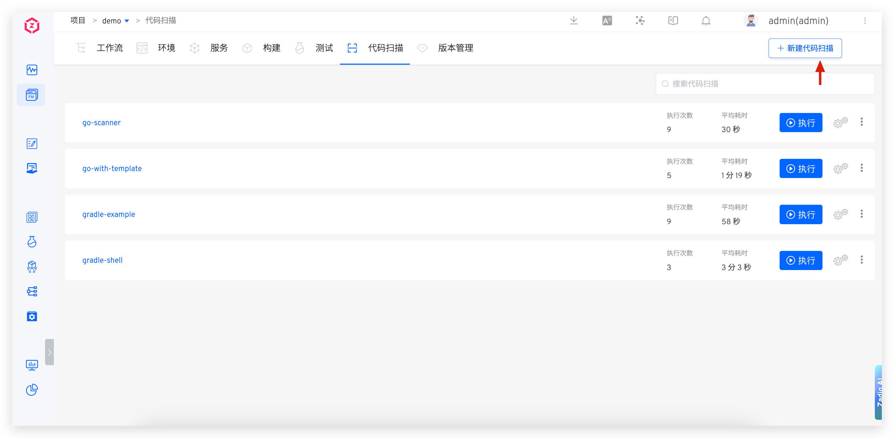
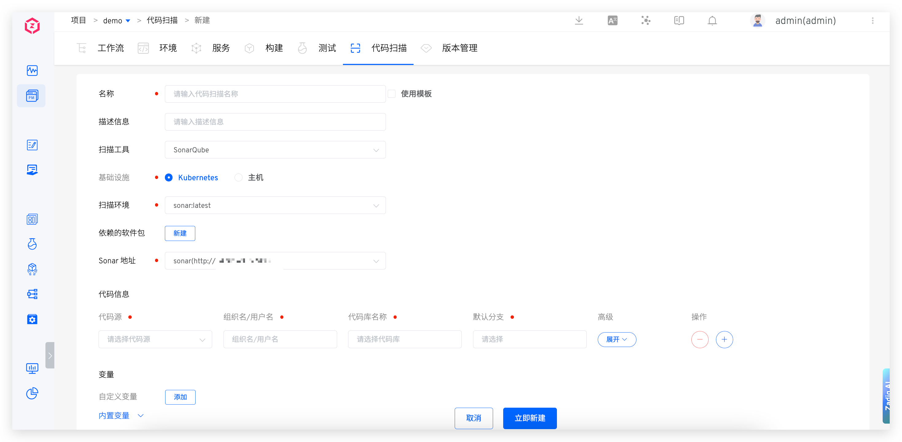
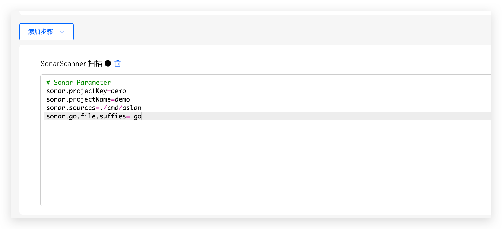
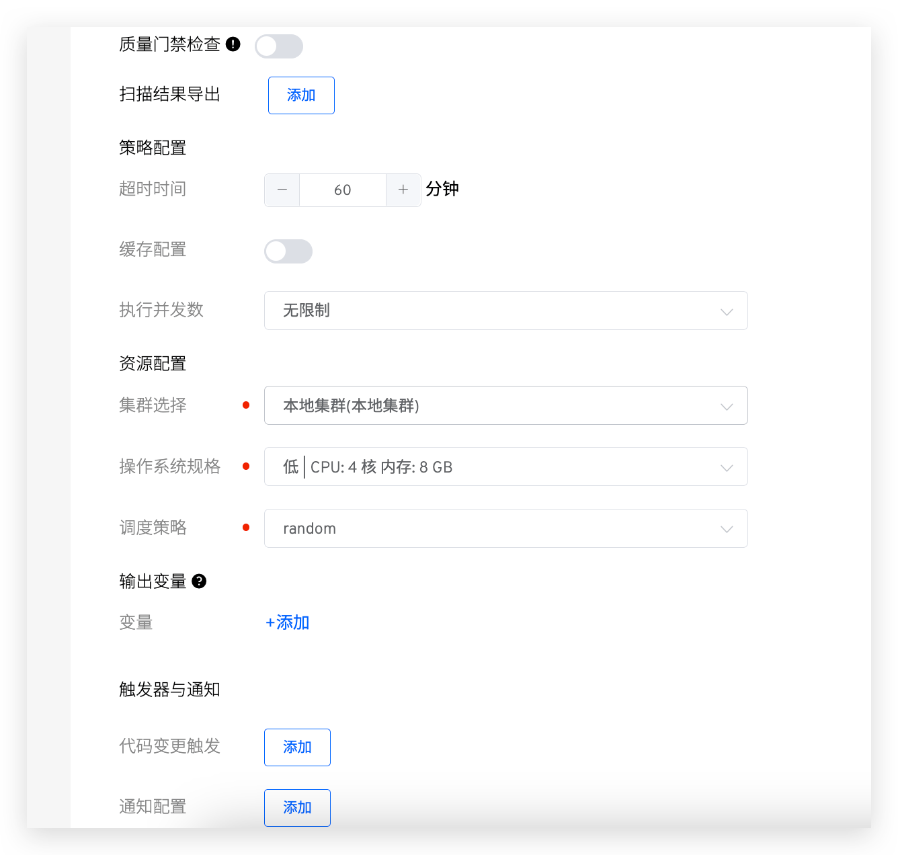
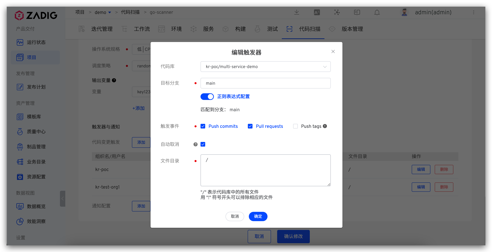
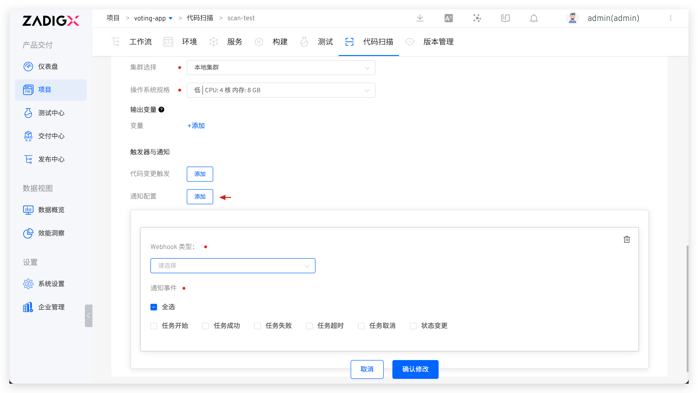
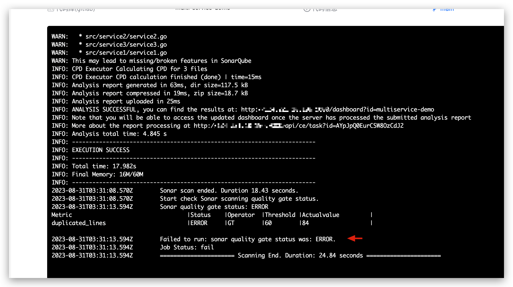
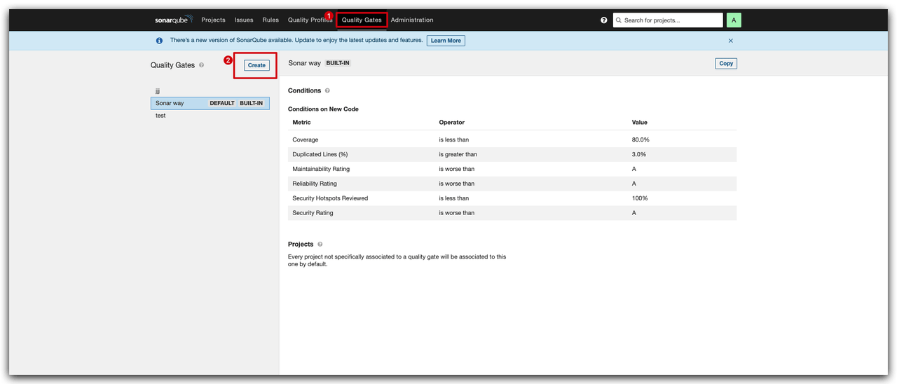
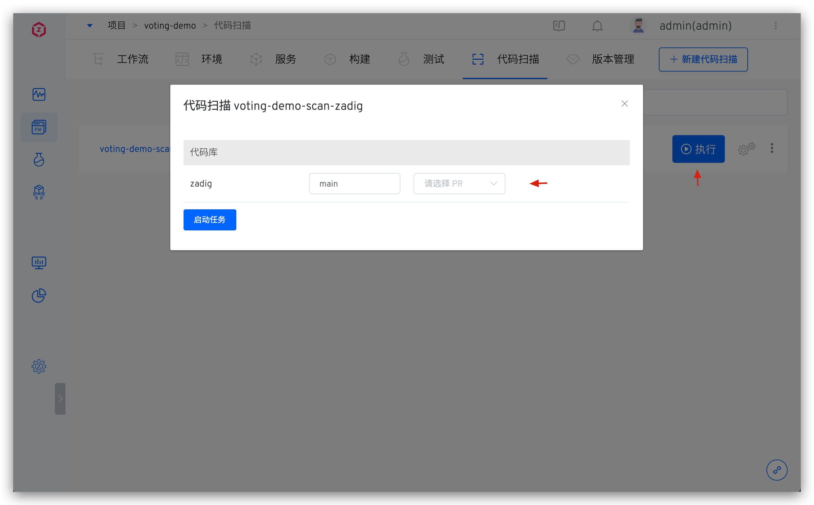
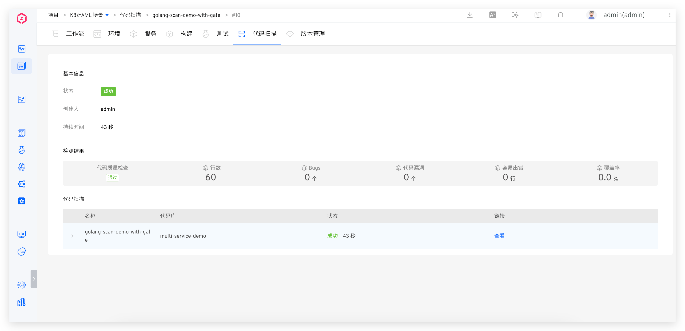

This article primarily introduces how to use Zadig's code scanning feature. Currently, the following functionalities are supported:

- Supports code scanning for all programming languages
- Supports using SonarQube and custom tools within Zadig for code scanning
- Supports configuring quality gate checks based on SonarQube scan results
- Supports one-click navigation to the Sonar system to analyze code scan results
- Supports code scanning for multiple code repositories
- Supports automatically triggering code scanning based on code changes
- Supports notifying the code scanning results to DingTalk, Enterprise WeChat, and Feishu

## Create a New Code Scan

Visit the project -> Code Scanning, click `新建代码扫描` and fill in the configuration.




### Basic Information

- `名称`: The name of the code scan, no duplication is allowed under the same project
- `扫描工具`: You can specify `SonarQube` or `其他`
- `基础设施`: Supports executing code scanning tasks on Kubernetes and hosts
- `扫描环境`: The specific runtime environment when executing the code scanning task
    - If you use the `SonarQube` tool for code scanning, the system has a built-in environment `sonar` that supports this tool. Select `sonar`
    - If you use other tools for code scanning, you can refer to [自定义镜像](/en/Zadig%20v3.4/settings/custom-image/) and add as needed
- `依赖的软件包`: When using the `SonarQube` tool for code scanning, you can configure this item to specify various software package tools needed during the scanning process, such as different versions of Java, Go, Node, etc
    - When selecting software packages, pay attention to the dependencies between multiple software packages and install them in the correct order. For example: Govendor depends on Go, so select Go first, then Govendor
    - The platform has some common software packages built-in. If you have other software packages or version requirements, the system administrator can configure the installation scripts in [软件包管理](/en/Zadig%20v3.4/settings/app/)
- `Sonar 地址`: This item must be configured when using the `SonarQube` tool for code scanning
    - You need to integrate Sonar into the system in advance. Refer to the documentation: [Sonar 集成](/en/Zadig%20v3.4/settings/sonar/)
    - When the code scanning is completed, Zadig will upload the results to the specified system


### Code Information
Configure code information for code scanning. When the code scanning is executed, the code will be pulled according to the specified configuration. For supported code sources, please refer to the document [code source information](/en/Zadig%20v3.4/settings/codehost/overview/#function-compatibility-list) . For specific fields in the code information, please refer to the document [code information field description](/en/Zadig%20v3.4/project/build/#%E4%BB%A3%E7%A0%81%E4%BF%A1%E6%81%AF) .

### Variables

Includes system-built-in variables and user-defined variables, which can be used directly in the scanning scripts.

> Tip: Add `env` commands to [the scan script](#%E6%89%AB%E6%8F%8F%E8%84%9A%E6%9C%AC) to view all build variables.

**Built-in Variables**

The built-in variables and their descriptions are as follows:

|Variable Name|Description|
|-------|---|
|`SONAR_URL`|Sonar Server access address|
|`WORKSPACE`|The working directory of the current code scan|
|`PROJECT`|Project identifier|
|`TASK_ID`|The ID of the code scan task|
|`TASK_URL`|The URL of the code scan task|
|`CI`|The value is always true and can be used as needed, such as to determine whether it is a CI script or another script|
|`Zadig`|The value is always true and can be used as needed, such as to determine whether it is executed in the Zadig system|
|`REPONAME_<index>`|1. Get the name of the code repository at the specified `<index>`<br>2. `<index>` is the position of the code in the code scanning configuration, with an initial value of 0<br>3. In the following example, using `$REPO_0` in the build script will get the name of the first code repository `voting-app`|
|`REPO_<index>`|1. Get the name of the code repository at the specified `<index>` and automatically replace the hyphen `-` in the name with an underscore `_`<br>2. `<index>` is the position of the code in the code scanning configuration, with an initial value of 0<br>3. In the following example, using `$REPO_0` in the build script will get the converted name of the first code repository `voting_app`|
|`<REPO>_PR`|1. Get the Pull Request information specified for `<REPO>` during the code scanning process. Please replace `<REPO>` with the specific code base name when using it.<br>2. When the `<REPO>` information contains a hyphen `-`, replace `-` with an underscore `_`.<br>3. In the following example, to get the Pull Request information for the `voting-app` repository, use `$voting_app_PR` or `eval PR=\${${REPO_0}_PR}`.<br>4. If multiple PRs are specified during the build, such as PR IDs 1, 2, 3, the value of the variable will be `1,2,3`.<br>5. When the code base is from the `其他` code source, this variable is not supported|
|`<REPO>_BRANCH`|1. Get the branch information specified for `<REPO>` during the code scanning process. Please replace `<REPO>` with the specific code base name when using it.<br>2. When the `<REPO>` information contains a hyphen `-`, replace `-` with an underscore `_`.<br>3. In the following example, to get the branch information for the `voting-app` repository, use `$voting_app_BRANCH` or `eval BRANCH=\${${REPO_0}_BRANCH}`|
|`<REPO>_TAG`|1. Get the Tag information specified for `<REPO>` during the code scanning process. Please replace `<REPO>` with the specific code base name when using it.<br>2. When the `<REPO>` information contains a hyphen `-`, replace `-` with an underscore `_`.<br>3. In the following example, to get the Tag information for the `voting-app` repository, use `$voting_app_TAG` or `eval TAG=\${${REPO_0}_TAG}`|
|`<REPO>_COMMIT_ID`|1. Get the Commit ID information specified for `<REPO>` during the code scanning process. Please replace `<REPO>` with the specific code base name when using it.<br>2. When the `<REPO>` information contains a hyphen `-`, replace `-` with an underscore `_`.<br>3. In the following example, to get the Commit ID information for the `voting-app` repository, use `$voting_app_COMMIT_ID` or `eval COMMIT_ID=\${${REPO_0}_COMMIT_ID}`.<br>4. When the code base is from the `其他` code source, this variable is not supported|
|`<REPO>_ORG`|1. Get the organization/user information specified for `<REPO>` during the code scanning process. Please replace `<REPO>` with the specific code base name when using it.<br>2. When the `<REPO>` information contains a hyphen `-`, replace `-` with an underscore `_`.<br>3. In the following example, to get the organization/user information for the `voting-app` repository, use `$voting_app_ORG` or `eval ORG=\${${REPO_0}_ORG}`|

**Custom Variables**

Explanation:

- Supports string, single-choice, and multiple-choice type variables.
- You can set string type variables as sensitive information, and the value of sensitive variables will not be output in the scan log.

### Scan Script
Configure the scan script as needed to scan the code.


### SonarScanner Scan

In `添加步骤`, you can configure SonarScanner Scan. `sonar.host.url` and `sonar.login` do not need to be configured, as the system will automatically inject them when performing a code scan. For more parameter configurations, refer to the [SonarQube documentation](https://docs.sonarqube.org/latest/analysis/analysis-parameters/).



### Advanced Configuration



Explanation:
- `质量门禁检查` : Reference document [quality access control inspection](#%E8%B4%A8%E9%87%8F%E9%97%A8%E7%A6%81%E6%A3%80%E6%9F%A5)
- `扫描结果导出`: Configure the scan report path
- `超时时间`: If the scan does not complete within the set time threshold, it will be considered a timeout failure
- `缓存配置`: After enabling the cache, the cache directory configured here will be used when the code scan is executed
- `集群选择`: Select the cluster resource used when the code scan task runs. The local cluster refers to the cluster where the Zadig system is located. You can refer to [集群管理](/en/Zadig%20v3.4/pages/cluster_manage/) to integrate more cluster resources
- `操作系统规格` : Configure resource specifications for executing code scanning tasks. The platform provides four configurations for high / Medium / Low / Lowest. In addition, you can also customize according to actual needs. If you need to use GPU resource, resource configuration form is `vendorname.com/gpu:num` , please refer to the document [scheduling for more information GPU](https://kubernetes.io/zh-cn/docs/tasks/manage-gpus/scheduling-gpus/)
- `调度策略` : Select the cluster scheduling policy, use `随机调度` policy by default. Please refer to the document [to set the scheduling policy](/en/Zadig%20v3.4/pages/cluster_manage/#%E8%AE%BE%E7%BD%AE%E8%B0%83%E5%BA%A6%E7%AD%96%E7%95%A5) management.
- `输出变量` : Output the environment variables in the code scan, which can realize variable transfer between different tasks in the workflow, and [variable transfer](/en/Zadig%20v3.4/project/common-workflow/#%E5%8F%98%E9%87%8F%E4%BC%A0%E9%80%92) in reference document
- `触发器与通知` : Configure Webhook Event, automatically trigger code scanning task execution, configuration details reference: [triggers and notifications](#%E8%A7%A6%E5%8F%91%E5%99%A8%E4%B8%8E%E9%80%9A%E7%9F%A5)

### Triggers and Notifications

#### Triggers

> Please refer to the supported code source: [Code source information](/en/Zadig%20v3.4/settings/codehost/overview/#function-compatibility-list)



Parameter Description:

- `代码库` : That is, the code library in [the code information](#%E4%BB%A3%E7%A0%81%E4%BF%A1%E6%81%AF) configuration
- `目标分支`: The branch that listens to the code change event
- `触发事件`: Specify the Webhook event that triggers the code scan to run. The available events are as follows:
    - `Push commits` event (Merge operation) triggered
    - `Pull requests` Triggered when submitting a pull request
    - `Push tags` Triggered after creating a tag
- `自动取消`: If checked, when multiple Webhook events trigger code scanning tasks in sequence, the system will automatically cancel the task in the queue
- `文件目录` : When the specified file or directory changes (new / / delete), a code scan is triggered, using the following code repository file structure example:

``` bash
├── reponame  # 仓库名称
  ├── Dockerfile
  ├── Makefile
  ├── README.md
  ├── src
    ├── service1/
    ├── service2/
    └── service3/
```
| Trigger Scenario | File Directory Configuration |
|----|------------|
| All file updates|`/`|
| All file updates except *.md|`/`<br>`!.md`|
| All file updates except those in the service1 directory | `/`<br>`!src/service1/`|
| All file updates in the service1 directory | `src/service1/` |
| File updates in the src directory (except those in the service1 directory)|`src`<br>`!src/service1/`|

#### Notification

Supports notifying the code scanning execution results to DingTalk, Enterprise WeChat, Feishu Platform, email, and Webhook. For configuration, refer to the documentation [通知](/en/Zadig%20v3.4/workflow/im/).



## Quality Gate Check

> Supported when the scan tool is SonarQube.

In the advanced configuration, enable the quality gate check. After enabling, Zadig will obtain the quality gate rules from SonarQube. If the quality gate fails, the task status will be set to failed. It will also return the specific rules and rule judgment results



To set rules, go to the SonarQube system and modify or add the Quality Gate configuration.



## Execute Code Scanning

Select the specific code scan -> Click `执行` to scan the code in the specified branch or tag.



When the code scanning task is completed, you can click the link to quickly jump to the SonarQube system to view the results.

> This feature is supported when using the `SonarQube` tool for code scanning.




For more best practices, refer to [Sonar 扫描最佳实践](/en/Zadig%20v3.4/sonar-scan/practice/).