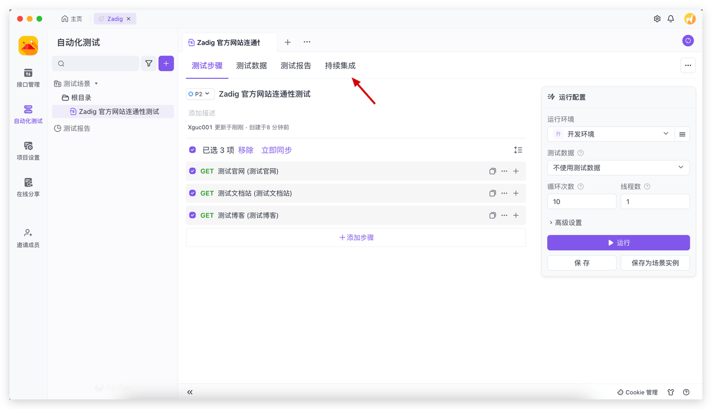
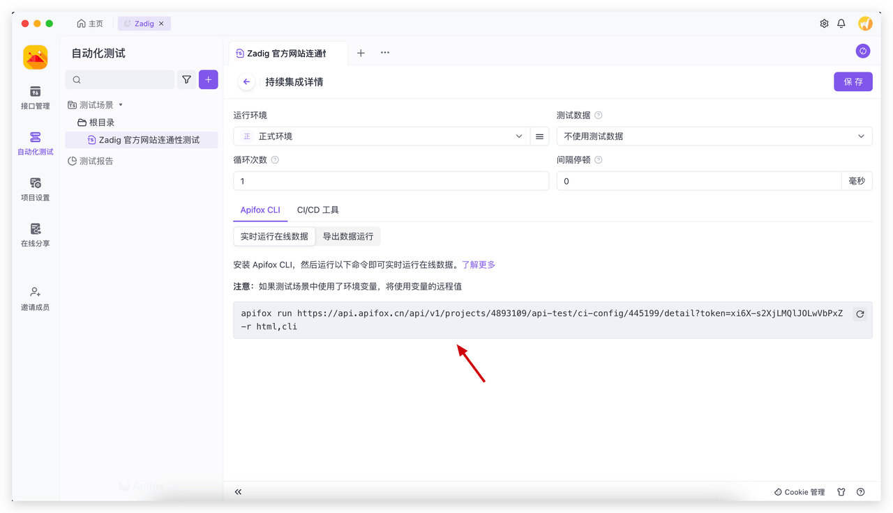
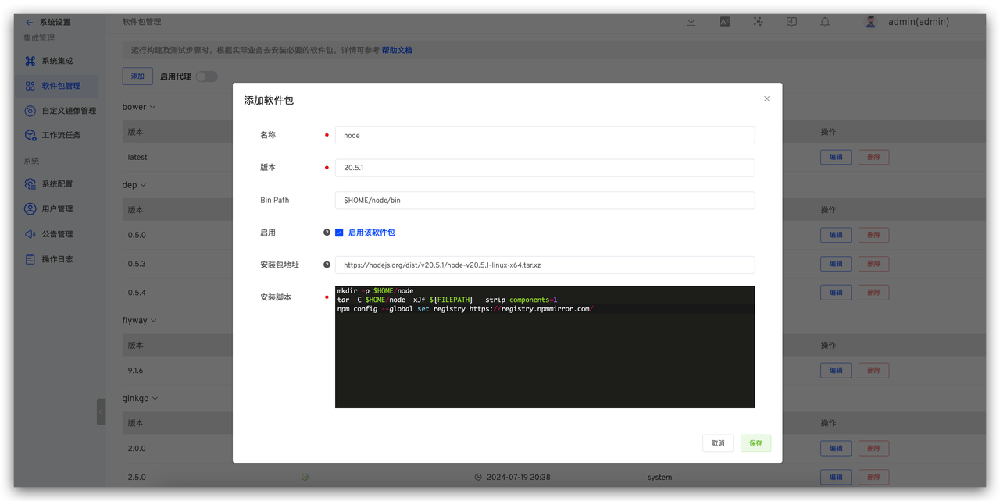
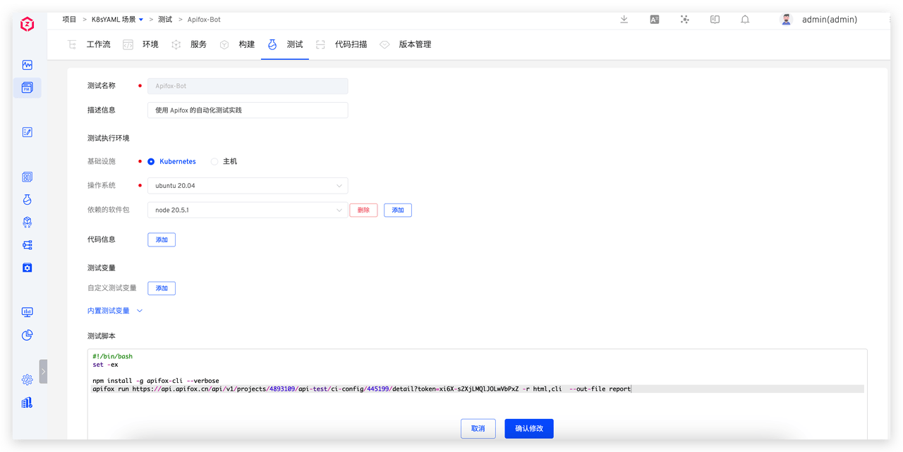
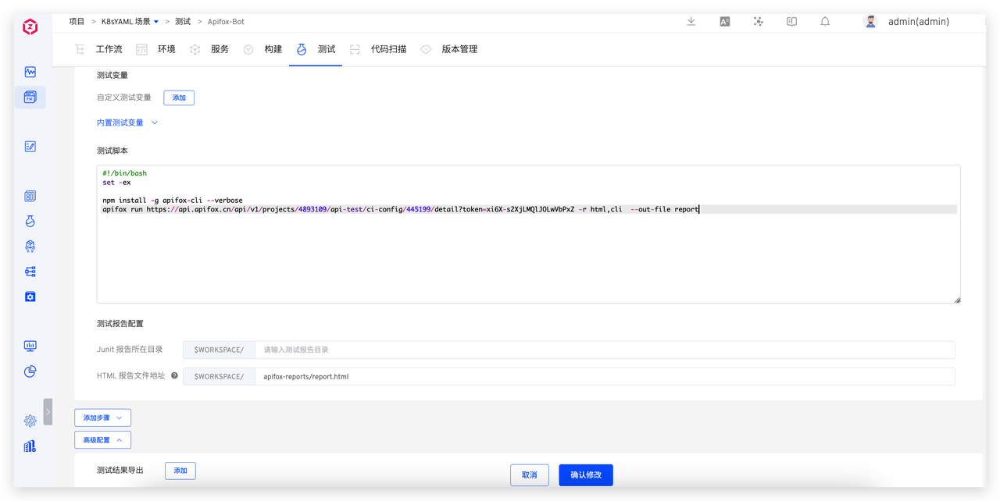
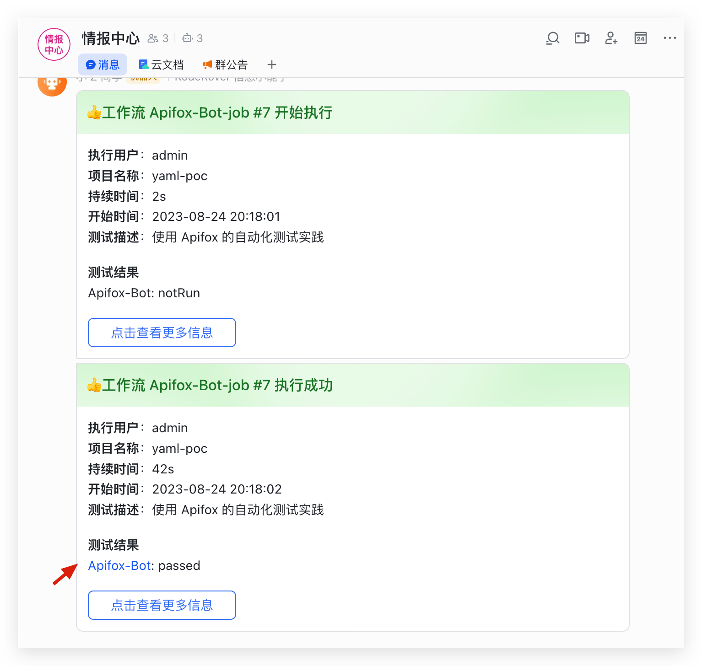
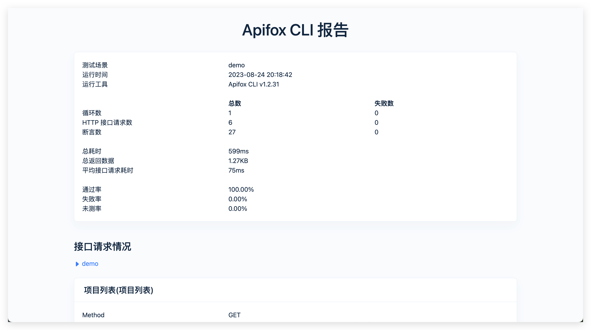
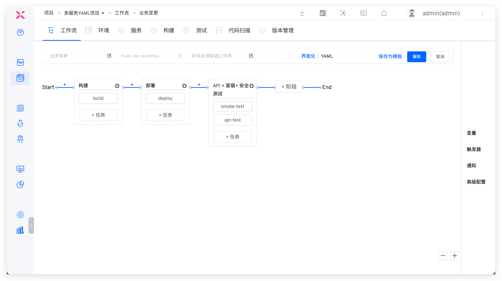
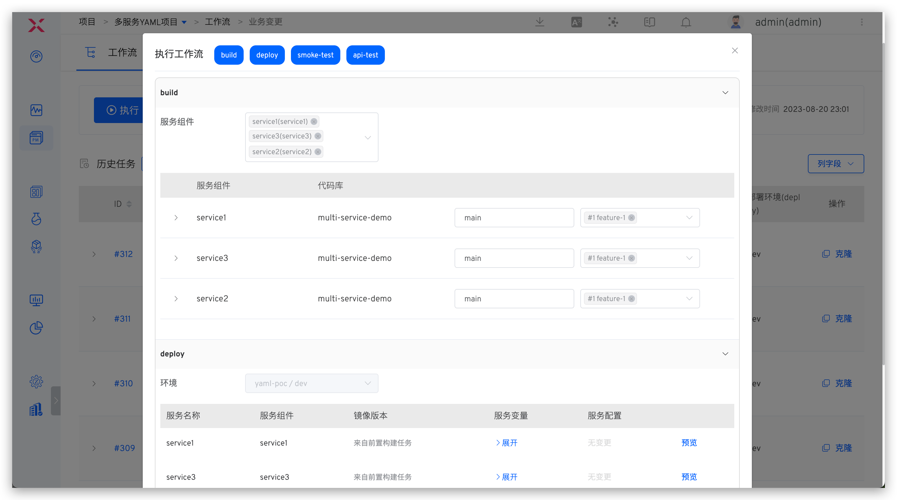
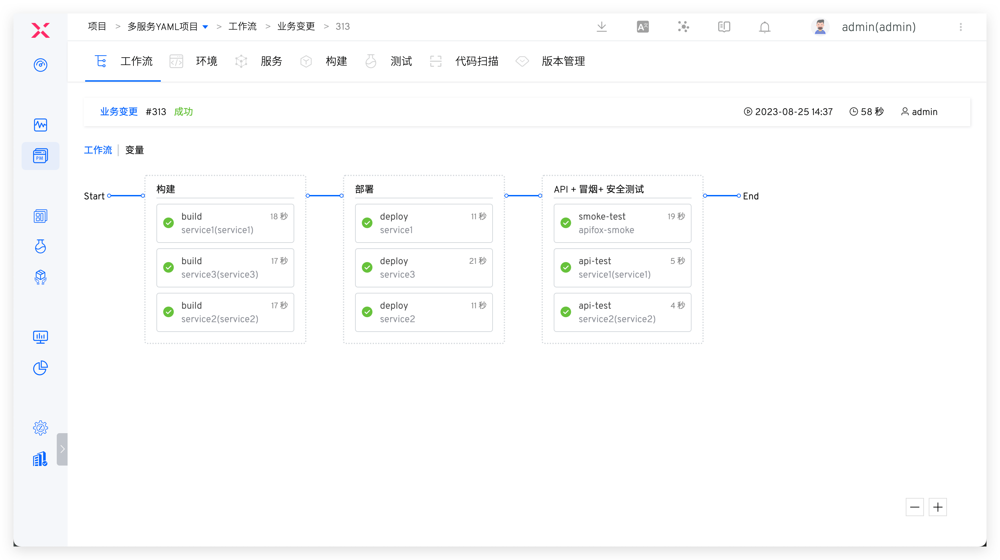

This article primarily explains how to integrate the Apifox test platform with Zadig, execute automated tests, analyze test reports, and leverage Zadig's environment capabilities to shift testing left, empowering other roles to participate in quality assurance and effectively reducing the cost of identifying and fixing issues.

## Apifox Integration

### Step 1: Configure Continuous Integration in Apifox

Access Apifox Automated Test -> Continuous Integration, add a new continuous integration configuration and save the Apifox CLI command.




### Step 2: Configure Node.js in Zadig

Zadig system administrators can access system settings -> Integration Management -> Package Management, and add a new package.



The specific configuration is as follows:
- `Name` : `node`
- `Version` : `20.5.1`
- `Bin Path` : `$HOME/node/bin`
- `Package address` : `https://nodejs.org/dist/v20.5.1/node-v20.5.1-linux-x64.tar.xz`
- `Install Script` : The content is as follows

``` bash
mkdir -p $HOME/node
tar -C $HOME/node -xJf ${FILEPATH} --strip-components=1
npm config --global set registry https://registry.npmmirror.com/
```

### Step 3: Configure the Test in Zadig

Enter the project's test module, click `Create Test` to complete the test configuration.





Configuration instructions:
- Dependent packages: select node 20.5.1
- Test script: Apifox Continuous Integration CLI, with the addition of --out-file=report, as shown below
```bash
#!/bin/bash
set -ex

npm install -g apifox-cli --verbose
apifox run https://api.apifox.cn/api/v1/projects/4893109/api-test/ci-config/445199/detail?token=xi6X-s2XjLMQlJOLwVbPxZ -r html,cli  --out-file report
```

- Html report file path: `$WORKSPACE/apifox-reports/report.html`

**Notification**

Reference Documentation: [Notification Configuration](/en/Zadig%20v3.4/project/test/#%E9%80%9A%E7%9F%A5%E9%85%8D%E7%BD%AE) .

## Automated Test Execution

Executing a Zadig test will automatically trigger Apifox to run automated tests. After the Zadig test is successfully executed, the execution status will be notified in the IM. The example using Feishu is as follows.



## Test Report Analysis

Click the test result link in the IM notification to view and analyze the test report.



## Test Left Shift

Configure workflows to orchestrate build, deployment (development environment), and test tasks. Refer to the documentation: [Workflows](/en/Zadig%20v3.4/project/common-workflow/).



After completing the feature development, submit a code change PR and select the PR change to execute the workflow, which will deploy the development environment and run automated tests. This allows you to identify and fix quality issues early in the development process.


