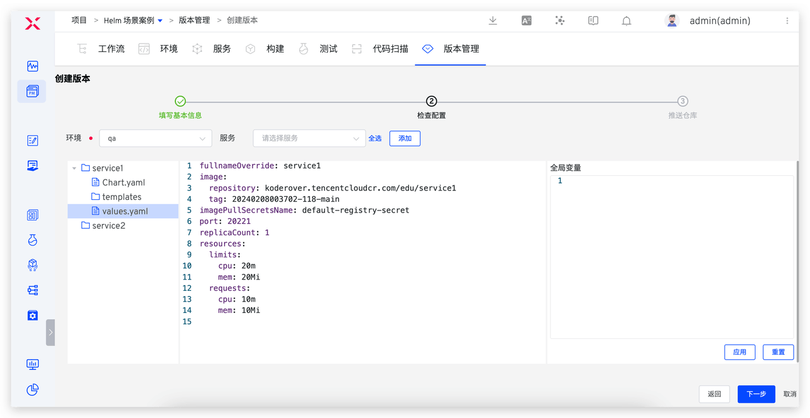
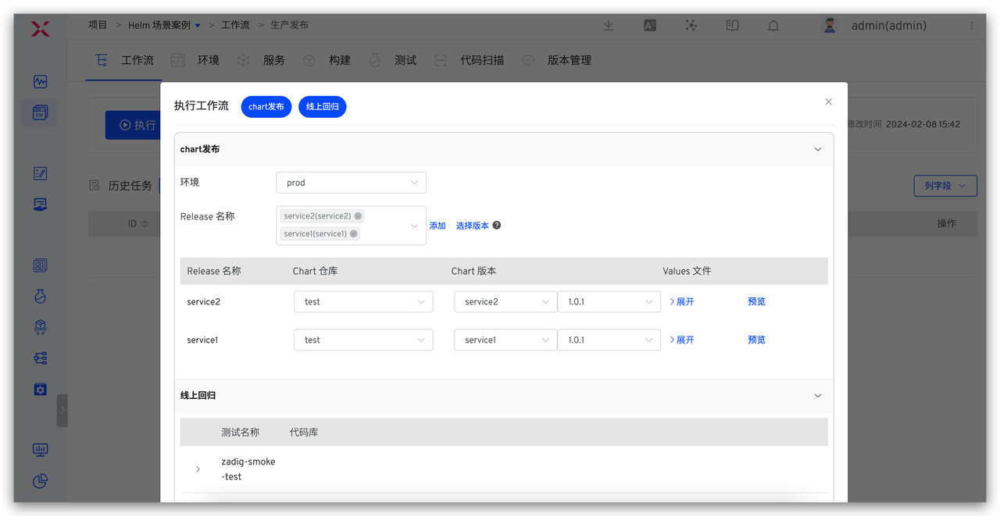

This article will explore how to achieve efficient version management and release through the Zadig platform, providing a stable and efficient delivery process for the team.

## Overview of the Core Delivery Process

1. After the engineer completes the code writing, they deploy the code to the development environment for self-testing and joint debugging.
2. In the test environment, integration tests and system tests are conducted on the submitted features to verify the quality and effectiveness of the version.
3. After all verifications are completed, the production environment version is released.

During this process, the validity and quality of the version are usually confirmed by the test engineer. Therefore, the test engineer can directly complete the version packaging and then hand it over to the release engineer or the R&D person in charge for production environment release.
Next, we will introduce how to create a complete version and perform specific operation steps for production environment release in Zadig's K8s YAML project and Helm Chart project, respectively.

## K8s YAML Project Release Scenario

### Step 1: Create a Version

- Enter the K8s YAML Project -> `Version`, click `Create`, and enter the version creation process.

- Step 1: Fill in the basic version information, including the version name, version label, and version description.

- Step 2: Select the environment and service, and preview and confirm the service configuration.

- Step 3: Select the image repository and fill in the image version as needed.

- After clicking "Complete," the selected service images will be pushed to the corresponding repository.
- Click the version in the version management list to view specific delivery information, including the workflow tasks for creating the version, the delivered image information, package information, service configuration, and startup sequence, etc.

### Step 2: Publish the Version

- Execute the production release workflow, select the version in the "Deployment" task, and update all service images contained in the version to the specified environment.

> The production release workflow is configured in advance by the administrator and includes steps such as "Deployment," "Testing," and "Manual Approval." 
> If the "Service Configuration" change is enabled in the deployment task, the "Service Filtering" option is supported. When enabled, only services that already exist in the environment will be deployed

## K8s Helm Chart Project Release Scenario

### Step 1: Create a Version

- Enter the Helm Chart Project -> `Version`, click `Create`, and enter the version creation process.

- Step 1: Fill in the basic version information, including the version name, version label, and version description.

- Step 2: Select the environment and services, and make minor modifications to the selected service configuration to meet the production environment service configuration needs.

If you need to uniformly modify the variable values in all service values files, you can use `Global Variables`. As shown in the figure below, fill in the global variable and click `Apply`. The corresponding variable values in all service values files will be uniformly modified to the values set in `Global Variables`.

- Step 3: Select the repository to push the delivery items, and fill in the Chart version number as needed, and configure the image version.

- After clicking "Complete," the selected service configuration (Chart) and images will be pushed to the corresponding repository.
- Click the version to view the version details, including the downloadable full Chart information, image information, etc., as shown in the figure below.

### Step 2: Publish the Version

- Execute the production release workflow, select the version in the "Helm Chart Deployment" task, and update all Charts included in the version to the specified environment.

> The production release workflow is configured in advance by the administrator and includes steps such as "Helm Chart Deployment," "Testing," and "Manual Approval."

Overall, Zadig provides efficient solutions for version management and release processes. Through version creation and workflow-based version release functions, the transparency and controllability of the release process are enhanced. Engineers can easily create versions on the Zadig platform and quickly view version details and perform release tasks through the platform, effectively managing product version releases. This integrated version management and release process not only improves team productivity but also helps reduce risks during the release process and ensures the stability and quality of product delivery.