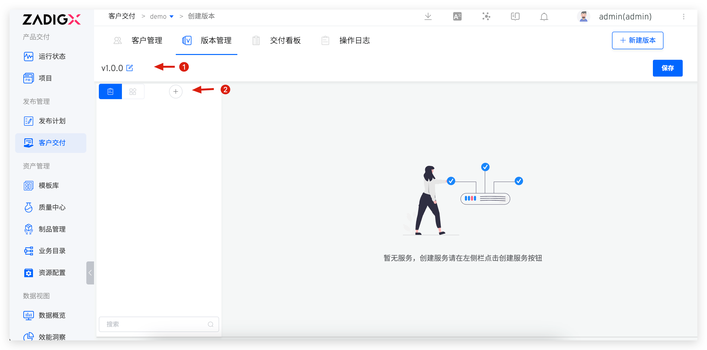

This article primarily outlines the specific operations suppliers should perform during customer delivery.

## Create a New Project

Click the `Create` option to input the relevant project information
- Project Name: This cannot be modified later
- Project Primary Key
- Description
Click `Confirm` to complete the project creation.

## Add a Client Group

1. Enter the client module
2. Click `Add Customer Group`, input the client group name, and click `Confirm` to complete the client group creation.

## Create a Client

1. Enter the client module
2. Click `Create Customer` to input the client information
    - Client Name
    - Specified Client Group
    - Authorization Credential Type:
        - Internal Use: For internal testing
        - Trial: For trial clients
        - Paid: For paid clients
    - Authorization Credential Expiration Time: After this time, the client console will no longer receive new versions provided by the supplier

## Create a Version
::: warning Prerequisites
1. You need to install the Chart package and push it to the Helm Chart repository
2. Integrate the Helm Chart repository in Zadig. For specific integration methods, refer to [here](/en/Zadig%20v3.4/settings/helm/)
:::

1. Enter the version module
2. Click `Create Version` to configure the version information
    1. Select the Chart repository and the corresponding Chart version
    2. Configure client-specific variables: Expose a limited number of configurations for users to set the appropriate variable values based on their environment during installation
    3. Helm Release Name Configuration: The release name used during deployment
    4. Configure `Installation Requirements` according to the actual resource requirements of the application. The following information can be configured:
        1. Kubernetes Minimum Version
        2. Number of Kubernetes Nodes
3. Click `Confirm` to complete the version creation

## Push Version

1. Enter the version module
2. Click `Push Version`, select the client group to push to, and fill in the Release Notes
3. Click `Confirm` to complete the version push

## Copy the Console Installation Script

The client console needs to be installed in the customer environment. The installation method can be obtained as follows:
1. Enter the `Customer` module
2. The client's console installation script can be copied from the location shown in the figure

## Download the Authorization Certificate

1. Enter the `Customer` module
2. Click the download icon to obtain the authorization certificate