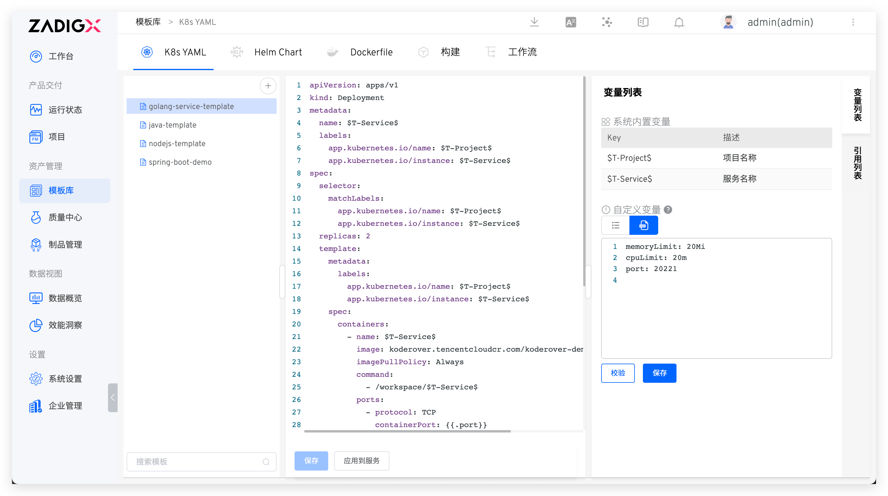
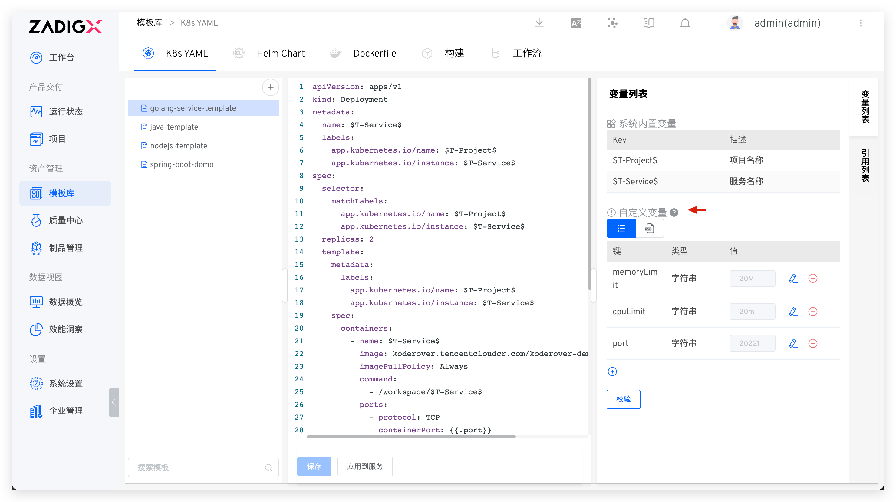
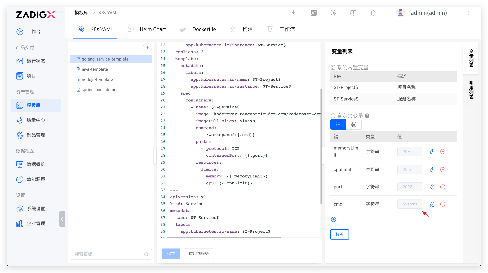
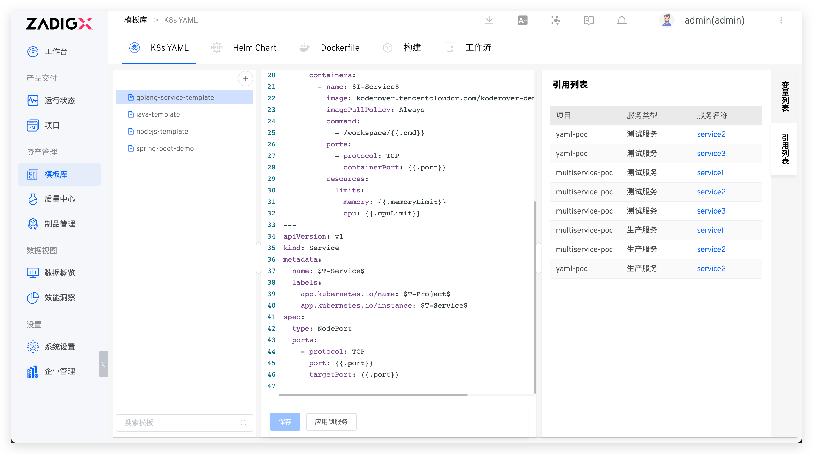
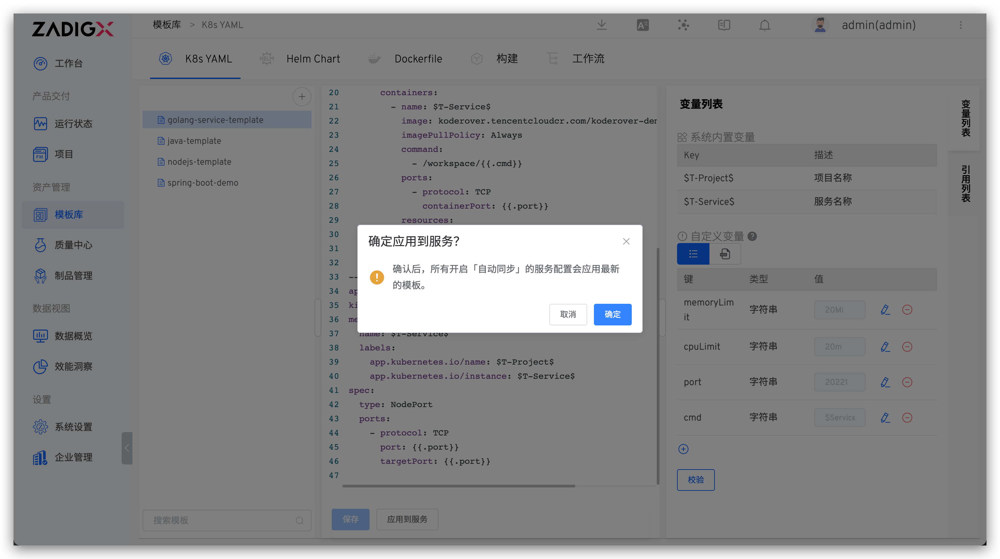

::: tip Background
</img> The K8s YAML template is suitable for projects deployed with K8s YAML. It supports users in creating new services on a common template, providing greater scalability.
:::

## New Template

> You can abstract the YAML configuration file of K8s resources and define the service based on the K8s YAML template when creating a new service in the project.

- Navigate to `Assets` → `Templates` → `K8s YAML` to enter the management page of the K8s YAML template library. Click the `+` button → enter the template name → fill in the template content → save the template.



If you use custom variables in the template, you can configure the default values of variables in the custom variable area on the right. For more information, refer to [the variable list](#variable-list).



## Variable List

The variable list includes both system-built-in variables and custom variables. Click the key-value pair or YAML file icon below the custom variable to switch the variable view. You can modify the type and default values of the service variables and verify their correctness. It supports four types: string, single choice, boolean, and YAML.

- `System Built-in Variables`: Includes `$T-Project$` and `$T-Service$`, which can be used directly in the K8s YAML template. After creating a new service based on a template in the project, these variables will be automatically replaced with the corresponding project name and service name.
- `Custom Variables`: Declare them in the form of a YAML code segment and use them in the template in the form of <span v-pre>`{{.key}}`</span> or Go template.

::: tip
1. When creating a new service based on a template in a project, you can modify the default values of the custom variables
2. The key of a custom variable does not support hyphens
3. For the use of Go template, refer to the [official documentation](https://pkg.go.dev/text/template#hdr-Examples)
:::

In addition to supporting the use of constant values, it also supports using built-in variables in [the service configuration](/en/Zadig%20v3.4/project/service/k8s/#variables-configuration) to assign values to custom variables in templates. For example, in the following example, using `$Service$` to assign values to `cmd`.



## Using Templates
When creating a new service in [the K8s YAML project](/en/Zadig%20v3.4/project/k8s-yaml/), you can choose to import services from templates, and refer to [using templates to create a new service](/en/Zadig%20v3.4/project/service/k8s/#create-a-new-service).

## View the Citation List

Click the `Reference List` on the right side of the K8s YAML template to view the list of projects and services that reference the template.



## Apply to the Service

Click `Apply to Service` to update all service configurations with `Automatic Synchronization` enabled using the latest template content and custom variables.

::: tip
1. Turn on the `Automatic Synchronization` operation for the service. Refer to [the use template to create a new service](/en/Zadig%20v3.4/project/service/k8s/#create-a-new-service)
2. When custom variables are changed, the update logic for service configuration refers to [the update service configuration](/en/Zadig%20v3.4/project/service/k8s/#update-a-service-using-a-new-template)
:::



## Example

### K8s YAML Template

```YAML
apiVersion: apps/v1
kind: Deployment
metadata:
  name: $T-Service$
  labels:
    app.kubernetes.io/name: $T-Project$
    app.kubernetes.io/instance: $T-Service$
  annotations:
{{.annotations}}
spec:
  selector:
    matchLabels:
      app.kubernetes.io/name: $T-Project$
      app.kubernetes.io/instance: $T-Service$
  replicas: {{.replicas_num}}
  template:
    metadata:
      labels:
        app.kubernetes.io/name: $T-Project$
        app.kubernetes.io/instance: $T-Service$
    spec:
      containers:
        - name: $T-Service$
          image: ccr.ccs.tencentyun.com/koderover-public/$T-Service$:latest
          imagePullPolicy: Always
          env:
            - name: DOWNSTREAM_ADDR
              value: "b"
            - name: HEADERS
              value: "x-request-id"
            {{- if .skywalking}}
            - name: ENHANCE
              value: "true"
            {{- end}}
          command:
            - /workspace/{{.cmd}}
          ports:
          {{- range .ports_config}}
            - protocol: {{ .protocol }}
              containerPort: {{.container_port}}
          {{- end}}
          resources:
            limits:
              memory: {{.memory_limit}}
              cpu: {{.cpu_limit}}
```

### Custom Variables

```yaml
cmd: $Service$
cpu_limit: 50m
memory_limit: 50Mi
replicas_num: 1
skywalking: true
value: value
ports_config:
  - protocol: TCP
    container_port: 20221
  - protocol: UDP
    container_port: 21221
annotations: |1-
    owner: "John Doe"
    team: "DevOps"
```