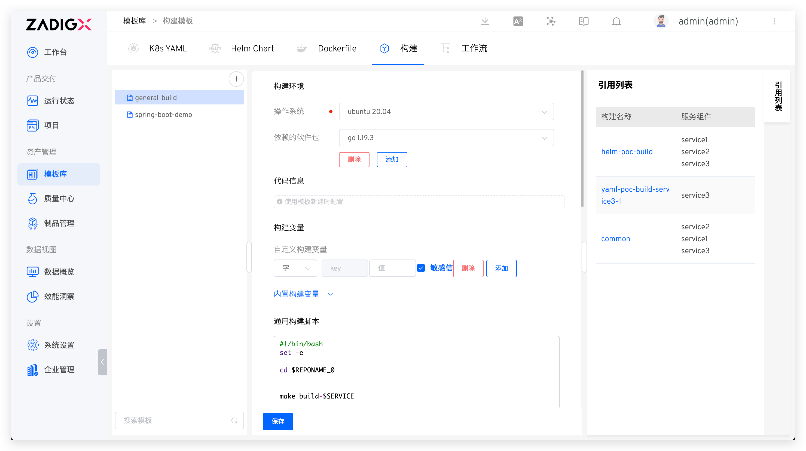

::: tip Background
Extract the build configuration of the service into a template. When creating a service, you can choose to create it based on the template. This is suitable for scenarios where the build configuration is the same for a large number of services.
:::

## New Template

Navigate to `Assets` → `Templates` → `Build` to enter the build template management page. Click the `+` button, enter the template name, and refer to [Build Configuration](/en/Zadig%20v3.4/project/build/) to complete the configuration of the build template.

> The `Code Information` section in the template does not need to be configured. It can be configured when creating a build for a service using the build template.



::: tip Tips
Combining the use of build variables `$REPONAME_<index>` can cleverly complete the configuration of the build template. For example, if the service's source code and compilation configuration are in repository A and the Dockerfile is in repository B, the scripts in the build configuration can be organized as follows:

```bash
#!/bin/bash
set -ex

cd $WORKSPACE/$REPONAME_0/service/
cp $WORKSPACE/$REPONAME_1/dockerfiles/$SERVICE.Dockerfile .
make build
docker build -t $IMAGE -f $SERVICE.Dockerfile .
docker push $IMAGE
```

When creating a build using a build template, simply follow the steps to configure the corresponding code repository.
:::

## Using Templates

Refer to [Using Build Templates](/en/Zadig%20v3.4/project/build/template/).