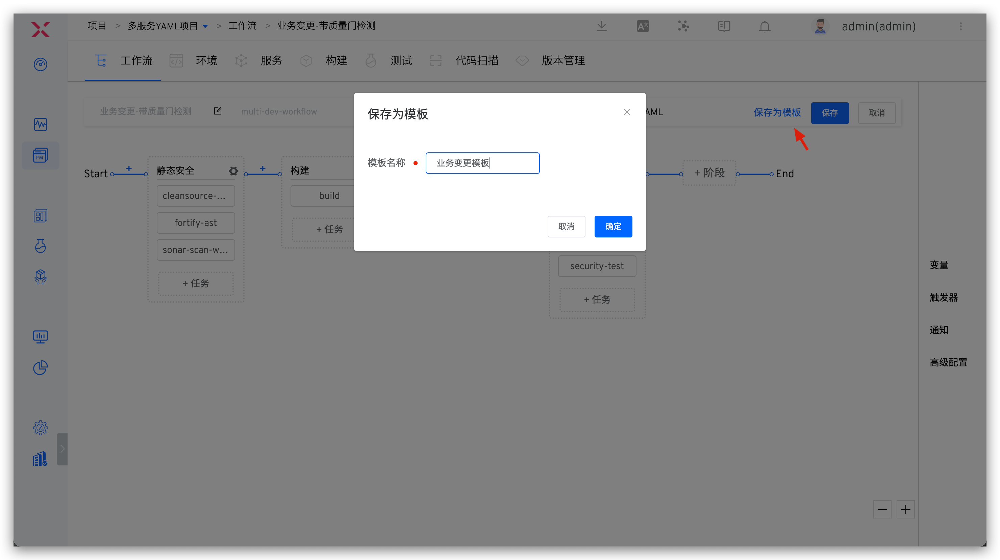

The workflow template enables users to design multiple processes covering development, testing, and production release based on specific project needs, thereby standardizing and streamlining the project delivery process.

## New Template
### Create in the Template Library
Navigate to `Assets` -> `Templates` -> `Workflow` in sequence, click `+Workflow Template`, fill in the template name and content, and save it.
> The workflow template name must be unique throughout the system.

### Save an Existing Workflow as a Template
Edit the workflow, click `Save as Template` and define the template name in the pop-up window. After confirmation, the workflow will be saved as a template.

> When saving as a template, ensure the template name is unique.

## Using Templates

To create a new workflow, you can manually configure it or use a workflow template with one click.

The enterprise templates are those created by users. Additionally, the system provides a large number of built-in templates that can be selected based on actual needs to achieve rapid workflow configuration.

::: tip
Built-in templates are not visible in the template library and cannot be modified or deleted.
:::