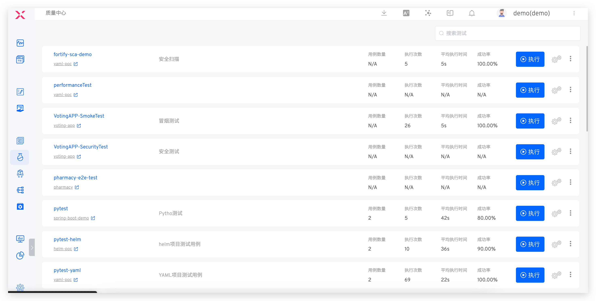
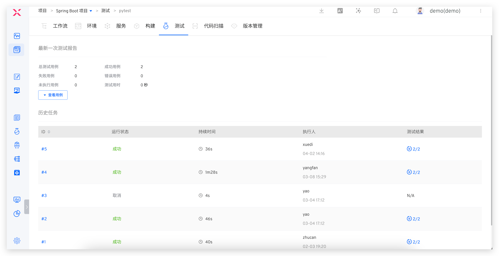

The Quality Center provides a test set board for the entire system, offering a global overview of the total number of test cases, execution counts, average execution time, success rate, and more for all projects. It also provides quick access to execute, configure, and delete tests.

Click on a specific test set to view the results of its latest execution and the historical task list.

Click the link in the test results to view the test report and quickly filter and analyze failed test cases.

