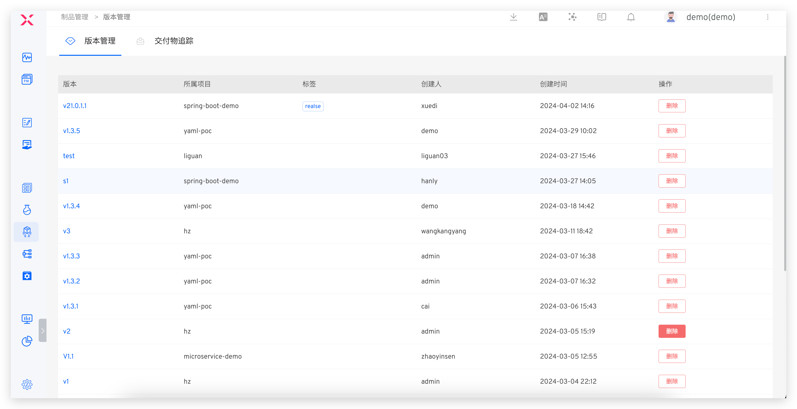
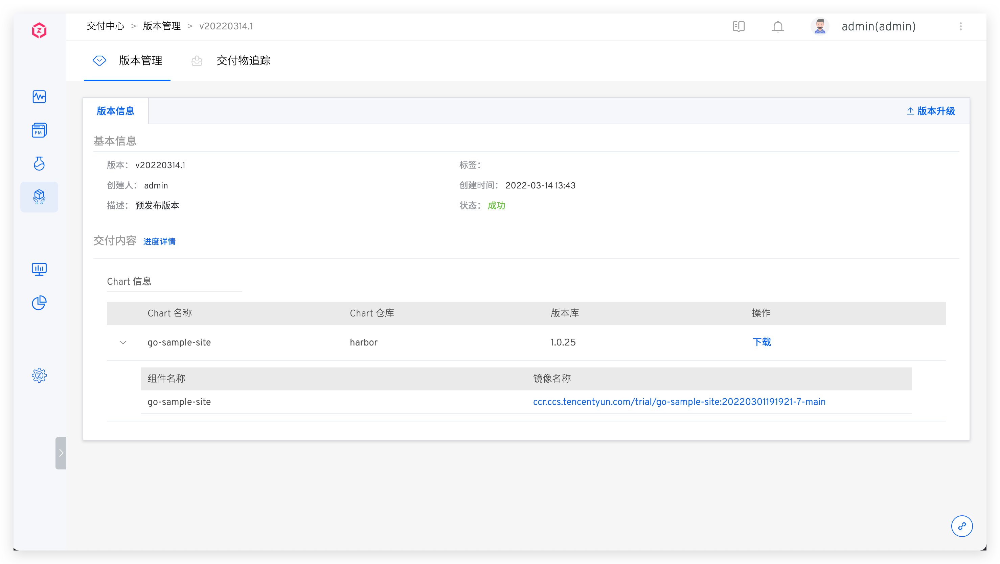

- In the version management of the Delivery Center, a version dashboard for the entire system is provided, allowing a global overview of version information in K8s YAML projects and K8s Helm Charts.

- Click on a specific version to view its details.

  - K8s YAML Project Version Details: Includes basic information such as service images and startup sequences. You can view the service configurations.

  

  - K8s Helm Chart Project Version Details: Includes a complete, downloadable Chart configuration.

  

- For more detailed descriptions of version management, refer to [Version Management](/en/Zadig%20v3.4/project/version/).