This article describes how to integrate an image repository on the Zadig system. Zadig supports integrating standard image repositories provided by cloud vendors or self-built image repositories, as well as mainstream image repository management platforms such as Harbor, DockerHub, Jfrog, Nexus, etc. The image repository is primarily used to store the images generated from builds and pre-release images, which are involved in the execution of workflows and the startup of environments.

## Add a Image Registry

Click `Assets` -> `Image Registry` -> `Add` and select the corresponding provider as needed

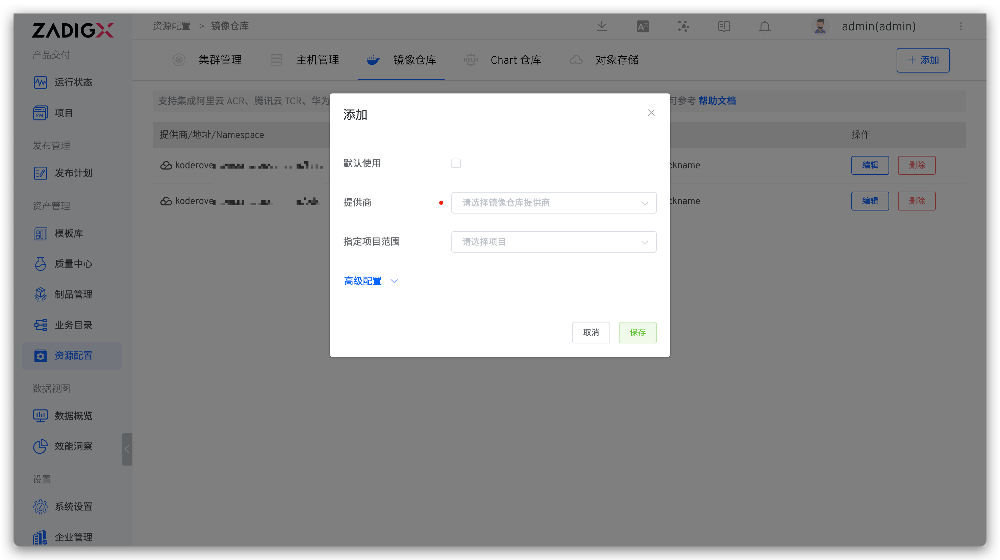

Parameter Description:

- `Default Use`: If set to `Default Use`, the image repository will be used by default when creating a new environment
- `Provider`: Supports Alibaba Cloud ACR, Huawei Cloud SWR, Tencent Cloud TCR, Harbor, DockerHub, Amazon ECR, and other Registry standard integrations
- `Specify Project Scope`: Specifies which projects can use the image repository. `All Projects` includes all projects created after the image repository is added

Advanced Configuration:

- `Enable SSL Verification`: Can disable SSL verification. After disabling, the system will inject the image address into `insecure-registry`.
- `TLS Certificate Content (Public Key)`: If the image repository is configured with a self-signed TLS/SSL certificate, the certificate public key content must be configured to function properly.

::: warning Modify Enable SSL Verification and TLS Certificate Content (Public Key) configuration
1. Modifying the configuration will cause the Zadig service to restart, which may affect the execution of workflows. Therefore, it is recommended to configure this when no workflows are running.
2. After modifying the configuration, if the cross-cluster build feature is used and the cluster is directly connected, the configuration will take effect only after the cluster components are updated.
:::

### Alibaba Cloud ACR (Personal Edition)

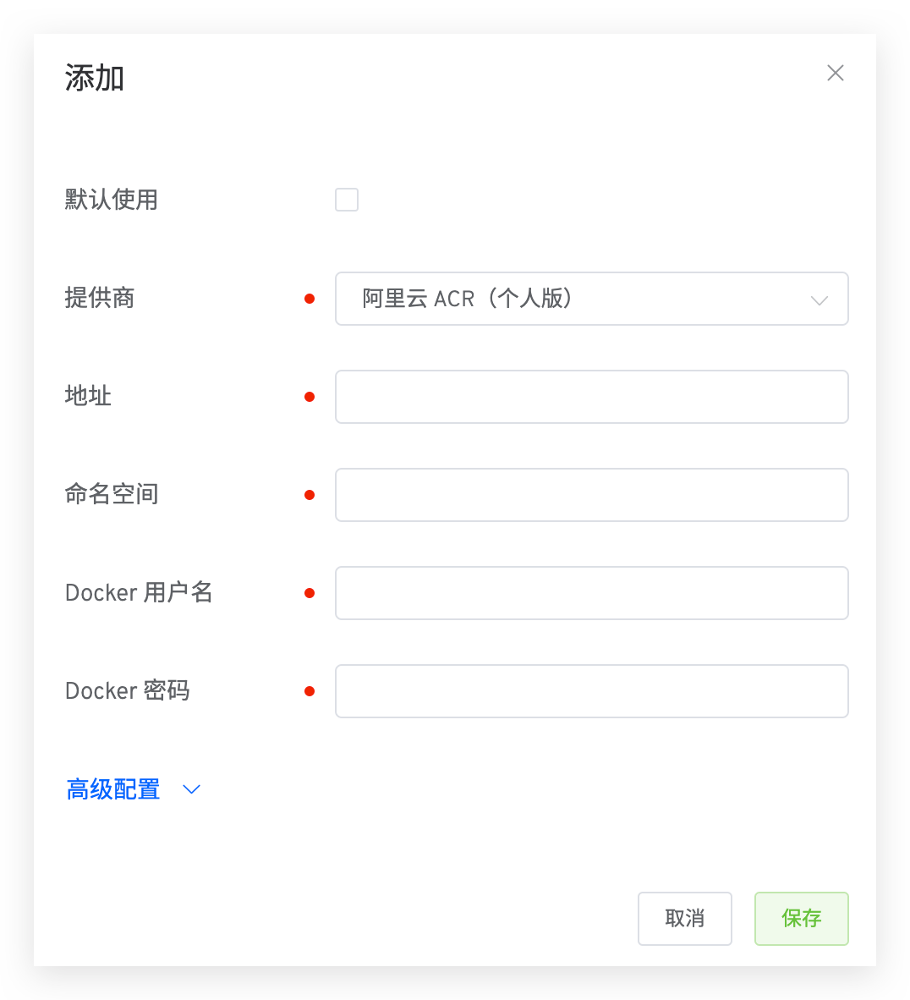

Parameter Description:

- `Address`: Mirror warehouse address, such as: [http://registry.cn-shanghai.aliyuncs.com](http://registry.cn-shanghai.aliyuncs.com)
- `Namespace`: The namespace of the image repository, similar to the organization concept in DockerHub. For more information, see [Namespace](https://www.alibabacloud.com/help/zh/container-registry/latest/manage-namespaces)
- `Docker Username`: Docker username for logging into the image repository
- `Docker Password`: Docker password for logging into the image repository

### Alibaba Cloud ACR (Enterprise Edition)

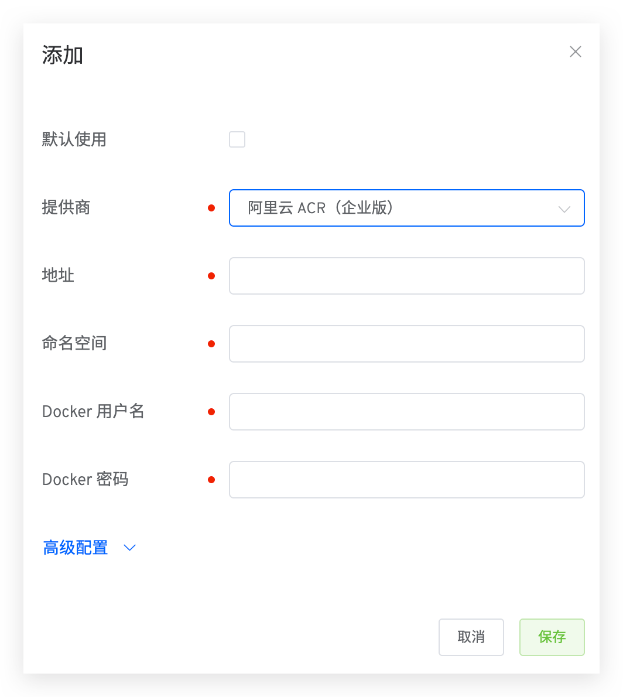

Parameter Description:

- `Address`: Mirror warehouse address, such as: [http://registry.cn-shanghai.aliyuncs.com](http://registry.cn-shanghai.aliyuncs.com)
- `Namespace`: The namespace of the image repository, similar to the organization concept in DockerHub. For more information, see [Namespace](https://www.alibabacloud.com/help/zh/container-registry/latest/manage-namespaces)
- `Docker Username`: Docker username for logging into the image repository
- `Docker Password`: Docker password for logging into the image repository

### Tencent Cloud TCR (Personal Edition)

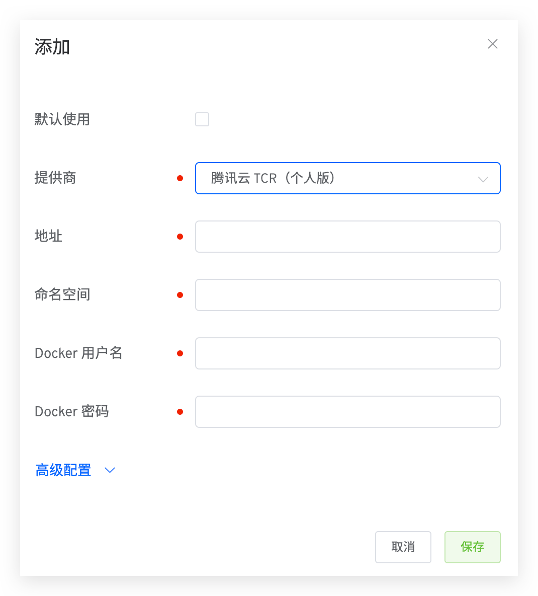

Parameter Description:

- `Address`: Mirror warehouse address, such as: [https://koderover-zadig.tencentcloudcr.com](https://koderover-zadig.tencentcloudcr.com)
- `Namespace`: Namespace of the mirror repository, similar to the organization concept in DockerHub. For more information, see [Namespace](https://cloud.tencent.com/document/product/1141/39295#M)
- `Docker Username`: Docker username for logging into the mirror repository
- `Docker Username`: Docker username for logging into the image repository

### Tencent Cloud TCR (Enterprise Edition)

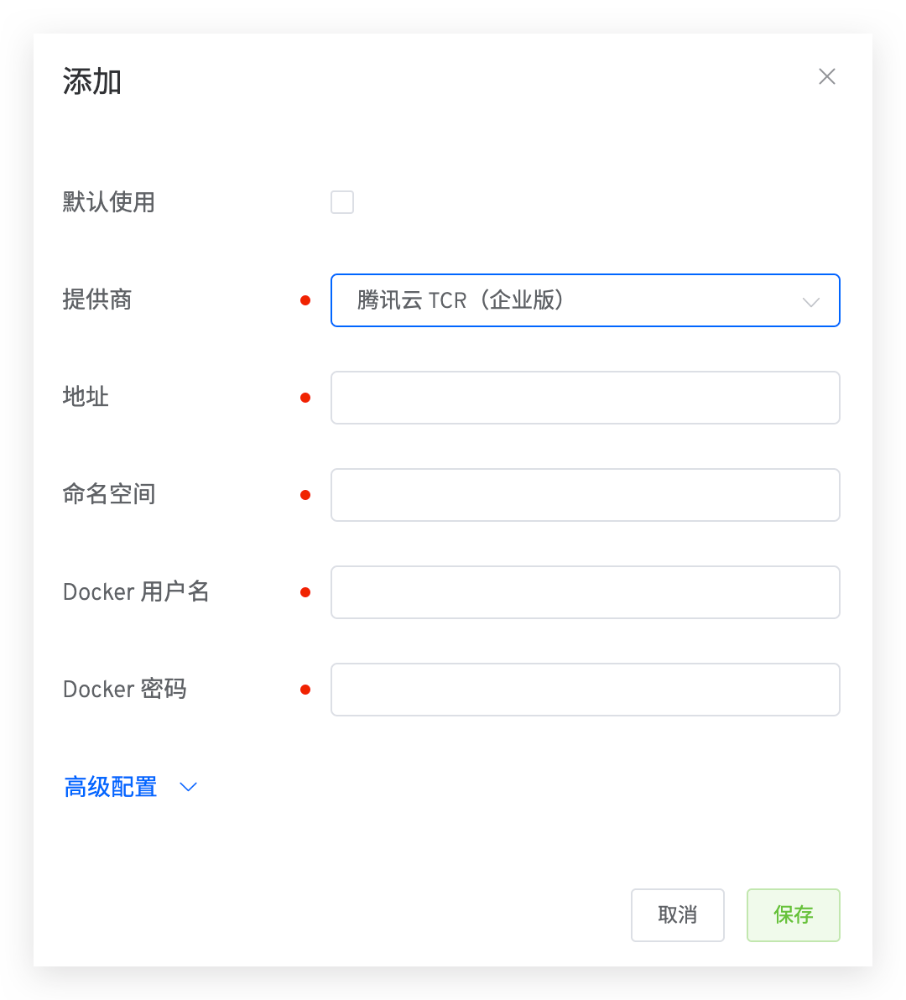

Parameter Description:

- `Address`: Mirror warehouse address, such as: [https://koderover-zadig.tencentcloudcr.com](https://koderover-zadig.tencentcloudcr.com)
- `Namespace`: Namespace of the mirror repository, similar to the organization concept in DockerHub. For more information, see [Namespace](https://cloud.tencent.com/document/product/1141/39295#M)
- `Docker Username`: Docker username for logging into the mirror repository
- `Docker Username`: Docker username for logging into the image repository

### Huawei Cloud SWR

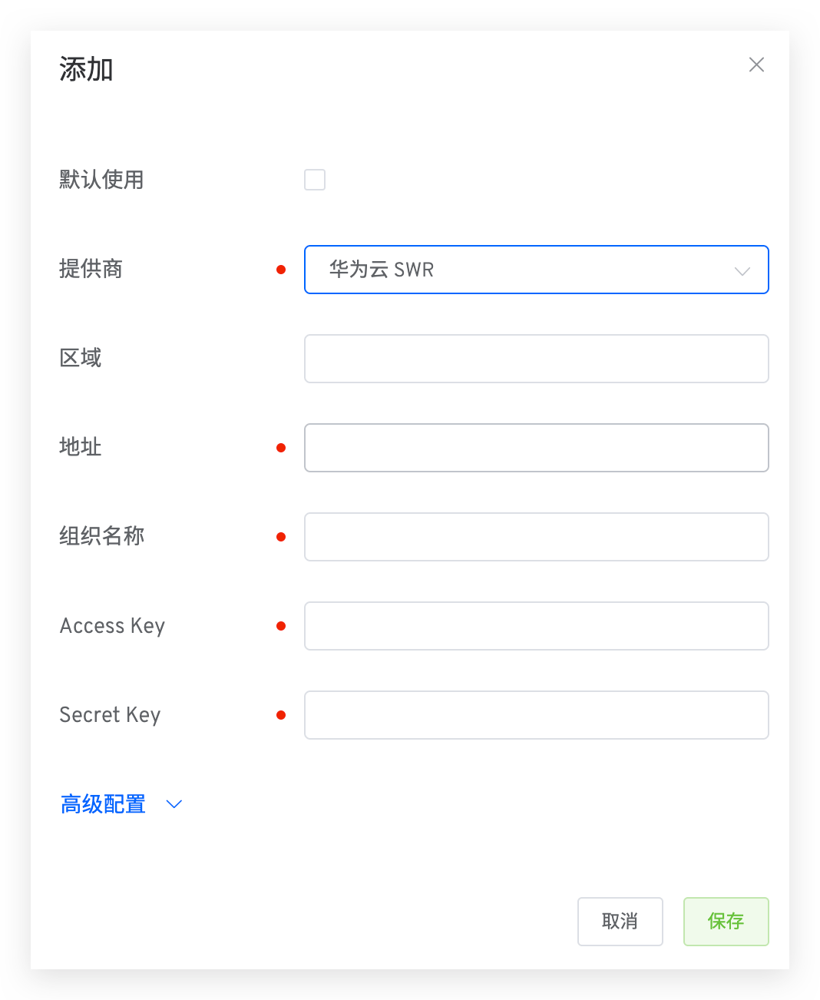

Parameter Description:

- `Region`: The area where the mirror warehouse belongs, such as Shanghai District 1, East China: cn-east-3
- `Address`: Mirror warehouse address, such as: [https://swr.cn-east-3.myhuaweicloud.com](https://swr.cn-east-3.myhuaweicloud.com)
- `Organization`: Organization to which the mirror repository belongs. For more information, see [Basic Concepts - Organization](https://support.huaweicloud.com/productdesc-swr/swr_03_0003.html)
- `Access Key`: Access Key for authentication. For more information, see [Obtaining AK/SK Access Keys](https://support.huaweicloud.com/usermanual-swr/swr_01_1000.html)
- `Secret Key`: Secret Key for authentication. For more information, see [Obtaining AK/SK Access Keys](https://support.huaweicloud.com/usermanual-swr/swr_01_1000.html)

### Amazon ECR

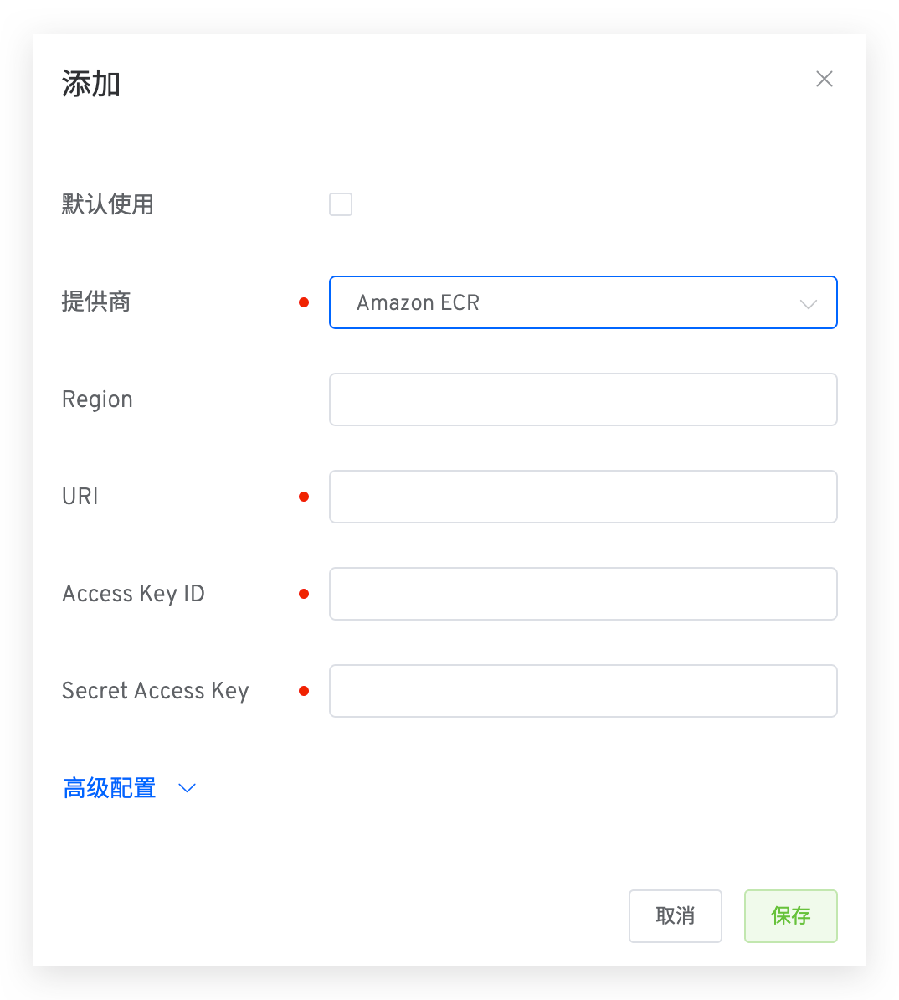

Parameter Description:

- `Region`: Supports integration with private mirror repositories. Region is the area where the mirror repository is located, for example: ap-northeast-1
- `URI` : Registry address, such as: [https://koderover-zadig.dkr.ecr.ap-northeast-1.amazonaws.com](https://koderover-zadig.dkr.ecr.ap-northeast-1.amazonaws.com)
- `Access Key ID`: Access Key ID for authentication. For more information, see [AWS KMS Concepts](https://docs.aws.amazon.com/kms/latest/developerguide/concepts.html)
- `Secret Access Key`: Secret Access Key for authentication. For more information, see [AWS KMS Concepts](https://docs.aws.amazon.com/kms/latest/developerguide/concepts.html)

### Google Cloud AR

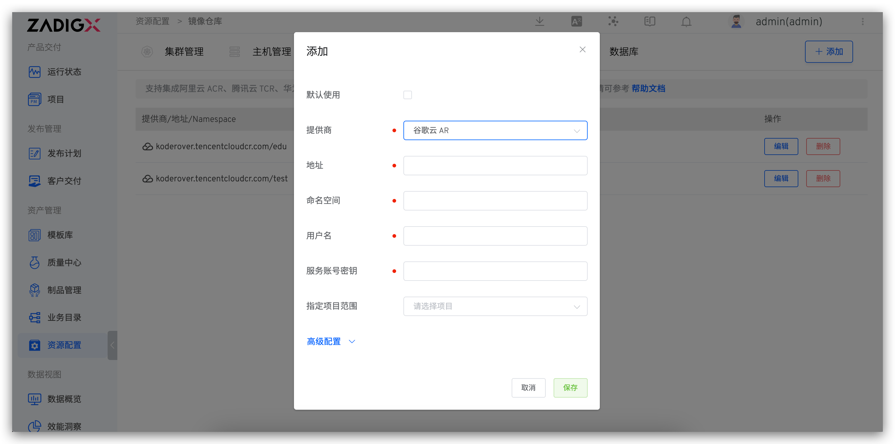

Parameter Description:
- `Address`: Registry address
- `Namespace`: Project name / Code repository name
- `Username`: Account for logging into the AR mirror repository, generally: `_json_key_base64`
- `Service Account Key`: Key for logging into the AR mirror repository. The original key needs to be base64-encoded. For more details, refer to the [official documentation](https://cloud.google.com/artifact-registry/docs/docker/authentication?hl=zh-cn#json-key)

### Harbor

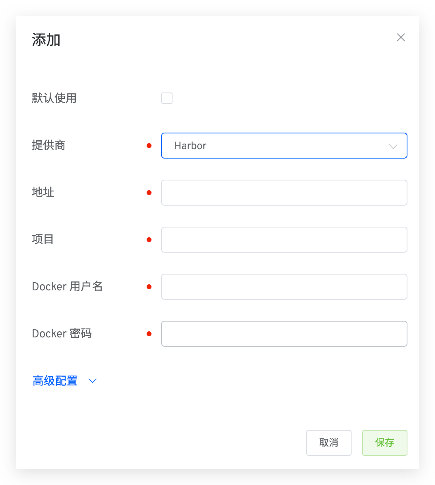

Parameter Description:

- `Namespace`: Project name or code repository name
- `Project`: Project information for the Harbor mirror repository. For more information, see [Project](https://goharbor.io/docs/2.6.0/working-with-projects/create-projects/)
- `Docker Username`: Docker username for logging into the Harbor mirror repository
- `Docker Password`: Docker password for logging into the Harbor mirror repository

### DockerHub

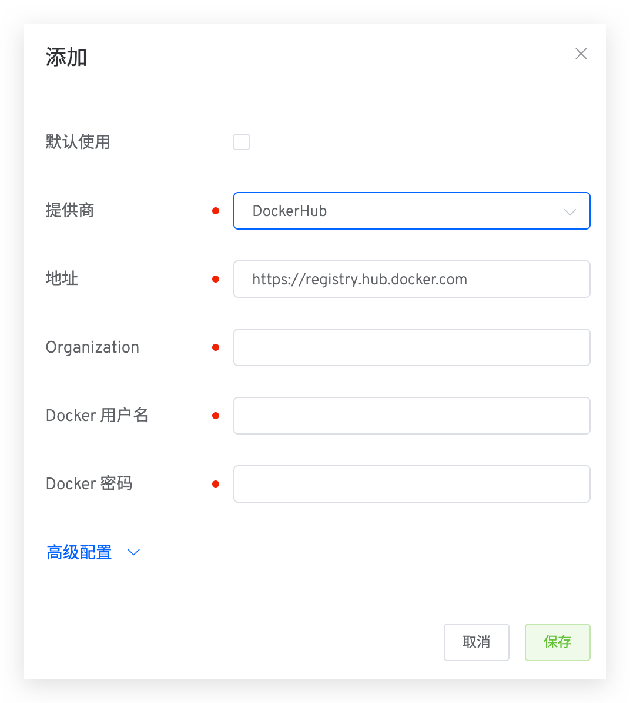

Parameter Description:

- `Address`: Registry address, such as: [https://koderover-zadig.tencentcloudcr.com](https://koderover-zadig.tencentcloudcr.com)
- `Project`: Project information for the Harbor image repository. For more information, see [Project](https://docs.docker.com/docker-hub/orgs/)
- `Docker Username`: Docker username for logging into the Harbor image repository
- `Docker Password`: Docker password for logging into the Harbor image repository

### JFrog

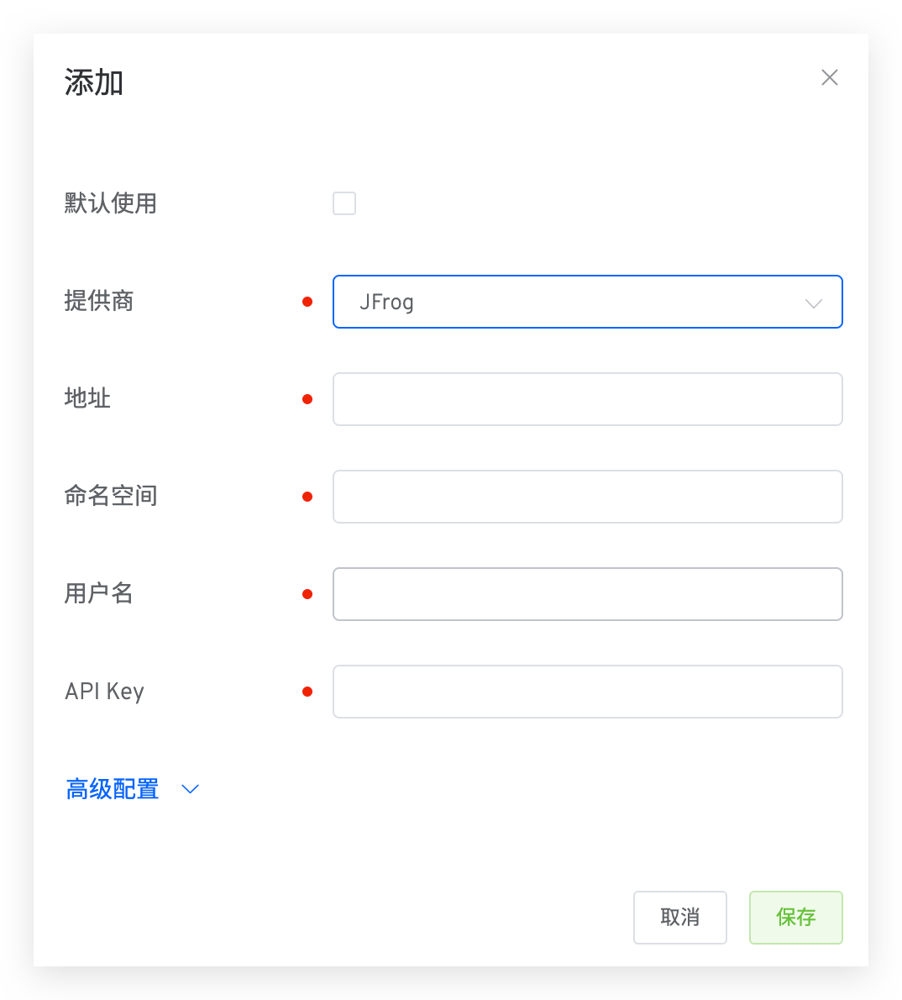

Parameter Description:

- `Address`: Registry address, such as: [https://test.jfrog.io](https://test.jfrog.io)
- `Namespace`: Organization name of the mirror repository.
- `Username`: Username for logging into JFrog.
- `Docker Username`: Docker username for logging into the image repository.

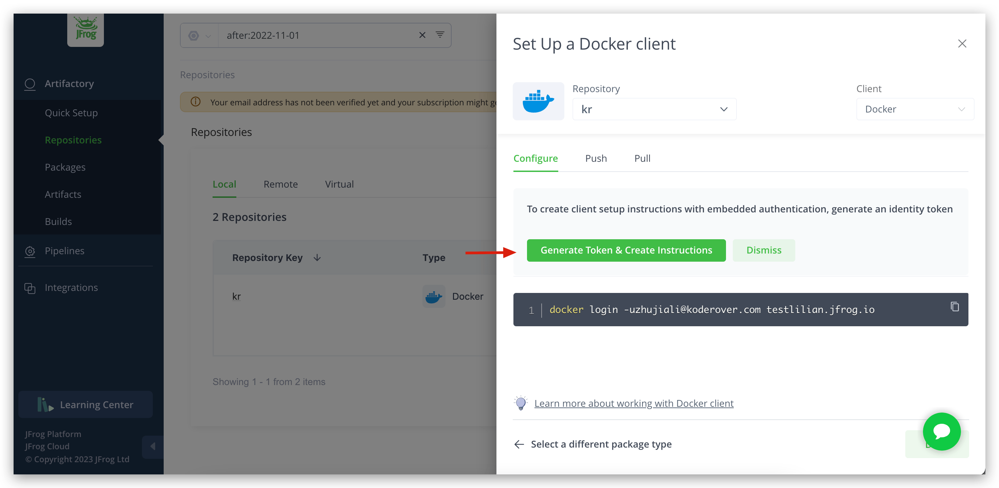

### Nexus

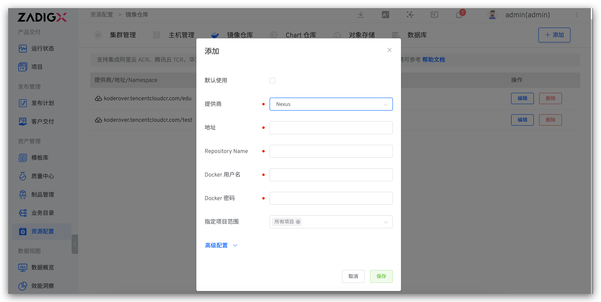
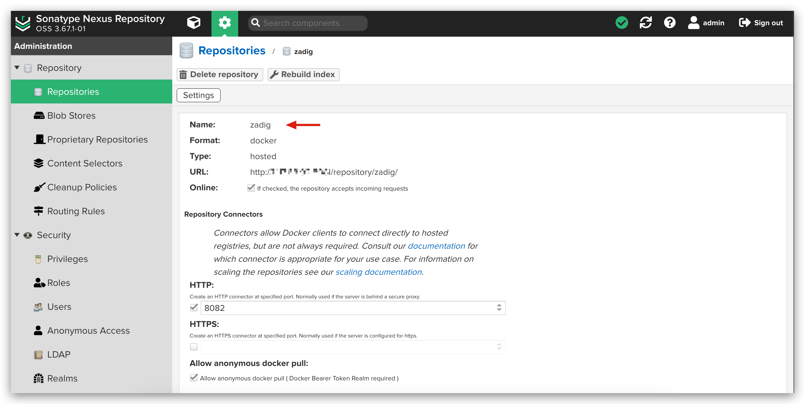

Parameter Description:

- `Address`: Registry address
- `Repository Name`: Name of the Nexus repository
- `Docker Username`: Docker username for logging into the mirror repository
- `Namespace`: The organization name of the image repository

### Other Requirements

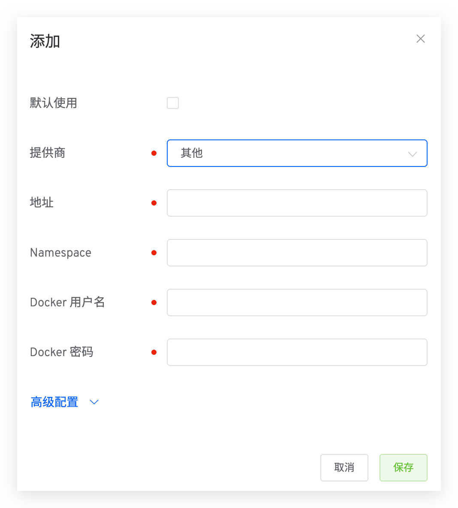

Parameter Description:

- `Address`: Registry address
- `Namespace`: Namespace of the mirror repository
- `Docker Username`: Docker username for logging into the mirror repository
- `Address`: Image repository address

## Using a Mirror Repository

**Workflow - Build**

When the workflow performs a build step, it pushes the build artifact to the specified mirror repository.

**Other Registry**

When the workflow performs a deployment step, it pulls the image from the specified mirror repository.

**Workflow - Image Distribution**

When the workflow performs an image distribution step, it pushes the artifact to the selected mirror repository in the workflow distribution configuration.

**Environment - Image Update**

In the environment, when updating a service image, it pulls the image from the specified mirror repository.