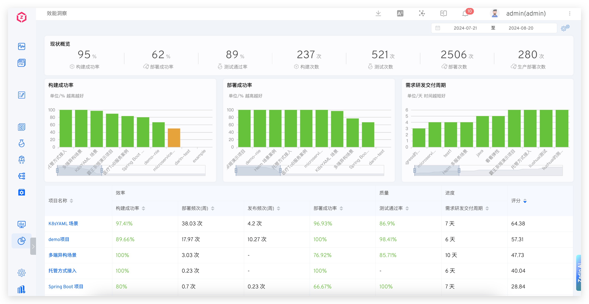
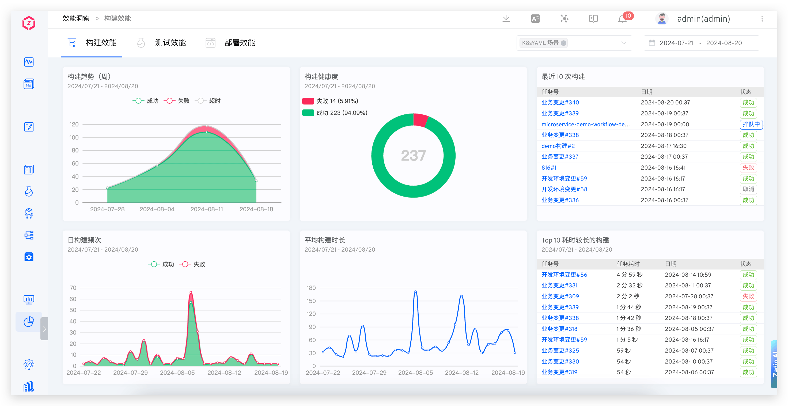
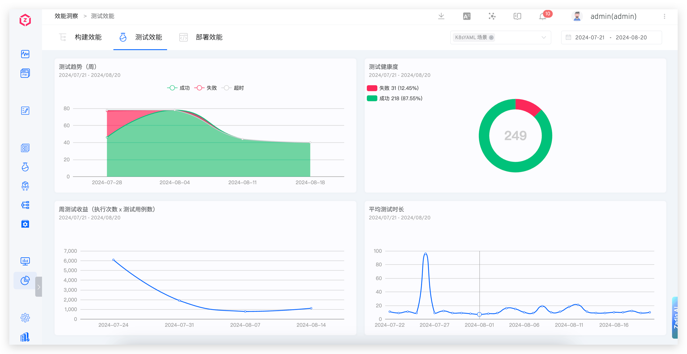
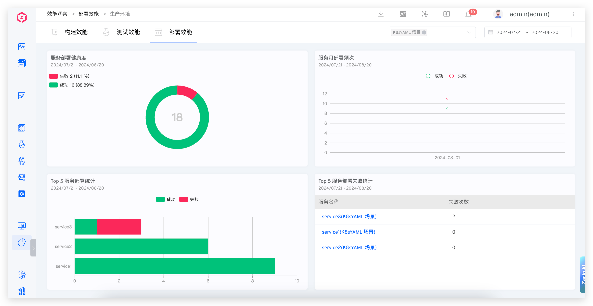
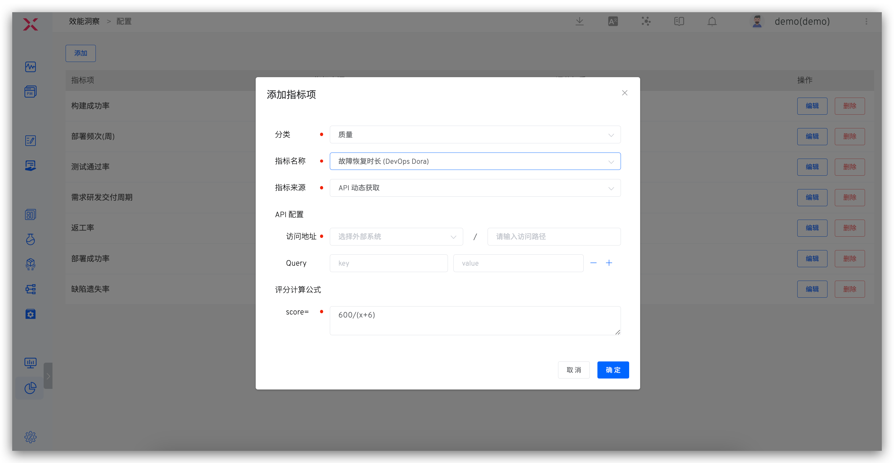
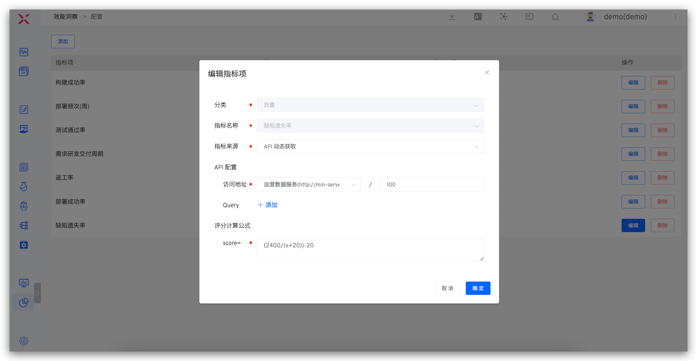

## Overview

Access the Data View -> Performance Insights to preview projects from the perspectives of efficiency, quality, and progress. Click on the project name to view the service build, deployment, and test data, which helps analyze the changes in each phase and identify performance bottlenecks.




### Build Performance

Displays the build data for the selected time and selected project, including weekly build trends, build health, daily build frequency, average build duration, the last 10 builds, and the top 10 builds with the longest duration.



- `Weekly Build Trends`: Displays the trend of the number of builds in the project on a weekly basis
- `Build Health`: The ratio of successful and failed build tasks in the project
- `Daily Build Frequency`: The number of successful and failed build tasks in the project
- `Average Build Duration`: The average daily duration of build tasks in the project
- `Last 10 Builds`: The latest 10 workflow execution records in the project
- `Top 10 Longest Builds`: The top 10 workflows with the longest duration in the project

### Test Performance

Provides insights into the trends, health, average test duration, and weekly test returns of the tests.



- `Test Trends`: Displays the trend of the number of test executions in the project on a weekly basis
- `Test Health`: The ratio of successful and failed test tasks in the project
- `Weekly Test Returns`: The number of test cases executed in the project
- `Average Test Duration`: The average daily execution time of test tasks in the project

### Deployment Performance

Provides insights into the health of microservices, weekly deployment frequency, deployment statistics, and microservice deployment failure statistics.



- `Microservice Health`: The ratio of successful and failed deployment tasks in the project
- `Monthly Microservice Deployment Frequency`: Displays the number of successful, failed, and rolled back deployments in the project on a monthly basis
- `Top 5 Microservice Deployment Statistics`: The top five services in the project based on the number of successful and failed deployments over a period of time
- `Top 5 Microservice Deployment Failure Statistics`: The top five services in the project based on the total number of failed deployments over a period of time

## Configuration

On the overview page, click the configuration icon in the upper right corner to customize performance metrics and the scoring weights for each metric.



Explanation:

- `Category`: Configurable quality / Efficiency / progress category indicators.
- `Metric Source`: Includes `Zadig Collection` and `API Dynamic Retrieval`.
    - `Zadig Collection` : Can be used to configure build / Deployment / / test success rate and average time consumption, data comes from build / deployment / release / test execution in the workflow.
    - `API Dynamic Retrieval`: Retrieves and customizes data from external systems via API configuration.
- `API Configuration`: Configures the API to retrieve data, with external system integration reference documentation: [External System](/en/Zadig%20v3.4/settings/others/).
- `Scoring Calculation Formula`: The formula for calculating the score of each metric, where the weighted scores of each metric are summed to determine the total score of the project.

For dynamically retrieving data using the API, the example of Zadig's request to fetch data is as follows:

``` bash
GET <External System>?start_time=<Unix Timestamp>&end_time=<Unix Timestamp>&project_name=<Project Identifier>&key1=value1&key2=value2...
```


Explanation:

- The request to retrieve data is a GET request
- Relevant query parameters are implemented as query strings
- start_time, end_time, and project_name do not need to be configured in the indicator items
- The external system returns JSON data, which must include data information. An example is as follows:

``` json
{
    "data": 92
}
```
## Metric Semantics

### Quality
- `Test Pass Rate`: The number of successful test executions / The total number of test executions, evaluating the delivery quality of the internal R&D process
- `Defect Escape Rate`: The number of issues found in production / The total number of defects, a standard for evaluating product quality
- `Re-work Rate`: The number of test-rejected issues / The total number of issues, evaluating the quality and efficiency of R&D delivery
- `Severe Defect Rate`: The number of high-priority defects / The total number of defects, evaluating the quality of delivery during the R&D process
- `Unit Test Pass Rate`: The number of successful unit test executions / The total number of unit test executions, evaluating the quality of R&D code
- `Unit Test Coverage`: Evaluates the proportion of code covered by unit tests
- `Change (Release) Failure Rate`: The number of rollbacks / The total number of changes, evaluating the quality of operations and maintenance online operations

### Efficiency
- `Build Success Rate`: The number of successful build executions / The total number of builds, evaluating the build efficiency during the R&D process
- `Average Build Duration`: The average duration of build tasks over a period of time, evaluating the build efficiency during the R&D process
- `Build Frequency (Weekly)`: Displays the number of builds on a weekly basis, evaluating daily change efficiency and engineering efficiency
- `Deployment Success Rate`: The number of successful deployments / The total number of deployments, evaluating the deployment efficiency during the R&D process
- `Average Deployment Duration`: The average duration of deployments over a period of time, evaluating the deployment efficiency during the R&D process
- `Deployment Frequency (Weekly)`: Displays the number of deployments on a weekly basis, evaluating daily change efficiency and engineering efficiency
- `Release Success Rate`: The number of successful releases to the production environment / The total number of releases
- `Average Release Duration`: The average duration of the release process over a period of time
- `Release Frequency (Weekly)`: Displays the number of releases on a weekly basis, evaluating delivery efficiency
- `Average Test Duration`: The average duration of tests over a period of time, evaluating testing efficiency
- `Change Lead Time`: The time from code submission to successful execution in the production environment
- `Mean Time to Recovery (MTTR)`: Evaluates the efficiency of construction and problem diagnosis

### Progress
- `Average Requirement Delivery Cycle`: The cycle from PRD review approval to production release
- `Requirement R&D Delivery Cycle`: The cycle from R&D claiming the requirement to production release