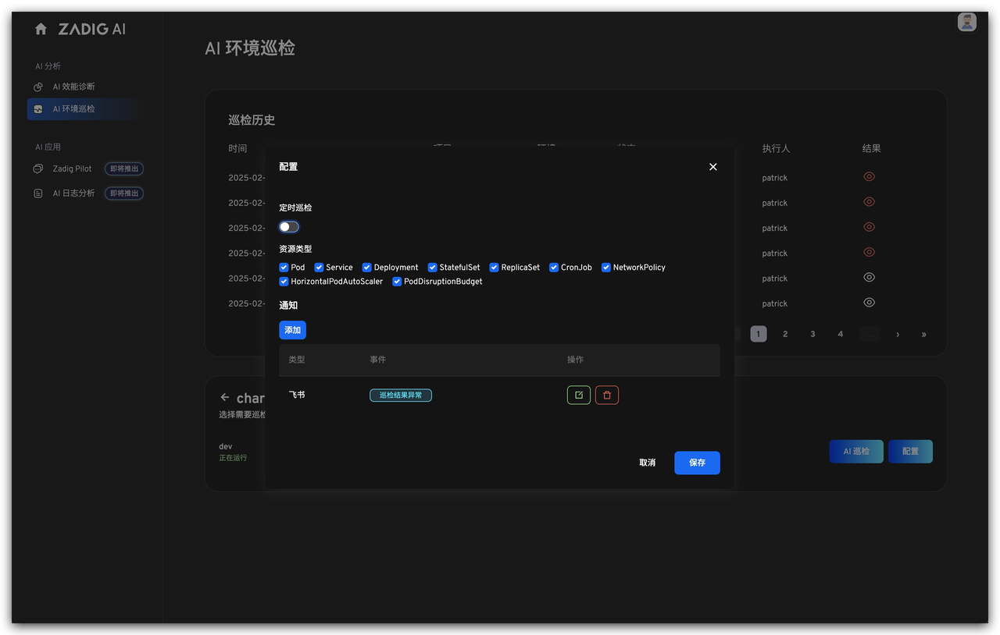
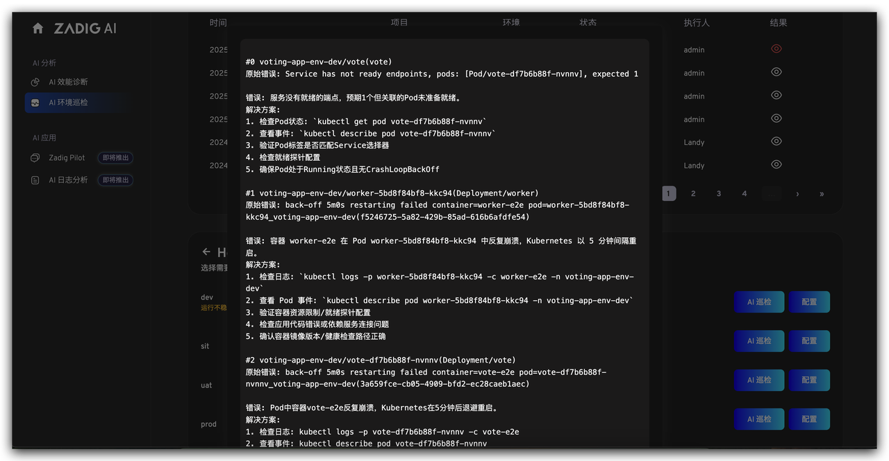
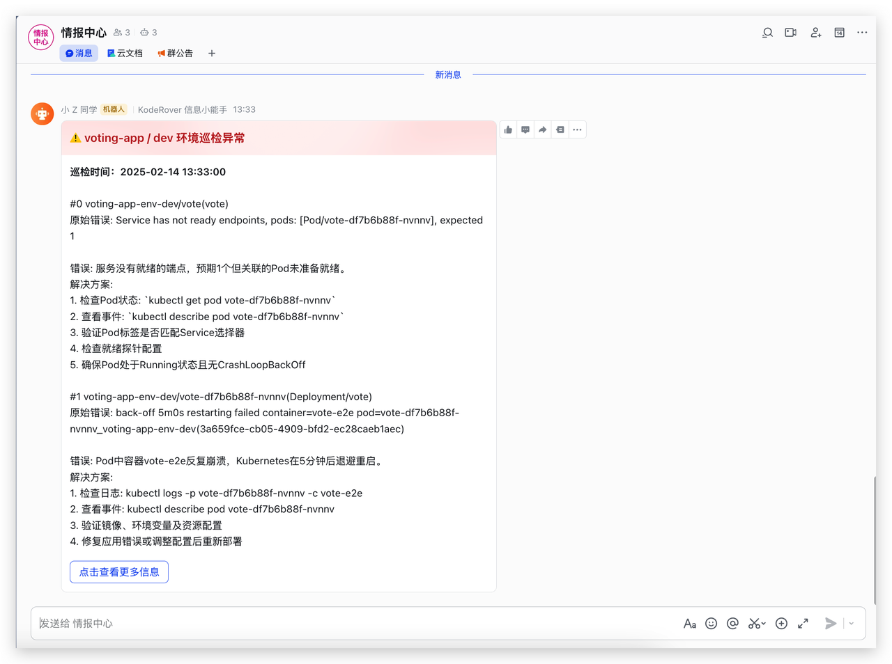

Faced with the complex Kubernetes production environment, traditional manual inspections are time-consuming and labor-intensive, and often fail to cover potential risks. Zadig’s AI environment inspection feature ensures environmental stability through scheduled inspections and intelligent alerts.

Scenario Value:
- No need for manual inspections; AI automatically completes environmental health checks, significantly reducing labor costs.
- With instant alerts, teams can quickly respond to environmental issues, preventing minor problems from escalating into major failures.

## Automatic Inspection on Schedule

AI regularly conducts comprehensive inspections of the Kubernetes environment, covering key indicators such as resource status and service health.

## Intelligent Problem Identification

Automatically identifies common environmental issues, such as Pod anomalies, insufficient resources, and configuration errors, and provides corresponding solutions.

## Alarm Push

The inspection results are notified to the relevant responsible persons in real time through IM tools (such as Feishu, DingTalk, Enterprise WeChat, etc.), ensuring that issues are addressed promptly.

