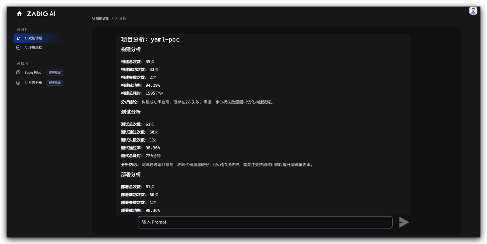
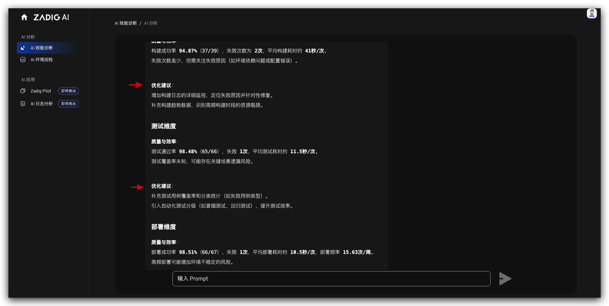

Traditional engineering efficiency analysis often relies on manual statistics and empirical judgment, which is inefficient and prone to subjective bias. Zadig has accumulated extensive performance data from the R&D process, including build, deployment, and testing. Leveraging DeepSeek's AI capabilities, it provides teams with objective and actionable improvement suggestions through intelligent data analysis.

Scenario Value:
- No need to manually analyze massive data; AI automatically generates performance reports, saving a significant amount of time.
- Through data-driven optimization suggestions, teams can quickly implement improvements, enhancing delivery efficiency.

## Intelligent Data Analysis

Through natural language interaction (Prompt method), AI can quickly analyze performance data in pipelines, builds, and testing to identify bottleneck issues.

## Accurate Problem Localization

Whether it is long build times, low test pass rates, or insufficient resource utilization, AI can clearly pinpoint the issues and provide detailed analysis reports.

## Scientific Improvement Suggestions

Based on the analysis results, AI provides specific optimization suggestions, such as parallel testing strategies and resource allocation adjustments, to help the team quickly improve performance.

