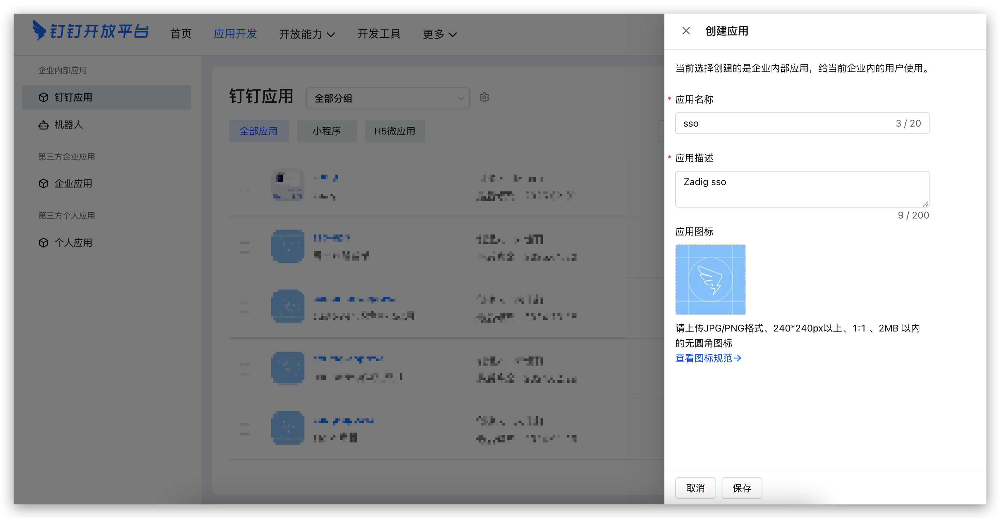
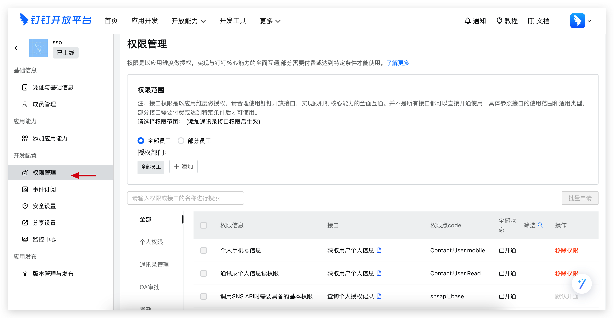
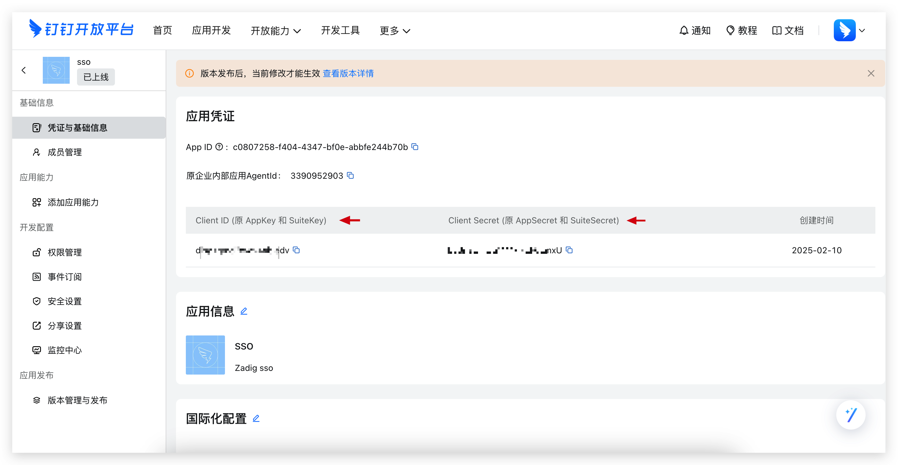
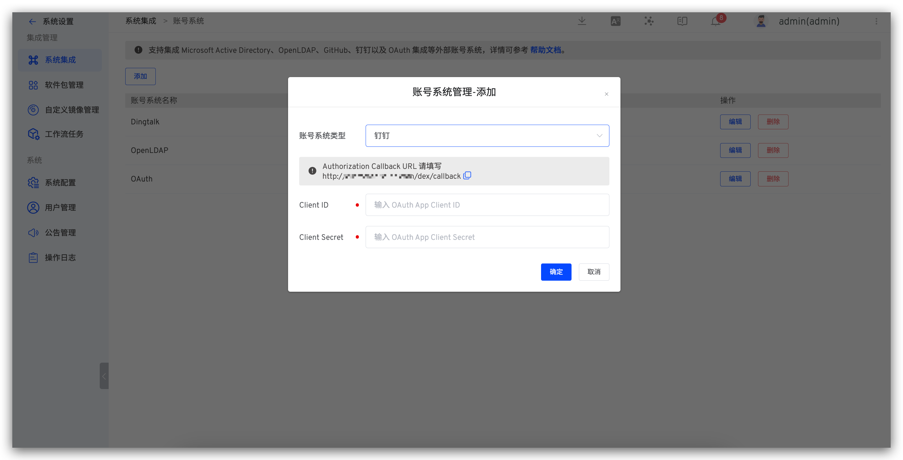
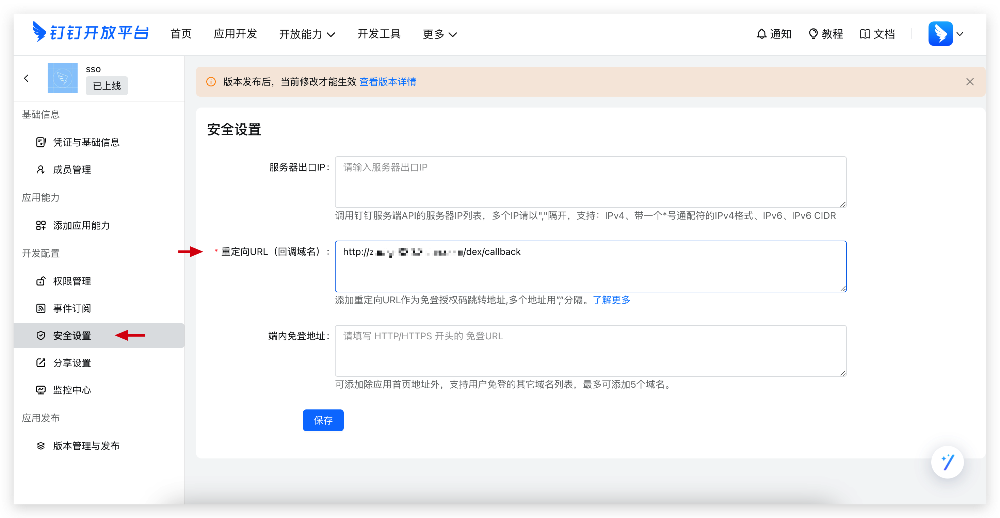

The Zadig account system supports integrating with DingTalk accounts, allowing users to log in to Zadig by configuring the DingTalk application.

## Step 1: Create a DingTalk Application

1. Visit the [DingTalk Open Platform](https://open-dev.dingtalk.com/fe/app#/corp/app) and create an application as shown in the figure below.

2. Set the address book permission scope in `Permission Management` - `Data Permission`, and enable the required permissions for the approval application in `API Permission`, as shown in the figure below.

The required permissions are as follows:

- `Contact.User.Read`
- `Contact.User.Mobile`

3. Obtain the `Client ID` and `Client Secret` as shown in the figure below.

4. Create a version and publish the DingTalk application.

## Step 2: Configure Zadig Account Integration

Visit Zadig, click `System Settings` -> `Integration` -> `Account System`, select `DingTalk`, and enter the `Client ID` and `Client Secret` obtained in step 1, as shown in the figure below.

Obtain the Callback URL and configure the callback address in the DingTalk Open Platform, as shown in the figure below.

