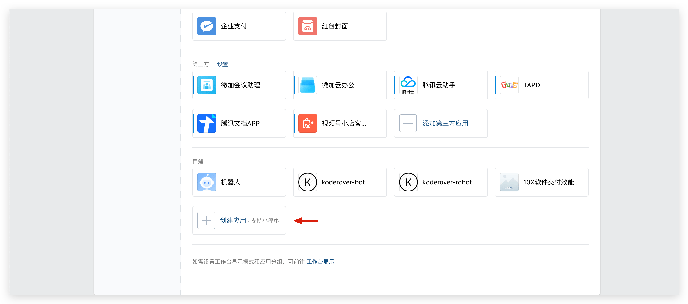
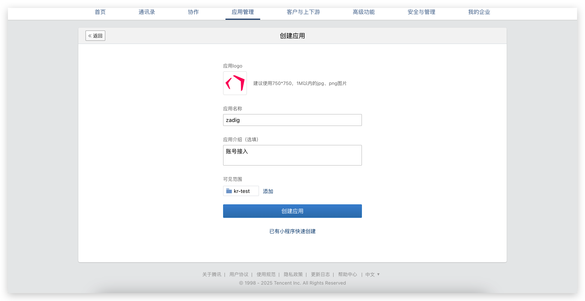
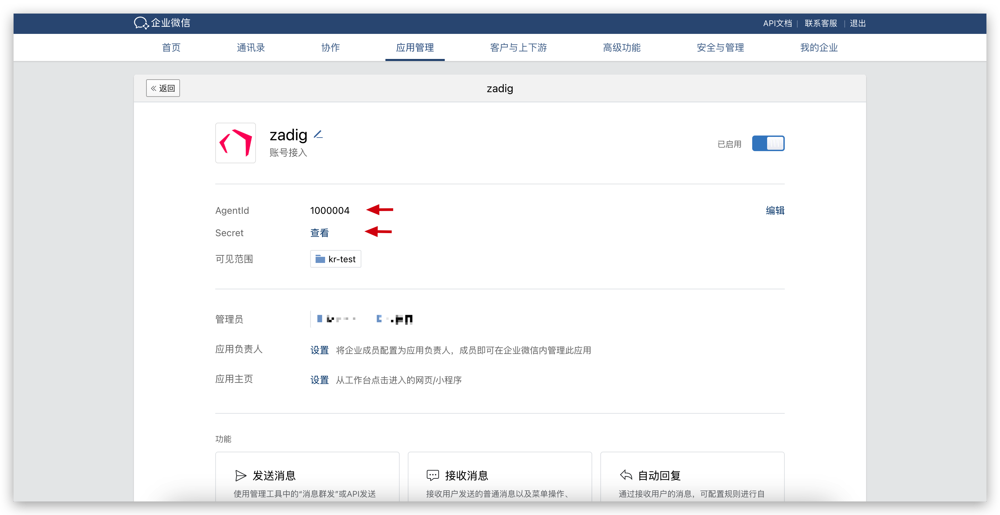
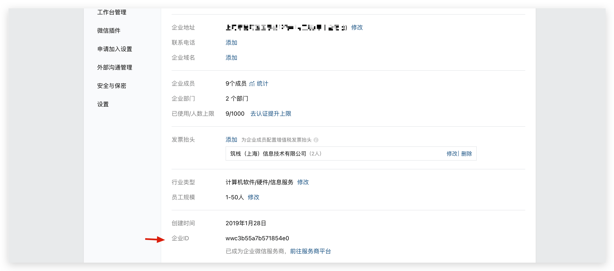
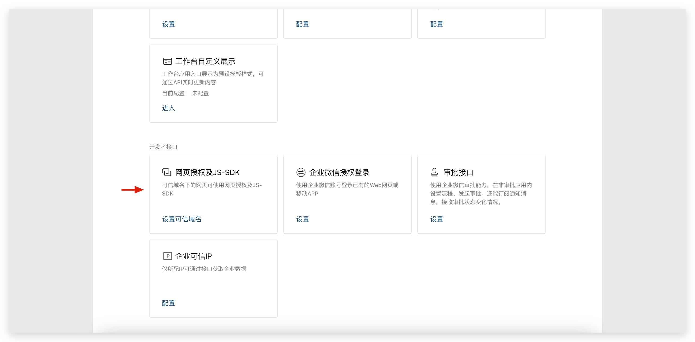
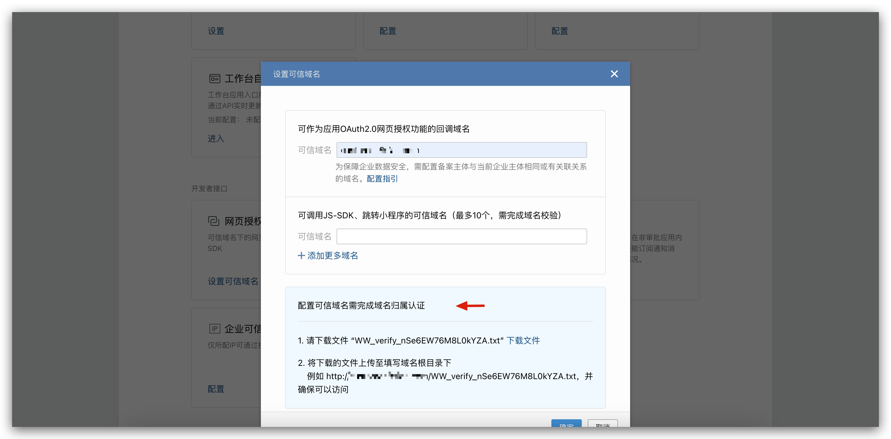
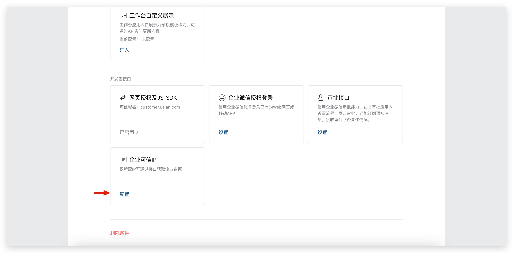
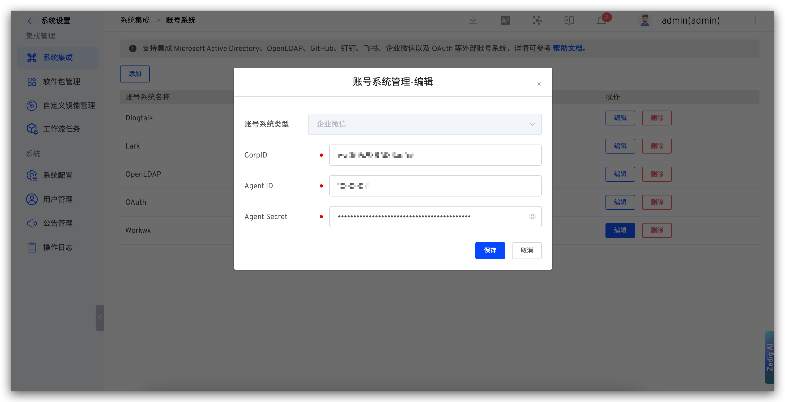

The Zadig account system supports integration with WeChat Work accounts, allowing users to log in to Zadig by configuring an WeChat Work application.

## Step 1: Create an WeChat Work Application

1. Visit [the WeChat Work backend](https://work.weixin.qq.com/wework_admin/frame#apps) and create an application as shown in the figure below.

2. Obtain the `AgentID` and `Secret`.

3. Go to “My Enterprise” -> “Enterprise Information” and get the `EnterpriseID`.

4. Configure Trusted Domain Names

5. Configure Trusted Enterprise IP

## Step 2: Configure Zadig Account Integration

Visit Zadig, click `System Settings` -> `System Integration` -> `Account System`, select `Enterprise WeChat`, and fill in the `EnterpriseID`, `AgentID`, and `Secret` obtained in Step 1, as shown in the figure below.

