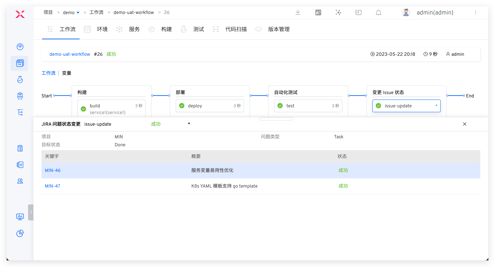
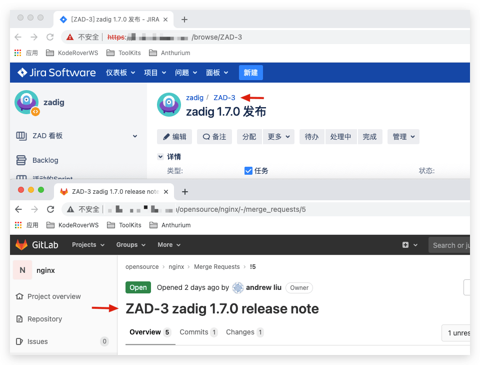

This article introduces how to integrate the project management system Jira on the Zadig system to achieve the two-way interconnection of Zadig + Jira.

## How to Configure

Click `System Settings` -> `Integration` -> `Project Management` -> Click Add.

Parameter Description:
- `Type`: Choose Jira
- `Access Address`: Your company's Jira address
- `System Identifier`: Customized, to facilitate quick identification in the Zadig system; the system identifier must be unique
- `Username`: A user with read permissions for Issues
- `Authentication Method`: Choose either `Password/API Token` or `Access Token`
- `Password/Token`: The password or corresponding Token for the username (fill in when using the `Password/API Token` authentication method)
- `Access Token`: The Access Token used for authentication (fill in when using the `Access Token` authentication method)
::: tip
The SaaS version can use the API Token from your Atlassian account for authentication, while the private deployment can use a password or Access Token for authentication.
:::

After confirming that the information is correct, save it.

## Usage Scenarios

### Automatically Change Issues Through Workflows

Supports Jira of project management tasks in the workflow, and automatically modify the specified Issue status through the workflow of Zadig with one click. For specific configuration, please refer to the document: [JIRA Problem status changes](/en/Zadig%20v3.4/project/workflow-jobs/#jira-issue-status-change) .

### Automatically Trigger Workflows with Jira Events

After configuring the Jira trigger in the workflow, the Zadig workflow can be automatically triggered when a Jira Issue changes. After the workflow execution is complete, the execution information will be commented on the corresponding Issue, enabling two-way tracking between Zadig and Jira. For specific configuration, refer to the documentation: [Jira Trigger](/en/Zadig%20v3.4/project/workflow-trigger/#jira-trigger).

<!-- ### 在 Zadig 中追踪 Issue

> 支持在产品工作流中追踪 Jira Issue。

Jira Issue 任务研发完毕后，在提交代码变更时关联 Issue ID 信息便可以实现在 Zadig 中追踪 Issue。支持的代码源请参考文档：[代码源信息](/en/Zadig%20v3.4/settings/codehost/overview/#功能兼容列表)。

在代码中关联 Issue ID 的 2 种方式：

- 在 Pull Request 的标题中填写 Jira Issue ID
- 在 Commit Message 中填写 Jira Issue ID

以 Pull Request 为例示范：#5 号 Pull Request 的标题中带上 Jira 的 Issue ID，图例中为 `ZAD-3`。

> 代码变更关联多个 Issue 时将 Issue ID 用空格分开即可。

运行产品工作流，选择上述 #5 号 Pull Request，待工作流运行完毕，构建信息部分会展示 Jira Issue 信息，可链接跳转至 Jira Issue，实现工作流和 Issue 的联动。

 -->