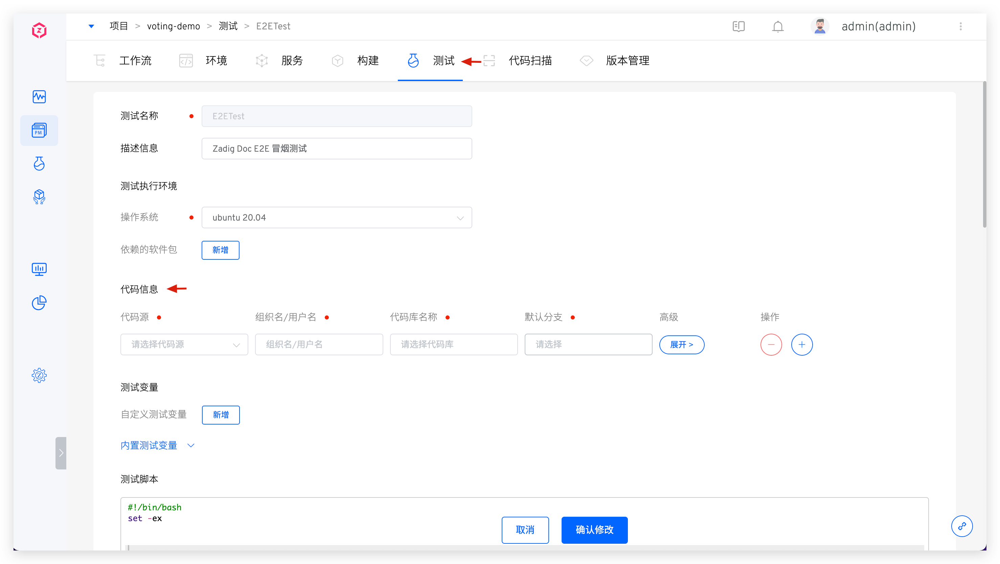
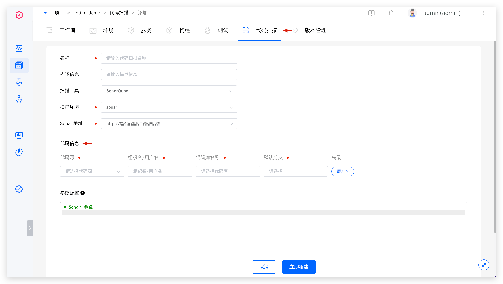
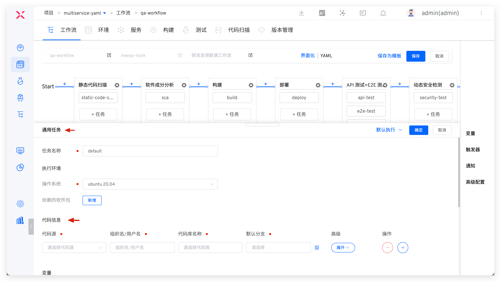
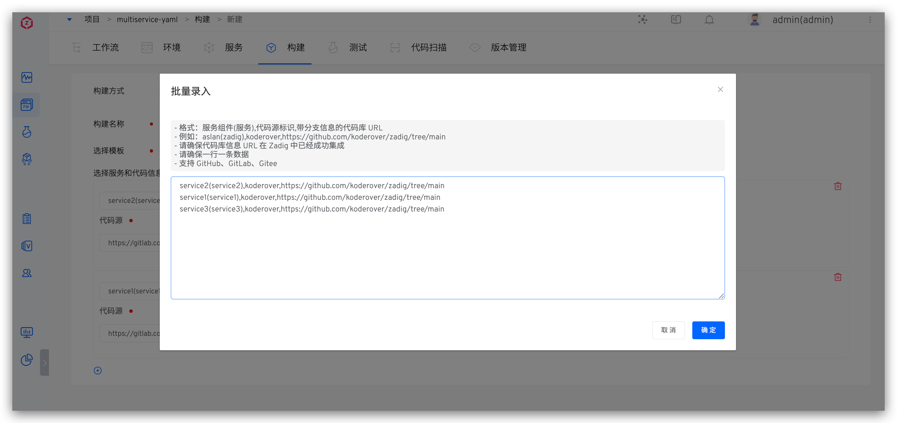
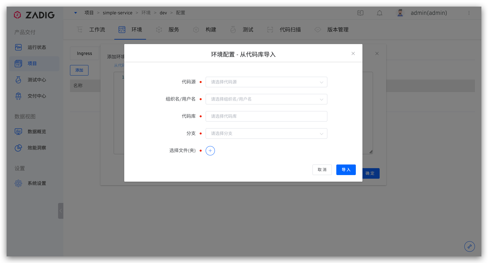
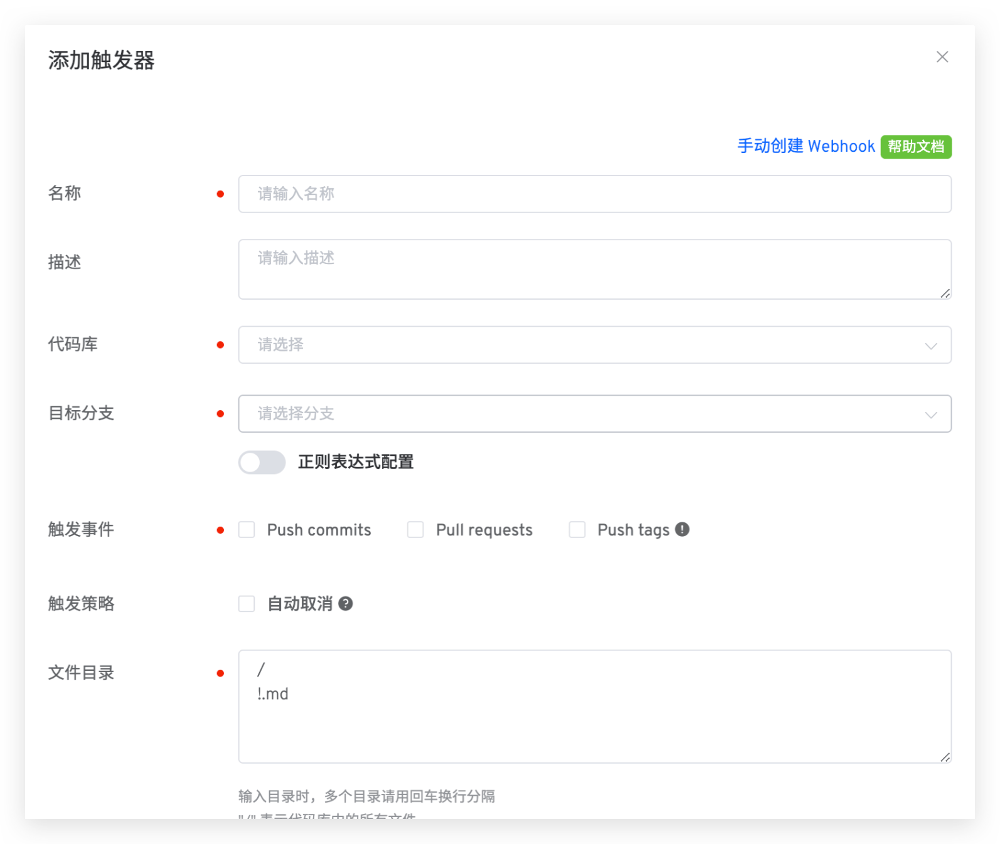
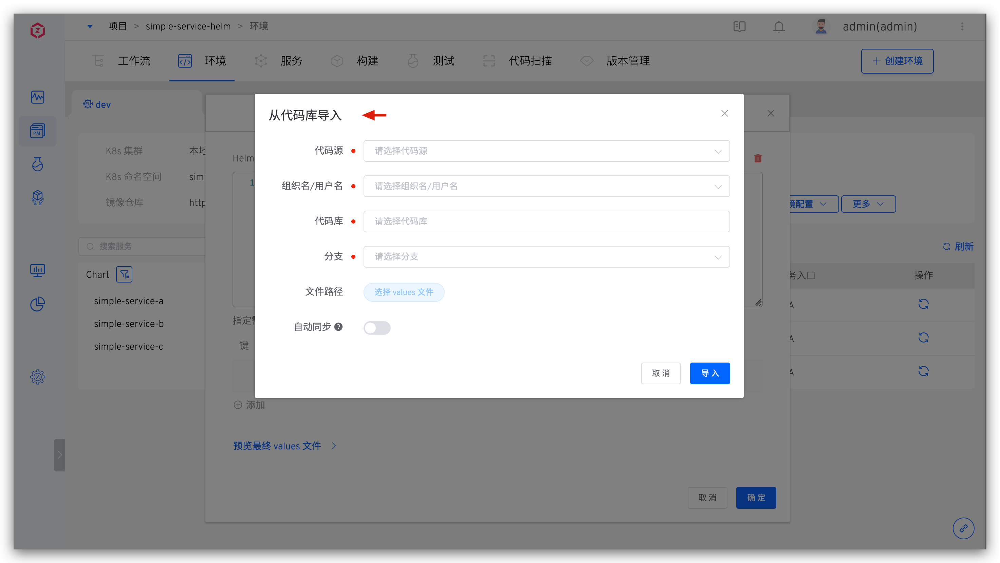
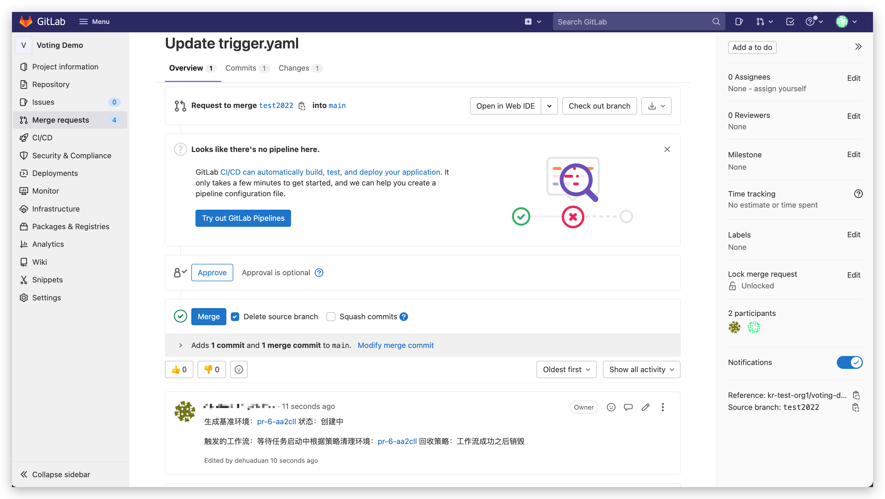
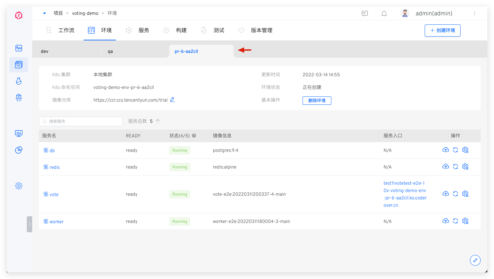

## Code Source Integration
Zadig supports the integration of the following code sources:

| Code Source | How to Integrate | Description |
|-------|---------|---|
| GitLab | [GitLab Code Source Integration](/en/Zadig%20v3.4/settings/codehost/gitlab/)| Authorization and authentication using OAuth2 |
| GitHub | [GitHub Code Source Integration](/en/Zadig%20v3.4/settings/codehost/github/)| Authorization and authentication using OAuth2 |
| Gerrit | [Gerrit Code Source Integration](/en/Zadig%20v3.4/settings/codehost/gerrit/)| Authorization and authentication using Basic Auth |
| Gitee Public Cloud | [Gitee Code Source Integration](/en/Zadig%20v3.4/settings/codehost/gitee/)| Authorization and authentication using OAuth2 |
| Gitee Private Deployment  | [Gitee Code Source Integration](/en/Zadig%20v3.4/settings/codehost/gitee-enterprise/)| Authorization and authentication using OAuth2 |
| Perforce | [Perforce Code Source Integration](/en/Zadig%20v3.4/settings/codehost/perforce/)| Authorization and authentication using Basic Auth |
| Other Requirements | [Integration of Other Code Sources](/en/Zadig%20v3.4/settings/codehost/others/)|For code sources that support the standard Git protocol, use SSH Key or Access Token for authentication|

## Function Compatibility List

The functions available in the system vary depending on the code source. The detailed descriptions are as follows.

| System Function | GitHub | GitLab | Gerrit | Gitee Public Cloud | Gitee Private Deployment| Perforce|Other Code Sources |
|:--------|:-----------------------------|:---------|:----|:---|:---|:----|:---|:----|
| Build configuration ( [illustration](#%E6%9E%84%E5%BB%BA%E9%85%8D%E7%BD%AE) ) | ✅ | ✅ | ✅ | ✅ | ✅ | ✅ |✅|
| Test configuration ( [illustration](#%E6%B5%8B%E8%AF%95%E9%85%8D%E7%BD%AE) ) | ✅ | ✅ | ✅ | ✅ | ✅ | ✅ | ✅|
| Code scanning configuration ( [illustration](#%E4%BB%A3%E7%A0%81%E6%89%AB%E6%8F%8F%E9%85%8D%E7%BD%AE) ) | ✅ | ✅ | ✅ | ✅ | ✅ |✅ |Supports Access Token method|
| General task configuration ( [illustration](#%E9%80%9A%E7%94%A8%E4%BB%BB%E5%8A%A1%E9%85%8D%E7%BD%AE) ) | ✅ | ✅ | ✅ | ✅ | ✅ |✅ |✅|
| Create K8s YAML Service ( [Illustrated](#%E5%88%9B%E5%BB%BA-k8s-yaml-%E6%9C%8D%E5%8A%A1) ) | ✅ | ✅ | ✅ | ✅ | ✅ |—|—|
| Create K8s Helm Chart Service ( [Illustrated](#%E5%88%9B%E5%BB%BA-k8s-helm-chart-%E6%9C%8D%E5%8A%A1) ) | ✅ | ✅ | ✅ | ✅ | ✅ |—|✅|
| Create K8s Helm Chart Service Template ( [Illustrated](#%E5%88%9B%E5%BB%BA-k8s-helm-chart-%E6%9C%8D%E5%8A%A1%E6%A8%A1%E6%9D%BF) ) | ✅ | ✅ | ✅ | ✅ | ✅ |—|✅|
| Batch code information ( [illustration](#%E6%89%B9%E9%87%8F%E5%BD%95%E5%85%A5%E4%BB%A3%E7%A0%81%E4%BF%A1%E6%81%AF) ) | ✅ | ✅ | — | ✅ | ✅ |—| — |
| Environment configuration ( [illustration](#%E7%8E%AF%E5%A2%83%E9%85%8D%E7%BD%AE) ) | ✅ | ✅ | — | — | — |—|—|
| Workflow trigger, automatic configuration ( [illustration](#%E8%87%AA%E5%8A%A8%E9%85%8D%E7%BD%AE%E5%B7%A5%E4%BD%9C%E6%B5%81%E8%A7%A6%E5%8F%91%E5%99%A8) ) | ✅ | ✅ | ✅ | ✅ | ✅ |—|—|
| Workflow trigger, manual configuration ( [illustration](#%E6%89%8B%E5%8A%A8%E9%85%8D%E7%BD%AE%E5%B7%A5%E4%BD%9C%E6%B5%81%E8%A7%A6%E5%8F%91%E5%99%A8) ) | ✅ | ✅ | — | ✅ | ✅ |—|—|
| Test trigger ( [illustration](#%E6%B5%8B%E8%AF%95%E8%A7%A6%E5%8F%91%E5%99%A8) ) | ✅ | ✅ | — | ✅ | ✅ |—|—|
| Code scan trigger ( [illustration](#%E4%BB%A3%E7%A0%81%E6%89%AB%E6%8F%8F%E8%A7%A6%E5%8F%91%E5%99%A8) ) | ✅ | ✅ (Additional support for regular expressions) | — | — | — |—|—|
| Import Helm Chart Values File ( [Illustrated](#%E5%AF%BC%E5%85%A5-helm-chart-values-%E6%96%87%E4%BB%B6) ) | ✅ | ✅ | — | — | —|—|—|
| Custom task source configuration ( [illustration](#%E8%87%AA%E5%AE%9A%E4%B9%89%E4%BB%BB%E5%8A%A1%E6%9D%A5%E6%BA%90%E9%85%8D%E7%BD%AE) ) | ✅ | ✅ | — | ✅ | ✅ |—|✅|

<!-- | 和 Jira Issue 联动（[图示](#和-jira-issue-联动)） | ✅ | ✅ | — | — | — |—|
| 基于 PR 的独立测试环境（[图示](#基于-pr-的独立测试环境)） | — | ✅ | — | — | — |—| -->

## Illustration

### Build Configuration
::: details
</img>
:::

### Test Configuration
::: details
</img>
:::

### Code Scanning Configuration
::: details
</img>
:::

### General Task Configuration
::: details
</img>
:::

### Create a K8s YAML Service
::: details
</img>
:::

### Create a K8s Helm Chart Service
::: details
</img>
:::

### Create a K8s Helm Chart Service Template
::: details
</img>
:::

### Batch Code Information Entry

::: details
</img>
</img>
:::

### Environment Configuration
::: details
</img>
:::

### Workflow Triggers

#### Automatic Workflow Trigger Configuration
::: details
</img>
:::

#### Manual Workflow Trigger Configuration

::: details
</img>
:::

### Test Trigger
::: details
</img>
:::

### Code Scan Trigger
::: details
</img>
:::

### Import the Helm Chart Values File
::: details
</img>
:::

<!-- ### 和 Jira Issue 联动

> 如何实现和 Jira Issue 的联动可参考文档：[在 Zadig 中追踪 Jira Issue](/en/Zadig%20v3.4/settings/jira/#在-zadigx-中追踪-issue)。

::: details
</img>
:::

### 基于 PR 的独立测试环境

> 如何实现基于 PR 的独立测试环境可参考文档：[Pull Request 独立测试环境](/en/Zadig%20v3.4/workflow/trigger/#进阶使用场景-pull-request-独立测试环境)。

::: details
</img>
</img>
::: -->

### Custom Task Source Configuration

</img>