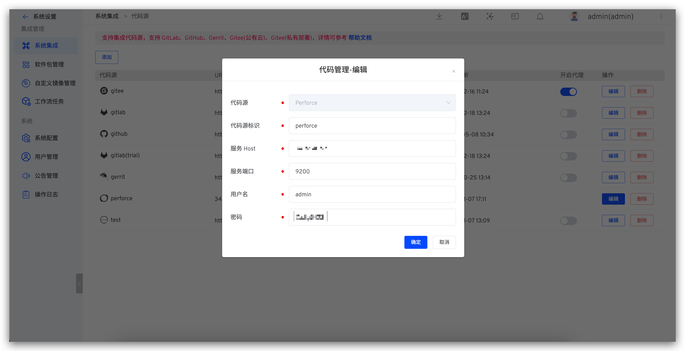

This article primarily introduces how to integrate Perforce code sources on Zadig.

> Currently, the Zadig system uses Basic Auth to retrieve code from Perforce and call Perforce's API

- `Provider`: Here, select `Perforce`
- `Alias`: Customize this to facilitate quick identification of the code source within the Zadig system. This information must be unique throughout the system
- `Host`: Perforce service address
- `Port`: Perforce service port
- `Username`: Perforce username
- `Password`: Perforce password