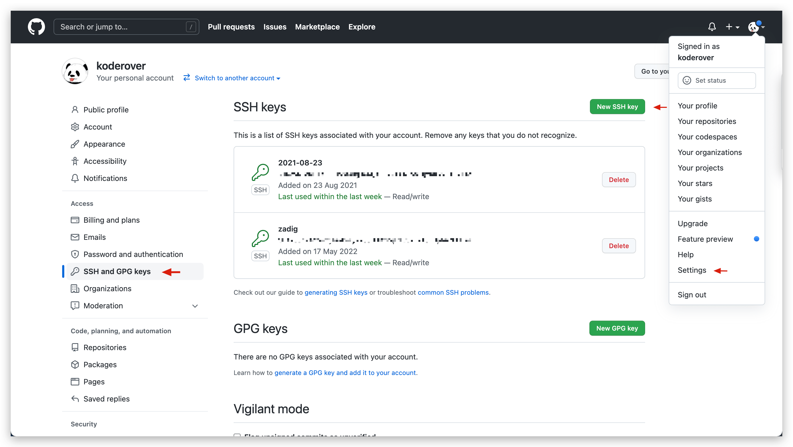
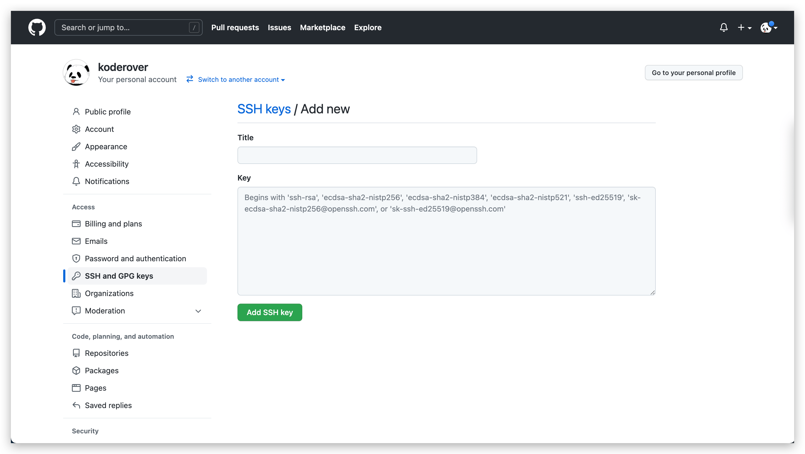
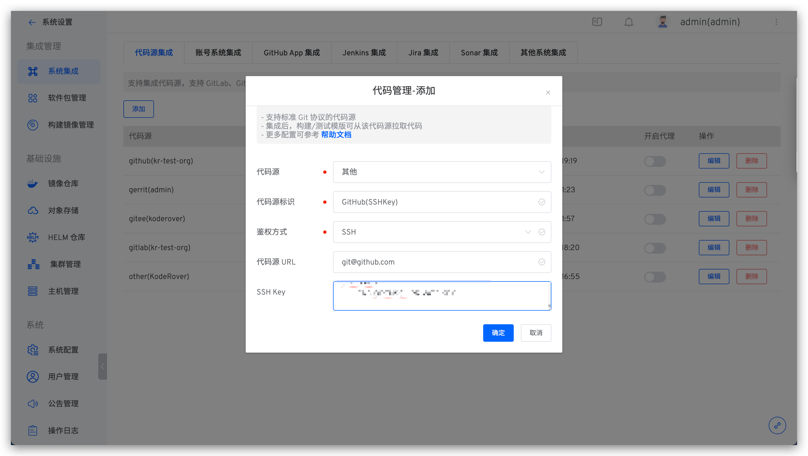
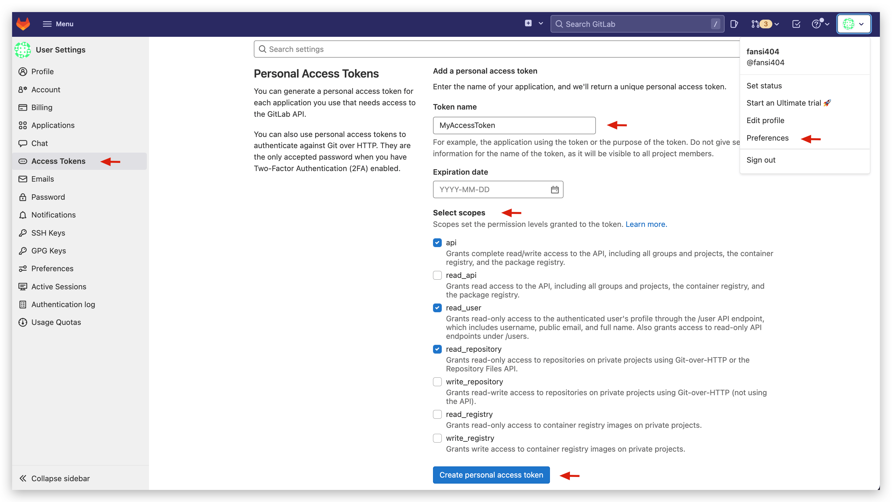
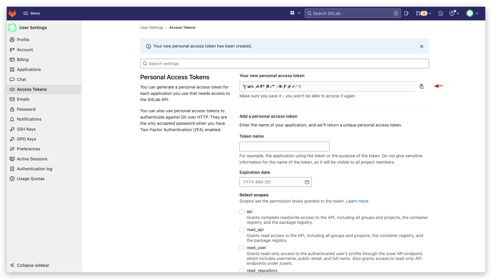
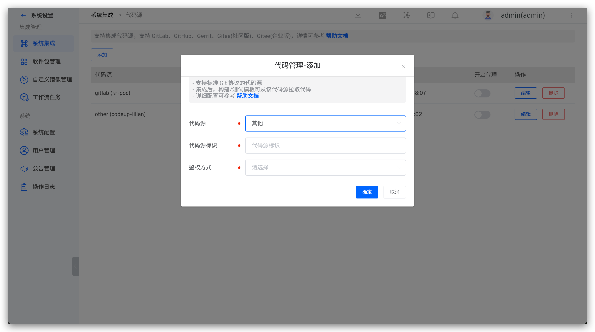

This article primarily discusses how to integrate code sources that support the standard Git protocol, including authentication using SSH Key and authentication using Access Token.

## SSH Key Authentication Method

### Step 1: Configure SSH Key

Configure the SSH public key in the corresponding code source. The operation path for this configuration varies depending on the code source. Please refer to the official documentation of the corresponding code source. The following is an example using GitHub as the code source.

1. Generate an SSH public and private key pair using `ssh-keygen -t rsa -C "your_email@example.com"`
2. After logging into GitHub, click on the avatar in the upper right corner -> `Settings` -> `SSH and GPG keys` -> `New SSH key`, and then click `Add SSH key` after filling in the following information:
    -  `Title`: Custom
    -  `Key`: The public key information generated in the previous step, i.e., the content of `id_rsa.pub`




### Step 2: Enter the Configuration in the Zadig System

An administrator should log into the Zadig system and navigate to `System Settings` -> `Integration` -> `Code Source` -> click the Add button.



Fill in the following information in sequence:

- `Provider`: Select `Other`
- `Alias`: Customize to help quickly identify the code source within the Zadig system. This information must be unique within the entire system
- `Authentication Method`: Select `SSH Key`
- `Code Source URL`: Enter the corresponding code source address, such as `git@github.com`
- `SSH Key`: Navigate to the directory where the key pair was generated in **Step 1**, and then execute the following command to copy and paste it into the input box here

``` bash
cat id_rsa | pbcopy
```

## Access Token Authentication Method

### Step 1: Obtain Access Token

Configure the Access Token in the corresponding code source. The configuration process varies depending on the code source. Please refer to the official documentation of the corresponding code source. The following is an example using GitLab as the code source.

1. After logging into GitLab, click on the avatar in the upper right corner -> `Preferences` -> `Access Tokens`, fill in the Token name, and check `api`, `read_user`, `read_repository` to generate the Access Token.



2. Copy the generated Access Token information.



### Step 2: Enter the Configuration in the Zadig System

An administrator should log into the Zadig system and navigate to `System Settings` -> `Integration` -> `Code Source Integration` -> click the Add button.



Fill in the following information in sequence:

- `Provider`: Select `Other`
- `Alias`: Customize to help quickly identify the code source within the Zadig system. This information must be unique within the entire system
- `Authentication Method`: Select `Access Token`
- `Code Source URL`: Enter the corresponding code source address, such as `https://gitlab.com`
- `Access Token`: The Access Token obtained in **Step 1**