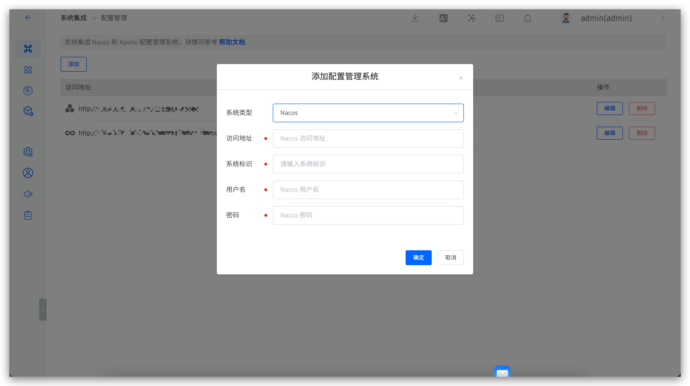

This article primarily introduces how to integrate and use Nacos in Zadig to achieve efficient and stable configuration change management.

## How to Integrate

Visit `System Settings` -> `Integration` -> `Configuration Management`, add Nacos configuration and pass the system connectivity test.

Parameter Description:

- `System Type`: Select `Nacos`
- `Access Address`: The address of the internal Nacos system, for example: `https://nacos.koderover.com`
- `System Identifier`: Customized to facilitate quick identification in the Zadig system; the system identifier must be unique
- `Username`: The username for the Nacos system account
- `Password`: The password for the Nacos system account

## How to Use

Orchestrate Nacos Configuration Change tasks in a custom workflow to achieve Nacos configuration changes, refer to the document: [Nacos Configuration Change](/en/Zadig%20v3.4/project/workflow-jobs/#nacos-configuration-change) .