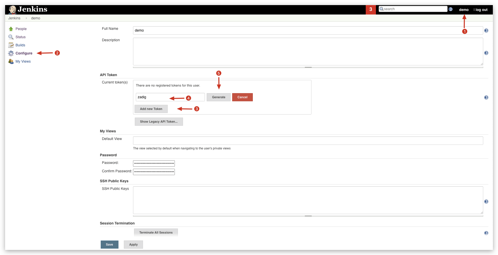
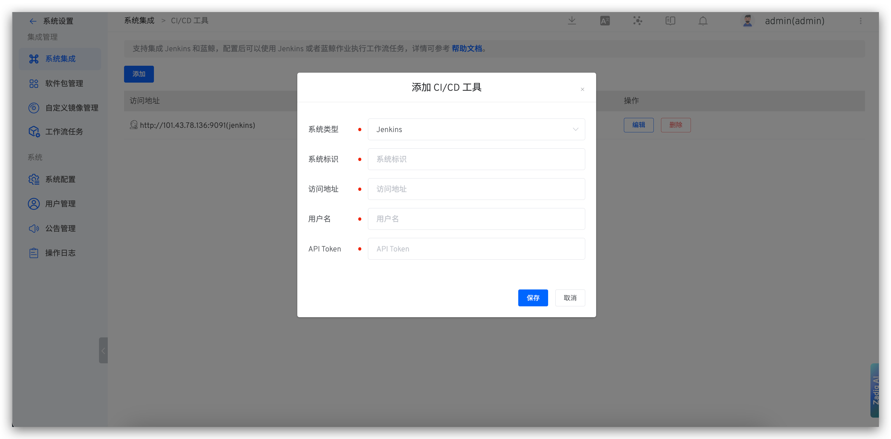

Supports integration with Jenkins and Blue Whale, allowing workflow tasks to be executed using Jenkins or Blue Whale jobs after configuration.

## How to Integrate Jenkins Server

### Step 1: Generate an API Token in Jenkins

Log in to Jenkins, and in the user configuration, generate an API token as shown in the figure below.

### Step 2: Integrate Jenkins Server in Zadig

Visit Zadig, click `System Settings` -> `Integration` -> `CI/CD Tools`, and add the relevant information for the Jenkins service as shown in the figure below.

You can then orchestrate the execution of Jenkins Job tasks in the workflow. For more details, refer to the documentation: [Execute Jenkins Job](/en/Zadig%20v3.4/project/workflow-jobs/#ci-cd).

## How to Integrate Blue Whale

> Supports Blue Whale Version 6.0

1. Create an application in Blue Whale and obtain the application ID and application token.
2. Integrate the Blue Whale system in Zadig: Visit Zadig, click `System Settings` -> `Integration` -> `CI/CD Tools`, and add the relevant information for the Blue Whale application.