This article introduces the integration of IM applications on the Zadig system, utilizing the capabilities of IM applications to achieve notifications and approvals. Currently, it supports the integration of Feishu, DingTalk, and Enterprise WeChat applications.

## Feishu

> The "Manual Approval" and "Notification" tasks in workflows are used.

Follow the steps below to configure Feishu notifications and approvals:
1. Create and publish an application on the Feishu Developer Platform
2. Configure the application credentials in the Zadig system to obtain the `Request Address` for the application to push event messages
3. Configure the `Request Address` on the Feishu Developer Platform

### Step 1: Create a Feishu App
1. Visit [the Feishu Developer Platform](https://open.feishu.cn/), and create an "enterprise self-built application" as shown in the figure below.

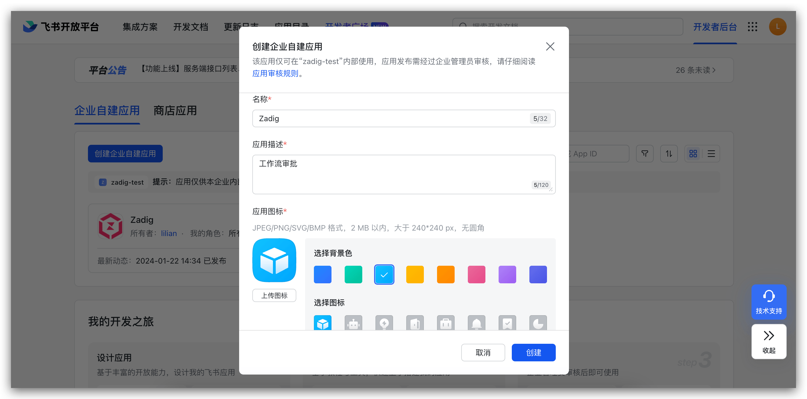

2. In `Permission Management` - `Data Permission`, set the address book permission scope, and in `API Permission`, enable the permissions required for the approval application, as shown in the figure below.

> Zadig's workflow supports configuring Feishu approvals, and the available approvers are related to the address book scope specified here.

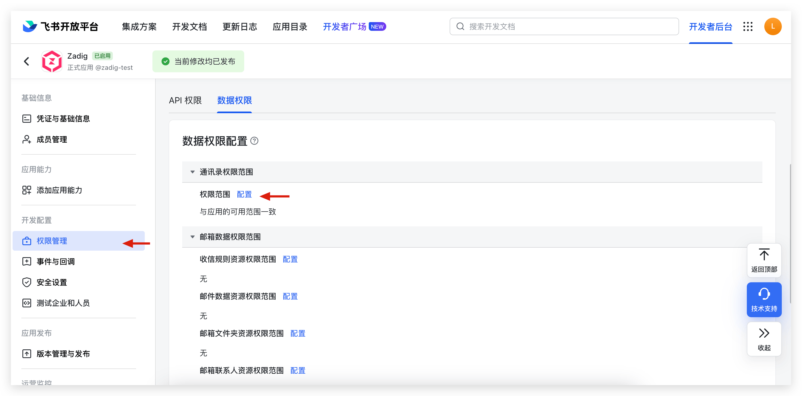

The required permissions for **approval** are as follows:
- `approval:approval`
- `approval:approval.list:readonly`
- `approval:approval:readonly`
- `contact:user.id:readonly`
- `contact:contact.base:readonly`
- `contact:user.employee_id:readonly`
- `contact:user.base:readonly`
- `contact:department.base:readonly`
- `contact:group:readonly`

The required permissions for **notification** are as follows:
- `im:chat`
- `im:chat:read`
- `im:chat:readonly`
- `im:message`
- `im:message:send_as_bot`
- `im:message:send_multi_depts`
- `contact:user.id:readonly`
- `contact:contact.base:readonly`
- `contact:user.employee_id:readonly`
- `contact:user.base:readonly`

3. Add a robot. If "Feishu Group Notification" is configured in the "Notification Task," the robot needs to be added to the corresponding group.

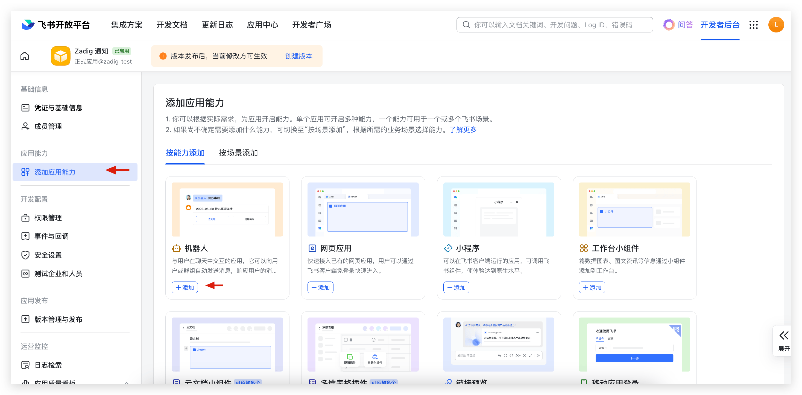

4. Create an application version and request its publication.
> Please configure the other information required for the application release process yourself, which is not detailed here.

5. Obtain the `App ID`, `App Secret`, and `Encrypt Key` (optional).

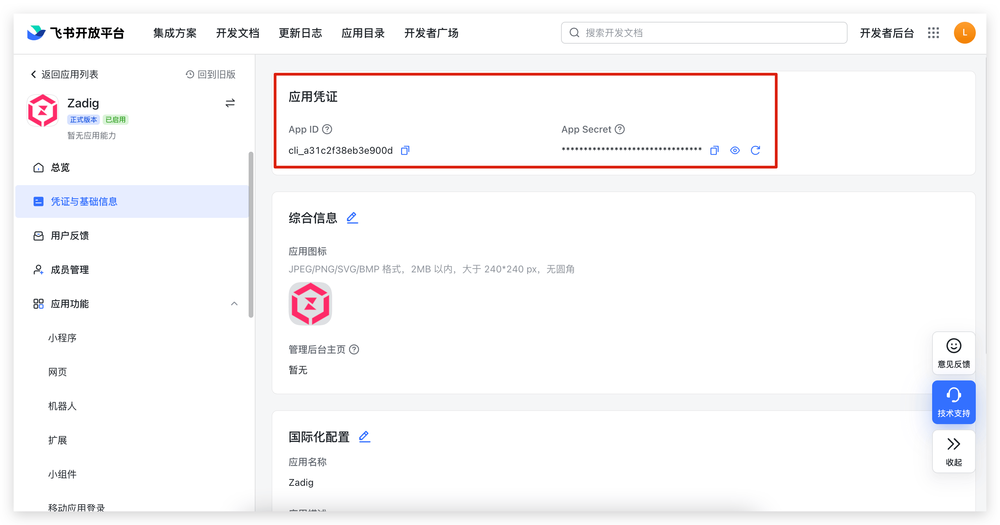

After the application release is approved, proceed to the next configuration step.

### Step 2: Integrate IM Application

Visit Zadig, click `System Settings` -> `Integration` -> `Approval System`, and add the Feishu approval application, as shown in the figure below.

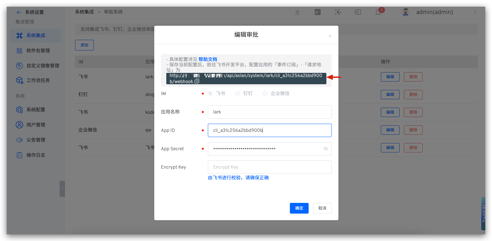

Parameter descriptions:
- `App Name`: Customize it for easy identification in the Zadig system
- `App ID`: Obtained in Step 1
- `App Secret`: Obtained in Step 1
- `Encrypt Key`: Obtained in Step 1

After filling in the details, obtain the "request address" and save the configuration.

### Step 3: Configure "Request Address" and "Events"

1. Configure the request address. Visit [the Feishu Developer Platform](https://open.feishu.cn/) and fill in the request address as shown in the figure below.

::: tip
After the user completes the approval on Feishu, the Feishu platform needs to callback the approval status to Zadig. To ensure the normal use of the Feishu approval function, please ensure that the Zadig domain name used can be accessed by the Feishu platform.
:::

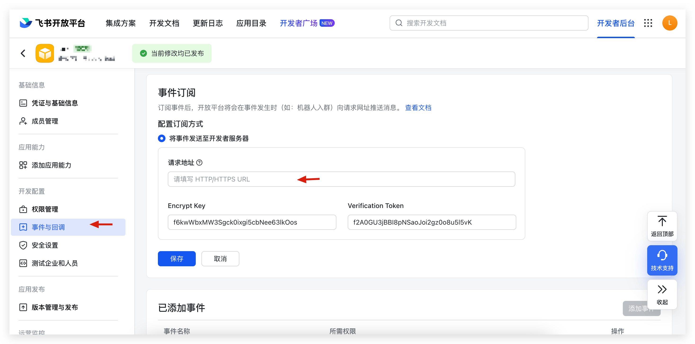

2. Add an event. Click "Event Subscription" -> "Add Event" and select `Approval Task Status Change`.

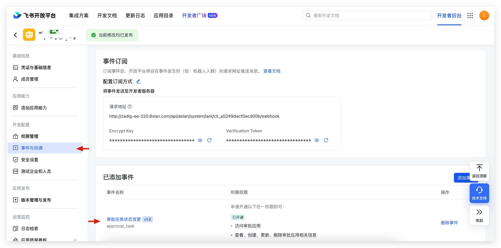

::: tip Tips
After completing the configuration, you need to create the application version again and release the latest version.
:::

## DingTalk

::: tip
After the user completes the approval on DingTalk, the DingTalk platform needs to callback the approval status to Zadig. To ensure the normal use of the DingTalk approval function, please ensure that the DingTalk platform can access the Zadig domain name.
:::

Follow the steps below to configure DingTalk approvals:
1. Create and publish an application on the DingTalk Developer Platform
2. Configure the application credentials in the Zadig system to obtain the `Request URL` for the application to push event messages
3. Configure the `Request URL` on the DingTalk Developer Platform

### Step 1: Create a DingTalk Application
1. Visit [the DingTalk Open Platform](https://open-dev.dingtalk.com/fe/app#/corp/app) and create an application as shown in the figure below.
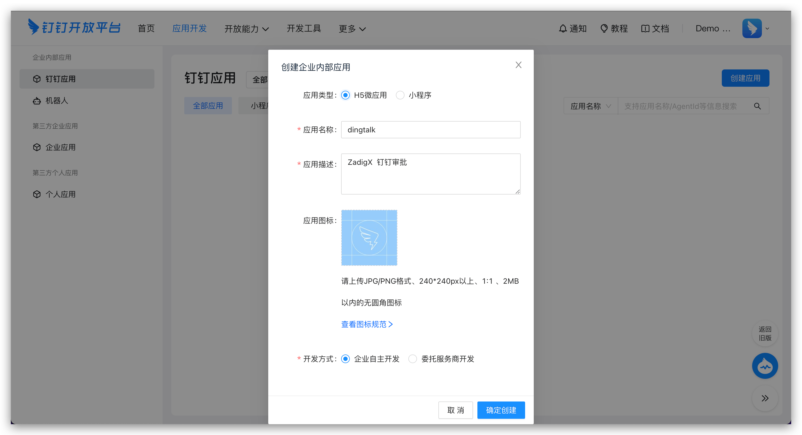

2. In permission management, configure the permission scope and enable the permissions required for the approval application, as shown in the figure below.

> Zadig's workflow supports configuring DingTalk approvals, and the available approvers are related to the permission scope specified here.

The required permissions are as follows:

- `snsapi_base`
- `qyapi_base`
- `Contact.User.Read`
- `qyapi_get_department_list`
- `qyapi_get_member`
- `qyapi_get_member_by_mobile`
- `Workflow.Form.Write`
- `Workflow.Form.Read`
- `Workflow.Instance.Read`
- `Workflow.Instance.Write`

3. Obtain the `AppKey`, `AppSecret`, `aes_key`, and `token` information.

`AppKey` and `AppSecret` are obtained in `App Information`:

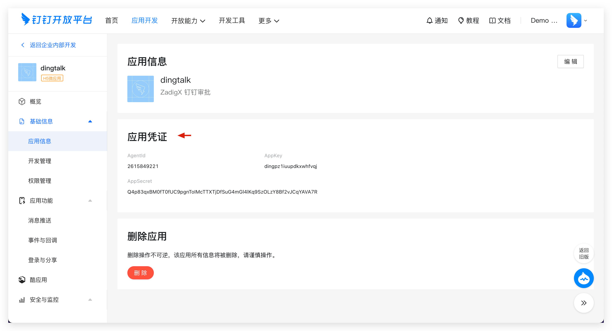

`aes_key` and `token` are obtained in `Events and Callbacks`:

> Tip: After saving the aes_key and other information, please do not close the current page. You will need to fill in the request URL here after completing the configuration in Zadig.

### Step 2: Integrate IM Application

Visit Zadig, click `System Settings` -> `Integration` -> `Approval System`, and add the DingTalk approval application, as shown in the figure below.

Parameter descriptions:
- `App Name`: Customize it for easy identification in the Zadig system
- `App Key`: Obtained in Step 1
- `App Secret`: Obtained in Step 1
- `Aes Key`: Obtained in Step 1
- `Token`: Obtained in Step 1

After filling in the details, copy the "request URL" and save the configuration.

### Step 3: Configure "Request URL" and "Events"

1. Visit the DingTalk Open Platform - Application Functions - Events and Callbacks, fill in the request URL and save.

2. Enable the following events in the approval event:

- `Approval Task Start, End, Transfer`
- `Approval Instance Start, End`

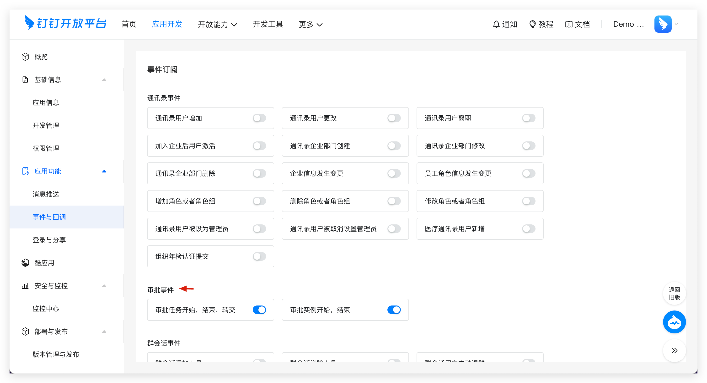

## Enterprise WeChat

::: tip
After the user completes the approval on Enterprise WeChat, the Enterprise WeChat platform needs to callback the approval status to Zadig. To ensure the normal use of the Enterprise WeChat approval function, please ensure that the Enterprise WeChat platform can access the Zadig domain name.
:::

### Step 1: Create an Application
1. Visit [the Enterprise WeChat backend](https://work.weixin.qq.com/wework_admin/frame#apps) and create an application as shown in the figure below.

2. Obtain the `AgentID` and `Secret`.
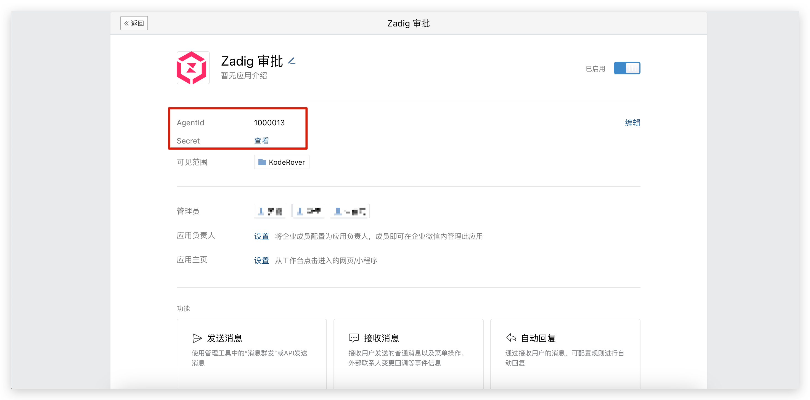

3. Go to "My Enterprise" -> "Enterprise Information" and obtain the `Enterprise ID`.

4. Configure trusted domain names

5. Configure enterprise trusted IPs

6. Go to the "Approval" application and configure the "Application with Callable Interface," checking the created application.

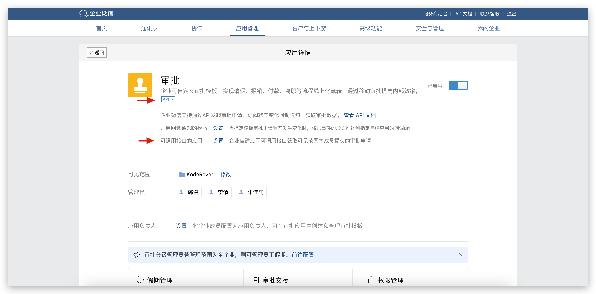
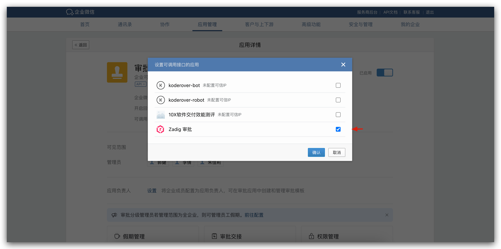

### Step 2: Integrate IM Application

1. Visit Zadig, click `System Settings` -> `Integration` -> `Approval System`, and add the Enterprise WeChat approval application, filling in the `Enterprise ID`, `AgentID`, and `Secret`, and obtain the callback address, as shown in the figure below.

2. Go to the Enterprise WeChat backend, configure the "Receive Information" URL callback address in the created application, and obtain the `Token` and `EncodingAESKey`.

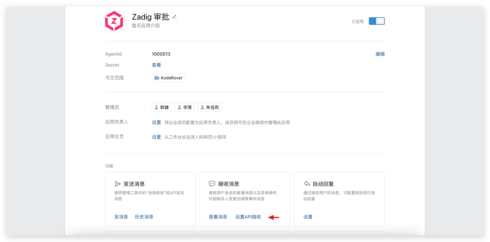
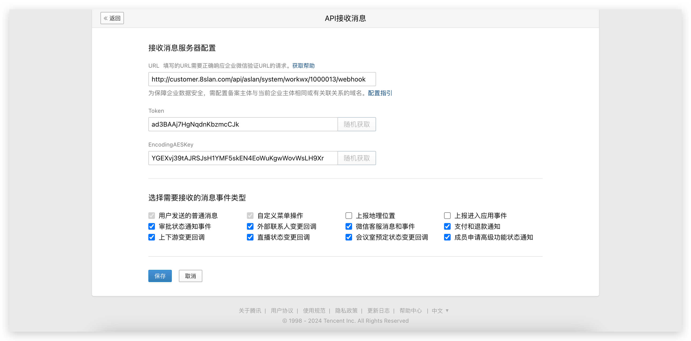

3. In the Zadig approval integration, fill in the `Token` and `EncodingAESKey` and save.

4. In the Enterprise WeChat backend, save the "Receive Information."

### Step 3: Enable the Callback Notification Template

Go to the Enterprise WeChat backend, "Approval" application, and enable the callback address template.

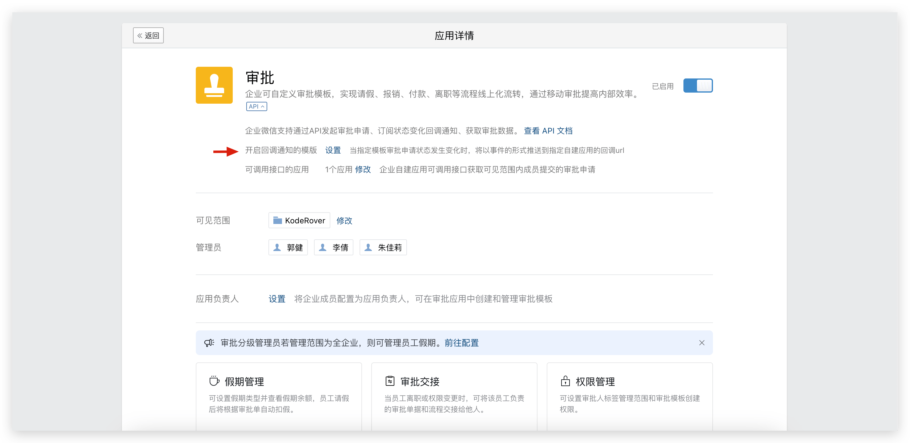
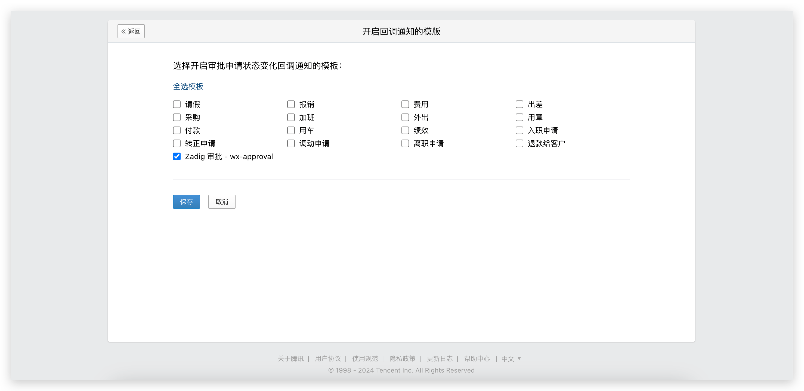

## Extended Reading

### Using Feishu Approval in Zadig

Reference document: [Feishu approval](/en/Zadig%20v3.4/workflow/approval/#feishu-approval)

### Using DingTalk Approval in Zadig

Reference document: [DingTalk Approval](/en/Zadig%20v3.4/workflow/approval/#dingtalk-approval)

### Using Enterprise WeChat Approval in Zadig

Reference document: [Enterprise WeChat Approval](/en/Zadig%20v3.4/workflow/approval/#enterprise-wechat-approval)