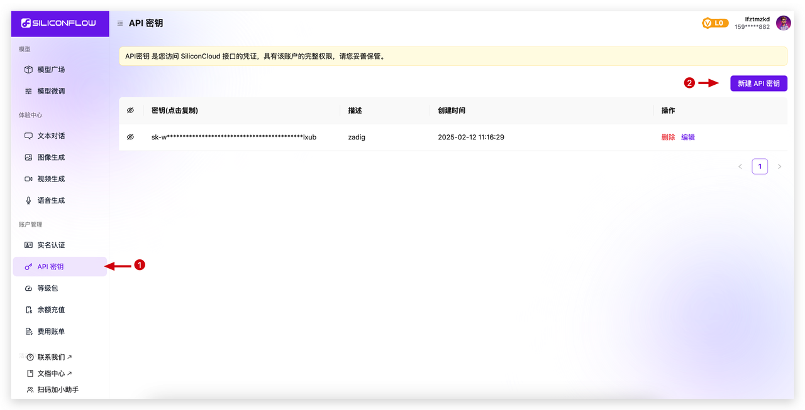

This article introduces the integration of AI services on the Zadig system.

Main application scenarios:
- AI Performance Diagnosis
- AI Environmental Inspection
- AI Pilot

## DeepSeek

1. Complete the registration on DeepSeek, generate [API Key](https://platform.deepseek.com/api_keys), create a new API Key, and copy it.

2. On Zadig, access `System Settings` -> `Integration` -> `AI Services`, and add the DeepSeek AI service.

**Parameter Description:**

1. Provider: Choose DeepSeek
2. Model Name: Enter the model provided on DeepSeek
3. Access Address: https://api.deepseek.com/v1
4. API Key: The API Key obtained in the previous step

## SiliconCloud

1. Complete the registration on SiliconCloud, generate [API Key](https://cloud.siliconflow.cn/account/ak), create a new API key, and copy it.

2. On Zadig, access `System Settings` -> `Integration` -> `AI Services`, and add the AI service.

**Parameter Description:**

1. Provider: Choose SiliconCloud
2. Model Name: Enter the model provided on SiliconCloud
3. Access Address: https://api.siliconflow.cn/v1
4. API Key: The API key obtained in the previous step