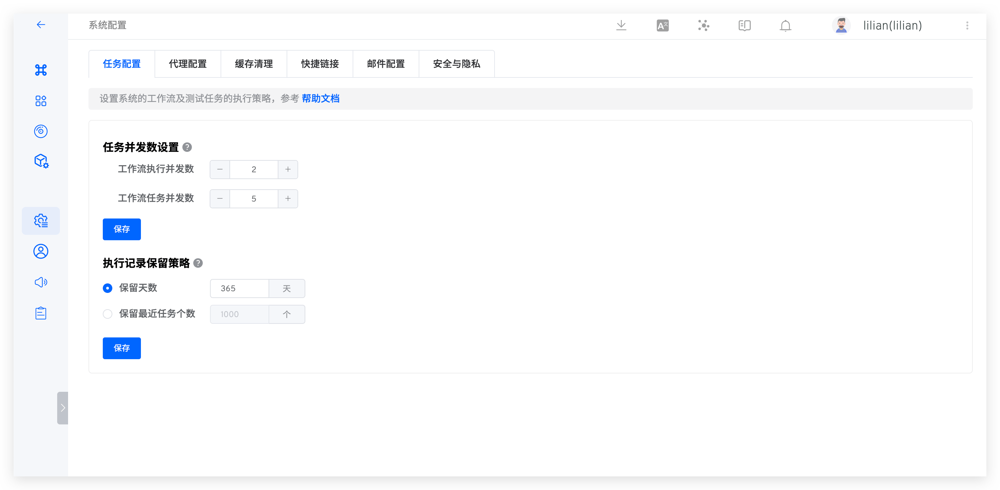
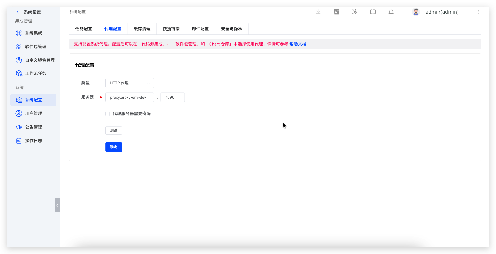
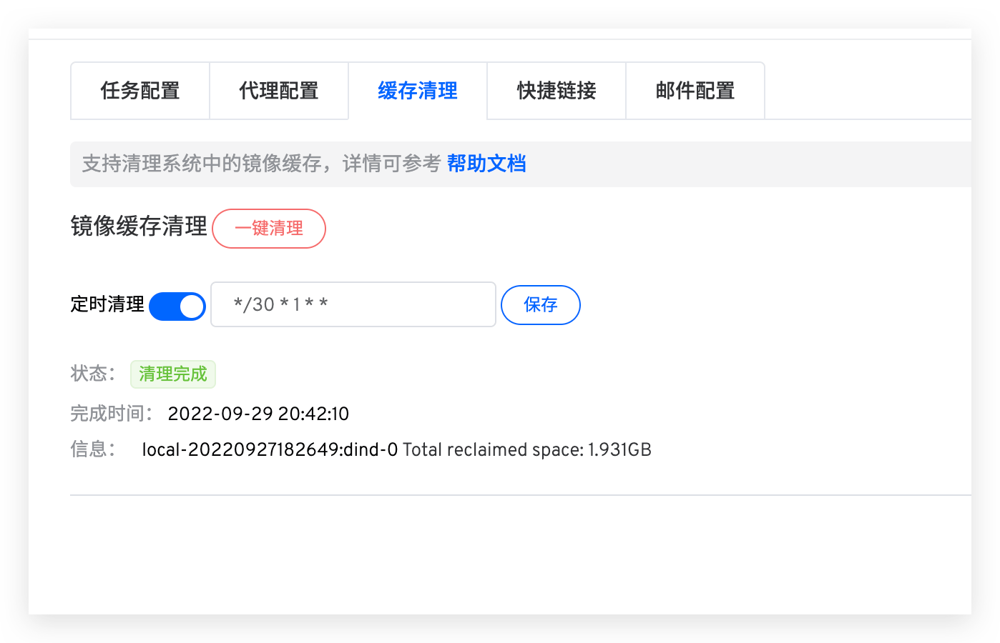
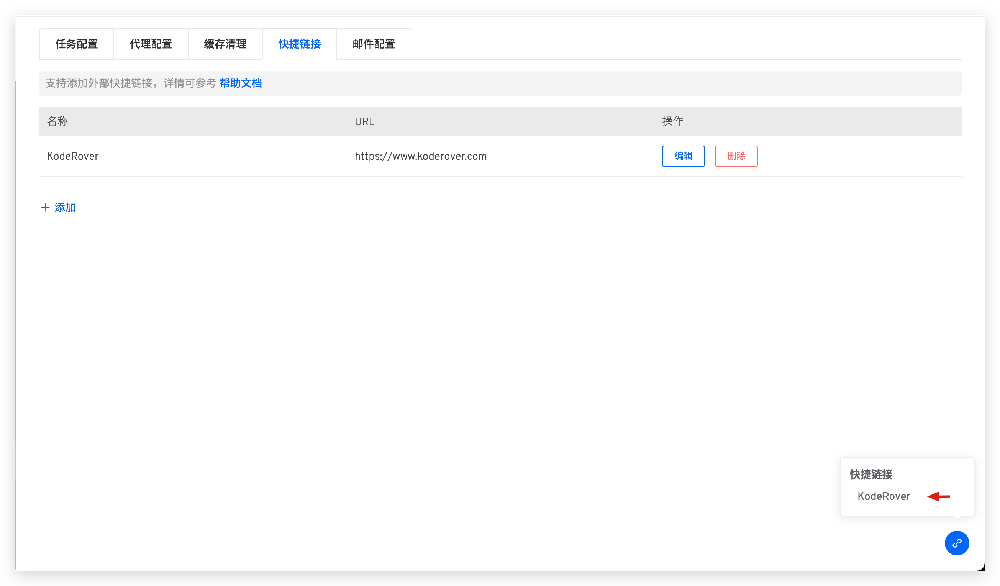
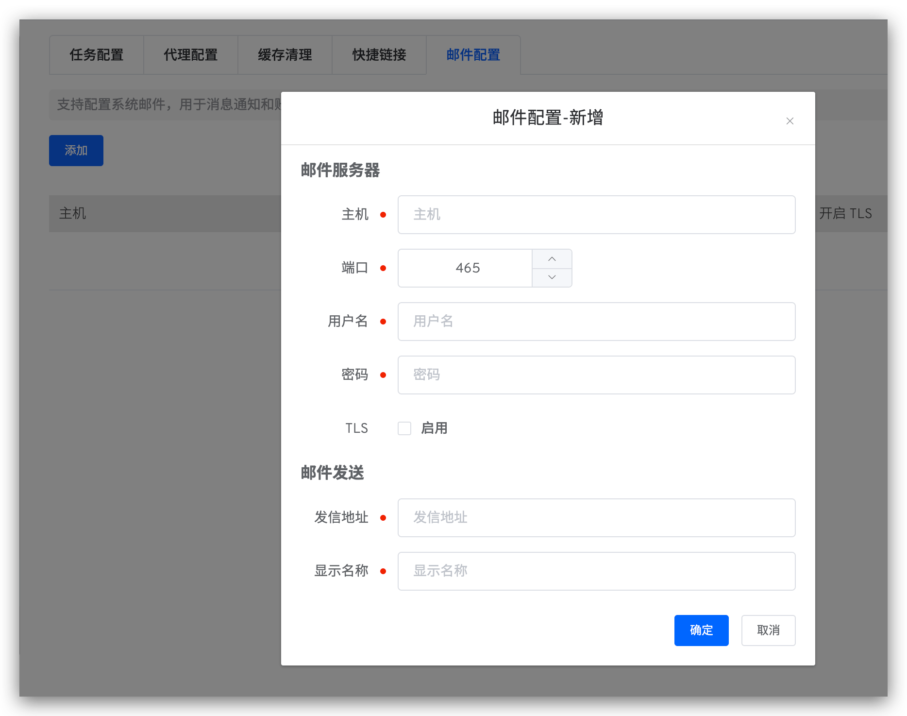

This article introduces some basic functions of Zadig system configuration, including: task configuration, proxy configuration, cache cleaning, quick links, and email configuration.

## Task Configuration

System administrators can access `System Settings` -> `System Configuration` -> `Task Configuration` to configure the number of concurrent tasks and the retention policy for historical tasks.



### Task Concurrency Settings
- Workflow execution concurrency: Controls the number of concurrent workflow/test tasks.
- Workflow task concurrency: Controls the number of services that can be deployed simultaneously within a workflow.

Each workflow task requires at least 1C2G resources. When setting the number of concurrent tasks, the following relationship must be satisfied:

```bash
Workflow execution concurrency * Workflow task concurrency * 1C2G ≤ Cluster resources
```

For example: If the cluster resources are 8C16G, it is recommended to set the workflow execution concurrency to 2 and the workflow task concurrency to 4.

### Execution Record Retention Policy

::: danger warning
Proceed with caution, as cleared data cannot be recovered
:::

- Set the retention period for workflow data (including workflow tasks and the build logs, binary files, test logs, and test reports they generate). The default retention period is 365 days, and data exceeding this period will be permanently deleted.
- The system will automatically clean up data at 2:00 AM daily according to the configured rules.


## Proxy Configuration


The Zadig system supports the use of proxies. System administrators can access `System Settings` -> `System Configuration` -> `Proxy Configuration` to configure the proxy settings as shown in the figure below.



::: warning
Only configuring the proxy without enabling it in specific modules will not make the proxy effective
:::

Currently, proxies can be used when executing build tasks. The specific settings are as follows:
1. When pulling code, the proxy must be enabled in `System Settings` -> `Integration` -> `Code Source Integration`
2. When pulling installation packages, the proxy must be enabled in `System Settings` -> `Package Management`
3. When pulling Chart packages, the proxy must be enabled in `Resource Configuration` -> `Chart Repository`

## Cache Cleaning
System administrators can access `System Settings` -> `System Configuration` -> `Cache Cleaning` to clean up component caches in the system, including stopped containers, all unused networks, unused images, and `Build Cache Image`.

1. `One-click Clean`: After this operation, the cache will be cleaned immediately
2. `Scheduled Clean`: The system will parse the Cron expression according to `Minutes Hours Date Month Week` and clean the cache at the specified intervals. The figure below represents a cleanup every 30 minutes on the 1st of each month



## Quick Links
System administrators can access `System Settings` -> `System Configuration` -> `Quick Links` to add common external links, making it convenient for users to access them quickly.



## Email Configuration

System administrators can access `System Settings` -> `System Configuration` -> `Email Configuration` and click `Add` to define email configurations.



Host Information Parameter Description:
- `Host`: The address of the mail server, for example: `smtp.example.163.com`
- `Port`: The port number of the mail server, default is `465`
- `Username`: The username for the email client, which can be obtained from the email service provider
- `Password`: The password for the email client, which can be obtained from the email service provider
- `TLS`: Whether to enable the TLS security protocol

Mail Sending Settings Parameter Description:
- `Mail Address`: The email address for sending emails, for example: `no-reply@koderover.com`
- `Display Name`: The name displayed in the email, for example: `no-reply`