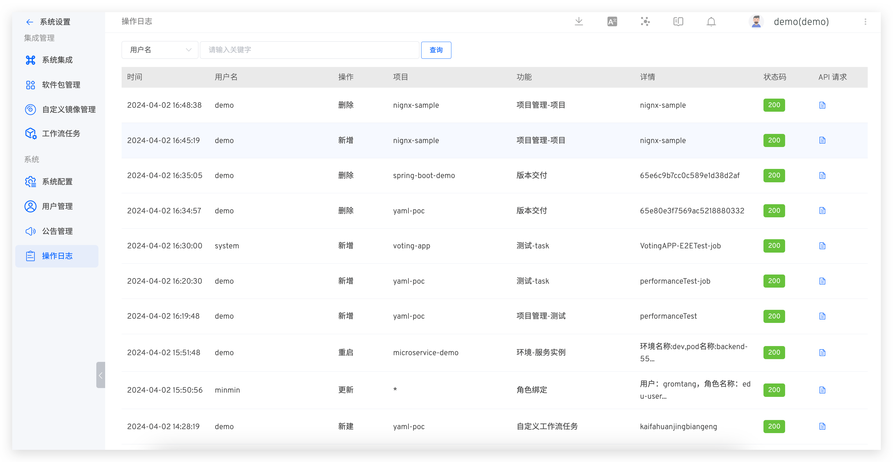

This article briefly introduces the operation log feature in the Zadig system. The Zadig system supports administrators in viewing operation logs to meet security and compliance requirements

Administrators can view operation logs by clicking `System Settings` -> `Audit Log`
Additionally, you can search based on username, project, function, and status code to quickly filter out the desired audit logs. The audit log entries include details of the operator and the API payload information.

