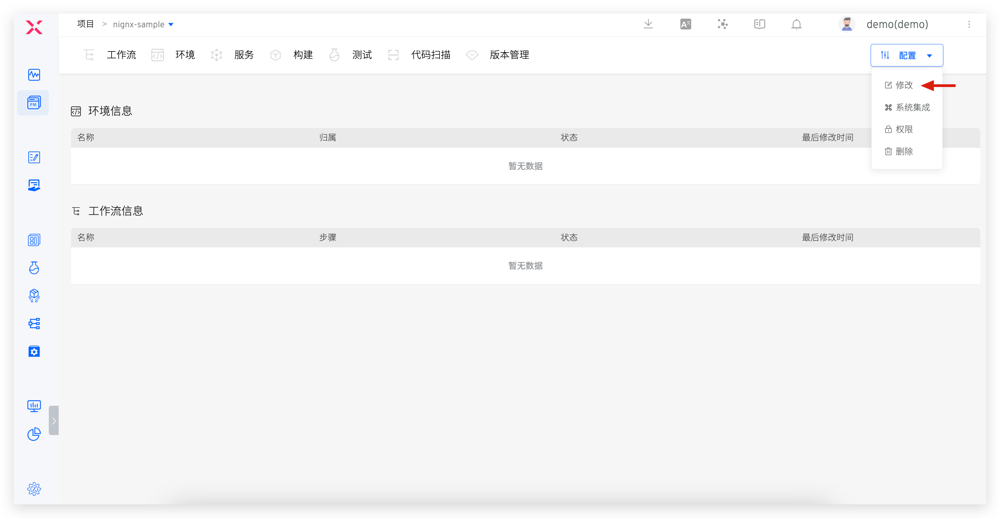
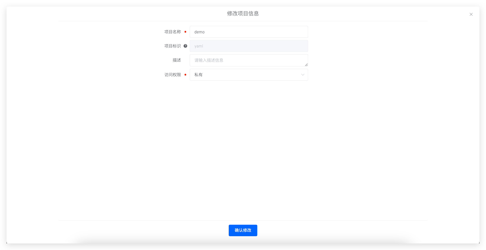
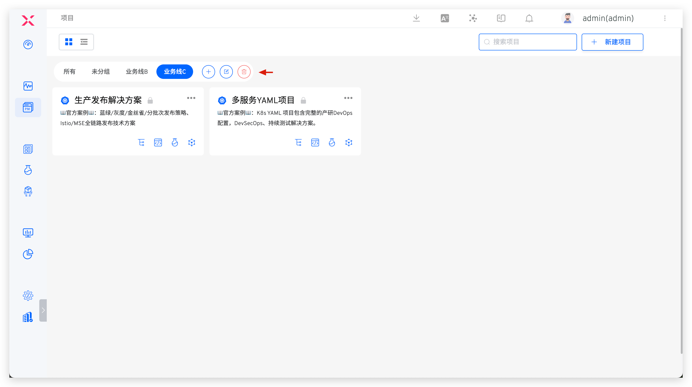
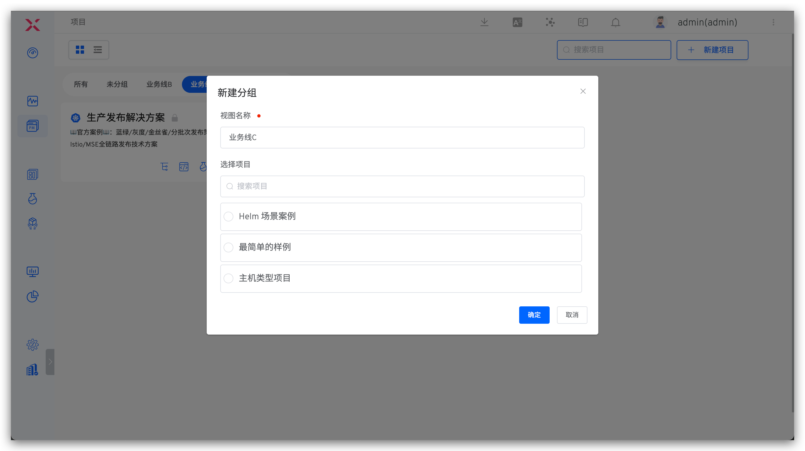
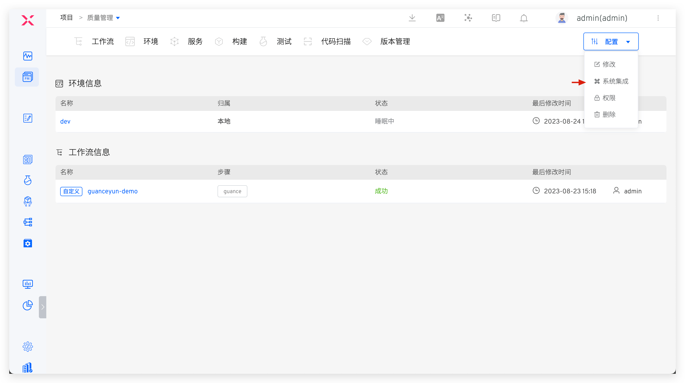

A Zadig project can be understood as a complete business unit, product, or system, which includes workflows, environments, services, builds, tests, code scans, versions, and other resources. Users can perform service development, service deployment, integration testing, version release, and other operations in a project to continuously deliver the product.

This article introduces the four types of projects supported by Zadig, how to quickly set them up, how to modify project basic information, how to group projects, and how to integrate system resources within a project.

## Project Types

Zadig supports the following four project types:
- `K8s YAML Project`: Use Kubernetes as the infrastructure and manage and deploy services using Kubernetes YAML.
- `K8s Helm Chart Project`: Use Kubernetes as the infrastructure and manage and deploy services using Helm Chart.
- `K8s Managed Project`: Host resources from existing Kubernetes clusters and manage services in the Zadig platform: view real-time service logs, debug by logging into Pods, update service images, etc.
- `Freestyle Project`: Use hosts or release terminal applications such as Android, iOS, Windows, and mini-programs.

## Quick Setup

See:

- [K8s YAML project](/en/Zadig%20v3.4/project/k8s-yaml/)
- [K8s Helm Chart project](/en/Zadig%20v3.4/project/helm-chart/)
- [K8s Managed project](/en/Zadig%20v3.4/project/host-k8s-resources/)
- [Freestyle project](/en/Zadig%20v3.4/project/vm/)

## Modifying a Project

::: tip
Only system administrators and project administrators can modify projects.
:::

On the project details page, click `Config` → `Edit` to modify the basic information of the project.

Parameter Description:
- `Name`: The name of the project, which can be modified after the project is created.
- `Identifier`: This can be specified when creating the project, and the default value is the project name. After the project is created, its identifier cannot be changed.
- `Description`: A brief description of the project, optional.
- `Access`: Choose `Public` or `Private` to define the default permissions for the project.
    - Public project: Users enjoy permissions in role `read-only` by default to view resources in the project. See [permission configuration](/en/Zadig%20v3.4/project/permission/#permission-configuration) for details of this role.
    - Private Project: Users have no default permission to view resources in the project. Project administrators can perform fine-grained permission control on users in the permissions and collaboration settings.

## Project Grouping

System administrators can manage projects in groups.

1. The `All` group contains all projects, and the `Ungrouped` group contains all projects that are not grouped. These two groups cannot be modified or deleted
2. You can create new groups, edit groups, and delete groups. After deleting a group, the projects within it will automatically be moved to the `Ungrouped` group
3. When a new project is created under a group, it will automatically belong to that group
4. A project can only belong to one group

## System Integration

Project administrators can go to the project → Configuration → System Integration to integrate code sources, hosts, and other resources for the project. Integrated resources are only available within the project, ensuring resource isolation between projects.

### Code Source

For specific integration parameters, see [Code Source Integration](/en/Zadig%20v3.4/settings/codehost/overview/).

### Host
> Suitable for Freestyle projects.

For specific integration parameters, see [Host Integration](/en/Zadig%20v3.4/settings/vm-management/#add-a-host).